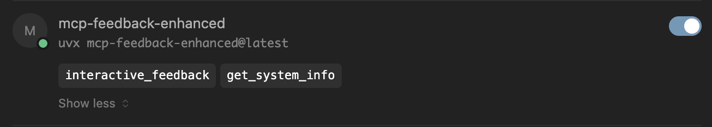
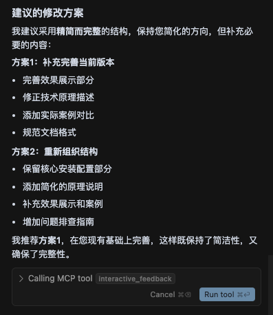
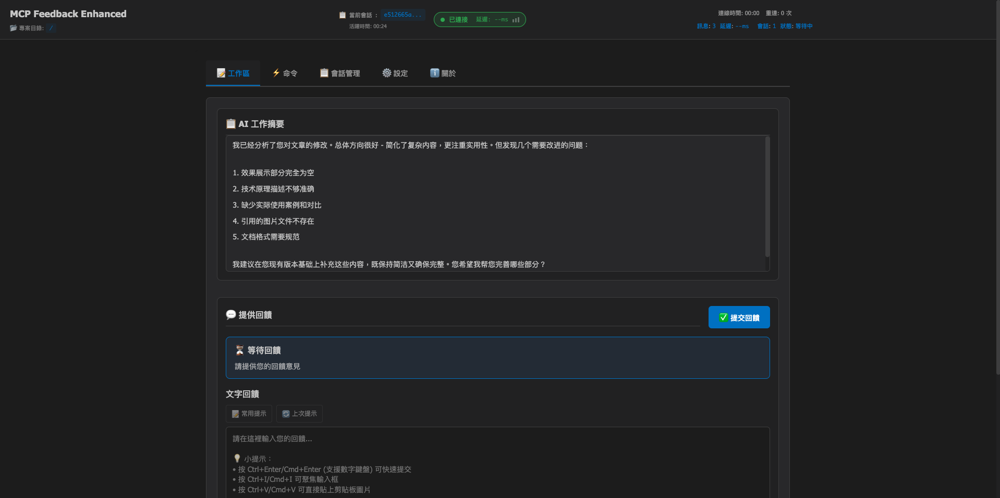

# 使用 MCP Feedback Enhanced 减少 Cursor 请求次数

## 方法原理

首先我们知道 Cursor 的请求次数是按会话次数计算的，只要对话不结束，本次就不会完整计算，结束后才算一次次数。

我们可以通过 Rules 让 Cursor 在每次要结束的时候都调用 mcp-feedback-enhanced，询问用户问题是否已经解决，或者是如果当前没有足够的信息来解决问题，Cursor 会调用这个 MCP 询问用户让用户提供更多上下文或背景信息，这样就可以避免平白无故的浪费请求次数了，并且一次请求次数甚至可以完成多个任务。

**注意**，该方法仅对非 MAX 模式有效。同时因为是 MCP，大模型并不是 100% 会调用，比如如果你的提问过于简单，Cursor 认为已经解决了你的问题，就不会调用。

## 安装和配置

1. 安装 uv

如果已安装可跳过：

```bash
pip install uv
```

2. 配置 MCP

依次点击 Cursor Settings -> MCP Tools -> New MCP Server，填入对应的配置

```json
{
  "mcpServers": {
    "mcp-feedback-enhanced": {
      "command": "uvx",
      "args": ["mcp-feedback-enhanced@latest"],
      "timeout": 600,
      "autoApprove": ["interactive_feedback"]
    }
  }
}
```

**常见问题：**

+ MCP 一直显示黄灯或红灯，长时间无法成功启动。

可以尝试在终端执行 `uvx mcp-feedback-enhanced@latest`，看看有无报错。或者可能是有些包下载时间过久或者需要翻墙，配置好翻墙指令后再执行 `uvx mcp-feedback-enhanced@latest` 成功后，MCP 也就正常了。



3. 设定 Rules

以 User Rules 为例，依次点击 Cursor Settings -> Rules -> User Rules 标题的 Add Rule，输入以下 Rules：

```
# MCP Interactive Feedback 规则

1. 在任何流程、任务、对话进行时，无论是询问、回复、或完成阶段性任务，皆必须调用 MCP mcp-feedback-enhanced。
2. 每当收到用户反馈，若反馈内容非空，必须再次调用 MCP mcp-feedback-enhanced，并根据反馈内容调整行为。
3. 仅当用户明确表示「结束」或「不再需要交互」时，才可停止调用 MCP mcp-feedback-enhanced，流程才算结束。
4. 除非收到结束指令，否则所有步骤都必须重复调用 MCP mcp-feedback-enhanced。
5. 完成任务前，必须使用 MCP mcp-feedback-enhanced 工具向用户询问反馈。
```

这是 mcp-feedback-enhanced 作者提供的 Rules，具体因人而异，你可以根据实际需求修改。

4. 效果展示





## 参考资料

- **MCP Feedback Enhanced 项目仓库**：[GitHub - mcp-feedback-enhanced](https://github.com/Minidoracat/mcp-feedback-enhanced)
- **原作者 Fábio Ferreira 项目仓库**：[GitHub - interactive-feedback-mcp](https://github.com/noopstudios/interactive-feedback-mcp)
- **另一个不错的二开项目**：[GitHub - kele527 - interactive-feedback-mcp](https://github.com/kele527/interactive-feedback-mcp)