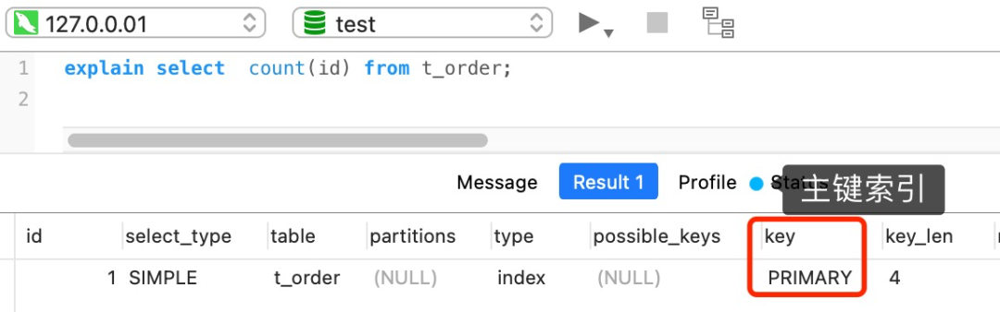
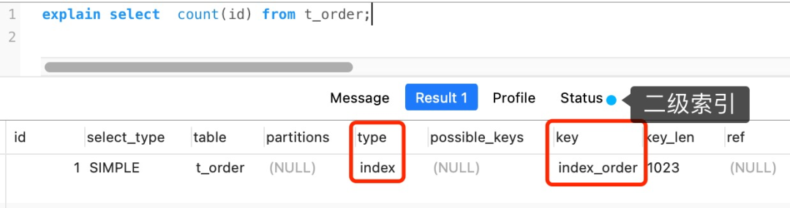

# count(*) 和 count(1) 有什么区别？哪个性能最好？

## 1.结论

按照性能排序：count(*) = count(1) > count(主键字段) > count(字段)

## 2.count() 是什么？

`count()` 是一个聚合函数，函数的参数不仅可以是字段名，也可以是其他任意表达式，该函数作用是**统计符合查询条件的记录中，函数指定的参数不为 NULL 的记录有多少个**。

假设 count() 函数的参数是字段名，如下：

```sql
select count(name) from t_order;
```

这条语句是统计「t_order 表中，name 字段不为 NULL 的记录」有多少个。也就是说，如果某一条记录中的 name 字段的值为 NULL，则就不会被统计进去。

再来假设 count() 函数的参数是数字 1 这个表达式，如下：

```sql
select count(1) from t_order;
```

这条语句是统计「t_order 表中，1 这个表达式不为 NULL 的记录」有多少个。

1 这个表达式就是单纯数字，它永远都不是 NULL，所以上面这条语句，其实是在统计 t_order 表中有多少个记录。

### 2.1 count(主键字段) 执行过程是怎样的？

在通过 `count` 函数统计有多少个记录时，MySQL 的 server 层会维护一个名叫 `count` 的变量。

server 层会循环向 InnoDB 读取一条记录，如果 `count` 函数指定的参数不为 NULL，那么就会将变量 count 加 1，直到符合查询的全部记录被读完，就退出循环。最后将 count 变量的值发送给客户端。

InnoDB 是通过 B+ 树来保存记录的，根据索引的类型又分为聚簇索引和二级索引，它们区别在于，聚簇索引的叶子节点存放的是实际数据，而二级索引的叶子节点存放的是主键值，而不是实际数据。

用下面这条语句作为例子：

```sql
//id 为主键值
select count(id) from t_order;
```

如果表里只有主键索引，没有二级索引时，那么，InnoDB 循环遍历聚簇索引，将读取到的记录返回给 server 层，然后读取记录中的 id 值，就会 id 值判断是否为 NULL，如果不为 NULL，就将 count 变量加 1。



但是，如果表里有二级索引时，InnoDB 循环遍历的对象就不是聚簇索引，而是二级索引。



这是因为相同数量的二级索引记录可以比聚簇索引记录占用更少的存储空间，所以二级索引树比聚簇索引树小，这样遍历二级索引的 I/O 成本比遍历聚簇索引的 I/O 成本小，因此「优化器」优先选择的是二级索引。

### 2.2 count(1) 执行过程是怎样的？

