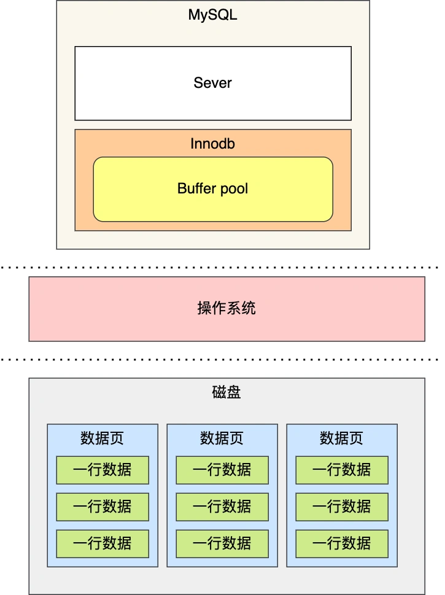
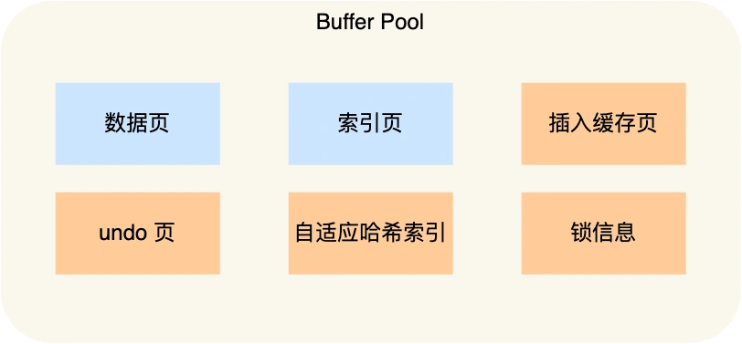

# 揭开 Buffer Pool 的面纱

- [揭开 Buffer Pool 的面纱](#揭开-buffer-pool-的面纱)
  - [1.为什么要有 Buffer Pool？](#1为什么要有-buffer-pool)
  - [2.Buffer Pool 有多大？](#2buffer-pool-有多大)
  - [3.Buffer Pool 缓存什么？](#3buffer-pool-缓存什么)
  - [4.如何管理 Buffer Pool？](#4如何管理-buffer-pool)
    - [4.1 如何管理空闲页？](#41-如何管理空闲页)
    - [4.2 如何管理脏页？](#42-如何管理脏页)
    - [4.3 如何提高缓存命中率？](#43-如何提高缓存命中率)
      - [4.3.1 什么是预读失效？](#431-什么是预读失效)
      - [4.3.2 什么是 Buffer Pool 污染？](#432-什么是-buffer-pool-污染)
    - [4.4 脏页什么时候会被刷入磁盘？](#44-脏页什么时候会被刷入磁盘)
  - [5.总结](#5总结)
  - [6.参考](#6参考)

## 1.为什么要有 Buffer Pool？

虽然说 MySQL 的数据是存储在磁盘里的，但是也不能每次都从磁盘里面读取数据，这样性能是极差的。

要想提升查询性能，加个缓存就行了嘛。所以，当数据从磁盘中取出后，缓存内存中，下次查询同样的数据的时候，直接从内存中读取。

为此，Innodb 存储引擎设计了一个**缓冲池（Buffer Pool）**，来提高数据库的读写性能。



有了缓冲池后：

+ 当读取数据时，如果数据存在于 Buffer Pool 中，客户端就会直接读取 Buffer Pool 中的数据，否则再去磁盘中读取。
+ 当修改数据时，首先是修改 Buffer Pool 中数据所在的页，然后将其页设置为脏页，最后由后台线程将脏页写入到磁盘。

## 2.Buffer Pool 有多大？

Buffer Pool 是在 MySQL 启动的时候，向操作系统申请的一片连续的内存空间，默认配置下 Buffer Pool 只有 128MB。

可以通过调整 `innodb_buffer_pool_size` 参数来设置 Buffer Pool 的大小，一般建议设置成可用物理内存的 60%~80%。

## 3.Buffer Pool 缓存什么？

InnoDB 会把存储的数据划分为若干个「页」，以页作为磁盘和内存交互的基本单位，一个页的默认大小为 16KB。因此，Buffer Pool 同样需要按「页」来划分。

在 MySQL 启动的时候，**InnoDB 会为 Buffer Pool 申请一片连续的内存空间，然后按照默认的 16KB 的大小划分出一个个的页， Buffer Pool 中的页就叫做缓存页。**此时这些缓存页都是空闲的，之后随着程序的运行，才会有磁盘上的页被缓存到 Buffer Pool 中。

所以，MySQL 刚启动的时候，你会观察到使用的虚拟内存空间很大，而使用到的物理内存空间却很小，这是因为只有这些虚拟内存被访问后，操作系统才会触发缺页中断，接着将虚拟地址和物理地址建立映射关系。

Buffer Pool 除了缓存「索引页」和「数据页」，还包括了 undo 页，插入缓存、自适应哈希索引、锁信息等等。



为了更好的管理这些在 Buffer Pool 中的缓存页，InnoDB 为每一个缓存页都创建了一个**控制块**，控制块信息包括「缓存页的表空间、页号、缓存页地址、链表节点」等等。

控制块也是占有内存空间的，它是放在 Buffer Pool 的最前面，接着才是缓存页，如下图：


上图中控制块和缓存页之间灰色部分称为碎片空间。

**为什么会有碎片空间呢？**

你想想啊，每一个控制块都对应一个缓存页，那在分配足够多的控制块和缓存页后，可能剩余的那点儿空间不够一对控制块和缓存页的大小，自然就用不到喽，这个用不到的那点儿内存空间就被称为碎片了。

当然，如果你把 Buffer Pool 的大小设置的刚刚好的话，也可能不会产生碎片。

**查询一条记录，就只需要缓冲一条记录吗？**

不是的。

当我们查询一条记录时，InnoDB 是会把整个页的数据加载到 Buffer Pool 中，因为，通过索引只能定位到磁盘中的页，而不能定位到页中的一条记录。将页加载到 Buffer Pool 后，再通过页里的页目录去定位到某条具体的记录。

## 4.如何管理 Buffer Pool？

### 4.1 如何管理空闲页？

Buffer Pool 是一片连续的内存空间，当 MySQL 运行一段时间后，这片连续的内存空间中的缓存页既有空闲的，也有被使用的。

那当我们从磁盘读取数据的时候，总不能通过遍历这一片连续的内存空间来找到空闲的缓存页吧，这样效率太低了。

所以，为了能够快速找到空闲的缓存页，可以使用链表结构，将空闲缓存页的「控制块」作为链表的节点，这个链表称为 **Free 链表**（空闲链表）。


Free 链表上除了有控制块，还有一个头节点，该头节点包含链表的头节点地址，尾节点地址，以及当前链表中节点的数量等信息。

Free 链表节点是一个一个的控制块，而每个控制块包含着对应缓存页的地址，所以相当于 Free 链表节点都对应一个空闲的缓存页。

有了 Free 链表后，每当需要从磁盘中加载一个页到 Buffer Pool 中时，就从 Free 链表中取一个空闲的缓存页，并且把该缓存页对应的控制块的信息填上，然后把该缓存页对应的控制块从 Free 链表中移除。

### 4.2 如何管理脏页？

设计 Buffer Pool 除了能提高读性能，还能提高写性能，也就是更新数据的时候，不需要每次都要写入磁盘，而是将 Buffer Pool 对应的缓存页标记为**脏页**，然后再由后台线程将脏页写入到磁盘。

那为了能快速知道哪些缓存页是脏的，于是就设计出 **Flush 链表**，它跟 Free 链表类似的，链表的节点也是控制块，区别在于 Flush 链表的元素都是脏页。


有了 Flush 链表后，后台线程就可以遍历 Flush 链表，将脏页写入到磁盘。

### 4.3 如何提高缓存命中率？

Buffer Pool 的大小是有限的，对于一些频繁访问的数据我们希望可以一直留在 Buffer Pool 中，而一些很少访问的数据希望可以在某些时机可以淘汰掉，从而保证 Buffer Pool 不会因为满了而导致无法再缓存新的数据，同时还能保证常用数据留在 Buffer Pool 中。

要实现这个，最容易想到的就是 LRU（Least recently used）算法。

该算法的思路是，链表头部的节点是最近使用的，而链表末尾的节点是最久没被使用的。那么，当空间不够了，就淘汰最久没被使用的节点，从而腾出空间。

简单的 LRU 算法的实现思路是这样的：

+ 当访问的页在 Buffer Pool 里，就直接把该页对应的 LRU 链表节点移动到链表的头部。
+ 当访问的页不在 Buffer Pool 里，除了要把页放入到 LRU 链表的头部，还要淘汰 LRU 链表末尾的节点。

比如下图，假设 LRU 链表长度为 5，LRU 链表从左到右有 1，2，3，4，5 的页。


如果访问了 3 号的页，因为 3 号页在 Buffer Pool 里，所以把 3 号页移动到头部即可。


而如果接下来，访问了 8 号页，因为 8 号页不在 Buffer Pool 里，所以需要先淘汰末尾的 5 号页，然后再将 8 号页加入到头部。


到这里我们可以知道，Buffer Pool 里有三种页和链表来管理数据。


图中：

+ Free Page（空闲页），表示此页未被使用，位于 Free 链表；
+ Clean Page（干净页），表示此页已被使用，但是页面未发生修改，位于LRU 链表。
+ Dirty Page（脏页），表示此页「已被使用」且「已经被修改」，其数据和磁盘上的数据已经不一致。当脏页上的数据写入磁盘后，内存数据和磁盘数据一致，那么该页就变成了干净页。脏页同时存在于 LRU 链表和 Flush 链表。

简单的 LRU 算法并没有被 MySQL 使用，因为简单的 LRU 算法无法避免下面这两个问题：

+ 预读失效；
+ Buffer Pool 污染；

#### 4.3.1 什么是预读失效？

先来说说 MySQL 的预读机制。程序是有空间局部性的，靠近当前被访问数据的数据，在未来很大概率会被访问到。

所以，MySQL 在加载数据页时，会提前把它相邻的数据页一并加载进来，目的是为了减少磁盘 IO。

但是可能这些**被提前加载进来的数据页，并没有被访问**，相当于这个预读是白做了，这个就是**预读失效**。

如果使用简单的 LRU 算法，就会把预读页放到 LRU 链表头部，而当 Buffer Pool空间不够的时候，还需要把末尾的页淘汰掉。

如果这些预读页如果一直不会被访问到，就会出现一个很奇怪的问题，不会被访问的预读页却占用了 LRU 链表前排的位置，而末尾淘汰的页，可能是频繁访问的页，这样就大大降低了缓存命中率。

**怎么解决预读失效而导致缓存命中率降低的问题？**

我们不能因为害怕预读失效，而将预读机制去掉，大部分情况下，局部性原理还是成立的。

要避免预读失效带来影响，最好就是**让预读的页停留在 Buffer Pool 里的时间要尽可能的短，让真正被访问的页才移动到 LRU 链表的头部，从而保证真正被读取的热数据留在 Buffer Pool 里的时间尽可能长。**

那到底怎么才能避免呢？

MySQL 是这样做的，它改进了 LRU 算法，将 LRU 划分了 2 个区域：**old 区域 和 young 区域**。

young 区域在 LRU 链表的前半部分，old 区域则是在后半部分，如下图：


old 区域占整个 LRU 链表长度的比例可以通过 `innodb_old_blocks_pc` 参数来设置，默认是 37，代表整个 LRU 链表中 young 区域与 old 区域比例是 63:37。

**划分这两个区域后，预读的页就只需要加入到 old 区域的头部，当页被真正访问的时候，才将页插入 young 区域的头部。**如果预读的页一直没有被访问，就会从 old 区域移除，这样就不会影响 young 区域中的热点数据。

接下来，给大家举个例子。

假设有一个长度为 10 的 LRU 链表，其中 young 区域占比 70 %，old 区域占比 30 %。


现在有个编号为 20 的页被预读了，这个页只会被插入到 old 区域头部，而 old 区域末尾的页（10号）会被淘汰掉。


如果 20 号页一直不会被访问，它也没有占用到 young 区域的位置，而且还会比 young 区域的数据更早被淘汰出去。

如果 20 号页被预读后，立刻被访问了，那么就会将它插入到 young 区域的头部，young 区域末尾的页（7号），会被挤到 old 区域，作为 old 区域的头部，这个过程并不会有页被淘汰。


虽然通过划分 old 区域 和 young 区域避免了预读失效带来的影响，但是还有个问题无法解决，那就是 Buffer Pool 污染的问题。

#### 4.3.2 什么是 Buffer Pool 污染？

当某一个 SQL 语句**扫描了大量的数据**时，在 Buffer Pool 空间比较有限的情况下，可能会将 **Buffer Pool 里的所有页都替换出去，导致大量热数据被淘汰了**，等这些热数据又被再次访问的时候，由于缓存未命中，就会产生大量的磁盘 I/O，MySQL 性能就会急剧下降，这个过程被称为 **Buffer Pool 污染**。

注意， Buffer Pool 污染并不只是查询语句查询出了大量的数据才出现的问题，即使查询出来的结果集很小，也会造成 Buffer Pool 污染。

比如，在一个数据量非常大的表，执行了这条语句：

```sql
select * from t_user where name like "%xiaolin%";
```

可能这个查询出来的结果就几条记录，但是由于这条语句会发生索引失效，所以这个查询过程是全表扫描的，接着会发生如下的过程：

+ 从磁盘读到的页加入到 LRU 链表的 old 区域头部；
+ 当从页里读取行记录时，也就是页被访问的时候，就要将该页放到 young 区域头部；
+ 接下来拿行记录的 name 字段和字符串 xiaolin 进行模糊匹配，如果符合条件，就加入到结果集里；
+ 如此往复，直到扫描完表中的所有记录。

经过这一番折腾，原本 young 区域的热点数据都会被替换掉。

举个例子，假设需要批量扫描：21，22，23，24，25 这五个页，这些页都会被逐一访问（读取页里的记录）。


在批量访问这些数据的时候，会被逐一插入到 young 区域头部。


可以看到，原本在 young 区域的热点数据 6 和 7 号页都被淘汰了，这就是 Buffer Pool 污染的问题。

**怎么解决出现 Buffer Pool 污染而导致缓存命中率下降的问题？**

像前面这种全表扫描的查询，很多缓冲页其实只会被访问一次，但是它却只因为被访问了一次而进入到 young 区域，从而导致热点数据被替换了。

LRU 链表中 young 区域就是热点数据，只要我们提高进入到 young 区域的门槛，就能有效地保证 young 区域里的热点数据不会被替换掉。

MySQL 是这样做的，进入到 young 区域条件增加了一个**停留在 old 区域的时间判断**。

具体是这样做的，在对某个处在 old 区域的缓存页进行第一次访问时，就在它对应的控制块中记录下来这个访问时间：

+ 如果后续的访问时间与第一次访问的时间**在某个时间间隔内**，那么**该缓存页就不会被从 old 区域移动到 young 区域的头部**；
+ 如果后续的访问时间与第一次访问的时间**不在某个时间间隔内**，那么**该缓存页移动到 young 区域的头部**；

这个间隔时间是由 `innodb_old_blocks_time` 控制的，默认是 1000 ms。

也就说，**只有同时满足「被访问」与「在 old 区域停留时间超过 1 秒」两个条件，才会被插入到 young 区域头部**，这样就解决了 Buffer Pool 污染的问题 。

另外，MySQL 针对 young 区域其实做了一个优化，为了防止 young 区域节点频繁移动到头部。young 区域前面 1/4 被访问不会移动到链表头部，只有后面的 3/4被访问了才会。

### 4.4 脏页什么时候会被刷入磁盘？

引入了 Buffer Pool 后，当修改数据时，首先是修改 Buffer Pool 中数据所在的页，然后将其页设置为脏页，但是磁盘中还是原数据。

因此，脏页需要被刷入磁盘，保证缓存和磁盘数据一致，但是若每次修改数据都刷入磁盘，则性能会很差，因此一般都会在一定时机进行批量刷盘。

可能大家担心，如果在脏页还没有来得及刷入到磁盘时，MySQL 宕机了，不就丢失数据了吗？

这个不用担心，InnoDB 的更新操作采用的是 Write Ahead Log 策略，即先写日志，再写入磁盘，通过 redo log 日志让 MySQL 拥有了崩溃恢复能力。

下面几种情况会触发脏页的刷新：

+ 当 redo log 日志满了的情况下，会主动触发脏页刷新到磁盘；
+ Buffer Pool 空间不足时，需要将一部分数据页淘汰掉，如果淘汰的是脏页，需要先将脏页同步到磁盘；
+ MySQL 认为空闲时，后台线程回定期将适量的脏页刷入到磁盘；
+ MySQL 正常关闭之前，会把所有的脏页刷入到磁盘；

在我们开启了慢 SQL 监控后，如果你发现**偶尔会出现一些用时稍长的 SQL**，这可能是因为脏页在刷新到磁盘时可能会给数据库带来性能开销，导致数据库操作抖动。

如果间断出现这种现象，就需要调大 Buffer Pool 空间或 redo log 日志的大小。

## 5.总结

Innodb 存储引擎设计了一个**缓冲池（Buffer Pool）**，来提高数据库的读写性能。

Buffer Pool 以页为单位缓冲数据，可以通过 `innodb_buffer_pool_size` 参数调整缓冲池的大小，默认是 128 M。

Innodb 通过三种链表来管理缓页：

+ Free List （空闲页链表），管理空闲页；
+ Flush List （脏页链表），管理脏页；
+ LRU List，管理脏页+干净页，将最近且经常查询的数据缓存在其中，而不常查询的数据就淘汰出去。

InnoDB 对 LRU 做了一些优化，我们熟悉的 LRU 算法通常是将最近查询的数据放到 LRU 链表的头部，而 InnoDB 做 2 点优化：

+ 将 LRU 链表分为 young 和 old 两个区域，加入缓冲池的页，优先插入 old 区域；页被访问时，才进入 young 区域，目的是为了解决预读失效的问题。
+ 当**页被访问且 old 区域停留时间超过 innodb_old_blocks_time 阈值（默认为 1 秒）**时，才会将页插入到 young 区域，否则还是插入到 old 区域，目的是为了解决批量数据访问，大量热数据淘汰的问题。

可以通过调整 `innodb_old_blocks_pc` 参数，设置 young 区域和 old 区域比例。

在开启了慢 SQL 监控后，如果你发现「偶尔」会出现一些用时稍长的 SQL，这可因为脏页在刷新到磁盘时导致数据库性能抖动。如果在很短的时间出现这种现象，就需要调大 Buffer Pool 空间或 redo log 日志的大小。

## 6.参考

[揭开 Buffer Pool 的面纱 - 小林coding](https://xiaolincoding.com/mysql/buffer_pool/buffer_pool.html)