# MySQL order by 原理和优化

- [MySQL order by 原理和优化](#mysql-order-by-原理和优化)
  - [1.数据库表](#1数据库表)
  - [2.需求](#2需求)
  - [3.order by 工作原理](#3order-by-工作原理)
    - [3.1 explain 执行计划](#31-explain-执行计划)
    - [3.2 全字段排序](#32-全字段排序)
    - [3.3 磁盘临时文件辅助排序](#33-磁盘临时文件辅助排序)
    - [3.4 rowid 排序](#34-rowid-排序)
    - [3.5 全字段排序与 rowid 排序对比](#35-全字段排序与-rowid-排序对比)
  - [4.order by 的一些优化思路](#4order-by-的一些优化思路)
    - [4.1 联合索引优化](#41-联合索引优化)
    - [4.2 调整参数优化](#42-调整参数优化)
  - [5.使用 order by 一些注意的点](#5使用-order-by-一些注意的点)
    - [5.1 没有 where 条件，order by 字段需要加索引吗？](#51-没有-where-条件order-by-字段需要加索引吗)
    - [5.2 分页 LIMIT 过大，导致大量排序怎么办？](#52-分页-limit-过大导致大量排序怎么办)
    - [5.3 索引存储顺序与 order by 不一致，如何优化？](#53-索引存储顺序与-order-by-不一致如何优化)
    - [5.4 使用 in 包含多值时，SQL 执行是否有排序过程？](#54-使用-in-包含多值时sql-执行是否有排序过程)

## 1.数据库表

```sql
CREATE TABLE `staff` (
	`id` BIGINT(11) AUTO_INCREMENT COMMENT '主键ID',
	`id_card` VARCHAR(20) NOT NULL COMMENT '身份证号码',
	`name` VARCHAR(64) NOT NULL COMMENT '姓名',
	`age` INT(4) NOT NULL COMMENT '城市',
	`city` VARCHAR(64) NOT NULL COMMENT '城市',
	PRIMARY KEY(`id`),
	INDEX idx_city(`city`)
) ENGINE = INNODB COMMENT='员工表'

INSERT INTO `staff` ( `id_card`, `name`, `age`, `city` )
VALUES
	( '440001xxxxxxxx0001', '小明', 22, '广州' ),
	( '440002xxxxxxxx0002', '小李', 23, '深圳' ),
	( '440003xxxxxxxx0003', '小刚', 28, '东莞' ),
	( '440004xxxxxxxx0004', '小红', 20, '上海' ),
	( '440005xxxxxxxx0005', '小芳', 36, '北京' ),
	( '440006xxxxxxxx0006', '小莉', 19, '深圳' ),
	( '440007xxxxxxxx0007', '小华', 27, '湛江' )
```

## 2.需求

查询 10 个来自深圳的员工，包含姓名、年龄、城市，并且按照年龄从小到大排序。对应的 SQL 语句如下：

```sql
SELECT name, age, city FROM staff where city = '深圳' ORDER BY age LIMIT 10
```

这条语句的逻辑很清楚，但是它的**底层执行流程**是怎样的呢？

## 3.order by 工作原理

### 3.1 explain 执行计划

我们先用 `explain` 查看一下执行计划：

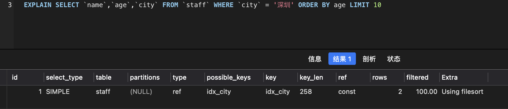

+ `key` 表示使用到索引 `idx_city`；
+ `Extra` 这个字段的 `Using filesort` 表示用到排序。

我们可以发现，这条SQL使用到了索引，并且也用到排序。那么它是**怎么排序**的呢？

### 3.2 全字段排序

MySQL 会给每个查询线程分配一块小内存用于排序，称为 sort_buffer。通过 `idx_city` 索引找到对应的数据，把数据放进 sort_buffer。

我们回顾下索引是怎么找到匹配的数据的，现在先把索引树画出来吧，`idx_city` 索引树如下：

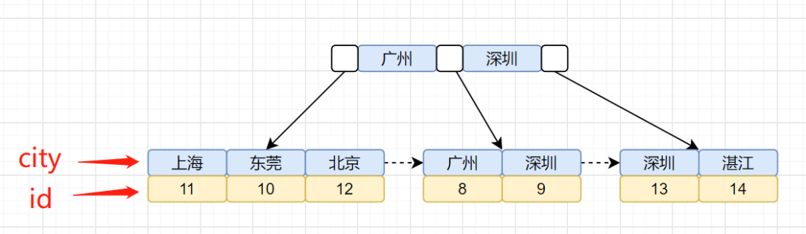

`idx_city` 索引树，叶子节点存储的是主键 id。还有一棵主键聚簇索引树，我们再画出聚簇索引树图吧：

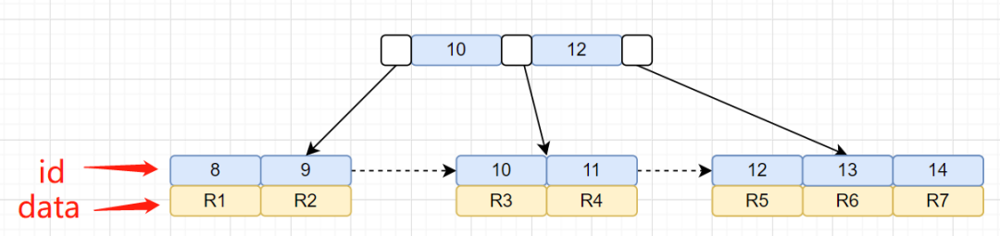

我们的查询语句是怎么找到匹配数据的呢？先通过 `idx_city` 索引树，找到对应的主键 id，然后再通过拿到的主键 id，搜索 id 主键索引树，找到对应的行数据。

加上 `order by` 之后，整体的执行流程就是：

1. MySQL 为对应的线程初始化 sort_buffer，放入需要查询的 `name`、`age`、`city` 字段；
2. 从索引树 `idx_city`， 找到第一个满足 `city='深圳'` 条件的主键 id，也就是图中的 `id=9`；
3. 到主键 id 索引树拿到 `id=9` 的这一行数据， 取 `name`、`age`、`city` 三个字段的值，存到 sort_buffer；
4. 从索引树 `idx_city` 拿到下一个记录的主键 id，即图中的 `id=13`；
5. 重复步骤 3、4 直到 `city` 的值不等于深圳为止；
6. 前面 5 步已经查找到了所有 `city` 为深圳的数据，在 sort_buffer 中，将所有数据根据 `age` 进行排序；
7. 按照排序结果取前 10 行返回给客户端。

执行示意图如下：

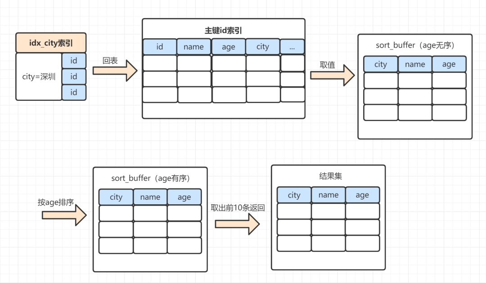

将查询所需的字段全部读取到 sort_buffer 中，就是全字段排序。这里面，有些小伙伴可能会有个疑问，把查询的所有字段都放到 sort_buffer，而 sort_buffer 是一块内存来的，如果数据量太大，sort_buffer 放不下怎么办呢？

### 3.3 磁盘临时文件辅助排序

实际上，sort_buffer 的大小是由一个参数控制的：`sort_buffer_size`。如果要排序的数据小于 `sort_buffer_size`，排序在sort_buffer 内存中完成，如果要排序的数据大于 `sort_buffer_size`，则借助磁盘文件来进行排序。

如何确定是否使用了磁盘文件来进行排序呢？可以使用以下这几个命令

```sh
## 打开optimizer_trace，开启统计
set optimizer_trace = "enabled=on";
## 执行SQL语句
select name,age,city from staff where city = '深圳' order by age limit 10;
## 查询输出的统计信息
select * from information_schema.optimizer_trace 
```

可以从 `number_of_tmp_files` 中看出，是否使用了临时文件。

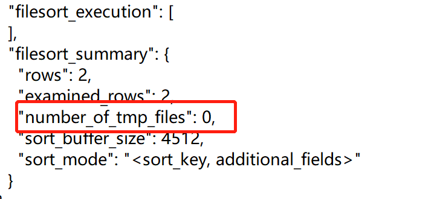

`number_of_tmp_files` 表示使用来排序的磁盘临时文件数。如果 `number_of_tmp_files>0`，则表示使用了磁盘文件来进行排序。

使用了磁盘临时文件，整个排序过程又是怎样的呢？

1. 从主键 id 索引树，拿到需要的数据，并放到 sort_buffer 内存块中。当 sort_buffer 快要满时，就对 sort_buffer 中的数据排序，排完后，把数据临时放到磁盘一个小文件中；
2. 继续回到主键 id 索引树取数据，继续放到 sort_buffer 内存中，排序后，也把这些数据写入到磁盘临时小文件中；
3. 继续循环，直到取出所有满足条件的数据。最后把磁盘的临时排好序的小文件，合并成一个有序的大文件。

> 借助磁盘临时小文件排序，实际上使用的是**归并排序**算法。

小伙伴们可能会有个疑问，既然 sort_buffer 放不下，就需要用到临时磁盘文件，这会影响排序效率。那为什么还要把排序不相关的字段（`name`，`city`）放到 sort_buffer 中呢？只放排序相关的 `age` 字段，它不香吗？可以了解下 rowid 排序。

### 3.4 rowid 排序

rowid 排序就是，只把查询 SQL 需要用于排序的字段和主键 id，放到 sort_buffer 中。那怎么确定走的是全字段排序还是 rowid 排序呢？

实际上有个参数控制的。这个参数就是 `max_length_for_sort_data`，它表示 MySQL 用于排序行数据的长度的一个参数，如果单行的长度超过这个值，MySQL 就认为单行太大，就换 rowid 排序。我们可以通过命令看下这个参数取值。

```sql
show variables like 'max_length_for_sort_data';
```

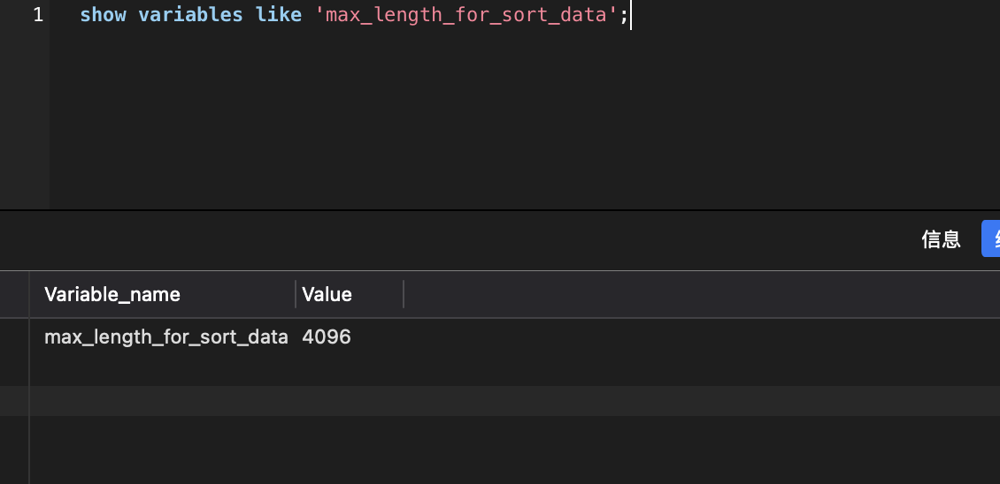

`max_length_for_sort_data` 默认值是 4096。因为本文示例中 `name`、`age`、`city` 长度 = 64 + 4 + 64 = 132 < 4096，所以走的是全字段排序。我们来改下这个参数，改小一点，

```sql
## 修改排序数据最大单行长度为32
set max_length_for_sort_data = 32;
## 执行查询SQL
select name,age,city from staff where city = '深圳' order by age limit 10;
```

使用 rowid 排序的话，整个 SQL 执行流程又是怎样的呢？

1. MySQL 为对应的线程初始化 sort_buffer，放入需要排序的 age 字段，以及主键 id；
2. 从索引树 `idx_city`，找到第一个满足 `city='深圳'` 条件的主键 id，也就是图中的 `id = 9`；
3. 到主键 id 索引树拿到 `id = 9` 的这一行数据，取 `age` 和主键 id 的值，存到 sort_buffer；
4. 从索引树 `idx_city` 拿到下一个记录的主键 id，即图中的 `id = 13`；
5. 重复步骤 3、4 直到 `city` 的值不等于深圳为止；
6. 前面 5 步已经查找到了所有 `city` 为深圳的数据，在 sort_buffer 中，将所有数据根据 `age` 进行排序；
7. 遍历排序结果，取前 10 行，并按照 id 的值回到原表中，取出 `city`、`name` 和 `age` 三个字段返回给客户端。

执行示意图如下：

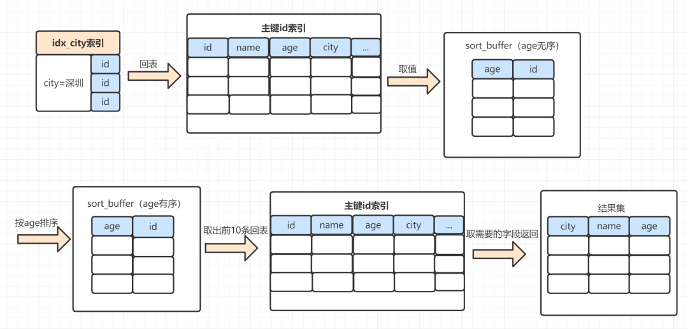

对比一下全字段排序的流程，rowid 排序多了一次回表。

我们通过 `optimizer_trace`，可以看到是否使用了 rowid 排序：

```sql
## 打开optimizer_trace，开启统计
set optimizer_trace = "enabled=on";
## 执行SQL语句
select name,age,city from staff where city = '深圳' order by age limit 10;
## 查询输出的统计信息
select * from information_schema.optimizer_trace 
```

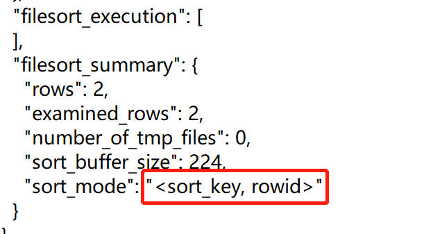

### 3.5 全字段排序与 rowid 排序对比

+ 全字段排序：sort_buffer 内存不够的话，就需要用到磁盘临时文件，造成磁盘访问；
+ rowid 排序：sort_buffer 可以放更多数据，但是需要再回到原表去取数据，比全字段排序多一次回表。

一般情况下，对于 InnoDB 存储引擎，会优先使用全字段排序。可以发现 `max_length_for_sort_data` 参数设置为 4096，这个数比较大的。一般情况下，排序字段不会超过这个值，也就是都会走全字段排序。

## 4.order by 的一些优化思路

我们如何优化 order by 语句呢？

+ 因为数据是无序的，所以就需要排序。如果数据本身是有序的，那就不用排了。而索引数据本身是有序的，我们通过建立联合索引，优化order by 语句。
+ 我们还可以通过调整 `max_length_for_sort_data` 等参数优化；

### 4.1 联合索引优化

我们给查询条件 `city` 和排序字段 `age`，加个联合索引 `idx__city_age`。再去查看执行计划：

```sql
ALTER TABLE `staff` ADD INDEX idx_city_age(`city`,`age`);

EXPLAIN SELECT name, age, city FROM staff where city = '深圳' ORDER BY age LIMIT 10
```

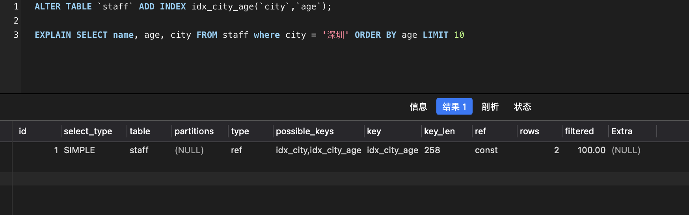

可以发现，加上 `idx_city_age` 联合索引，就不需要 `Using filesort` 排序了。为什么呢？因为索引本身是有序的，我们可以看下 `idx_city_age` 联合索引示意图，如下：

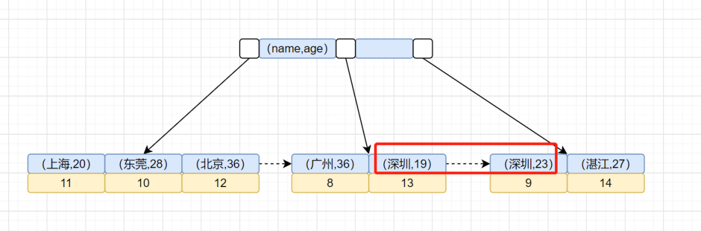

整个 SQL 执行流程变成了：

1. 从索引 `idx_city_age` 找到满足 `city='深圳'` 的主键 id；
2. 到主键 id 索引取出整行，拿到 `name`、`city`、`age` 三个字段的值，作为结果集的一部分直接返回；
3. 从索引 `idx_city_age` 取下一个记录主键 id；
4. 重复步骤 2、3，直到查到第 10 条记录，或者是不满足 `city='深圳'` 条件时循环结束。

流程示意图如下：

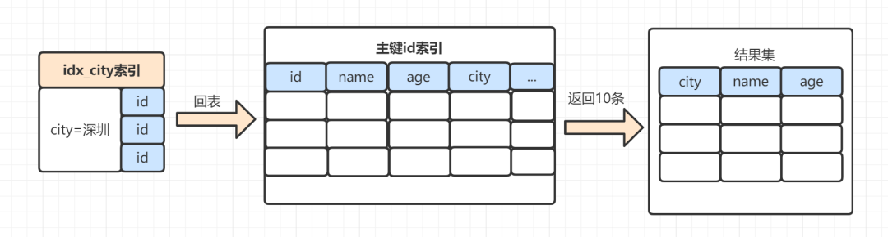

从示意图看来，还是有一次回表操作。针对本次示例，有没有更高效的方案呢？有的，可以使用**覆盖索引**。

我们给 `city`、`age`、`name` 组成一个联合索引，即可用到了覆盖索引，这时候SQL执行时，连回表操作都可以省去。

### 4.2 调整参数优化

我们还可以通过调整参数，去优化 order by 的执行。比如可以调整 `sort_buffer_size` 的值。因为 sort_buffer 值太小，数据量大的话，会借助磁盘临时文件排序。如果 MySQL 服务器配置高的话，可以使用稍微调整大点。

我们还可以调整 `max_length_for_sort_data` 的值，这个值太小的话，order by 会走 rowid 排序，会回表，降低查询性能。所以 `max_length_for_sort_data` 可以适当大一点。

当然，很多时候，这些 MySQL 参数值，我们直接采用默认值就可以了。

## 5.使用 order by 一些注意的点

### 5.1 没有 where 条件，order by 字段需要加索引吗？

日常开发过程中，我们可能会遇到没有 where 条件的 order by，这时候 order by 后面的字段是否需要加索引呢。如有这么一个 SQL，create_time 是否需要加索引：

```sql
SELECT * FROM A ORDER BY create_time;
```

无条件查询下，即使 create_time 有索引，也不会使用到。因为 MySQL 优化器认为走二级索引，再去回表成本比全表扫描排序更高。所以会走全表扫描，然后根据全字段排序或 rowid 排序来进行。

如果查询 SQL 改一下：

```sql
SELECT * FROM A ORDER BY create_time LIMIT m;
```

如果 `m` 值比较小，是可以走索引的。

### 5.2 分页 LIMIT 过大，导致大量排序怎么办？

假设 SQL 如下：

```sql
SELECT * FROM A ORDER BY a LIMIT 100000, 10;
```

+ 可以记录上一页最后的 id，下一页查询时，查询条件带上 id，如：`WHERE id > 上一页最后 id LIMIT 10`。
+ 也可以在业务允许的情况下，限制页数。

### 5.3 索引存储顺序与 order by 不一致，如何优化？

假设有联合索引 `idx_age_name`，我们需求修改为这样：查询前10个员工的姓名、年龄，并且按照年龄小到大排序，如果年龄相同，则按姓名降序排。对应的 SQL 语句就可以这么写：

```sql
SELECT name, age FROM staff ORDER BY age, name DESC LIMIT 10;
```

我们看下执行计划，发现使用到 `Using filesort`。

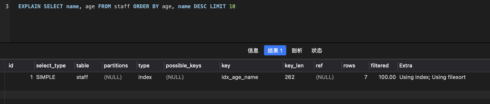

这是因为，`idx_age_name` 索引树中，`age` 从小到大排序，如果 `age` 相同，再按 `name` 从小到大排序。而 `order by` 中，是按 `age` 从小到大排序，如果 `age` 相同，再按 `name` 从大到小排序。也就是说，索引存储顺序与 `order by` 不一致。

如果是 MySQL 8.0，可以使用降序索引：

```sql
ALTER TABLE `staff` ADD INDEX idx_age_name_desc(`age`, `name` DESC);
```

### 5.4 使用 in 包含多值时，SQL 执行是否有排序过程？

如果我们有联合索引 `idx_city_age`，执行这个 SQL 的话，是不会走排序过程的，如下：

```sql
SELECT * FROM staff WHERE city in ('深圳') ORDER BY age limit 10;
```

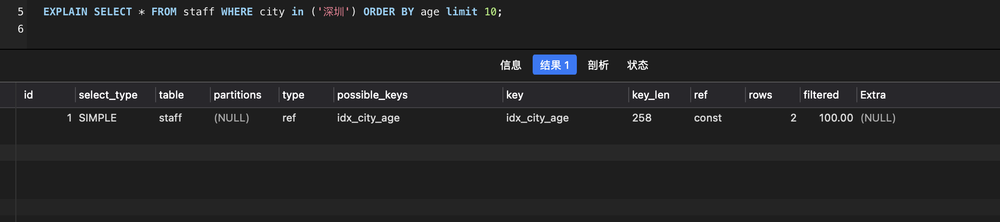

但是，如果 `in` 条件包含多个值时，就会有排序过程：

```sql
SELECT * FROM staff WHERE city in ('深圳', '上海') ORDER BY age limit 10;
```

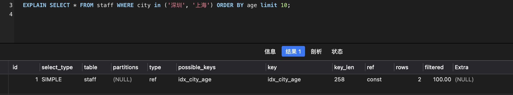

因为 `in` 有 2 个条件时，在满足深圳时，`age` 是排好序的，但是把满足上海的 `age` 加进来，就不能保证满足所有的 `age` 都是排好序的。因此需要 `Using fillsort`。