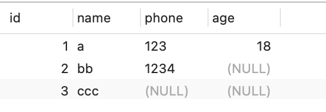
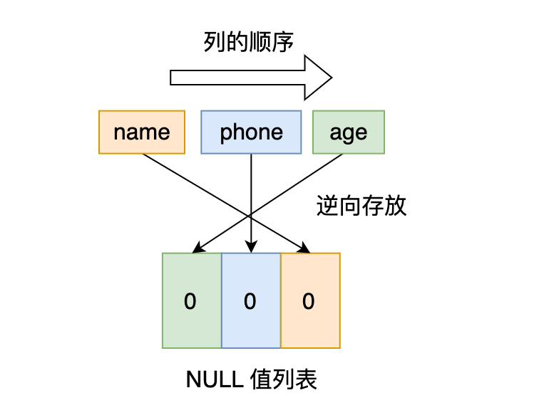
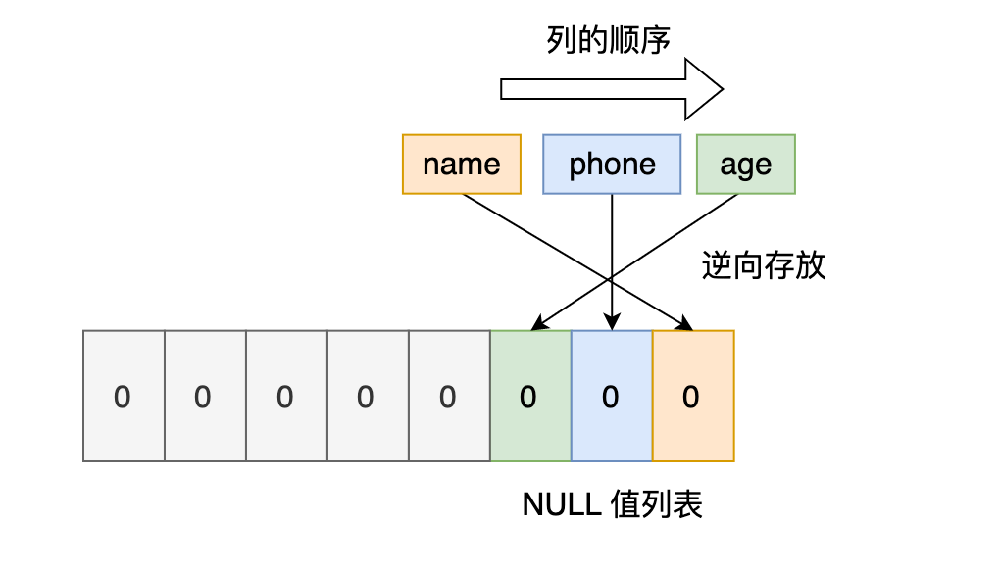
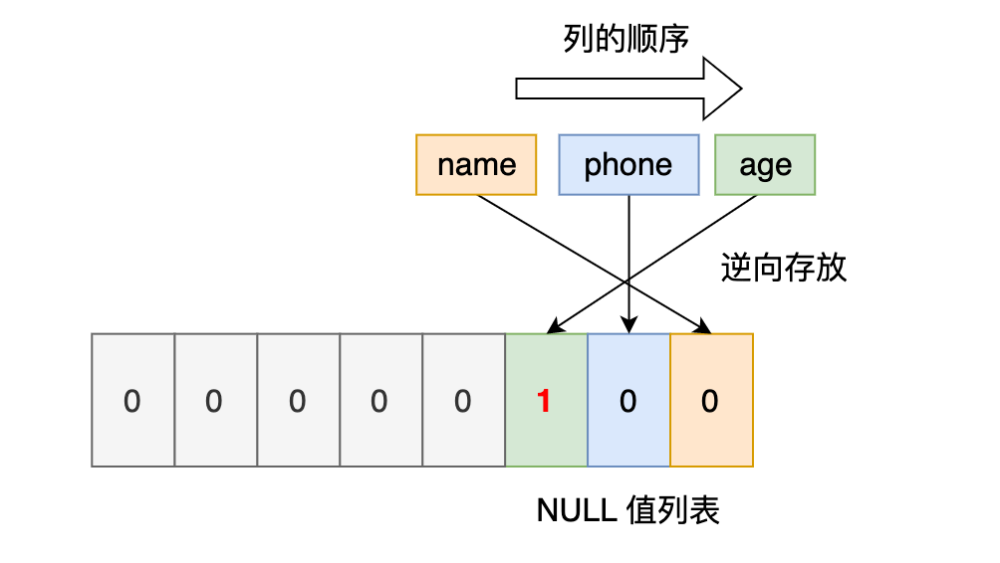
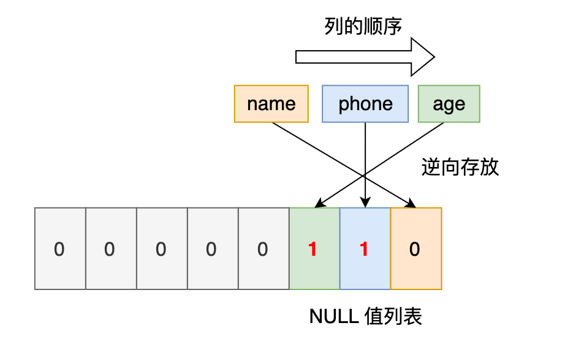
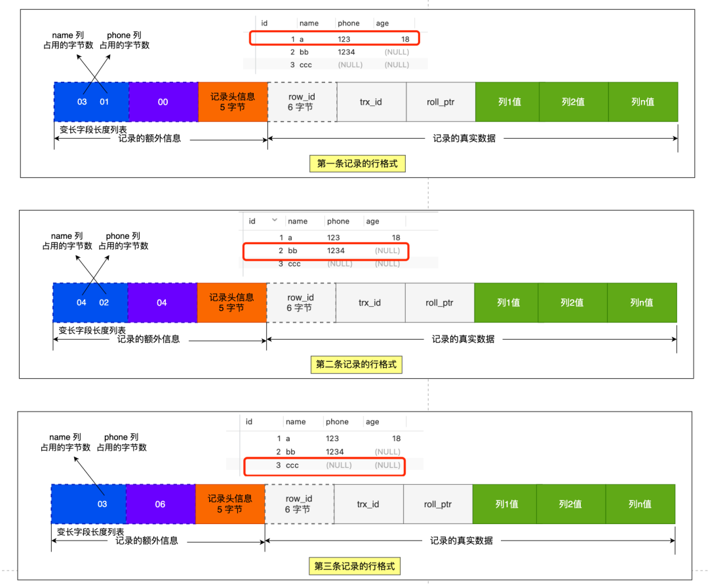

# MySQL 如何存储一行记录？

- [MySQL 如何存储一行记录？](#mysql-如何存储一行记录)
  - [1.MySQL 的数据存放在哪个文件？](#1mysql-的数据存放在哪个文件)
  - [2.InnoDB 行格式有哪些？](#2innodb-行格式有哪些)
    - [2.1 COMPACT 行格式长什么样？](#21-compact-行格式长什么样)
      - [2.1.1 记录的额外信息](#211-记录的额外信息)

## 1.MySQL 的数据存放在哪个文件？

大家都知道 MySQL 的数据都是保存在磁盘的，那具体是保存在哪个文件呢？

MySQL 存储的行为是由存储引擎实现的，MySQL 支持多种存储引擎，不同的存储引擎保存的文件自然也不同。

InnoDB 是我们常用的存储引擎，也是 MySQL 默认的存储引擎。所以，本文主要以 InnoDB 存储引擎展开讨论。

先来看看 MySQL 数据库的文件存放在哪个目录？

```sql
mysql> SHOW VARIABLES LIKE 'datadir';
+---------------+-----------------+
| Variable_name | Value           |
+---------------+-----------------+
| datadir       | /var/lib/mysql/ |
+---------------+-----------------+
1 row in set (0.00 sec)
```

我们每创建一个 database（数据库）都会在 /var/lib/mysql/ 目录里面创建一个以 database 为名的目录，然后保存表结构和表数据的文件都会存放在这个目录里。

比如，我这里有一个名为 my_test 的 database，该 database 里有一张名为 t_order 数据库表。


然后，我们进入 /var/lib/mysql/my_test 目录，看看里面有什么文件？

```sh
[root@xiaolin ~]#ls /var/lib/mysql/my_test
db.opt  
t_order.frm  
t_order.ibd
```

可以看到，共有三个文件，这三个文件分别代表着：

+ db.opt，用来存储当前数据库的默认字符集和字符校验规则。
+ t_order.frm ，t_order 的**表结构**会保存在这个文件。在 MySQL 中建立一张表都会生成一个 `.frm` 文件，该文件是用来保存每个表的元数据信息的，主要包含表结构定义。
+ t_order.ibd，t_order 的**表数据**会保存在这个文件。表数据既可以存在共享表空间文件（文件名：ibdata1）里，也可以存放在独占表空间文件（文件名：表名字.idb）。这个行为是由参数 `innodb_file_per_table` 控制的，若设置了参数 `innodb_file_per_table` 为 1，则会将存储的数据、索引等信息单独存储在一个独占表空间，从 MySQL 5.6.6 版本开始，它的默认值就是 1 了，因此从这个版本之后， MySQL 中每一张表的数据都存放在一个独立的 `.idb` 文件。

好了，现在我们知道了一张数据库表的数据是保存在「 表名字.idb 」的文件里的，这个文件也称为独占表空间文件。

那这个表空间文件的结构是怎么样的？

**表空间由段（segment）、区（extent）、页（page）、行（row）组成**，InnoDB存储引擎的逻辑存储结构大致如下图：


下面我们从下往上一个个看看。

1. **行（row）**

数据库表中的记录都是按行（row）进行存放的，每行记录根据不同的行格式，有不同的存储结构。

后面我们详细介绍 InnoDB 存储引擎的行格式，也是本文重点介绍的内容。

2. **页（page）**

记录是按照行来存储的，但是数据库的读取并不以「行」为单位，否则一次读取（也就是一次 I/O 操作）只能处理一行数据，效率会非常低。

因此，**InnoDB 的数据是按「页」为单位来读写的**，也就是说，当需要读一条记录的时候，并不是将这个行记录从磁盘读出来，而是以页为单位，将其整体读入内存。

**默认每个页的大小为 16KB**，也就是最多能保证 16KB 的连续存储空间。

页是 InnoDB 存储引擎磁盘管理的最小单元，意味着数据库每次读写都是以 16KB 为单位的，一次最少从磁盘中读取 16K 的内容到内存中，一次最少把内存中的 16K 内容刷新到磁盘中。

页的类型有很多，常见的有数据页、undo 日志页、溢出页等等。数据表中的行记录是用「数据页」来管理的，数据页的结构这里我就不讲细说了，之前文章有说过，感兴趣的可以去看这篇文章：[换一个角度看 B+ 树](https://mp.weixin.qq.com/s?__biz=MzUxODAzNDg4NQ==&mid=2247502059&idx=1&sn=ccbee22bda8c3d6a98237be769a7c89c&scene=21)

总之知道表中的记录存储在「数据页」里面就行。

3. **区（extent）**

我们知道 InnoDB 存储引擎是用 B+ 树来组织数据的。

B+ 树中每一层都是通过双向链表连接起来的，如果是以页为单位来分配存储空间，那么链表中相邻的两个页之间的物理位置并不是连续的，可能离得非常远，那么磁盘查询时就会有大量的随机I/O，随机 I/O 是非常慢的。

解决这个问题也很简单，就是让链表中相邻的页的物理位置也相邻，这样就可以使用顺序 I/O 了，那么在范围查询（扫描叶子节点）的时候性能就会很高。

那具体怎么解决呢？

**在表中数据量大的时候，为某个索引分配空间的时候就不再按照页为单位分配了，而是按照区（extent）为单位分配。每个区的大小为 1MB，对于 16KB 的页来说，连续的 64 个页会被划为一个区，这样就使得链表中相邻的页的物理位置也相邻，就能使用顺序 I/O 了。**

4. 段（segment）

表空间是由各个段（segment）组成的，段是由多个区（extent）组成的。段一般分为数据段、索引段和回滚段等。

+ 索引段：存放 B+ 树的非叶子节点的区的集合；
+ 数据段：存放 B+ 树的叶子节点的区的集合；
+ 回滚段：存放的是回滚数据的区的集合，之前讲**事务隔离**的时候就介绍到了 MVCC 利用了回滚段实现了多版本查询数据。

好了，终于说完表空间的结构了。接下来，就具体讲一下 InnoDB 的行格式了。

之所以要绕一大圈才讲行记录的格式，主要是想让大家知道行记录是存储在哪个文件，以及行记录在这个表空间文件中的哪个区域，有一个从上往下切入的视角，这样理解起来不会觉得很抽象。

## 2.InnoDB 行格式有哪些？

行格式（row_format），就是一条记录的存储结构。

InnoDB 提供了 4 种行格式，分别是 Redundant、Compact、Dynamic和 Compressed 行格式。

+ Redundant 是很古老的行格式了， MySQL 5.0 版本之前用的行格式，现在基本没人用了。
+ 由于 Redundant 不是一种紧凑的行格式，所以 MySQL 5.0 之后引入了 Compact 行记录存储方式，Compact 是一种紧凑的行格式，设计的初衷就是为了让一个数据页中可以存放更多的行记录，从 MySQL 5.1 版本之后，行格式默认设置成 Compact。
+ Dynamic 和 Compressed 两个都是紧凑的行格式，它们的行格式都和 Compact 差不多，因为都是基于 Compact 改进一点东西。从 MySQL5.7 版本之后，默认使用 Dynamic 行格式。

Redundant 行格式我这里就不讲了，因为现在基本没人用了，这次重点介绍 Compact 行格式，因为 Dynamic 和 Compressed 这两个行格式跟 Compact 非常像。

所以，弄懂了 Compact 行格式，之后你们在去了解其他行格式，很快也能看懂。

### 2.1 COMPACT 行格式长什么样？

先跟 Compact 行格式混个脸熟，它长这样：


可以看到，一条完整的记录分为「记录的额外信息」和「记录的真实数据」两个部分。

接下里，分别详细说下。

#### 2.1.1 记录的额外信息

记录的额外信息包含 3 个部分：变长字段长度列表、NULL 值列表、记录头信息。

1. **变长字段长度列表**

varchar(n) 和 char(n) 的区别是什么，相信大家都非常清楚，char 是定长的，varchar 是变长的，变长字段实际存储的数据的长度（大小）不固定的。

所以，在存储数据的时候要把这些数据占用的字节数也存起来，存到「变长字段长度列表」里面，读取数据的时候才能根据这个「变长字段长度列表」去读取对应长度的数据。其他 TEXT、BLOB 等变长字段也是这么实现的。

为了展示「变长字段长度列表」具体是怎么保存变长字段占用的字节数，我们先创建这样一张表，字符集是 ascii（所以每一个字符占用的 1 字节），行格式是 Compact，t_user 表中 name 和 phone 字段都是变长字段：

```sql
CREATE TABLE `t_user` (
  `id` int(11) NOT NULL,
  `name` VARCHAR(20) NOT NULL,
  `phone` VARCHAR(20) DEFAULT NULL,
  `age` int(11) DEFAULT NULL,
  PRIMARY KEY (`id`) USING BTREE
) ENGINE = InnoDB DEFAULT CHARACTER SET = ascii ROW_FORMAT = COMPACT;
```

现在 t_user 表里有这三条记录：



接下来，我们看看这三条记录的行格式中的 「变长字段长度列表」是怎样存储的。

先来看第一条记录：

+ name 列的值为 a，长度是 1 字节，十六进制 0x01
+ phone 列的值为 123，长度是 3 字节，十六进制 0x03
+ age 列和 id 列不是变长字段，所以这里不用管。

这些变长字段的长度值会按照列的顺序**逆序存放**（等下会说为什么要这么设计），所以「变长字段长度列表」里的内容是「03 01」，而不是 「01 03」。


同样的道理，我们也可以得出**第二条记录**的行格式中，「变长字段长度列表」里的内容是「04 02」，如下图：


**第三条记录**中 phone 列的值是 NULL，**NULL 是不会存放在行格式中记录的真实数据部分里的**，所以「变长字段长度列表」里不需要保存值为  NULL 的变长字段的长度。


**为什么「变长字段长度列表」的信息要按照逆序存放？**

这个设计是有想法的，主要是因为「记录头信息」中指向下一个记录的指针，指向的是下一条记录的「记录头信息」和「真是数据」之间的位置，这样的好处是向左读就是记录头信息，向右读就是真实数据，比较方便。

「变长字段长度列表」中的信息之所以要逆序存放，是因为这样可以**使得位置靠前的记录的真实数据和数据对应的字段长度信息可以同时在一个 CPU Cache Line 中，这样就可以提高 CPU Cache 的命中率。**

同样的道理， NULL 值列表的信息也需要逆序存放。

如果你不知道什么是 CPU Cache，可以看这篇文章：[面试官：如何写出让 CPU 跑得更快的代码？](https://mp.weixin.qq.com/s?__biz=MzUxODAzNDg4NQ==&mid=2247486022&idx=1&sn=8bb5a066d81f77523a06cd09251055da)，这属于计算机组成的知识。

**每个数据库表的行格式都有「变长字段字节数列表」吗？**

其实变长字段字节数列表不是必须的。

**当数据表没有变长字段的时候，比如全部都是 int 类型的字段，这时候表里的行格式就不会有「变长字段长度列表」了**，因为没必要，不如去掉以节省空间。

所以「变长字段长度列表」只出现在数据表有变长字段的时候。

2. NULL 值列表

表中的某些列可能会存储 NULL 值，如果把这些 NULL 值都放到记录的真实数据中会比较浪费空间，所以 Compact 行格式把这些值为 NULL 的列存储到 NULL 值列表中。

如果存在允许 NULL 值的列，则每个列对应一个二进制位（bit），二进制位按照列的顺序逆序排列。

+ 二进制位的值为 1 时，代表该列的值为 NULL。
+ 二进制位的值为 0 时，代表该列的值不为 NULL。

另外，NULL 值列表必须用整数个字节的位表示（1 字节 8 位），如果使用的二进制位个数不足整数个字节，则在字节的高位补 0。

还是以 t_user 表的这三条记录作为例子：


接下来，我们看看看看这三条记录的行格式中的 NULL 值列表是怎样存储的。

先来看**第一条记录**，第一条记录所有列都有值，不存在 NULL 值，所以用二进制来表示是酱紫的：



但是 InnoDB 是用整数字节的二进制位来表示 NULL 值列表的，现在不足 8 位，所以要在高位补 0，最终用二进制来表示是酱紫的：



所以，对于第一条数据，NULL 值列表用十六进制表示是 0x00。

接下来看**第二条记录**，第二条记录 age 列是 NULL 值，所以，对于第二条数据，NULL值列表用十六进制表示是 0x04。



最后**第三条记录**，第三条记录 phone 列 和 age 列是 NULL 值，所以，对于第三条数据，NULL 值列表用十六进制表示是 0x06。



我们把三条记录的 NULL 值列表都填充完毕后，它们的行格式是这样的：



**每个数据库表的行格式都有「NULL 值列表」吗？**

NULL 值列表也不是必须的。

**当数据表的字段都定义成 NOT NULL 的时候，这时候表里的行格式就不会有 NULL 值列表了。**所以在设计数据库表的时候，通常都是建议将字段设置为  NOT NULL，这样可以节省 1 字节的空间（NULL 值列表占用 1 字节空间）。

