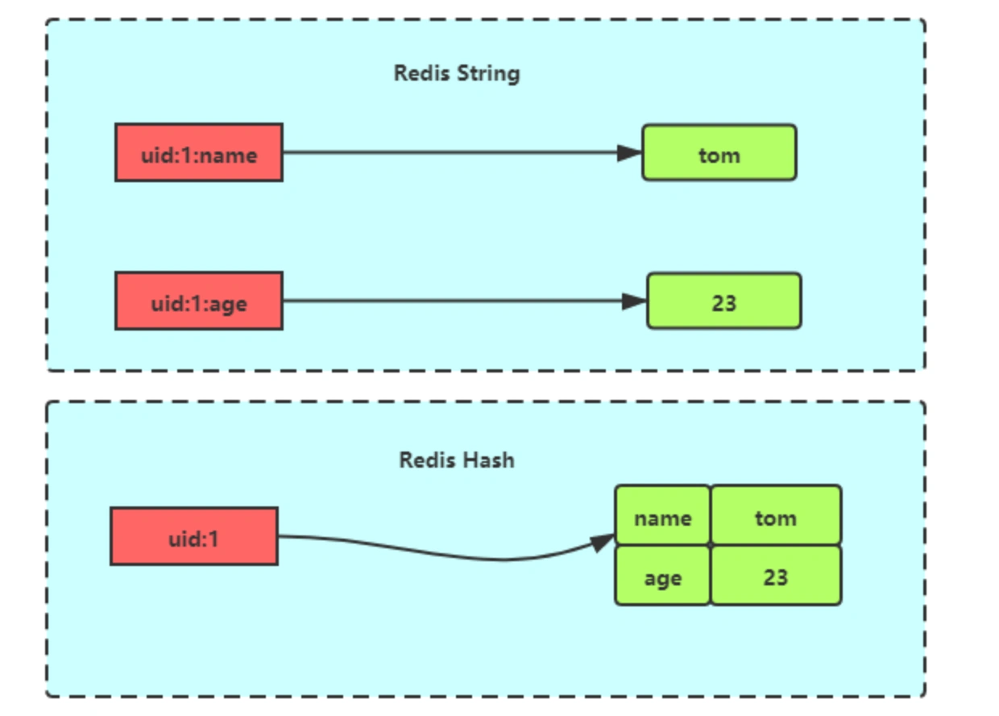

# Redis 数据类型

Redis 是一个开源（BSD许可）的，内存中的数据结构存储系统，它可以用作数据库、缓存和消息中间件。 它支持多种类型的数据结构，如 **字符串（strings）**， **散列（hashes）**， **列表（lists）**， **集合（sets）**， **有序集合（sorted sets）** 与范围查询， **bitmaps**， **hyperloglogs** 和 **地理空间（geospatial）** 索引半径查询。 Redis 内置了 **复制（replication）**，**LUA脚本（Lua scripting）**， **LRU驱动事件（LRU eviction）**，**事务（transactions）** 和不同级别的 **磁盘持久化（persistence）**， 并通过 **Redis哨兵（Sentinel）**和自动 **分区（Cluster）**提供高可用性（high availability）。

本文将介绍 Redis 的 5 种基本数据类型。

- [1.Redis Key 操作](#1redis-key-操作)
- [2.String](#2string)

## 1.Redis Key 操作

```sh
keys *      # 查看所有的 key 

EXISTS key  # 判断当前的 key 是否存在

move key 1  # 移除当前的 key，一般不会这么用

expire key seconds  # 设置 key 的过期时间，单位秒

ttl key     # 查看当前 key 的剩余时间

type key    # 查看当前 key 的类型
```

## 2.String

### 2.1 介绍

String 是最基本的 key-value 结构，key 是唯一标识，value 是具体的值，value其实不仅是字符串， 也可以是数字（整数或浮点数），value 最多可以容纳的数据长度是 512M。


### 2.2 内部实现

String 类型的底层的数据结构实现主要是 int 和 SDS（简单动态字符串）。

SDS 和我们认识的 C 字符串不太一样，之所以没有使用 C 语言的字符串表示，因为 SDS 相比于 C 的原生字符串：

+ **SDS 不仅可以保存文本数据，还可以保存二进制数据。**因为 SDS 使用 `len` 属性的值而不是空字符来判断字符串是否结束，并且 SDS 的所有 API 都会以处理二进制的方式来处理 SDS 存放在 `buf[]` 数组里的数据。所以 SDS 不光能存放文本数据，而且能保存图片、音频、视频、压缩文件这样的二进制数据。
+ **SDS 获取字符串长度的时间复杂度是 O(1)。**因为 C 语言的字符串并不记录自身长度，所以获取长度的复杂度为 O(n)；而 SDS 结构里用 `len` 属性记录了字符串长度，所以复杂度为 O(1)。
+ **Redis 的 SDS API 是安全的，拼接字符串不会造成缓冲区溢出。**因为 SDS 在拼接字符串之前会检查 SDS 空间是否满足要求，如果空间不够会自动扩容，所以不会导致缓冲区溢出的问题。

字符串对象的内部编码（encoding）有 3 种 ：**int、raw 和 embstr**。


如果一个字符串对象保存的是整数值，并且这个整数值可以用 `long` 类型来表示，那么字符串对象会将整数值保存在字符串对象结构的 `ptr` 属性里面（将 `void*` 转换成 `long`），并将字符串对象的编码设置为 `int`。


如果字符串对象保存的是一个字符串，并且这个字符申的长度小于等于 32 字节，那么字符串对象将使用一个简单动态字符串（SDS）来保存这个字符串，并将对象的编码设置为 `embstr`，`embstr` 编码是专门用于保存短字符串的一种优化编码方式：


如果字符串对象保存的是一个字符串，并且这个字符串的长度大于 32 字节，那么字符串对象将使用一个简单动态字符串（SDS）来保存这个字符串，并将对象的编码设置为raw：


注意，`embstr` 编码和 `raw` 编码的边界在 Redis 不同版本中是不一样的：

+ Redis 2.+ 是 32 字节
+ Redis 3.0-4.0 是 39 字节
+ Redis 5.0 是 44 字节

可以看到 `embstr` 和 `raw` 编码都会使用 SDS 来保存值，但不同之处在于 `embstr` 会通过一次内存分配函数来分配一块连续的内存空间来保存 `redisObject` 和 `SDS`，而 `raw` 编码会通过调用两次内存分配函数来分别分配两块空间来保存 `redisObject` 和 `SDS`。Redis 这样做会有很多好处：

+ `embstr` 编码将创建字符串对象所需的内存分配次数从 `raw` 编码的两次降低为一次；
+ 释放 `embstr` 编码的字符串对象同样只需要调用一次内存释放函数；
+ 因为 `embstr` 编码的字符串对象的所有数据都保存在一块连续的内存里面可以更好的利用 CPU 缓存提升性能。

但是 `embstr` 也有缺点：

+ 如果字符串的长度增加需要重新分配内存时，整个 redisObject 和 sds 都需要重新分配空间，所以 `embstr` 编码的字符串对象实际上是只读的，Redis 没有为 `embstr` 编码的字符串对象编写任何相应的修改程序。当我们对 `embstr` 编码的字符串对象执行任何修改命令（例如 append）时，程序会先将对象的编码从 `embstr` 转换成 `raw`，然后再执行修改命令。

### 2.3 常用指令

#### 2.3.1 普通字符串的基本操作

```sh
# 设置值
SET key
# 获得值
GET key

# 获取字符串的长度
STRLEN key

# 删除某个 key
DEL key
```

#### 2.3.2 批量设置

```sh
# 同时设置多个 key-value
MSET key value [key value ...]  

# 获取所有指定 key 值
MGET key [key ...]  

# 设置多个 key-value，仅当所有 key 不存在时才会设置成功，体现了 redis 的原子性
MSETNX key value [key value]    
```

#### 2.3.3 计数器（值为整数时可以使用）

```sh
# 自增 1
INCR key
# 自减 1
DECR key    

# 设置自增/自减步长
INCRBY|DECRBY key number   
```

#### 2.3.4 其他

```sh
# 追加字符串，如果 key 不存在，则新建
APPEND key value    

# 截取字符串，闭区间，起始 0
GETRANGE key start end  

# 替换指定位置开始到结尾的字符串
SETRANGE key offset value   

# 设置 key-value 并设置过期时间(单位：秒)
SETEX key seconds value     

# 当 key 不存在时创建该 key-value
SETNX key value     

# 设置一个 key-value，并获取设置前的值
GETSET key value    
```

### 2.4 使用场景

#### 2.4.1 缓存对象

使用 String 来缓存对象有两种方式：

+ 直接缓存整个对象的 JSON，命令例子： `SET user:1 '{"name":"tz", "age":18}'`。
+ 采用将 key 进行分离为 user:ID:属性，采用 MSET 存储，用 MGET 获取各属性值，命令例子： `MSET user:1:name tz user:1:age 18 user:2:name tz77 user:2:age 20`。

#### 2.4.2 常规计数

因为 Redis 处理命令是单线程，所以执行命令的过程是原子的。因此 String 数据类型适合计数场景，比如计算访问次数、点赞、转发、库存数量等等。

比如计算文章的阅读量：

```sh
# 初始化文章的阅读量
> SET article:readcount:1001 0
OK

# 阅读量+1
> INCR article:readcount:1001
(integer) 1
# 阅读量+1
> INCR article:readcount:1001
(integer) 2
# 阅读量+1
> INCR article:readcount:1001
(integer) 3

# 获取文章的阅读量
> GET article:readcount:1001
"3"
```

#### 2.4.3 分布式锁

SET 命令有个 NX 参数可以实现「key不存在才插入」，可以用它来实现分布式锁：

+ 如果 key 不存在，则显示插入成功，可以用来表示加锁成功；
+ 如果 key 存在，则会显示插入失败，可以用来表示加锁失败。

一般而言，还会对分布式锁加上过期时间，分布式锁的命令如下：

```sh
SET lock_key unique_value NX PX 10000
```

+ lock_key 就是 key 键；
+ unique_value 是客户端生成的唯一标识；
+ NX 代表只在 lock_key 不存在时，才对 lock_key 进行设置操作
+ PX 10000 表示设置 lock_key 的过期时间为 10s，这是为了避免客户端发生异常而无法释放锁。

而解锁的过程就是将 lock_key 键删除，但不能乱删，要保证执行操作的客户端就是加锁的客户端。所以，解锁的时候，我们要先判断锁的 unique_value 是否为加锁客户端，是的话，才将 lock_key 键删除。

可以看到，解锁是有两个操作，这时就需要 Lua 脚本来保证解锁的原子性，因为 Redis 在执行 Lua 脚本时，可以以原子性的方式执行，保证了锁释放操作的原子性。

```lua
// 释放锁时，先比较 unique_value 是否相等，避免锁的误释放
if redis.call("get",KEYS[1]) == ARGV[1] then
    return redis.call("del",KEYS[1])
else
    return 0
end
```

这样一来，就通过使用 SET 命令和 Lua 脚本在 Redis 单节点上完成了分布式锁的加锁和解锁。

#### 2.4.4 共享 Session 信息

通常我们在开发后台管理系统时，会使用 Session 来保存用户的会话(登录)状态，这些 Session 信息会被保存在服务器端，但这只适用于单系统应用，如果是分布式系统此模式将不再适用。

例如用户一的 Session 信息被存储在服务器一，但第二次访问时用户一被分配到服务器二，这个时候服务器并没有用户一的 Session 信息，就会出现需要重复登录的问题，问题在于分布式系统每次会把请求随机分配到不同的服务器。

分布式系统单独存储 Session 流程图：


因此，我们需要借助 Redis 对这些 Session 信息进行统一的存储和管理，这样无论请求发送到那台服务器，服务器都会去同一个 Redis 获取相关的 Session 信息，这样就解决了分布式系统下 Session 存储的问题。

分布式系统使用同一个 Redis 存储 Session 流程图：


## 3.List

### 3.1 介绍

List 列表是简单的字符串列表，**按照插入顺序排序**，可以从头部或尾部向 List 列表添加元素。

列表的最大长度为 `2^32 - 1`，也即每个列表支持超过 40 亿个元素。

### 3.2 内部实现

List 类型的底层数据结构是由**双向链表**或**压缩列表**实现的：

+ 如果列表的元素个数小于 512 个（默认值，可由 `list-max-ziplist-entries` 配置），列表每个元素的值都小于 64 字节（默认值，可由 list-max-ziplist-value 配置），Redis 会使用压缩列表作为 List 类型的底层数据结构；
+ 如果列表的元素不满足上面的条件，Redis 会使用**双向链表**作为 List 类型的底层数据结构；

但是**在 Redis 3.2 版本之后，List 数据类型底层数据结构就只由 quicklist 实现了，替代了双向链表和压缩列表**。

### 3.3 常用命令

```sh
# 从队列左边入队一个或多个元素
LPUSH key value [value ...]     
# 从队列的右边入队一个或多个元素
RPUSH key value [value ...]     

# 从队列左边出队一个元素
LPOP key    
# 从队列右边出队一个元素
RPOP key    

# 从队列左边出队一个元素，没有就阻塞 timeout 秒，如果 timeout = 0 则一直阻塞
BLPOP key [key ...] timeout
# 从队列右边出队一个元素，没有就阻塞 timeout 秒，如果 timeout = 0 则一直阻塞
BRPOP key [key ...] timeout

# 通过下标 index 获取 list 中的一个元素
# 当 index 超过范围的时候返回 nil
LINDEX key index    

# 从列表中获取指定返回的元素
LRANGE key start stop   

# 获取队列 list 的长度
LLEN key    

# 移除 list 中指定 count 个数的 value 值
# count > 0: 从头往尾移除值为 value 的元素。
# count < 0: 从尾往头移除值为 value 的元素。
# count = 0: 移除所有值为 value 的元素。
LREM key count value    

# 通过下标截取指定长度，并替换原 list 值
# start 和 end 也可以用负数来表示与表尾的偏移量，比如 -1 表示列表里的最后一个元素， -2 表示倒数第二个，等等。
LTRIM key start stop    

# 移除列表的最后一个元素，并将它移动到新的列表中
RPOPLPUSH source destination    

# 将列表中指定下标的值替换为另一个值，不存在则报错
LSET key index value    

# 把 value 插入存于 key 的列表中在基准值 pivot 的前面或后面。
# 当 key 不存在时，这个 list 会被看作是空 list，任何操作都不会发生。
# 当 key 存在，但保存的不是一个 list 的时候，会返回 error。
# 当 pivot 值找不到的时候返回 -1。
LINSERT key BEFORE|AFTER pivot value
```

### 3.4 应用场景

#### 3.4.1 消息队列

消息队列在存取消息时，必须要满足三个需求，分别是**消息保序、处理重复的消息和保证消息可靠性**。

Redis 的 List 和 Stream 两种数据类型，就可以满足消息队列的这三个需求。我们先来了解下基于 List 的消息队列实现方法，后面在介绍 Stream 数据类型时候，在详细说说 Stream。

1. 如何满足消息保序需求？

List 本身就是按先进先出的顺序对数据进行存取的，所以，如果使用 List 作为消息队列保存消息的话，就已经能满足消息保序的需求了。

List 可以使用 LPUSH + RPOP （或者反过来，RPUSH+LPOP）命令实现消息队列。


+ 生产者使用 `LPUSH key value[value...]` 将消息插入到队列的头部，如果 key 不存在则会创建一个空的队列再插入消息。
+ 消费者使用 `RPOP key` 依次读取队列的消息，先进先出。

不过，在消费者读取数据时，有一个潜在的性能风险点。

在生产者往 List 中写入数据时，List 并不会主动地通知消费者有新消息写入，如果消费者想要及时处理消息，就需要在程序中不停地调用 `RPOP` 命令（比如使用一个 `while(1)` 循环）。如果有新消息写入，`RPOP` 命令就会返回结果，否则，`RPOP` 命令返回空值，再继续循环。

所以，即使没有新消息写入 List，消费者也要不停地调用 `RPOP` 命令，这就会导致消费者程序的 CPU 一直消耗在执行 `RPOP` 命令上，带来不必要的性能损失。

为了解决这个问题，Redis 提供了 `BRPOP` 命令。`BRPOP` 命令也称为阻塞式读取，客户端在没有读到队列数据时，自动阻塞，直到有新的数据写入队列，再开始读取新数据。和消费者程序自己不停地调用 `RPOP` 命令相比，这种方式能节省 CPU 开销。


2. 如何处理重复的消息？

消费者要实现重复消息的判断，需要 2 个方面的要求：

+ 每个消息都有一个全局的 ID。
+ 消费者要记录已经处理过的消息的 ID。当收到一条消息后，消费者程序就可以对比收到的消息 ID 和记录的已处理过的消息 ID，来判断当前收到的消息有没有经过处理。如果已经处理过，那么，消费者程序就不再进行处理了。

但是 List 并不会为每个消息生成 ID 号，所以我们需要自行为每个消息生成一个全局唯一 ID，生成之后，我们在用 `LPUSH` 命令把消息插入 List 时，需要在消息中包含这个全局唯一 ID。

例如，我们执行以下命令，就把一条全局 ID 为 111000102、库存量为 99 的消息插入了消息队列：

```sh
> LPUSH mq "111000102:stock:99"
(integer) 1
```

3. 如何保证消息可靠性？

当消费者程序从 List 中读取一条消息后，List 就不会再留存这条消息了。所以，如果消费者程序在处理消息的过程出现了故障或宕机，就会导致消息没有处理完成，那么，消费者程序再次启动后，就没法再次从 List 中读取消息了。

为了留存消息，List 类型提供了 `BRPOPLPUSH` 命令，这个命令的作用是让消费者程序从一个 List 中读取消息，同时，Redis 会把这个消息再插入到另一个 List（可以叫作备份 List）留存。

这样一来，如果消费者程序读了消息但没能正常处理，等它重启后，就可以从备份 List 中重新读取消息并进行处理了。

好了，到这里可以知道基于 List 类型的消息队列，满足消息队列的三大需求（消息保序、处理重复的消息和保证消息可靠性）。

+ 消息保序：使用 `LPUSH` + `RPOP`；
+ 阻塞读取：使用 `BRPOP`；
+ 重复消息处理：生产者自行实现全局唯一 ID；
+ 消息的可靠性：使用 `BRPOPLPUSH`。

#### 3.4.2 List 作为消息队列有什么缺陷？

**List 不支持多个消费者消费同一条消息**，因为一旦消费者拉取一条消息后，这条消息就从 List 中删除了，无法被其它消费者再次消费。

要实现一条消息可以被多个消费者消费，那么就要将多个消费者组成一个消费组，使得多个消费者可以消费同一条消息，但是 **List 类型并不支持消费组的实现**。

这就要说起 Redis 从 5.0 版本开始提供的 Stream 数据类型了，Stream 同样能够满足消息队列的三大需求，而且它还支持「消费组」形式的消息读取。

## 4.Hash(哈希)

### 4.1 介绍

Hash 是一个键值对 key-value 集合，其中 value 的形式如： `value=[{field1，value1}，...{fieldN，valueN}]`，可以看做 key-map 组合。Hash 特别适合用于存储对象。

Hash 与 String 对象的区别如下图所示:



### 4.2 内部实现

Hash 类型的底层数据结构是由**压缩列表或哈希表**实现的：

+ 如果哈希类型元素个数小于 512 个（默认值，可由 `hash-max-ziplist-entries` 配置），所有值小于 64 字节（默认值，可由 `hash-max-ziplist-value` 配置）的话，Redis 会使用**压缩列表**作为 Hash 类型的底层数据结构；
+ 如果哈希类型元素不满足上面条件，Redis 会使用**哈希表**作为 Hash 类型的 底层数据结构。

**在 Redis 7.0 中，压缩列表数据结构已经废弃了，交由 listpack 数据结构来实现了。**

### 4.3 常用命令

```sh
# 设置 key 指定的哈希集中指定字段的值，如果存在，则覆盖
HSET key field value    
# 返回 key 指定的哈希集中该字段所关联的值
HGET key field  

# 批量设置 key-value。如果存在则覆盖
HMSET key field value [field value ...]     
# 批量返回指定字段，不存在则返回 nil
HMGET key field [field ...]  

# 返回 key 指定的哈希集包含的字段的数量
HLEN key       

# 返回 key 指定的哈希集中所有的字段和值
HGETALL key     

# 返回 hash 里面 field 是否存在
HEXISTS key field   

# 返回所有 field
HKEYS key   
# 返回所有 value
HVALS key   

# 删除一个或多个指定的 field，如不存在则忽略
HDEL key field [field ...]      

# 增加 key 指定的哈希集中指定字段的数值。如 field 不存在，则创建
HINCRBY key field increment     

# 只在 key 指定的哈希集中不存在指定的字段时，设置字段的值。
# 如果 key 指定的哈希集不存在，会创建一个新的哈希集并与 key 关联。
# 如果字段已存在，该操作无效果。
HSETNX key field value
```

### 4.4 应用场景

#### 4.4.1 缓存对象

Hash 类型的（key，field，value）的结构与对象的（对象id，属性，值）的结构相似，也可以用来存储对象。

我们以用户信息为例，它在关系型数据库中的结构是这样的：


我们可以使用如下命令，将用户对象的信息存储到 Hash 类型：

```sh
# 存储一个哈希表 uid:1 的键值
> HSET uid:1 name Tom age 15
2
# 存储一个哈希表 uid:2 的键值
> HSET uid:2 name Jerry age 13
2
# 获取哈希表用户id为1中所有的键值
> HGETALL uid:1
1) "name"
2) "Tom"
3) "age"
4) "15"
```

Redis Hash 存储其结构如下图：


在介绍 String 类型的应用场景时有所介绍，String + Json也是存储对象的一种方式，那么存储对象时，到底用 String + json 还是用 Hash 呢？

一般对象用 String + Json 存储，对象中某些频繁变化的属性可以考虑抽出来用 Hash 类型存储。

#### 4.4.2 购物车

以用户 id 为 key，商品 id 为 field，商品数量为 value，恰好构成了购物车的 3 个要素，如下图所示。

涉及的命令如下：

+ 添加商品：`HSET cart:{用户id} {商品id} 1`
+ 添加数量：`HINCRBY cart:{用户id} {商品id} 1`
+ 商品总数：`HLEN cart:{用户id}`
+ 删除商品：`HDEL cart:{用户id} {商品id}`
+ 获取购物车所有商品：`HGETALL cart:{用户id}`

当前仅仅是将商品 ID 存储到了 Redis 中，在回显商品具体信息的时候，还需要拿着商品 id 查询一次数据库，获取完整的商品的信息。

## 5.Set

### 5.1 介绍

Set 类型是一个无序并唯一的键值集合，它的存储顺序不会按照插入的先后顺序进行存储。

一个集合最多可以存储 `2^32-1` 个元素。概念和数学中个的集合基本类似，可以交集，并集，差集等等，所以 Set 类型除了支持集合内的增删改查，同时还支持多个集合取交集、并集、差集。


Set 类型和 List 类型的区别如下：

+ List 可以存储重复元素，Set 只能存储非重复元素；
+ List 是按照元素的先后顺序存储元素的，而 Set 则是无序方式存储元素的。

### 5.2 内部实现

Set 类型的底层数据结构是由**哈希表**或**整数集合**实现的：

+ 如果集合中的元素都是整数且元素个数小于 512 （默认值，`set-maxintset-entries` 配置）个，Redis 会使用整数集合作为 Set 类型的底层数据结构；
+ 如果集合中的元素不满足上面条件，则 Redis 使用哈希表作为 Set 类型的底层数据结构。

### 5.3 常用命令

```sh
# 添加一个或多个指定的 member 元素到集合的 key 中
# 添加多个时如果 member 重复则忽略，并且会继续添加其他 member
SADD key member [member ...]
# 移除 key 集合中指定元素，如果不是集合中的元素则忽略，并继续移除其他 member
SREM key member [member ...]

# 返回 key 集合所有的元素.
SMEMBERS key

# 返回成员 member 是否是集合 key 的成员.
SISMEMBER key member    

# 返回集合元素的数量. 
SCARD key   

# 随机返回 key 集合中的 count 个元素，默认是 1 个.
# 当 count 大于集合长度，则返回集合所有元素
# 当 count 小于 0 则取绝对值
SRANDMEMBER key [count]
# 随机从存储 key 集合中移除并返回一个或多个随机元素。
SPOP key [count]    

# 将 member 从 source 集合移动到 destination 集合中. 
# 如果 source 集合不存在或者不包含指定的元素，则不执行任何操作
# 如果 destination 集合不存在或者不包含指定的元素，则只发生 source 移除操作
SMOVE source destination member

# 返回一个集合与给定集合的差集的元素.
# 如果是多个 key，则是取并集的差集
SDIFF key [key ...]
# 返回给定集合的成员交集.
SINTER key [key ...]    
# 返回给定集合的成员并集.
SUNION key [key ...]    

# 交集运算
SINTER key [key ...]
# 将交集结果存入新集合 destination
SINTERSTORE destination key [key ...]
# 并集运算
SUNION key [key ...]
# 将并集结果存入新集合 destination
SUNIONSTORE destination key [key ...]
# 差集运算
SDIFF key [key ...]
# 将差集结果存入新集合 destination
SDIFFSTORE destination key [key ...]
```

### 5.4 使用场景

集合的主要几个特性，无序、不可重复、支持并交差等操作。

因此 Set 类型比较适合用来数据去重和保障数据的唯一性，还可以用来统计多个集合的交集、错集和并集等，当我们存储的数据是无序并且需要去重的情况下，比较适合使用集合类型进行存储。

但是要提醒你一下，这里有一个潜在的风险。**Set 的差集、并集和交集的计算复杂度较高，在数据量较大的情况下，如果直接执行这些计算，会导致 Redis 实例阻塞。**

在主从集群中，为了避免主库因为 Set 做聚合计算（交集、差集、并集）时导致主库被阻塞，我们可以选择一个从库完成聚合统计，或者把数据返回给客户端，由客户端来完成聚合统计。

#### 5.4.1 点赞

Set 类型可以保证一个用户只能点一个赞，这里举例子一个场景，key 是文章 id，value 是用户 id。

`uid:1`、`uid:2`、`uid:3` 三个用户分别对 `article:1` 文章点赞了。

```sh
# uid:1 用户对文章 article:1 点赞
> SADD article:1 uid:1
(integer) 1
# uid:2 用户对文章 article:1 点赞
> SADD article:1 uid:2
(integer) 1
# uid:3 用户对文章 article:1 点赞
> SADD article:1 uid:3
(integer) 1
```

`uid:1` 取消了对 `article:1` 文章点赞。

```sh
> SREM article:1 uid:1
(integer) 1
```

获取 `article:1` 文章所有点赞用户:

```sh
> SMEMBERS article:1
1) "uid:3"
2) "uid:2"
```

获取 `article:1` 文章的点赞用户数量：

```sh
> SCARD article:1
(integer) 2
```

判断用户 `uid:1` 是否对文章 `article:1` 点赞了：

```sh
> SISMEMBER article:1 uid:1
(integer) 0  # 返回 0 说明没点赞，返回 1 则说明点赞了
```

#### 5.4.2 共同关注

Set 类型支持交集运算，所以可以用来计算共同关注的好友、公众号等。

key 可以是用户 id，value 则是已关注的公众号的 id。

`uid:1` 用户关注公众号 id 为 5、6、7、8、9，`uid:2` 用户关注公众号 id 为 7、8、9、10、11。

```sh
# uid:1 用户关注公众号 id 为 5、6、7、8、9
> SADD uid:1 5 6 7 8 9
(integer) 5
# uid:2  用户关注公众号 id 为 7、8、9、10、11
> SADD uid:2 7 8 9 10 11
(integer) 5
```

`uid:1` 和 `uid:2` 共同关注的公众号：

```sh
# 获取共同关注
> SINTER uid:1 uid:2
1) "7"
2) "8"
3) "9"
```

给 `uid:2` 推荐 `uid:1` 关注的公众号：

```sh
> SDIFF uid:1 uid:2
1) "5"
2) "6"
```

验证某个公众号是否同时被 `uid:1` 或 `uid:2` 关注:

```sh
> SISMEMBER uid:1 5
(integer) 1 # 返回0，说明关注了
> SISMEMBER uid:2 5
(integer) 0 # 返回0，说明没关注
```

#### 5.4.3 抽奖活动

存储某活动中中奖的用户名 ，Set 类型因为有去重功能，可以保证同一个用户不会中奖两次。

key 为抽奖活动名，value 为员工名称，把所有员工名称放入抽奖箱：

```sh
>SADD lucky Tom Jerry John Sean Marry Lindy Sary Mark
(integer) 5
```

如果允许重复中奖，可以使用 `SRANDMEMBER` 命令。

```sh
# 抽取 1 个一等奖：
> SRANDMEMBER lucky 1
1) "Tom"
# 抽取 2 个二等奖：
> SRANDMEMBER lucky 2
1) "Mark"
2) "Jerry"
# 抽取 3 个三等奖：
> SRANDMEMBER lucky 3
1) "Sary"
2) "Tom"
3) "Jerry"
```

如果不允许重复中奖，可以使用 `SPOP` 命令。

```sh
# 抽取一等奖1个
> SPOP lucky 1
1) "Sary"
# 抽取二等奖2个
> SPOP lucky 2
1) "Jerry"
2) "Mark"
# 抽取三等奖3个
> SPOP lucky 3
1) "John"
2) "Sean"
3) "Lindy"
```

## 6.Zset

### 6.1 介绍

Zset 类型（有序集合类型）相比于 Set 类型多了一个排序属性 score（分值），对于有序集合 ZSet 来说，每个存储元素相当于有两个值组成的，一个是有序结合的元素值，一个是排序值。

有序集合保留了集合不能有重复成员的特性（分值可以重复），但不同的是，有序集合中的元素可以排序。


### 6.2 内部实现

Zset 类型的底层数据结构是由**压缩列表或跳表**实现的：

+ 如果有序集合的元素个数小于 128 个，并且每个元素的值小于 64 字节时，Redis 会使用**压缩列表**作为 Zset 类型的底层数据结构；
+ 如果有序集合的元素不满足上面的条件，Redis 会使用**跳表**作为 Zset 类型的底层数据结构；

**在 Redis 7.0 中，压缩列表数据结构已经废弃了，交由 listpack 数据结构来实现了。**

### 6.3 常用命令

```sh
# 添加一个或多个 score/member 对
# XX : 仅仅更新存在的成员，不添加新成员。
# NX : 不更新存在的成员。只添加新成员。
# CH: 修改返回值为发生变化的成员总数，原始是返回新添加成员的总数 (CH 是 changed 的意思)。更改的元素是新添加的成员，已经存在的成员更新分数。所以在命令中指定的成员有相同的分数将不被计算在内。注：在通常情况下，ZADD返回值只计算新添加成员的数量。
# INCR: 当ZADD指定这个选项时，成员的操作就等同 ZINCRBY 命令，对成员的分数进行递增操作。
ZADD key [NX|XX] [CH] [INCR] score member [[score member] ...]
# 移除指定 member
ZREM key member [member ...]  
# 返回有序集合key中元素member的分值
ZSCORE key member
# 返回有序集合key中元素个数
ZCARD key 

# 为有序集合key中元素member的分值加上increment
ZINCRBY key increment member

# 正序获取有序集合key从start下标到stop下标的元素
ZRANGE key start stop [WITHSCORES]
# 倒序获取有序集合key从start下标到stop下标的元素
ZREVRANGE key start stop [WITHSCORES]

# 返回有序集合中指定分数区间内的成员，分数由低到高排序。
# min/max 可以指定为 -inf/+inf，也可以使用区间写法
ZRANGEBYSCORE key min max [WITHSCORES] [LIMIT offset count]

# 返回有序集 key 中，score 值在 min 和 max 之间(默认包括 score 值等于 min 或 max)的成员。
ZCOUNT key min max

# 并集计算(相同元素分值相加)，numberkeys一共多少个key，WEIGHTS每个key对应的分值乘积
ZUNIONSTORE destkey numberkeys key [key...] 
# 交集计算(相同元素分值相加)，numberkeys一共多少个key，WEIGHTS每个key对应的分值乘积
ZINTERSTORE destkey numberkeys key [key...]
```

### 6.4 使用场景

Zset 类型（Sorted Set，有序集合） 可以根据元素的权重来排序，我们可以自己来决定每个元素的权重值。比如说，我们可以根据元素插入 Sorted Set 的时间确定权重值，先插入的元素权重小，后插入的元素权重大。

在面对需要展示最新列表、排行榜等场景时，如果数据更新频繁或者需要分页显示，可以优先考虑使用 Sorted Set。

#### 6.5.1 排行榜

有序集合比较典型的使用场景就是排行榜。例如学生成绩的排名榜、游戏积分排行榜、视频播放排名、电商系统中商品的销量排名等。

我们以博文点赞排名为例，小林发表了五篇博文，分别获得赞为 200、40、100、50、150。

```sh
# arcticle:1 文章获得了200个赞
> ZADD user:xiaolin:ranking 200 arcticle:1
(integer) 1
# arcticle:2 文章获得了40个赞
> ZADD user:xiaolin:ranking 40 arcticle:2
(integer) 1
# arcticle:3 文章获得了100个赞
> ZADD user:xiaolin:ranking 100 arcticle:3
(integer) 1
# arcticle:4 文章获得了50个赞
> ZADD user:xiaolin:ranking 50 arcticle:4
(integer) 1
# arcticle:5 文章获得了150个赞
> ZADD user:xiaolin:ranking 150 arcticle:5
(integer) 1
```

文章 arcticle:4 新增一个赞，可以使用 ZINCRBY 命令（为有序集合key中元素member的分值加上increment）：

```sh
> ZINCRBY user:xiaolin:ranking 1 arcticle:4
"51"
```

查看某篇文章的赞数，可以使用 ZSCORE 命令（返回有序集合key中元素个数）：

```sh
> ZSCORE user:xiaolin:ranking arcticle:4
"50"
```

获取小林文章赞数最多的 3 篇文章，可以使用 ZREVRANGE 命令（倒序获取有序集合 key 从start下标到stop下标的元素）：

```sh
# WITHSCORES 表示把 score 也显示出来
> ZREVRANGE user:xiaolin:ranking 0 2 WITHSCORES
1) "arcticle:1"
2) "200"
3) "arcticle:5"
4) "150"
5) "arcticle:3"
6) "100"
```

获取小林 100 赞到 200 赞的文章，可以使用 ZRANGEBYSCORE 命令（返回有序集合中指定分数区间内的成员，分数由低到高排序）：

```sh
> ZRANGEBYSCORE user:xiaolin:ranking 100 200 WITHSCORES
1) "arcticle:3"
2) "100"
3) "arcticle:5"
4) "150"
5) "arcticle:1"
6) "200"
```

### 7.参考

[命令中心(中文)](http://redis.cn/commands.html)

[命令中心](https://redis.io/commands)

[Redis 常见数据类型和应用场景 - 小林coding](https://xiaolincoding.com/redis/data_struct/command.html)