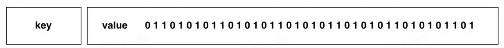
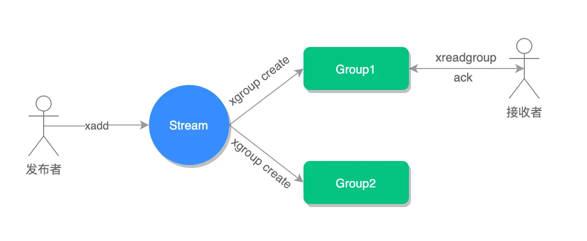
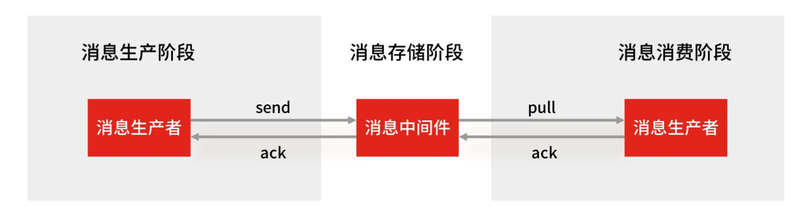

# Redis 特殊数据类型

- [1.Bitmap](#1bitmap)
- [2.HyperLogLog](#2hyperloglog)
- [3.GEO](#3geo)
- [4.Stream](#4stream)

## 1.BitMap

### 1.1 介绍

Bitmap，即位图，是一串连续的二进制数组（0 和 1），可以通过偏移量 offset 定位元素。BitMap 通过最小的单位 bit 来进行 `0|1` 的设置，表示某个元素的值或者状态，时间复杂度为 O(1)。

由于 bit 是计算机中最小的单位，使用它进行储存将非常节省空间，特别适合一些数据量大且使用二值统计的场景。



### 1.2 内部实现

Bitmap 本身是用 String 类型作为底层数据结构实现的一种统计二值状态的数据类型。

String 类型是会保存为二进制的字节数组，所以，Redis 就把字节数组的每个 bit 位利用起来，用来表示一个元素的二值状态，你可以把 Bitmap 看作是一个 bit 数组。

### 1.3 常用命令

bitmap 常用操作：

```sh
# 设置值，其中 value 只能是 0 或 1
SETBIT key offset value
# 获取值
GETBIT key offset 

# 获取指定范围内值为 1 的个数
# start 和 end 以字节为单位
BITCOUNT key start end
```

bitmap 运算操作：

```sh
# BitMap 间的运算
# operations 位移操作符，枚举值
#   &  |  ^：异或  ~：取反
# result 计算的结果，会存储在该 key 中
# key1 … keyn 参与运算的 key，可以有多个，空格分割，not 运算只能一个 key
# 当 BITOP 处理不同长度的字符串时，较短的那个字符串所缺少的部分会被看作 0。返回值是保存到 destkey 的字符串的长度（以字节byte为单位），和输入 key 中最长的字符串长度相等。
BITOP [operations] [result] [key1] [keyn…]

# 返回指定 key 中第一次出现指定 value(0/1) 的位置
BITPOS [key] [value]
```

### 1.4 应用场景

BitMap 类型非常适合二值状态统计的场景，这里的二值状态就是指集合元素的取值就只有 0 和 1 两种，在记录海量数据时，BitMap 能够有效地节省内存空间。

#### 1.4.1 签到统计

假设我们要统计 ID 100 的用户在 2022 年 6 月份的签到情况，就可以按照下面的步骤进行操作。

```sh
# 6 月 3 号签到
SETBIT uid:sign:100:202206 2 1
# 检查该用户 6 月 3 号是否签到
GETBIT uid:sign:100:202206 2
# 统计该用户 6 月的签到次数
BITCOUNT uid:sign:100:202206
# 统计这个月首次打卡时间呢
BITPOS uid:sign:100:202206 1
```

#### 1.4.2 判断用户登录态

假如我们要判断 ID = 10086 的用户的登陆情况：

```sh
# 用户登录
SETBIT login_status 10086 1
# 检查该用户是否登陆
GETBIT login_status 10086
# 登出，将 offset 对应的 value 设置成 0
SETBIT login_status 10086 0
```

#### 1.4.3 连续签到用户总数

我们把每天的日期作为 BitMap 的 key，userId 作为 offset，若是打卡则将 offset 位置的 bit 设置成 1。

一共有 7 个这样的 Bitmap，如果我们能对这 7 个 Bitmap 的对应的 bit 位做 『与』运算。同样的 UserID offset 都是一样的，当一个 userID 在 7 个 Bitmap 对应对应的 offset 位置的 bit = 1 就说明该用户 7 天连续打卡。

结果保存到一个新 Bitmap 中，我们再通过 BITCOUNT 统计 bit = 1 的个数便得到了连续打卡 7 天的用户总数了。

```sh
# 与操作
BITOP AND destmap bitmap:01 bitmap:02 bitmap:03
# 统计 bit 位 =  1 的个数
BITCOUNT destmap
```

## 2.HyperLogLog

### 2.1 介绍

Redis HyperLogLog 是 Redis 2.8.9 版本新增的数据类型，是一种用于「统计基数」的数据集合类型，基数统计就是指统计一个集合中不重复的元素个数。但要注意，HyperLogLog 是统计规则是基于概率完成的，不是非常准确，标准误算率是 0.81%。

所以，简单来说 HyperLogLog **提供不精确的去重计数**。

HyperLogLog 的优点是，在输入元素的数量或者体积非常非常大时，计算基数所需的内存空间总是固定的、并且是很小的。

HyperLogLog 的优点是，在输入元素的数量或者体积非常非常大时，计算基数所需的内存空间总是固定的、并且是很小的。

在 Redis 里面，**每个 HyperLogLog 键只需要花费 12 KB 内存，就可以计算接近 2^64 个不同元素的基数**，和元素越多就越耗费内存的 Set 和 Hash 类型相比，HyperLogLog 就非常节省空间。

这什么概念？举个例子给大家对比一下。

用 Java 语言来说，一般 long 类型占用 8 字节，而 1 字节有 8 位，即：1 byte = 8 bit，即 long 数据类型最大可以表示的数是：2^63-1。对应上面的2^64个数，假设此时有 2^63-1 这么多个数，从 0 ~ 2^63-1，按照 long 以及 1k = 1024 字节的规则来计算内存总数，就是：((2^63-1) * 8/1024)K，这是很庞大的一个数，存储空间远远超过12K，而 HyperLogLog 却可以用 12K 就能统计完。

### 2.2 内部实现

[内部实现](https://en.wikipedia.org/wiki/HyperLogLog)

### 2.3 常见命令

```sh
# 添加指定元素到 HyperLogLog 中
PFADD key element [element ...]

# 返回给定 HyperLogLog 的基数估算值。
PFCOUNT key [key ...]

# 将多个 HyperLogLog 合并为一个 HyperLogLog
PFMERGE destkey sourcekey [sourcekey ...]
```

### 2.4 应用场景

#### 2.4.1 百万级网页 UV 计数

在统计 UV 时，你可以用 PFADD 命令（用于向 HyperLogLog 中添加新元素）把访问页面的每个用户都添加到 HyperLogLog 中。

```sh
PFADD page1:uv user1 user2 user3 user4 user5
```

接下来，就可以用 PFCOUNT 命令直接获得 page1 的 UV 值了，这个命令的作用就是返回 HyperLogLog 的统计结果。

```sh
PFCOUNT page1:uv
```

## 3.GEO

### 3.1 介绍

Redis GEO 是 Redis 3.2 版本新增的数据类型，主要用于存储地理位置信息，并对存储的信息进行操作。

在日常生活中，我们越来越依赖搜索“附近的餐馆”、在打车软件上叫车，这些都离不开基于位置信息服务（Location-Based Service，LBS）的应用。LBS 应用访问的数据是和人或物关联的一组经纬度信息，而且要能查询相邻的经纬度范围，GEO 就非常适合应用在 LBS 服务的场景中。

### 3.2 内部实现

GEO 本身并没有设计新的底层数据结构，而是直接使用了 Sorted Set 集合类型。

GEO 类型使用 GeoHash 编码方法实现了经纬度到 Sorted Set 中元素权重分数的转换，这其中的两个关键机制就是「对二维地图做区间划分」和「对区间进行编码」。一组经纬度落在某个区间后，就用区间的编码值来表示，并把编码值作为 Sorted Set 元素的权重分数。

这样一来，我们就可以把经纬度保存到 Sorted Set 中，利用 Sorted Set 提供的“按权重进行有序范围查找”的特性，实现 LBS 服务中频繁使用的“搜索附近”的需求。

### 3.3 常用命令

```sh
# 存储指定的地理空间位置，可以将一个或多个经度(longitude)、纬度(latitude)、位置名称(member)添加到指定的 key 中。
GEOADD key longitude latitude member [longitude latitude member ...]

# 从给定的 key 里返回所有指定名称(member)的位置（经度和纬度），不存在的返回 nil。
GEOPOS key member [member ...]

# 返回两个给定位置之间的距离。
GEODIST key member1 member2 [m|km|ft|mi]

# 根据用户给定的经纬度坐标来获取指定范围内的地理位置集合。
GEORADIUS key longitude latitude radius m|km|ft|mi [WITHCOORD] [WITHDIST] [WITHHASH] [COUNT count] [ASC|DESC] [STORE key] [STOREDIST key]
```

### 3.4 应用场景

#### 3.4.1 打车

假设车辆 ID 是 33，经纬度位置是（116.034579，39.030452），我们可以用一个 GEO 集合保存所有车辆的经纬度，集合 key 是 cars:locations。

执行下面的这个命令，就可以把 ID 号为 33 的车辆的当前经纬度位置存入 GEO 集合中：

```sh
GEOADD cars:locations 116.034579 39.030452 33
```

当用户想要寻找自己附近的网约车时，LBS 应用就可以使用 GEORADIUS 命令。

例如，LBS 应用执行下面的命令时，Redis 会根据输入的用户的经纬度信息（116.054579，39.030452 ），查找以这个经纬度为中心的 5 公里内的车辆信息，并返回给 LBS 应用。

```sh
GEORADIUS cars:locations 116.054579 39.030452 5 km ASC COUNT 10
```

## 4.Stream

### 4.1 介绍

Redis Stream 是 Redis 5.0 版本新增加的数据类型，Redis 专门为消息队列设计的数据类型。

在 Redis 5.0 Stream 没出来之前，消息队列的实现方式都有着各自的缺陷，例如：

+ 发布订阅模式，不能持久化也就无法可靠的保存消息，并且对于离线重连的客户端不能读取历史消息的缺陷；
+ List 实现消息队列的方式不能重复消费，一个消息消费完就会被删除，而且生产者需要自行实现全局唯一 ID。

基于以上问题，Redis 5.0 便推出了 Stream 类型也是此版本最重要的功能，用于完美地实现消息队列，它支持消息的持久化、支持自动生成全局唯一 ID、支持 ack 确认消息的模式、支持消费组模式等，让消息队列更加的稳定和可靠。

### 4.2 常见命令

Stream 消息队列操作命令：

```sh
# 插入消息，保证有序，可以自动生成全局 ID
XADD
# 查询消息长度
XLEN
# 用于读取消息，可以按 ID 读取数据
XREAD
# 根据消息 ID 删除消息
XDEL
# 读取区间信息
XRANGE
# 按消费组形式读取消息
XREADGROUP
# 查询每个消费组内所有消费者「已读取、但尚未确认」的消息
XPENDING
# 向消息队列确认消息处理已完成
XACK
```

### 4.3 应用场景

#### 4.3.1 消息队列

生产者通过 XADD 命令插入一条消息：

```sh
# * 表示让 Redis 为插入的数据自动生成一个全局唯一的 ID
# 往名称为 mymq 的消息队列中插入一条消息，消息的键是 name，值是 xiaolin
> XADD mymq * name xiaolin
"1654254953808-0"
```

插入成功后会返回全局唯一的 ID：`1654254953808-0`。消息的全局唯一 ID 由两部分组成：

+ 第一部分 `1654254953808` 是数据插入时，以毫秒为单位计算的当前服务器时间；
+ 第二部分表示插入消息在当前毫秒内的消息序号，这是从 0 开始编号的。例如，`1654254953808-0` 就表示在 `1654254953808` 毫秒内的第 1 条消息。

消费者通过 `XREAD` 命令从消息队列中读取消息时，可以指定一个消息 ID，并从这个消息 ID 的下一条消息开始进行读取（注意是输入消息 ID 的下一条信息开始读取，不是查询输入 ID 的消息）。

```sh
# 从 ID 号为 1654254953807-0 的消息开始，读取后续的所有消息（示例中一共 1 条）。
> XREAD STREAMS mymq 1654254953807-0
1) 1) "mymq"
    2) 1) 1) "1654254953808-0"
        2) 1) "name"
            2) "xiaolin"
```

如果想要实现阻塞读（当没有数据时，阻塞住），可以调用 `XRAED` 时设定 `BLOCK` 配置项，实现类似于 `BRPOP` 的阻塞读取操作。

比如，下面这命令，设置了 `BLOCK 10000` 的配置项，10000 的单位是毫秒，表明 `XREAD` 在读取最新消息时，如果没有消息到来，`XREAD` 将阻塞 10000 毫秒（即 10 秒），然后再返回。

```sh
# 命令最后的 $ 符号表示读取最新的消息
> XREAD BLOCK 10000 STREAMS mymq $
(nil)
(10.00s)
```

Stream 的基础方法，使用 xadd 存入消息和 xread 循环阻塞读取消息的方式可以实现简易版的消息队列，交互流程如下图所示：


**前面介绍的这些操作 List 也支持的，接下来看看 Stream 特有的功能。**

Stream 可以以使用 `XGROUP` 创建消费组，创建消费组之后，Stream 可以使用 `XREADGROUP` 命令让消费组内的消费者读取消息。

创建两个消费组，这两个消费组消费的消息队列是 `mymq`，都指定从第一条消息开始读取：

```sh
# 创建一个名为 group1 的消费组，0-0 表示从第一条消息开始读取
> XGROUP CREATE mymq group1 0-0
OK
# 创建一个名为 group2 的消费组，0-0 表示从第一条消息开始读取
> XGROUP CREATE mymq group2 0-0
```

消费组 `group1` 内的消费者 `consumer1` 从 `mymq` 消息队列中读取所有消息的命令如下：

```sh
# 命令最后的参数 > 表示从第一条尚未被消费的消息开始读取
> XREADGROUP GROUP group1 consumer1 STREAMS mymq >
1) 1) "mymq"
    2) 1) 1) "1654254953808-0"
        2) 1) "name"
            2) "xiaolin"
```

**消息队列中的消息一旦被消费组里的一个消费者读取了，就不能再被该消费组内的其他消费者读取了，即同一个消费组里的消费者不能消费同一条消息。**

比如说，我们执行完刚才的 `XREADGROUP` 命令后，再执行一次同样的命令，此时读到的就是空值了：

```sh
> XREADGROUP GROUP group1 consumer1 STREAMS mymq >
(nil)
```

但是，**不同消费组的消费者可以消费同一条消息（但是有前提条件，创建消息组的时候，不同消费组指定了相同位置开始读取消息）。**

比如说，刚才 `group1` 消费组里的 `consumer1` 消费者消费了一条 id 为 `1654254953808-0` 的消息，现在用 `group2` 消费组里的 `consumer1` 消费者消费消息：

```sh
> XREADGROUP GROUP group2 consumer1 STREAMS mymq >
1) 1) "mymq"
    2) 1) 1) "1654254953808-0"
        2) 1) "name"
            2) "xiaolin"
```

因为我创建两组的消费组都是从第一条消息开始读取，所以可以看到第二组的消费者依然可以消费 id 为 `1654254953808-0` 的这一条消息。因此，不同的消费组的消费者可以消费同一条消息。

使用消费组的目的是让组内的多个消费者共同分担读取消息，所以，我们通常会让每个消费者读取部分消息，从而实现消息读取负载在多个消费者间是均衡分布的。

例如，我们执行下列命令，让 `group2` 中的 `consumer1、2、3` 各自读取一条消息。

```sh
# 让 group2 中的 consumer1 从 mymq 消息队列中消费一条消息
> XREADGROUP GROUP group2 consumer1 COUNT 1 STREAMS mymq >
1) 1) "mymq"
    2) 1) 1) "1654254953808-0"
        2) 1) "name"
            2) "xiaolin"
# 让 group2 中的 consumer2 从 mymq 消息队列中消费一条消息
> XREADGROUP GROUP group2 consumer2 COUNT 1 STREAMS mymq >
1) 1) "mymq"
    2) 1) 1) "1654256265584-0"
        2) 1) "name"
            2) "xiaolincoding"
# 让 group2 中的 consumer3 从 mymq 消息队列中消费一条消息
> XREADGROUP GROUP group2 consumer3 COUNT 1 STREAMS mymq >
1) 1) "mymq"
    2) 1) 1) "1654256271337-0"
        2) 1) "name"
            2) "Tom"
```

**基于 Stream 实现的消息队列，如何保证消费者在发生故障或宕机再次重启后，仍然可以读取未处理完的消息？**

Streams 会自动使用内部队列（也称为 PENDING List）留存消费组里每个消费者读取的消息，直到消费者使用 XACK 命令通知 Streams“消息已经处理完成”。

消费确认增加了消息的可靠性，一般在业务处理完成之后，需要执行 `XACK` 命令确认消息已经被消费完成，整个流程的执行如下图所示：



如果消费者没有成功处理消息，它就不会给 Streams 发送 `XACK` 命令，消息仍然会留存。此时，**消费者可以在重启后，用 XPENDING 命令查看已读取、但尚未确认处理完成的消息。**

例如，我们来查看一下 `group2` 中各个消费者已读取、但尚未确认的消息个数，命令如下：

```sh
> XPENDING mymq group2
1) (integer) 3
2) "1654254953808-0"  # 表示 group2 中所有消费者读取的消息最小 ID
3) "1654256271337-0"  # 表示 group2 中所有消费者读取的消息最大 ID
4) 1) 1) "consumer1"
      2) "1"
   2) 1) "consumer2"
      2) "1"
   3) 1) "consumer3"
      2) "1"
```

如果想查看某个消费者具体读取了哪些数据，可以执行下面的命令：

```sh
# 查看 group2 里 consumer2 已从 mymq 消息队列中读取了哪些消息
> XPENDING mymq group2 - + 10 consumer2
1) 1) "1654256265584-0"
   2) "consumer2"
   3) (integer) 410700
   4) (integer) 1
```

可以看到，`consumer2` 已读取的消息的 ID 是 `1654256265584-0`。

一旦消息 `1654256265584-0` 被 `consumer2` 处理了，`consumer2` 就可以使用 `XACK` 命令通知 Streams，然后这条消息就会被删除。

```sh
> XACK mymq group2 1654256265584-0
(integer) 1
```

当我们再使用 `XPENDING` 命令查看时，就可以看到，`consumer2` 已经没有已读取、但尚未确认处理的消息了。

```sh
> XPENDING mymq group2 - + 10 consumer2
(empty array)
```

好了，基于 Stream 实现的消息队列就说到这里了，小结一下：

+ 消息保序：XADD/XREAD
+ 阻塞读取：XREAD block
+ 重复消息处理：Stream 在使用 XADD 命令，会自动生成全局唯一 ID；
+ 消息可靠性：内部使用 `PENDING List` 自动保存消息，使用 `XPENDING` 命令查看消费组已经读取但是未被确认的消息，消费者使用 `XACK` 确认消息；
+ 支持消费组形式消费数据

**Redis 基于 Stream 消息队列与专业的消息队列有哪些差距？**

一个专业的消息队列，必须要做到两大块：

+ 消息不丢。
+ 消息可堆积。

1. Redis Stream 消息会丢失吗？

使用一个消息队列，其实就分为三大块：**生产者、队列中间件、消费者**，所以要保证消息就是保证三个环节都不能丢失数据。



Redis Stream 消息队列能不能保证三个环节都不丢失数据？

+ Redis 生产者会不会丢消息？生产者会不会丢消息，取决于生产者对于异常情况的处理是否合理。 从消息被生产出来，然后提交给 MQ 的过程中，只要能正常收到 （ MQ 中间件） 的 ack 确认响应，就表示发送成功，所以只要处理好返回值和异常，如果返回异常则进行消息重发，那么这个阶段是不会出现消息丢失的。
+ Redis 消费者会不会丢消息？不会，因为 Stream （ MQ 中间件）会自动使用内部队列（也称为 PENDING List）留存消费组里每个消费者读取的消息，但是未被确认的消息。消费者可以在重启后，用 XPENDING 命令查看已读取、但尚未确认处理完成的消息。等到消费者执行完业务逻辑后，再发送消费确认 XACK 命令，也能保证消息的不丢失。
+ Redis 消息中间件会不会丢消息？**会**，Redis 在以下 2 个场景下，都会导致数据丢失：
  + AOF 持久化配置为每秒写盘，但这个写盘过程是异步的，Redis 宕机时会存在数据丢失的可能
  + 主从复制也是异步的，主从切换时，也存在丢失数据的可能 (opens new window)。

2. Redis Stream 消息可堆积吗？

Redis 的数据都存储在内存中，这就意味着一旦发生消息积压，则会导致 Redis 的内存持续增长，如果超过机器内存上限，就会面临被 OOM 的风险。

所以 Redis 的 Stream 提供了可以指定队列最大长度的功能，就是为了避免这种情况发生。

当指定队列最大长度时，队列长度超过上限后，旧消息会被删除，只保留固定长度的新消息。这么来看，Stream 在消息积压时，如果指定了最大长度，还是有可能丢失消息的。

但 Kafka、RabbitMQ 专业的消息队列它们的数据都是存储在磁盘上，当消息积压时，无非就是多占用一些磁盘空间。

因此，把 Redis 当作队列来使用时，会面临的 2 个问题：

+ Redis 本身可能会丢数据；
+ 面对消息挤压，内存资源会紧张；

所以，能不能将 Redis 作为消息队列来使用，关键看你的业务场景：

+ 如果你的业务场景足够简单，对于数据丢失不敏感，而且消息积压概率比较小的情况下，把 Redis 当作队列是完全可以的。
+ 如果你的业务有海量消息，消息积压的概率比较大，并且不能接受数据丢失，那么还是用专业的消息队列中间件吧。

**Redis 发布/订阅机制为什么不可以作为消息队列？**

发布订阅机制存在以下缺点，都是跟丢失数据有关：

+ 发布/订阅机制没有基于任何数据类型实现，所以不具备「数据持久化」的能力，也就是发布/订阅机制的相关操作，不会写入到 RDB 和 AOF 中，当 Redis 宕机重启，发布/订阅机制的数据也会全部丢失。
+ 发布订阅模式是“发后既忘”的工作模式，如果有订阅者离线重连之后不能消费之前的历史消息。
+ 当消费端有一定的消息积压时，也就是生产者发送的消息，消费者消费不过来时，如果超过 32M 或者是 60s 内持续保持在 8M 以上，消费端会被强行断开，这个参数是在配置文件中设置的，默认值是 `client-output-buffer-limit pubsub 32mb 8mb 60`。

所以，发布/订阅机制只适合即使通讯的场景，比如构建哨兵集群 的场景采用了发布/订阅机制。