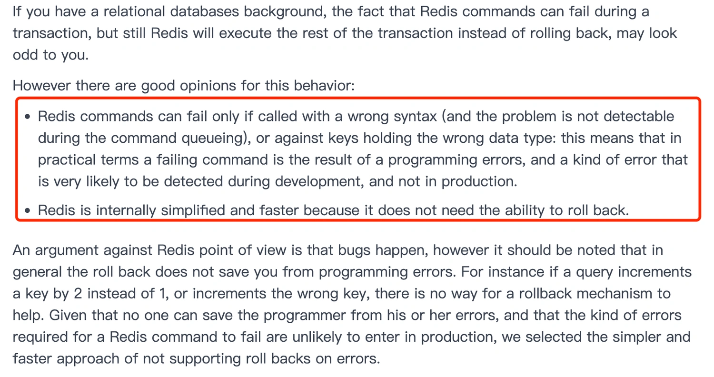

# Redis 事务

Redis 事务本质：一组命令的集合。一个事务中的所有命令都会被序列化，在事务执行过程中，会顺序执行。

事务特性：一次性、顺序性、排他性(执行过程中不允许其他指令执行)。(没有隔离级别的概念)

所有的命令在事务中，并没有直接被执行。只有**发起执行命令的时候才会执行**。

**Redis 单条命令是保证原子性的，但是事务不保证原子性。**

## 1.Redis 事务流程

1. 开启事务(MULTI)

2. 命令入队(...)

3. 执行事务(EXEC)

## 2.执行事务

执行事务使用 `EXEC` 指令：

```bash
127.0.0.1:6379> MULTI           # 开启事务
OK
127.0.0.1:6379(TX)> set k1 v1   # 命令入队
QUEUED
127.0.0.1:6379(TX)> set k2 v2
QUEUED
127.0.0.1:6379(TX)> get k2
QUEUED
127.0.0.1:6379(TX)> set k3 v3
QUEUED
127.0.0.1:6379(TX)> exec        # 执行事务
1) OK
2) OK
3) "v2"
4) OK
```

## 3.放弃事务实例

放弃事务使用 `DISCARD` 指令；

```bash
127.0.0.1:6379> MULTI
OK
127.0.0.1:6379(TX)> set k1 v1
QUEUED
127.0.0.1:6379(TX)> set k2 v2
QUEUED
127.0.0.1:6379(TX)> set k4 v4
QUEUED
127.0.0.1:6379(TX)> DISCARD     # 取消事务
OK
127.0.0.1:6379> get k4
(nil)
```

## 4.编译型异常 

编译型异常(代码/命令错误)，事务中所有的命令都不会执行。

```bash
127.0.0.1:6379> MULTI
OK
127.0.0.1:6379(TX)> set k1 v1
QUEUED
127.0.0.1:6379(TX)> set k2 v2
QUEUED
127.0.0.1:6379(TX)> getset k1   # 错误的命令
(error) ERR wrong number of arguments for 'getset' command
127.0.0.1:6379(TX)> set k3 v3
QUEUED
127.0.0.1:6379(TX)> EXEC        # 执行事务报错
(error) EXECABORT Transaction discarded because of previous errors.
127.0.0.1:6379> get k1          # 所有的命令都不执行
(nil)
127.0.0.1:6379> get k2
(nil)
```

## 5.运行时异常

运行时异常（1/0），其他命令正常执行，错误命令抛出异常。

```bash
127.0.0.1:6379> MULTI
OK
127.0.0.1:6379(TX)> set k1 v1
QUEUED
127.0.0.1:6379(TX)> set k2 v2
QUEUED
127.0.0.1:6379(TX)> getset k1
(error) ERR wrong number of arguments for 'getset' command
127.0.0.1:6379(TX)> set k3 v3
QUEUED
127.0.0.1:6379(TX)> EXEC        # 有命令报错，依旧正常执行其他命令
(error) EXECABORT Transaction discarded because of previous errors.
127.0.0.1:6379> get k1
(nil)
127.0.0.1:6379> get k2
(nil)
```

## 6.Redis 事务支持回滚吗？

MySQL 在执行事务时，会提供回滚机制，当事务执行发生错误时，事务中的所有操作都会撤销，已经修改的数据也会被恢复到事务执行前的状态。

**Redis 中并没有提供回滚机制**，虽然 Redis 提供了 DISCARD 命令，但是这个命令只能用来主动放弃事务执行，把暂存的命令队列清空，起不到回滚的效果。

事务执行过程中，如果命令入队时没报错，而事务提交后，实际执行时报错了，正确的命令依然可以正常执行，所以这可以看出 **Redis 并不一定保证原子性**（原子性：事务中的命令要不全部成功，要不全部失败）。

## 7.为什么 Redis 不支持事务回滚？

Redis 官方文档解释如下：



大概的意思是，作者不支持事务回滚的原因有以下两个：

+ 他认为 Redis 事务的执行时，错误通常都是编程错误造成的，这种错误通常只会出现在开发环境中，而很少会在实际的生产环境中出现，所以他认为没有必要为 Redis 开发事务回滚功能；
+ 不支持事务回滚是因为这种复杂的功能和 Redis 追求的简单高效的设计主旨不符合。

这里不支持事务回滚，指的是不支持事务运行时错误的事务回滚。