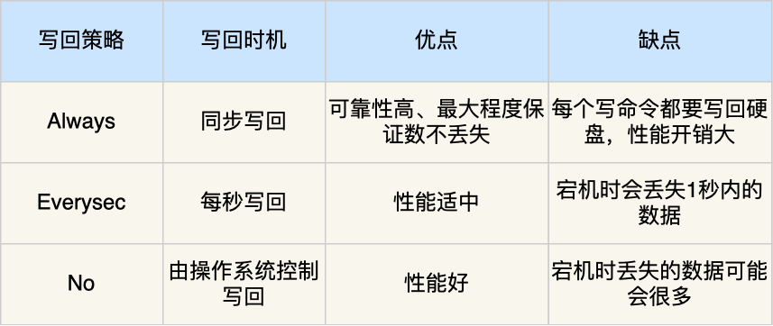

# Redis 持久化

- [Redis 持久化](#redis-持久化)
  - [1.Redis 如何保证数据不丢失](#1redis-如何保证数据不丢失)
  - [2.AOF 日志是如何实现的？](#2aof-日志是如何实现的)
    - [2.1 AOF 配置文件解析](#21-aof-配置文件解析)
    - [2.2 为什么先执行命令，再把数据写入日志](#22-为什么先执行命令再把数据写入日志)
    - [2.3 AOF 写回策略有几种？](#23-aof-写回策略有几种)
    - [2.4 AOF 日志过大，会触发什么机制？](#24-aof-日志过大会触发什么机制)
    - [2.5 重写 AOF 日志的过程是怎样的？](#25-重写-aof-日志的过程是怎样的)
    - [2.6 AOF 文件校验](#26-aof-文件校验)

## 1.Redis 如何保证数据不丢失

Redis 的读写操作都是在内存中，所以 Redis 性能才会高，但是当 Redis 重启后，内存中的数据就会丢失，那为了保证内存中的数据不会丢失，Redis 实现了数据持久化的机制，这个机制会把数据存储到磁盘，这样在 Redis 重启就能够从磁盘中恢复原有的数据。

Redis 共有三种数据持久化的方式：

+ **AOF 日志**：每执行一条写操作命令，就把该命令以追加的方式写入到一个文件里；
+ **RDB 快照**：将某一时刻的内存数据，以二进制的方式写入磁盘；
+ **混合持久化方式**：Redis 4.0 新增的方式，集成了 AOF 和 RBD 的优点；

## 2.AOF 日志是如何实现的？

Redis 在执行完一条写操作命令后，就会把该命令以追加的方式写入到一个文件里，然后 Redis 重启时，会读取该文件记录的命令，然后逐一执行命令的方式来进行数据恢复。


我这里以「set name xiaolin」命令作为例子，Redis 执行了这条命令后，记录在 AOF 日志里的内容如下图：


我这里给大家解释下。

「*3」表示当前命令有三个部分，每部分都是以「$+数字」开头，后面紧跟着具体的命令、键或值。然后，这里的「数字」表示这部分中的命令、键或值一共有多少字节。例如，「$3 set」表示这部分有 3 个字节，也就是「set」命令这个字符串的长度。

### 2.1 AOF 配置文件解析

```c
############################## APPEND ONLY MODE ###############################

appendonly no       # 默认不开启
appendfilename "appendonly.aof"     # aof 持久化文件名

# appendfsync always        # 每次修改都会 sync，消耗性能
appendfsync everysec        # 每秒执行一次 sync，可能会丢失这 1 秒的数据
# appendfsync no            # 不执行 sync，操作系统自己同步数据，速度最快

auto-aof-rewrite-percentage 100
auto-aof-rewrite-min-size 64mb      # aof 默认是文件追加，如果 aof 文件超过 64m，fork 一个新进程来将文件进行重写
```

### 2.2 为什么先执行命令，再把数据写入日志

Reids 是先执行写操作命令后，才将该命令记录到 AOF 日志里的，这么做其实有两个好处。

+ **避免额外的检查开销**：因为如果先将写操作命令记录到 AOF 日志里，再执行该命令的话，如果当前的命令语法有问题，那么如果不进行命令语法检查，该错误的命令记录到 AOF 日志里后，Redis 在使用日志恢复数据时，就可能会出错。
+ **不会阻塞当前写操作命令的执行**：因为当写操作命令执行成功后，才会将命令记录到 AOF 日志。

当然，这样做也会带来风险：

+ **数据可能会丢失**： 执行写操作命令和记录日志是两个过程，那当 Redis 在还没来得及将命令写入到硬盘时，服务器发生宕机了，这个数据就会有丢失的风险。
+ **可能阻塞其他操作**： 由于写操作命令执行成功后才记录到 AOF 日志，所以不会阻塞当前命令的执行，但因为 AOF 日志也是在主线程中执行，所以当 Redis 把日志文件写入磁盘的时候，还是会阻塞后续的操作无法执行。

### 2.3 AOF 写回策略有几种？

先来看看，Redis 写入 AOF 日志的过程，如下图：


具体说说：

1. Redis 执行完写操作命令后，会将命令追加到 `server.aof_buf` 缓冲区；
2. 然后通过 `write()` 系统调用，将 `aof_buf` 缓冲区的数据写入到 AOF 文件，此时数据并没有写入到硬盘，而是拷贝到了内核缓冲区 page cache，等待内核将数据写入硬盘；
3. 具体内核缓冲区的数据什么时候写入到硬盘，由内核决定。

Redis 提供了 3 种写回硬盘的策略，控制的就是上面说的第三步的过程。 在 Redis.conf 配置文件中的 `appendfsync` 配置项可以有以下 3 种参数可填：

+ **Always**：是每次写操作命令执行完后，同步将 AOF 日志数据写回硬盘；
+ **Everysec**：每次写操作命令执行完后，先将命令写入到 AOF 文件的内核缓冲区，然后每隔一秒将缓冲区里的内容写回到硬盘；
+ **No**：意味着不由 Redis 控制写回硬盘的时机，转交给操作系统控制写回的时机，也就是每次写操作命令执行完后，先将命令写入到 AOF 文件的内核缓冲区，再由操作系统决定何时将缓冲区内容写回硬盘。

我也把这 3 个写回策略的优缺点总结成了一张表格：



### 2.4 AOF 日志过大，会触发什么机制？

AOF 日志是一个文件，随着执行的写操作命令越来越多，文件的大小会越来越大。 如果当 AOF 日志文件过大就会带来性能问题，比如重启 Redis 后，需要读 AOF 文件的内容以恢复数据，如果文件过大，整个恢复的过程就会很慢。

所以，Redis 为了避免 AOF 文件越写越大，提供了 **AOF 重写机制**，当 AOF 文件的大小超过所设定的阈值后，Redis 就会启用 AOF 重写机制，来压缩 AOF 文件。

AOF 重写机制是在重写时，读取当前数据库中的所有键值对，然后将每一个键值对用一条命令记录到「新的 AOF 文件」，等到全部记录完后，就将新的 AOF 文件替换掉现有的 AOF 文件。

举个例子，在没有使用重写机制前，假设前后执行了「set name xiaolin」和「set name xiaolincoding」这两个命令的话，就会将这两个命令记录到 AOF 文件。


但是**在使用重写机制后，就会读取 name 最新的 value（键值对） ，然后用一条 「set name xiaolincoding」命令记录到新的 AOF 文件**，之前的第一个命令就没有必要记录了，因为它属于「历史」命令，没有作用了。这样一来，一个键值对在重写日志中只用一条命令就行了。

重写工作完成后，就会将新的 AOF 文件覆盖现有的 AOF 文件，这就相当于压缩了 AOF 文件，使得 AOF 文件体积变小了。

### 2.5 重写 AOF 日志的过程是怎样的？

Redis 的**重写 AOF 过程是由后台子进程 bgrewriteaof 来完成的**，这么做可以达到两个好处：

+ 子进程进行 AOF 重写期间，主进程可以继续处理命令请求，从而避免阻塞主进程；
+ 子进程带有主进程的数据副本，这里使用子进程而不是线程，因为如果是使用线程，多线程之间会共享内存，那么在修改共享内存数据的时候，需要通过加锁来保证数据的安全，而这样就会降低性能。而使用子进程，创建子进程时，父子进程是共享内存数据的，不过这个共享的内存只能以只读的方式，而当父子进程任意一方修改了该共享内存，就会发生「写时复制」，于是父子进程就有了独立的数据副本，就不用加锁来保证数据安全。

触发重写机制后，主进程就会创建重写 AOF 的子进程，此时父子进程共享物理内存，重写子进程只会对这个内存进行只读，重写 AOF 子进程会读取数据库里的所有数据，并逐一把内存数据的键值对转换成一条命令，再将命令记录到重写日志（新的 AOF 文件）。

**但是重写过程中，主进程依然可以正常处理命令**，那问题来了，重写 AOF 日志过程中，如果主进程修改了已经存在 key-value，那么会发生写时复制，此时这个 key-value 数据在子进程的内存数据就跟主进程的内存数据不一致了，这时要怎么办呢？

为了解决这种数据不一致问题，Redis 设置了一个 **AOF 重写缓冲区**，这个缓冲区在创建 bgrewriteaof 子进程之后开始使用。

在重写 AOF 期间，当 Redis 执行完一个写命令之后，它会同时将这个写命令写入到 「AOF 缓冲区」和 「AOF 重写缓冲区」。


也就是说，在 bgrewriteaof 子进程执行 AOF 重写期间，主进程需要执行以下三个工作:

+ 执行客户端发来的命令；
+ 将执行后的写命令追加到 「AOF 缓冲区」；
+ 将执行后的写命令追加到 「AOF 重写缓冲区」；

当子进程完成 AOF 重写工作（扫描数据库中所有数据，逐一把内存数据的键值对转换成一条命令，再将命令记录到重写日志）后，会向主进程发送一条信号，信号是进程间通讯的一种方式，且是异步的。

主进程收到该信号后，会调用一个信号处理函数，该函数主要做以下工作：

+ 将 AOF 重写缓冲区中的所有内容追加到新的 AOF 的文件中，使得新旧两个 AOF 文件所保存的数据库状态一致；
+ 新的 AOF 的文件进行改名，覆盖现有的 AOF 文件。

信号函数执行完后，主进程就可以继续像往常一样处理命令了。

### 2.6 AOF 文件校验

如果 `appendonly.aof` 文件遭到破坏，这个时候是无法启动 Redis 的，可以修复这个文件。

Redis 给我们提供了一个工具 redis-check-aof，也位于 `/usr/local/bin` 目录下。

```sh
redis-check-aof --fix appendonly.aof
```