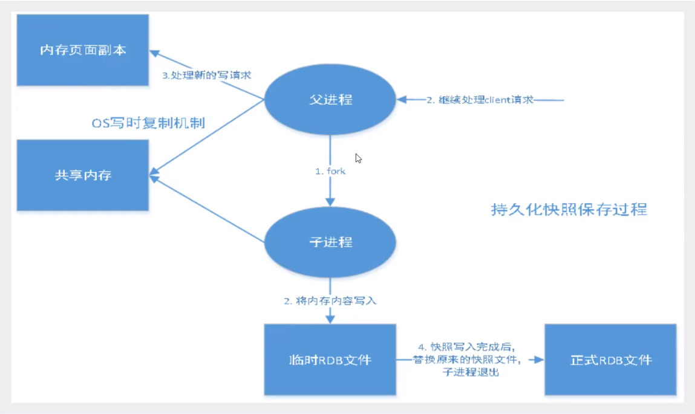

# redis 持久化之 RDB

Redis 是内存数据库，如果不将内存中的数据库状态保存到磁盘，那么一旦服务器进程退出，服务器中的数据库状态也会消失。所以 Redis 提供了持久化功能。

## RDB(Redis Database)

### 什么是 RDB



在指定的时间间隔内将内存中的数据集快照进入磁盘，也就是 Snapshot 快照，恢复时将快照文件直接读到内存里。

Redis 会单独创建(fork)一个子进程来进行持久化，会先将数据写入到一个临时文件中，待持久化过程都结束了，再用这个临时文件替换上次持久化好的文件。整个过程中，主进程是不进行任何 IO 操作的。

这就确保了极高的性能。如果需要进行大规模数据的恢复，且对于数据恢复的完整性不是非常敏感，RDB 方式要比 AOF 方式更加的高效。

RDB 的缺点是最后一次持久化后的数据可能丢失。

一般情况下默认的就是 RDB，不需要修改。

RDB 保存的文件是 `dump.rdb`，可在配置文件中修改。（有时候在生产环境会对其进行备份）

```conf
save 3600 1

dbfilename dump.rdb
```

### 触发机制

1. save 的规则满足条件的情况下；

2. 执行 `FLUSHALL` 命令；(只会生成空的文件)

3. 退出 redis。

上述情况均会自动生成一个 `dump.rdb`。

### 如何恢复

只需要将 rdb 文件放在我们 redis 启动目录就可以，redis 启动的时候会自动检查 dump.rdb。

#### 查看需要存放的位置

```bash
127.0.0.1:6379> config get dir
1) "dir"
2) "/usr/local/bin"
```

## RDB 的优缺点

优点：

1. 适合大规模的数据恢复

缺点：

1. 需要一定的时间间隔进程操作，如果 redis 意外宕机，最后一次修改的数据就没有了

2. fork 进程会占据一定的内存空间