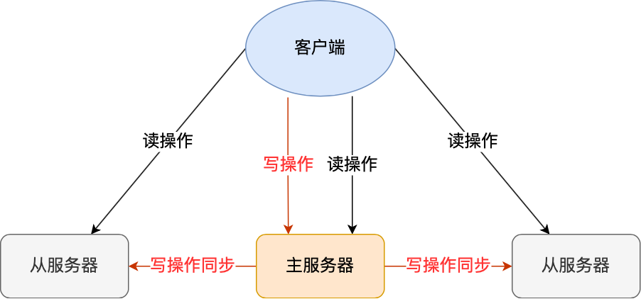
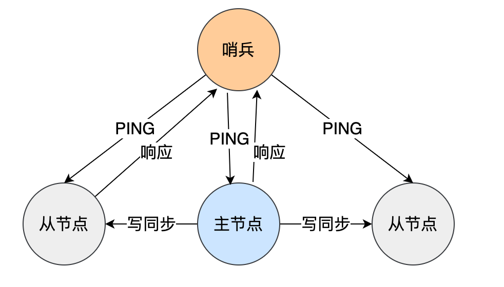
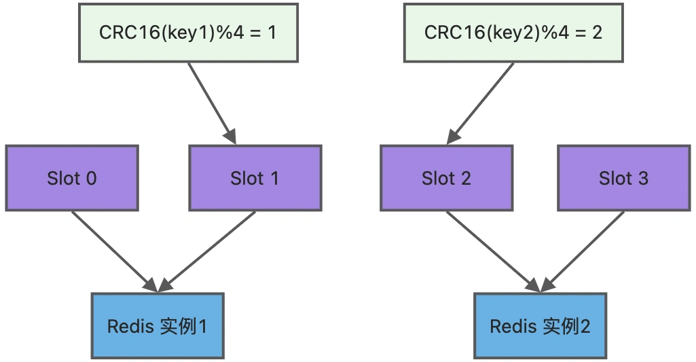
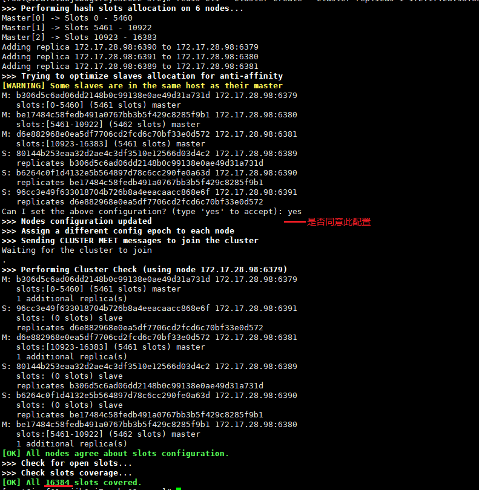

# Redis 集群

- [Redis 集群](#redis-集群)
  - [1.Redis 如何实现服务高可用](#1redis-如何实现服务高可用)
    - [1.1 主从复制](#11-主从复制)
    - [1.2 哨兵模式](#12-哨兵模式)
    - [1.3 切片集群模式](#13-切片集群模式)
  - [2.集群脑裂导致数据丢失怎么办？](#2集群脑裂导致数据丢失怎么办)
    - [2.1 什么是脑裂？](#21-什么是脑裂)
    - [2.2 解决方案](#22-解决方案)
  - [3.集群搭建实操](#3集群搭建实操)
  - [4.参考](#4参考)

## 1.Redis 如何实现服务高可用

要想设计一个高可用的 Redis 服务，一定要从 Redis 的多服务节点来考虑，比如 Redis 的主从复制、哨兵模式、切片集群。

### 1.1 主从复制

主从复制是 Redis 高可用服务的最基础的保证，实现方案就是将从前的一台 Redis 服务器，同步数据到多台从 Redis 服务器上，即一主多从的模式，且主从服务器之间采用的是「读写分离」的方式。


主服务器可以进行读写操作，当发生写操作时自动将写操作同步给从服务器，而从服务器一般是只读，并接受主服务器同步过来写操作命令，然后执行这条命令。



也就是说，所有的数据修改只在主服务器上进行，然后将最新的数据同步给从服务器，这样就使得主从服务器的数据是一致的。

注意，主从服务器之间的命令复制是**异步**进行的。

具体来说，在主从服务器命令传播阶段，主服务器收到新的写命令后，会发送给从服务器。但是，主服务器并不会等到从服务器实际执行完命令后，再把结果返回给客户端，而是主服务器自己在本地执行完命令后，就会向客户端返回结果了。如果从服务器还没有执行主服务器同步过来的命令，主从服务器间的数据就不一致了。

所以，无法实现强一致性保证（主从数据时时刻刻保持一致），数据不一致是难以避免的。

### 1.2 哨兵模式

在使用 Redis 主从服务的时候，会有一个问题，就是当 Redis 的主从服务器出现故障宕机时，需要手动进行恢复。

为了解决这个问题，Redis 增加了哨兵模式（**Redis Sentinel**），因为哨兵模式做到了可以监控主从服务器，并且提供**主从节点故障转移的功能**。



### 1.3 切片集群模式

当 Redis 缓存数据量大到一台服务器无法缓存时，就需要使用 **Redis 切片集群**（Redis Cluster ）方案，它将数据分布在不同的服务器上，以此来降低系统对单主节点的依赖，从而提高 Redis 服务的读写性能。

Redis Cluster 方案采用哈希槽（Hash Slot），来处理数据和节点之间的映射关系。在 Redis Cluster 方案中，**一个切片集群共有 16384 个哈希槽**，这些哈希槽类似于数据分区，每个键值对都会根据它的 key，被映射到一个哈希槽中，具体执行过程分为两大步：

+ 根据键值对的 key，按照 CRC16 算法 (opens new window)计算一个 16 bit 的值。
+ 再用 16bit 值对 16384 取模，得到 0~16383 范围内的模数，每个模数代表一个相应编号的哈希槽。

接下来的问题就是，这些哈希槽怎么被映射到具体的 Redis 节点上的呢？有两种方案：

+ **平均分配**： 在使用 cluster create 命令创建 Redis 集群时，Redis 会自动把所有哈希槽平均分布到集群节点上。比如集群中有 9 个节点，则每个节点上槽的个数为 16384/9 个。
+ **手动分配**： 可以使用 cluster meet 命令手动建立节点间的连接，组成集群，再使用 cluster addslots 命令，指定每个节点上的哈希槽个数。

为了方便你的理解，我通过一张图来解释数据、哈希槽，以及节点三者的映射分布关系。



上图中的切片集群一共有 2 个节点，假设有 4 个哈希槽（Slot 0～Slot 3）时，我们就可以通过命令手动分配哈希槽，比如节点 1 保存哈希槽 0 和 1，节点 2 保存哈希槽 2 和 3。

```c
redis-cli -h 192.168.1.10 –p 6379 cluster addslots 0,1
redis-cli -h 192.168.1.11 –p 6379 cluster addslots 2,3
```

然后在集群运行的过程中，key1 和 key2 计算完 CRC16 值后，对哈希槽总个数 5 进行取模，再根据各自的模数结果，就可以被映射到对应的节点 1 和节点 3 上了。

需要注意的是，在手动分配哈希槽时，需要把 16384 个槽都分配完，否则 Redis 集群无法正常工作。

## 2.集群脑裂导致数据丢失怎么办？

### 2.1 什么是脑裂？

先来理解集群的脑裂现象，这就好比一个人有两个大脑，那么到底受谁控制呢？

那么在 Redis 中，集群脑裂产生数据丢失的现象是怎样的呢？

在 Redis 主从架构中，部署方式一般是「一主多从」，主节点提供写操作，从节点提供读操作。 如果主节点的网络突然发生了问题，它与所有的从节点都失联了，但是此时的主节点和客户端的网络是正常的，这个客户端并不知道 Redis 内部已经出现了问题，还在照样的向这个失联的主节点写数据（过程A），此时这些数据被旧主节点缓存到了缓冲区里，因为主从节点之间的网络问题，这些数据都是无法同步给从节点的。

这时，哨兵也发现主节点失联了，它就认为主节点挂了（但实际上主节点正常运行，只是网络出问题了），于是哨兵就会在「从节点」中选举出一个 leader 作为主节点，这时集群就有两个主节点了 —— **脑裂出现了**。

然后，网络突然好了，哨兵因为之前已经选举出一个新主节点了，它就会把旧主节点降级为从节点（A），然后从节点（A）会向新主节点请求数据同步，**因为第一次同步是全量同步的方式，此时的从节点（A）会清空掉自己本地的数据，然后再做全量同步。所以，之前客户端在过程 A 写入的数据就会丢失了，也就是集群产生脑裂数据丢失的问题。**

总结一句话就是：由于网络问题，集群节点之间失去联系。主从数据不同步；重新平衡选举，产生两个主服务。等网络恢复，旧主节点会降级为从节点，再与新主节点进行同步复制的时候，由于会从节点会清空自己的缓冲区，所以导致之前客户端写入的数据丢失了。

### 2.2 解决方案

当主节点发现从节点下线或者通信超时的总数量小于阈值时，那么禁止主节点进行写数据，直接把错误返回给客户端。

在 Redis 的配置文件中有两个参数我们可以设置：

+ min-slaves-to-write x，主节点必须要有至少 x 个从节点连接，如果小于这个数，主节点会禁止写数据。
+ min-slaves-max-lag x，主从数据复制和同步的延迟不能超过 x 秒，如果超过，主节点会禁止写数据。

我们可以把 min-slaves-to-write 和 min-slaves-max-lag 这两个配置项搭配起来使用，分别给它们设置一定的阈值，假设为 N 和 T。

这两个配置项组合后的要求是，主库连接的从库中至少有 N 个从库，和主库进行数据复制时的 ACK 消息延迟不能超过 T 秒，否则，主库就不会再接收客户端的写请求了。

即使原主库是假故障，它在假故障期间也无法响应哨兵心跳，也不能和从库进行同步，自然也就无法和从库进行 ACK 确认了。这样一来，min-slaves-to-write 和 min-slaves-max-lag 的组合要求就无法得到满足，**原主库就会被限制接收客户端写请求，客户端也就不能在原主库中写入新数据了。**

再来举个例子。

假设我们将 min-slaves-to-write 设置为 1，把 min-slaves-max-lag 设置为 12s，把哨兵的 down-after-milliseconds 设置为 10s，主库因为某些原因卡住了 15s，导致哨兵判断主库客观下线，开始进行主从切换。

同时，因为原主库卡住了 15s，没有一个从库能和原主库在 12s 内进行数据复制，原主库也无法接收客户端请求了。

这样一来，主从切换完成后，也只有新主库能接收请求，不会发生脑裂，也就不会发生数据丢失的问题了。

## 3.集群搭建实操

1. 删除持久化数据

删除 rdb、aof 文件。

2. 配置 6 个 Redis 实例，以端口号进行区分

`redis63xx.conf`：

```conf
include ./redis.conf;
pidfile /var/run/redis_63xx.pid
port 63xx
dbfilename "dump63xx.rdb"

############### redis cluster ###############

# 打开集群模式
cluster-enabled yes

# 设置节点配置文件名
cluster-config-file nodes-63xx.conf

# 设置节点失联时间，超过该时间(毫秒)，集群自动进行主从切换
cluster-node-timeout 15000
```

3. 启动配置好的 6 个 Redis 服务

```sh
redis-server redis63xx.conf
```

4. 将 6 个节点合成一个集群

合并之前，确保所有的 Redis 实例成功启动，nodes-63xx.conf 文件都生成正常。

进入 Redis 安装目录下的 src 目录：

```sh
cd your_redis_install_dir/src
```

执行命令：

```sh
# ip 不能写 127.0.0.1
redis-cli --cluster create --cluster-replicas 1 ip:6379 ip:6380 ip:6381 ip:6389 ip:6390 ip:6391
```

注意几点：

+ protected-mode 要改为 no
+ requirepass 这里我设为空，否则会报权限验证不通过

执行结果：



5. `-c` 采用集群策略连接，设置数据会自动切换到相应的写主机

```sh
redis-cli -c -p 6379
```

查看集群节点信息 `CLUSTER NODES`

```sh
127.0.0.1:6379> CLUSTER NODES
96cc3e49f633018704b726b8a4eeacaacc868e6f your_ip:6391@16391 slave d6e882968e0ea5df7706cd2fcd6c70bf33e0d572 0 1625020767561 3 connected
d6e882968e0ea5df7706cd2fcd6c70bf33e0d572 your_ip:6381@16381 master - 0 1625020767000 3 connected 10923-16383
80144b253eaa32d2ae4c3df3510e12566d03d4c2 your_ip:6389@16389 slave b306d5c6ad06dd2148b0c99138e0ae49d31a731d 0 1625020766558 1 connected
b6264c0f1d4132e5b564897d78c6cc290fe0a63d your_ip:6390@16390 slave be17484c58fedb491a0767bb3b5f429c8285f9b1 0 1625020768000 2 connected
b306d5c6ad06dd2148b0c99138e0ae49d31a731d your_ip:6379@16379 myself,master - 0 1625020765000 1 connected 0-5460
be17484c58fedb491a0767bb3b5f429c8285f9b1 your_ip:6380@16380 master - 0 1625020768571 2 connected 5461-10922
```

从返回结果可以看到每个主节点都有对应的从节点，并且每个主节点负责的插槽如下：

+ master6379 负责 0-5460
+ master6380 负责 5461-10922
+ master6381 负责 10923-16383

6. 写入数据

```sh
127.0.0.1:6379> set k1 v1
->Redirected to slot [12706] located at 196.168.44.168:6379
OK
```

注意： 不在同一个 slot 同时 `mset` 多个 key 是行不通的，可以通过组来实现。

```sh
mset name{user} Nancy age{user} 20
```

7. 查询数据

```sh
# 返回 slot 槽中的 key 个数
CLUSTER COUNTKEYSINSLOT <slot>

# 返回 count 个 slot 槽中的键
CLUSTER GETKEYSINSLOT <slot> <count>
```

## 4.参考

[Redis 集群 - 小林coding](https://xiaolincoding.com/redis/base/redis_interview.html#redis-%E9%9B%86%E7%BE%A4)

[Redis 集群环境搭建 - bilibili - 狂神](https://www.bilibili.com/video/BV1S54y1R7SB?p=31&vd_source=91fa52272f3d7f5d1d4f7a617c1dc644)

[Redis 集群参数 - CSDN - 老许的花开](https://blog.csdn.net/weixin_35738304/article/details/112518907)