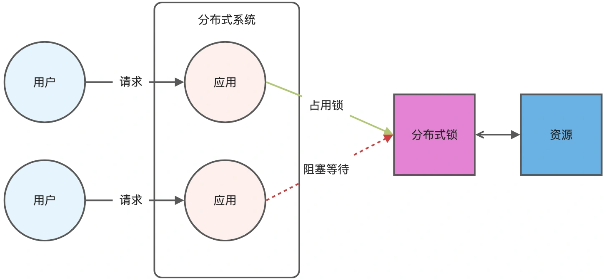

# Redis 实操

- [Redis 实操](#redis-实操)
  - [1.Redis 如何实现延迟队列？](#1redis-如何实现延迟队列)
  - [2.Redis 的大 key 如何处理？](#2redis-的大-key-如何处理)
    - [2.1 什么是 Redis 大 key？](#21-什么是-redis-大-key)
    - [2.2 大 key 会造成什么问题？](#22-大-key-会造成什么问题)
    - [2.3 如何找到大 key？](#23-如何找到大-key)
    - [2.4 如何删除大 key](#24-如何删除大-key)
  - [3.Redis 管道有什么用？](#3redis-管道有什么用)
  - [4.如何用 Redis 实现分布式锁？](#4如何用-redis-实现分布式锁)
    - [4.1 基于 Redis 实现分布式锁有什么优缺点？](#41-基于-redis-实现分布式锁有什么优缺点)
    - [4.2 Redis 如何解决集群情况下分布式锁的可靠性？](#42-redis-如何解决集群情况下分布式锁的可靠性)

## 1.Redis 如何实现延迟队列？

延迟队列是指把当前要做的事情，往后推迟一段时间再做。延迟队列的常见使用场景有以下几种：

+ 在淘宝、京东等购物平台上下单，超过一定时间未付款，订单会自动取消；
+ 打车的时候，在规定时间没有车主接单，平台会取消你的单并提醒你暂时没有车主接单；
+ 点外卖的时候，如果商家在10分钟还没接单，就会自动取消订单；

在 Redis 可以使用有序集合（ZSet）的方式来实现延迟消息队列的，ZSet 有一个 `Score` 属性可以用来存储延迟执行的时间。

使用 `zadd score1 value1` 命令就可以一直往内存中生产消息。再利用 `zrangebysocre` 查询符合条件的所有待处理的任务， 通过循环执行队列任务即可。


## 2.Redis 的大 key 如何处理？

### 2.1 什么是 Redis 大 key？

大 key 并不是指 key 的值很大，而是 key 对应的 value 很大。

一般而言，下面这两种情况被称为大 key：

+ String 类型的值大于 10 KB；
+ Hash、List、Set、ZSet 类型的元素的个数超过 5000个；

### 2.2 大 key 会造成什么问题？

大 key 会带来以下四种影响：

+ **客户端超时阻塞**。由于 Redis 执行命令是单线程处理，然后在操作大 key 时会比较耗时，那么就会阻塞 Redis，从客户端这一视角看，就是很久很久都没有响应。
+ **引发网络阻塞**。每次获取大 key 产生的网络流量较大，如果一个 key 的大小是 1 MB，每秒访问量为 1000，那么每秒会产生 1000MB 的流量，这对于普通千兆网卡的服务器来说是灾难性的。
+ **阻塞工作线程**。如果使用 del 删除大 key 时，会阻塞工作线程，这样就没办法处理后续的命令。
+ **内存分布不均**。集群模型在 slot 分片均匀情况下，会出现数据和查询倾斜情况，部分有大 key 的 Redis 节点占用内存多，QPS 也会比较大。

### 2.3 如何找到大 key？

1. redis-cli --bigkeys 命令查找大 key：

```sh
redis-cli -h 127.0.0.1 -p6379 -a "password" -- bigkeys
```

使用的时候注意事项：

+ 最好选择在从节点上执行该命令。因为主节点上执行时，会阻塞主节点；
+ 如果没有从节点，那么可以选择在 Redis 实例业务压力的低峰阶段进行扫描查询，以免影响到实例的正常运行；或者可以使用 -i 参数控制扫描间隔，避免长时间扫描降低 Redis 实例的性能。

该方式的不足之处：

+ 这个方法只能返回每种类型中最大的那个 bigkey，无法得到大小排在前 N 位的 bigkey；
+ 对于集合类型来说，这个方法只统计集合元素个数的多少，而不是实际占用的内存量。但是，一个集合中的元素个数多，并不一定占用的内存就多。因为，有可能每个元素占用的内存很小，这样的话，即使元素个数有很多，总内存开销也不大；

2. 使用 SCAN 命令查找大 key

使用 SCAN 命令对数据库扫描，然后用 TYPE 命令获取返回的每一个 key 的类型。

对于 String 类型，可以直接使用 STRLEN 命令获取字符串的长度，也就是占用的内存空间字节数。

对于集合类型来说，有两种方法可以获得它占用的内存大小：

+ 如果能够预先从业务层知道集合元素的平均大小，那么，可以使用下面的命令获取集合元素的个数，然后乘以集合元素的平均大小，这样就能获得集合占用的内存大小了。List 类型：LLEN 命令；Hash 类型：HLEN 命令；Set 类型：SCARD 命令；Sorted Set 类型：ZCARD 命令；
+ 如果不能提前知道写入集合的元素大小，可以使用 MEMORY USAGE 命令（需要 Redis 4.0 及以上版本），查询一个键值对占用的内存空间。

3. 使用 RdbTools 工具查找大 key

使用 RdbTools 第三方开源工具，可以用来解析 Redis 快照（RDB）文件，找到其中的大 key。

比如，下面这条命令，将大于 10 kb 的  key  输出到一个表格文件。

```sh
rdb dump.rdb -c memory --bytes 10240 -f redis.csv
```

### 2.4 如何删除大 key

删除操作的本质是要释放键值对占用的内存空间，不要小瞧内存的释放过程。

释放内存只是第一步，为了更加高效地管理内存空间，在应用程序释放内存时，操作系统需要把释放掉的内存块插入一个空闲内存块的链表，以便后续进行管理和再分配。这个过程本身需要一定时间，而且会阻塞当前释放内存的应用程序。

所以，如果一下子释放了大量内存，空闲内存块链表操作时间就会增加，相应地就会造成 Redis 主线程的阻塞，如果主线程发生了阻塞，其他所有请求可能都会超时，超时越来越多，会造成 Redis 连接耗尽，产生各种异常。

因此，删除大 key 这一个动作，我们要小心。具体要怎么做呢？这里给出两种方法：

+ 分批次删除
+ 异步删除（Redis 4.0版本以上）

1. 分批次删除

对于**删除大 Hash**，使用 `hscan` 命令，每次获取 100 个字段，再用 hdel 命令，每次删除 1 个字段。

```py
def del_large_hash():
    r = redis.StrictRedis(host='redis-host1', port=6379)
    large_hash_key ="xxx" #要删除的大hash键名
    cursor = '0'
    while cursor != 0:
        # 使用 hscan 命令，每次获取 100 个字段
        cursor, data = r.hscan(large_hash_key, cursor=cursor, count=100)
        for item in data.items():
            # 再用 hdel 命令，每次删除1个字段
            r.hdel(large_hash_key, item[0])
```

对于**删除大 List**，通过 `ltrim` 命令，每次删除少量元素。

```py
def del_large_list():
    r = redis.StrictRedis(host='redis-host1', port=6379)
    large_list_key = 'xxx'  #要删除的大list的键名
    while r.llen(large_list_key)>0:
        #每次只删除最右100个元素
        r.ltrim(large_list_key, 0, -101) 
```

对于**删除大 Set**，使用 `sscan` 命令，每次扫描集合中 100 个元素，再用 srem 命令每次删除一个键。

```py
def del_large_set():
    r = redis.StrictRedis(host='redis-host1', port=6379)
    large_set_key = 'xxx'   # 要删除的大set的键名
    cursor = '0'
    while cursor != 0:
        # 使用 sscan 命令，每次扫描集合中 100 个元素
        cursor, data = r.sscan(large_set_key, cursor=cursor, count=100)
        for item in data:
            # 再用 srem 命令每次删除一个键
            r.srem(large_size_key, item)
```

对于**删除大 ZSet**，使用 `zremrangebyrank` 命令，每次删除 top 100个元素。

```py
def del_large_sortedset():
    r = redis.StrictRedis(host='large_sortedset_key', port=6379)
    large_sortedset_key='xxx'
    while r.zcard(large_sortedset_key)>0:
        # 使用 zremrangebyrank 命令，每次删除 top 100个元素
        r.zremrangebyrank(large_sortedset_key,0,99)
```

2. 异步删除

从 Redis 4.0 版本开始，可以采用**异步删除**法，**用 `unlink` 命令代替 del 来删除**。

这样 Redis 会将这个 key 放入到一个异步线程中进行删除，这样不会阻塞主线程。

除了主动调用 `unlink` 命令实现异步删除之外，我们还可以通过配置参数，达到某些条件的时候自动进行异步删除。

主要有 4 种场景，默认都是关闭的：

```conf
# 表示当 Redis 运行内存超过 maxmeory 时，是否开启 lazy free 机制删除；
lazyfree-lazy-eviction no

# 表示设置了过期时间的键值，当过期之后是否开启 lazy free 机制删除；
lazyfree-lazy-expire no

# 有些指令在处理已存在的键时，会带有一个隐式的 del 键的操作，比如 rename 命令，当目标键已存在，Redis 会先删除目标键，如果这些目标键是一个 big key，就会造成阻塞删除的问题，此配置表示在这种场景中是否开启 lazy free 机制删除；
lazyfree-lazy-server-del

# 针对 slave (从节点) 进行全量数据同步，slave 在加载 master 的 RDB 文件前，会运行 flushall 来清理自己的数据，它表示此时是否开启 lazy free 机制删除。
noslave-lazy-flush no
```

建议开启其中的 `lazyfree-lazy-eviction`、`lazyfree-lazy-expire`、`lazyfree-lazy-server-del` 等配置，这样就可以有效的提高主线程的执行效率。

## 3.Redis 管道有什么用？

管道技术（Pipeline）是客户端提供的一种批处理技术，用于一次处理多个 Redis 命令，从而提高整个交互的性能。

普通命令模式，如下图所示：


管道模式，如下图所示：


使用**管道技术可以解决多个命令执行时的网络等待**，它是把多个命令整合到一起发送给服务器端处理之后统一返回给客户端，这样就免去了每条命令执行后都要等待的情况，从而有效地提高了程序的执行效率。

但使用管道技术也要注意避免发送的命令过大，或管道内的数据太多而导致的网络阻塞。

要注意的是，管道技术本质上是客户端提供的功能，而非 Redis 服务器端的功能。

## 4.如何用 Redis 实现分布式锁？

分布式锁是用于分布式环境下并发控制的一种机制，用于控制某个资源在同一时刻只能被一个应用所使用。如下图所示：



Redis 本身可以被多个客户端共享访问，正好就是一个共享存储系统，可以用来保存分布式锁，而且 Redis 的读写性能高，可以应对高并发的锁操作场景。

Redis 的 `SET` 命令有个 `NX` 参数可以实现「key 不存在才插入」，所以可以用它来实现分布式锁：

+ 如果 key 不存在，则显示插入成功，可以用来表示加锁成功；
+ 如果 key 存在，则会显示插入失败，可以用来表示加锁失败。

基于 Redis 节点实现分布式锁时，对于加锁操作，我们需要满足三个条件。

+ 加锁包括了读取锁变量、检查锁变量值和设置锁变量值三个操作，但需要以原子操作的方式完成，所以，我们使用 `SET` 命令带上 `NX` 选项来实现加锁；
+ 锁变量需要设置过期时间，以免客户端拿到锁后发生异常，导致锁一直无法释放，所以，我们在 `SET` 命令执行时加上 `EX/PX` 选项，设置其过期时间；
+ 锁变量的值需要能区分来自不同客户端的加锁操作，以免在释放锁时，出现误释放操作，所以，我们使用 SET 命令设置锁变量值时，每个客户端设置的值是一个唯一值，用于标识客户端。

满足这三个条件的分布式命令如下：

```sh
SET lock_key unique_value NX PX 10000 
```

+ `lock_key` 就是 key 键；
+ `unique_value` 是客户端生成的唯一的标识，区分来自不同客户端的锁操作；
+ `NX` 代表只在 `lock_key` 不存在时，才对 `lock_key` 进行设置操作；
+ `PX 10000` 表示设置 `lock_key` 的过期时间为 10s，这是为了避免客户端发生异常而无法释放锁。

而解锁的过程就是将 `lock_key` 键删除（`del lock_key`），但不能乱删，要保证执行操作的客户端就是加锁的客户端。所以，解锁的时候，我们要先判断锁的 `unique_value` 是否为加锁客户端，是的话，才将 `lock_key` 键删除。

可以看到，解锁是有两个操作，这时就需要 Lua 脚本来保证解锁的原子性，因为 Redis 在执行 Lua 脚本时，可以以原子性的方式执行，保证了锁释放操作的原子性。

```lua
// 释放锁时，先比较 unique_value 是否相等，避免锁的误释放
if redis.call("get",KEYS[1]) == ARGV[1] then
    return redis.call("del",KEYS[1])
else
    return 0
end
```

这样一来，就通过使用 SET 命令和 Lua 脚本在 Redis 单节点上完成了分布式锁的加锁和解锁。

### 4.1 基于 Redis 实现分布式锁有什么优缺点？

基于 Redis 实现分布式锁的**优点**：

1. 性能高效（这是选择缓存实现分布式锁最核心的出发点）；
2. 实现方便。很多研发工程师选择使用 Redis 来实现分布式锁，很大成分上是因为 Redis 提供了 `setnx` 方法，实现分布式锁很方便。
3. 避免单点故障（因为 Redis 是跨集群部署的，自然就避免了单点故障）。

基于 Redis 实现分布式锁的**缺点**：

+ **超时时间不好设置。**如果锁的超时时间设置过长，会影响性能，如果设置的超时时间过短会保护不到共享资源。比如在有些场景中，一个线程 A 获取到了锁之后，由于业务代码执行时间可能比较长，导致超过了锁的超时时间，自动失效，注意 A 线程没执行完，后续线程 B 又意外的持有了锁，意味着可以操作共享资源，那么两个线程之间的共享资源就没办法进行保护了。
  + **那么如何合理设置超时时间呢**？ 我们可以基于续约的方式设置超时时间：先给锁设置一个超时时间，然后启动一个守护线程，让守护线程在一段时间后，重新设置这个锁的超时时间。实现方式就是：写一个守护线程，然后去判断锁的情况，当锁快失效的时候，再次进行续约加锁，当主线程执行完成后，销毁续约锁即可，不过这种方式实现起来相对复杂。
+ **Redis 主从复制模式中的数据是异步复制的，这样导致分布式锁的不可靠性**。如果在 Redis 主节点获取到锁后，在没有同步到其他节点时，Redis 主节点宕机了，此时新的 Redis 主节点依然可以获取锁，所以多个应用服务就可以同时获取到锁。

### 4.2 Redis 如何解决集群情况下分布式锁的可靠性？

为了保证集群环境下分布式锁的可靠性，Redis 官方已经设计了一个分布式锁算法 Redlock（红锁）。

它是基于**多个 Redis 节点**的分布式锁，即使有节点发生了故障，锁变量仍然是存在的，客户端还是可以完成锁操作。官方推荐是至少部署 5 个 Redis 节点，而且都是主节点，它们之间没有任何关系，都是一个个孤立的节点。

**Redlock 算法的基本思路，是让客户端和多个独立的 Redis 节点依次请求申请加锁，如果客户端能够和半数以上的节点成功地完成加锁操作，那么我们就认为，客户端成功地获得分布式锁，否则加锁失败。**

这样一来，即使有某个 Redis 节点发生故障，因为锁的数据在其他节点上也有保存，所以客户端仍然可以正常地进行锁操作，锁的数据也不会丢失。

Redlock 算法加锁三个过程：

+ 第一步是，客户端获取当前时间（t1）。
+ 第二步是，客户端按顺序依次向 N 个 Redis 节点执行加锁操作：
  + 加锁操作使用 SET 命令，带上 NX，EX/PX 选项，以及带上客户端的唯一标识。
  + 如果某个 Redis 节点发生故障了，为了保证在这种情况下，Redlock 算法能够继续运行，我们需要给「加锁操作」设置一个超时时间（不是对「锁」设置超时时间，而是对「加锁操作」设置超时时间），加锁操作的超时时间需要远远地小于锁的过期时间，一般也就是设置为几十毫秒。
+ 第三步是，一旦客户端从超过半数（大于等于 N/2+1）的 Redis 节点上成功获取到了锁，就再次获取当前时间（t2），然后计算计算整个加锁过程的总耗时（t2-t1）。如果 t2-t1 < 锁的过期时间，此时，认为客户端加锁成功，否则认为加锁失败。

可以看到，加锁成功要同时满足两个条件（简述：如果有超过半数的 Redis 节点成功的获取到了锁，并且总耗时没有超过锁的有效时间，那么就是加锁成功）：

+ 条件一：客户端从超过半数（大于等于 N/2+1）的 Redis 节点上成功获取到了锁；
+ 条件二：客户端从大多数节点获取锁的总耗时（t2-t1）小于锁设置的过期时间。

加锁成功后，客户端需要重新计算这把锁的有效时间，计算的结果是「锁最初设置的过期时间」减去「客户端从大多数节点获取锁的总耗时（t2-t1）」。如果计算的结果已经来不及完成共享数据的操作了，我们可以释放锁，以免出现还没完成数据操作，锁就过期了的情况。

加锁失败后，客户端**向所有 Redis 节点发起释放锁的操作**，释放锁的操作和在单节点上释放锁的操作一样，只要执行释放锁的 Lua 脚本就可以了。