# Redis 数据结构

**Redis 为什么那么快？**

除了它是内存数据库，使得所有的操作都在内存上进行之外，还有一个重要因素，它实现的数据结构，使得我们对数据进行增删查改操作时，Redis 能高效的处理。

因此，这次我们就来好好聊一下 Redis 数据结构，这个在面试中太常问了。

注意，Redis 数据结构并不是指 String（字符串）对象、List（列表）对象、Hash（哈希）对象、Set（集合）对象和 Zset（有序集合）对象，因为这些是 Redis 键值对中值的数据类型，也就是数据的保存形式，这些对象的底层实现的方式就用到了数据结构。

我画了一张 Redis 数据类型（也叫 Redis 对象）和底层数据结构的对应关图，左边是 Redis 3.0版本的，也就是《Redis 设计与实现》这本书讲解的版本，现在看还是有点过时了，右边是现在 Github 最新的 Redis 代码的（还未发布正式版本）。

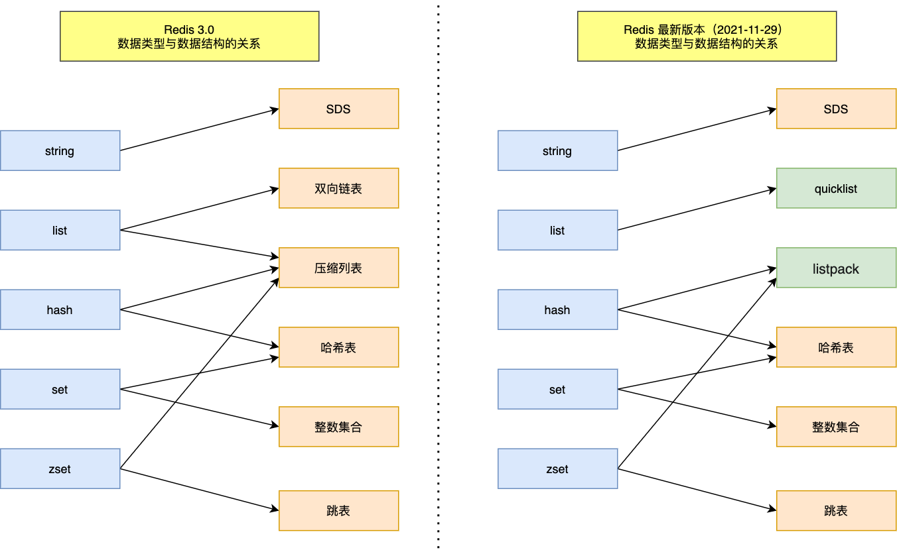

可以看到，Redis 数据类型的底层数据结构随着版本的更新也有所不同，比如：

+ 在 Redis 3.0 版本中 List 对象的底层数据结构由「双向链表」或「压缩表列表」实现，但是在 3.2 版本之后，List 数据类型底层数据结构是由 quicklist 实现的；
+ 在最新的 Redis 代码（还未发布正式版本）中，压缩列表数据结构已经废弃了，交由 listpack 数据结构来实现了。

**本文将介绍新旧版本的数据结构，共有 9 种：SDS、双向链表、压缩列表、哈希表、跳表、整数集合、quicklist、listpack。**

- [Redis 数据结构](#redis-数据结构)
  - [1.键值对数据库是怎么实现的？](#1键值对数据库是怎么实现的)
  - [2.SDS](#2sds)
    - [2.1 C 语言字符串的缺陷](#21-c-语言字符串的缺陷)
    - [2.2 SDS 结构设计](#22-sds-结构设计)
      - [2.2.1 O(1) 复杂度获取字符串长度](#221-o1-复杂度获取字符串长度)
      - [2.2.2 二进制安全](#222-二进制安全)
      - [2.2.3 不会发生缓冲区溢出](#223-不会发生缓冲区溢出)
      - [2.2.4 节省内存空间](#224-节省内存空间)
  - [3.链表](#3链表)
    - [3.1 链表节点结构设计](#31-链表节点结构设计)
    - [3.2 链表结构设计](#32-链表结构设计)
    - [3.3 链表的优势和缺陷](#33-链表的优势和缺陷)
  - [4.压缩列表](#4压缩列表)
    - [4.1 压缩列表结构设计](#41-压缩列表结构设计)
    - [4.2 连锁更新](#42-连锁更新)
    - [4.3 压缩列表的缺陷](#43-压缩列表的缺陷)
  - [5.哈希表](#5哈希表)
    - [5.1 哈希表结构设计](#51-哈希表结构设计)
    - [5.2 哈希冲突](#52-哈希冲突)
      - [5.2.1 什么是哈希冲突？](#521-什么是哈希冲突)
    - [5.3 链式哈希](#53-链式哈希)
      - [5.3.1 链式哈希是怎么实现的？](#531-链式哈希是怎么实现的)
    - [5.4 rehash](#54-rehash)
    - [5.5 渐进式 rehash](#55-渐进式-rehash)
    - [5.6 rehash 触发条件](#56-rehash-触发条件)

## 1.键值对数据库是怎么实现的？

在开始讲数据结构之前，先给介绍下 Redis 是怎样实现键值对（key-value）数据库的。

Redis 的键值对中的 key 就是字符串对象，而 **value 可以是字符串对象，也可以是集合数据类型的对象**，比如 List 对象、Hash 对象、Set 对象和 Zset 对象。

举个例子，我这里列出几种 Redis 新增键值对的命令：

```sh
> SET name "xiaolincoding"
OK

> HSET person name "xiaolincoding" age 18
0

> RPUSH stu "xiaolin" "xiaomei"
(integer) 4
```

这些命令代表着：

+ 第一条命令：name 是一个**字符串键**，因为键的**值是一个字符串对象**；
+ 第二条命令：person 是一个**哈希表键**，因为键的**值是一个包含两个键值对的哈希表对象**；
+ 第三条命令：stu 是一个**列表键**，因为键的**值是一个包含两个元素的列表对象**；

这些键值对是如何保存在 Redis 中的呢？

Redis 是使用了一个「哈希表」保存所有键值对，哈希表的最大好处就是让我们可以用 O(1) 的时间复杂度来快速查找到键值对。哈希表其实就是一个数组，数组中的元素叫做哈希桶。

Redis 的哈希桶是怎么保存键值对数据的呢？

哈希桶存放的是指向键值对数据的指针（`dictEntry*`），这样通过指针就能找到键值对数据，然后因为键值对的值可以保存字符串对象和集合数据类型的对象，所以键值对的数据结构中并不是直接保存值本身，而是保存了 void * key 和 void * value 指针，分别指向了实际的键对象和值对象，这样一来，即使值是集合数据，也可以通过 void * value 指针找到。

我这里画了一张 Redis 保存键值对所涉及到的数据结构。


这些数据结构的内部细节，我先不展开讲，后面在讲哈希表数据结构的时候，在详细的说说，因为用到的数据结构是一样的。这里先大概说下图中涉及到的数据结构的名字和用途：

+ redisDb 结构，表示 Redis 数据库的结构，结构体里存放了指向了 dict 结构的指针；
+ dict 结构，结构体里存放了 2 个哈希表，正常情况下都是用「哈希表1」，「哈希表2」只有在 rehash 的时候才用，具体什么是 rehash，我在本文的哈希表数据结构会讲；
+ ditctht 结构，表示哈希表的结构，结构里存放了哈希表数组，数组中的每个元素都是指向一个哈希表节点结构（dictEntry）的指针；
+ dictEntry 结构，表示哈希表节点的结构，结构里存放了 void * key 和 void * value 指针， key 指向的是 String 对象，而 value 则可以指向 String 对象，也可以指向集合类型的对象，比如 List 对象、Hash 对象、Set 对象和 Zset 对象。

特别说明下，void * key 和 void * value 指针指向的是 **Redis 对象**，Redis 中的每个对象都由 redisObject 结构表示，如下图：


对象结构里包含的成员变量：

+ type，标识该对象是什么类型的对象（String 对象、 List 对象、Hash 对象、Set 对象和 Zset 对象）；
+ encoding，标识该对象使用了哪种底层的数据结构；
+ **ptr，指向底层数据结构的指针**。

我画了一张 Redis 键值对数据库的全景图，你就能清晰知道 Redis 对象和数据结构的关系了：


接下来，就好好聊一下底层数据结构！

## 2.SDS

字符串在 Redis 中是很常用的，键值对中的键是字符串类型，值有时也是字符串类型。

Redis 是用 C 语言实现的，但是它没有直接使用 C 语言的 char* 字符数组来实现字符串，而是自己封装了一个名为简单动态字符串（simple dynamic string，SDS） 的数据结构来表示字符串，也就是 Redis 的 String 数据类型的底层数据结构是 SDS。

既然 Redis 设计了 SDS 结构来表示字符串，肯定是 C 语言的 char* 字符数组存在一些缺陷。

要了解这一点，得先来看看 char* 字符数组的结构。

### 2.1 C 语言字符串的缺陷

C 语言的字符串其实就是一个字符数组，即数组中每个元素是字符串中的一个字符。

比如，下图就是字符串 `xiaolin` 的 char* 字符数组的结构：

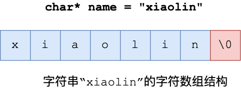

没学过 C 语言的同学，可能会好奇为什么最后一个字符是`\0`？

在 C 语言里，对字符串操作时，char * 指针只是指向字符数组的起始位置，而**字符数组的结尾位置就用 `\0` 表示，意思是指字符串的结束**。

因此，C 语言标准库中的字符串操作函数就通过判断字符是不是 `\0` 来决定要不要停止操作，如果当前字符不是 `\0` ，说明字符串还没结束，可以继续操作，如果当前字符是 `\0` 则说明字符串结束了，就要停止操作。

举个例子，C 语言获取字符串长度的函数 `strlen`，就是通过字符数组中的每一个字符，并进行计数，等遇到字符为 `\0` 后，就会停止遍历，然后返回已经统计到的字符个数，即为字符串长度。下图显示了 `strlen` 函数的执行流程：


很明显，**C 语言获取字符串长度的时间复杂度是 O(N)（这是一个可以改进的地方）**

C 语言字符串用 `\0` 字符作为结尾标记有个缺陷。假设有个字符串中有个 `\0` 字符，这时在操作这个字符串时就会提早结束，比如 `xiao\0lin` 字符串，计算字符串长度的时候则会是 4，如下图：

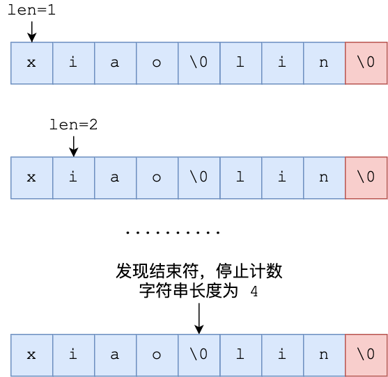

因此，除了字符串的末尾之外，**字符串里面不能含有 `\0` 字符**，否则最先被程序读入的 `\0` 字符将被误认为是字符串结尾，这个限制使得 C 语言的字符串只能保存文本数据，**不能保存像图片、音频、视频文化这样的二进制数据（这也是一个可以改进的地方）**

另外， C 语言标准库中字符串的操作函数是很不安全的，对程序员很不友好，稍微一不注意，就会导致缓冲区溢出。

举个例子，`strcat` 函数是可以将两个字符串拼接在一起。

```c
//将 src 字符串拼接到 dest 字符串后面
char *strcat(char *dest, const char* src);
```

**C 语言的字符串是不会记录自身的缓冲区大小的**，所以 `strcat` 函数假定程序员在执行这个函数时，已经为 `dest` 分配了足够多的内存，可以容纳 `src` 字符串中的所有内容，而**一旦这个假定不成立，就会发生缓冲区溢出将可能会造成程序运行终止，（这是一个可以改进的地方）。**

而且，`strcat` 函数和 `strlen` 函数类似，时间复杂度也很高，也都需要先通过遍历字符串才能得到目标字符串的末尾。然后对于 strcat 函数来说，还要再遍历源字符串才能完成追加，**对字符串的操作效率不高。**

好了， 通过以上的分析，我们可以得知 C 语言的字符串不足之处以及可以改进的地方：

+ 获取字符串长度的时间复杂度为 O（N）；
+ 字符串的结尾是以 `\0` 字符标识，字符串里面不能包含有 `\0` 字符，因此不能保存二进制数据；
+ 字符串操作函数不高效且不安全，比如有缓冲区溢出的风险，有可能会造成程序运行终止；

Redis 实现的 SDS 的结构就把上面这些问题解决了，接下来我们一起看看 Redis 是如何解决的。

### 2.2 SDS 结构设计

下图就是 Redis 5.0 的 SDS 的数据结构：


结构中的每个成员变量分别介绍下：

+ **len，记录了字符串长度**。这样获取字符串长度的时候，只需要返回这个成员变量值就行，时间复杂度只需要 O(1)。
+ **alloc，分配给字符数组的空间长度**。这样在修改字符串的时候，可以通过 `alloc - len` 计算出剩余的空间大小，可以用来判断空间是否满足修改需求，如果不满足的话，就会自动将 SDS 的空间扩展至执行修改所需的大小，然后才执行实际的修改操作，所以使用 SDS 既不需要手动修改 SDS 的空间大小，也不会出现前面所说的缓冲区溢出的问题。
+ **flags，用来表示不同类型的 SDS**。一共设计了 5 种类型，分别是 sdshdr5、sdshdr8、sdshdr16、sdshdr32 和 sdshdr64，后面在说明区别之处。
+ **buf[]，字符数组，用来保存实际数据**。不仅可以保存字符串，也可以保存二进制数据。

总的来说，Redis 的 SDS 结构在原本字符数组之上，增加了三个元数据：`len`、`alloc`、`flags`，用来解决 C 语言字符串的缺陷。

#### 2.2.1 O(1) 复杂度获取字符串长度

C 语言的字符串长度获取 `strlen` 函数，需要通过遍历的方式来统计字符串长度，时间复杂度是 O(N)。

而 Redis 的 SDS 结构因为加入了 `len` 成员变量，那么获取字符串长度的时候，直接返回这个成员变量的值就行，所以复杂度只有 O(1)。

#### 2.2.2 二进制安全

因为 SDS 不需要用 `\0` 字符来标识字符串结尾了，而是有个专门的 len 成员变量来记录长度，所以可存储包含 `\0` 的数据。但是 SDS 为了兼容部分 C 语言标准库的函数， SDS 字符串结尾还是会加上 `\0` 字符。

因此， SDS 的 API 都是以处理二进制的方式来处理 SDS 存放在 `buf[]` 里的数据，程序不会对其中的数据做任何限制，数据写入的时候时什么样的，它被读取时就是什么样的。

通过使用二进制安全的 SDS，而不是 C 字符串，使得 Redis 不仅可以保存文本数据，也可以保存任意格式的二进制数据。

#### 2.2.3 不会发生缓冲区溢出

C 语言的字符串标准库提供的字符串操作函数，大多数（比如 `strcat` 追加字符串函数）都是不安全的，因为这些函数把缓冲区大小是否满足操作需求的工作交由开发者来保证，程序内部并不会判断缓冲区大小是否足够用，当发生了缓冲区溢出就有可能造成程序异常结束。

所以，Redis 的 SDS 结构里引入了 `alloc` 和 `len` 成员变量，这样 SDS API 通过 `alloc - len` 计算，可以算出剩余可用的空间大小，这样在对字符串做修改操作的时候，就可以由程序内部判断缓冲区大小是否足够用。

而且，**当判断出缓冲区大小不够用时，Redis 会自动将扩大 SDS 的空间大小（小于 1MB 翻倍扩容，大于 1MB 按 1MB 扩容）**，以满足修改所需的大小。

在扩展 SDS 空间之前，SDS API 会优先检查未使用空间是否足够，如果不够的话，API 不仅会为 SDS 分配修改所必须要的空间，还会给 SDS 分配额外的「未使用空间」。

这样的好处是，下次在操作 SDS 时，如果 SDS 空间够的话，API 就会直接使用「未使用空间」，而无须执行内存分配，**有效的减少内存分配次数**。

所以，使用 SDS 即不需要手动修改 SDS 的空间大小，也不会出现缓冲区溢出的问题。

#### 2.2.4 节省内存空间

SDS 结构中有个 `flags` 成员变量，表示的是 SDS 类型。

Redis 一共设计了 5 种类型，分别是 sdshdr5、sdshdr8、sdshdr16、sdshdr32 和 sdshdr64。

这 5 种类型的主要**区别就在于，它们数据结构中的 len 和 alloc 成员变量的数据类型不同**。

比如 sdshdr16 和 sdshdr32 这两个类型，它们的定义分别如下：

```c
struct __attribute__ ((__packed__)) sdshdr16 {
    uint16_t len;
    uint16_t alloc; 
    unsigned char flags; 
    char buf[];
};


struct __attribute__ ((__packed__)) sdshdr32 {
    uint32_t len;
    uint32_t alloc; 
    unsigned char flags;
    char buf[];
};
```

可以看到：

+ sdshdr16 类型的 `len` 和 `alloc` 的数据类型都是 `uint16_t`，表示字符数组长度和分配空间大小不能超过 2 的 16 次方。
+ sdshdr32 则都是 `uint32_t`，表示表示字符数组长度和分配空间大小不能超过 2 的 32 次方。

**之所以 SDS 设计不同类型的结构体，是为了能灵活保存不同大小的字符串，从而有效节省内存空间**。比如，在保存小字符串时，结构头占用空间也比较少。

除了设计不同类型的结构体，Redis 在编程上还**使用了专门的编译优化来节省内存空间**，即在 struct 声明了 `__attribute__ ((packed))` ，它的作用是：**告诉编译器取消结构体在编译过程中的优化对齐，按照实际占用字节数进行对齐**。

比如，`sdshdr16` 类型的 SDS，默认情况下，编译器会按照 2 字节对齐的方式给变量分配内存，这意味着，即使一个变量的大小不到 2 个字节，编译器也会给它分配 2 个字节。

举个例子，假设下面这个结构体，它有两个成员变量，类型分别是 char 和 int，如下所示：

```c
#include <stdio.h>

struct test1 {
    char a;
    int b;
 } test1;
 
int main() {
     printf("%lu\n", sizeof(test1));
     return 0;
}
```

大家猜猜这个结构体大小是多少？我先直接说答案，这个结构体大小计算出来是 8。

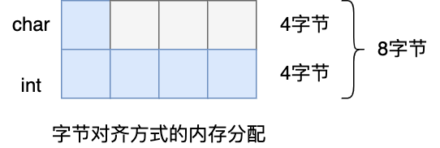

这是因为默认情况下，编译器是使用「字节对齐」的方式分配内存，虽然 char 类型只占一个字节，但是由于成员变量里有 int 类型，它占用了 4 个字节，所以在成员变量为 char 类型分配内存时，会分配 4 个字节，其中这多余的 3 个字节是为了字节对齐而分配的，相当于有 3 个字节被浪费掉了。

如果不想编译器使用字节对齐的方式进行分配内存，可以采用了 `__attribute__ ((packed))` 属性定义结构体，这样一来，结构体实际占用多少内存空间，编译器就分配多少空间。

比如，我用 `__attribute__ ((packed))` 属性定义下面的结构体 ，同样包含 char 和 int 两个类型的成员变量，代码如下所示：

```c
#include <stdio.h>

struct __attribute__((packed)) test2  {
    char a;
    int b;
 } test2;
 
int main() {
     printf("%lu\n", sizeof(test2));
     return 0;
}
```

这时打印的结果是 5（1 个字节 char + 4 字节 int）。

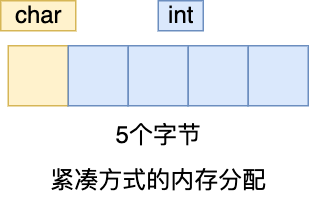

可以看得出，这是按照实际占用字节数进行分配内存的，这样可以节省内存空间。

## 3.链表

大家最熟悉的数据结构除了数组之外，我相信就是链表了。

Redis 的 List 对象的底层实现之一就是链表。C 语言本身没有链表这个数据结构的，所以 Redis 自己设计了一个链表数据结构。

### 3.1 链表节点结构设计

先来看看「链表节点」结构的样子：

```c
typedef struct listNode {
    //前置节点
    struct listNode *prev;
    //后置节点
    struct listNode *next;
    //节点的值
    void *value;
} listNode;
```

有前置节点和后置节点，可以看的出，这个是一个双向链表。

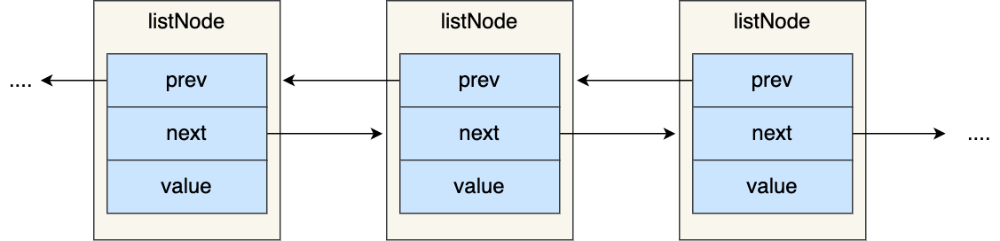

### 3.2 链表结构设计

不过，Redis 在 `listNode` 结构体基础上又封装了 `list` 这个数据结构，这样操作起来会更方便，链表结构如下：

```c
typedef struct list {
    //链表头节点
    listNode *head;
    //链表尾节点
    listNode *tail;
    //节点值复制函数
    void *(*dup)(void *ptr);
    //节点值释放函数
    void (*free)(void *ptr);
    //节点值比较函数
    int (*match)(void *ptr, void *key);
    //链表节点数量
    unsigned long len;
} list;
```

`list` 结构为链表提供了链表头指针 `head`、链表尾节点 `tail`、链表节点数量 `len`、以及可以自定义实现的 `dup`、`free`、`match` 函数。

举个例子，下面是由 `list` 结构和 3 个 `listNode` 结构组成的链表。


### 3.3 链表的优势和缺陷

Redis 的链表实现优点如下：

+ `listNode` 链表节点的结构里带有 `prev` 和 `next` 指针，**获取某个节点的前置节点或后置节点的时间复杂度只需 O(1)，而且这两个指针都可以指向 NULL，所以链表是无环链表；**
+ `list` 结构因为提供了表头指针 `head` 和表尾节点 `tail`，所以**获取链表的表头节点和表尾节点的时间复杂度只需 O(1)**；
+ `list` 结构因为提供了链表节点数量 `len`，所以**获取链表中的节点数量的时间复杂度只需 O(1)**；
+ `listNode` 链表节使用 `void*` 指针保存节点值，并且可以通过 `list` 结构的 `dup`、`free`、`match` 函数指针为节点设置该节点类型特定的函数，因此**链表节点可以保存各种不同类型的值**；

链表的缺陷也是有的：

+ 链表每个节点之间的内存都是不连续的，意味着**无法很好利用 CPU 缓存**。能很好利用 CPU 缓存的数据结构就是数组，因为数组的内存是连续的，这样就可以充分利用 CPU 缓存来加速访问。
+ 还有一点，保存一个链表节点的值都需要一个链表节点结构头的分配，**内存开销较大**。

因此，Redis 3.0 的 List 对象在数据量比较少的情况下，会采用「压缩列表」作为底层数据结构的实现，它的优势是节省内存空间，并且是内存紧凑型的数据结构。

不过，压缩列表存在性能问题（具体什么问题，下面会说），所以 Redis 在 3.2 版本设计了新的数据结构 `quicklist`，并将 List 对象的底层数据结构改由 `quicklist` 实现。

然后在 Redis 5.0 设计了新的数据结构 `listpack`，沿用了压缩列表紧凑型的内存布局，最终在最新的 Redis 版本，将 Hash 对象和 Zset 对象的底层数据结构实现之一的压缩列表，替换成由 `listpack` 实现。

## 4.压缩列表

压缩列表的最大特点，就是它被设计成一种内存紧凑型的数据结构，占用一块连续的内存空间，不仅可以利用 CPU 缓存，而且会针对不同长度的数据，进行相应编码，这种方法可以有效地节省内存开销。

但是，压缩列表的缺陷也是有的：

+ 不能保存过多的元素，否则查询效率就会降低；
+ 新增或修改某个元素时，压缩列表占用的内存空间需要重新分配，甚至可能引发连锁更新的问题。

因此，Redis 对象（List 对象、Hash 对象、Zset 对象）包含的元素数量较少，或者元素值不大的情况才会使用压缩列表作为底层数据结构。

接下来，就跟大家详细聊下压缩列表。

### 4.1 压缩列表结构设计

压缩列表是 Redis 为了节约内存而开发的，它是**由连续内存块组成的顺序型数据结构**，有点类似于数组。


压缩列表在表头有三个字段：

+ **zlbytes**，记录整个压缩列表占用对内存字节数；
+ **zltail**，记录压缩列表「尾部」节点距离起始地址由多少字节，也就是列表尾的偏移量；
+ **zllen**，记录压缩列表包含的节点数量；
+ **zlend**，标记压缩列表的结束点，固定值 0xFF（十进制255）。

在压缩列表中，如果我们要查找定位第一个元素和最后一个元素，可以通过表头三个字段（zllen）的长度直接定位，复杂度是 O(1)。而**查找其他元素时，就没有这么高效了，只能逐个查找，此时的复杂度就是 O(N) 了，因此压缩列表不适合保存过多的元素。**

另外，压缩列表节点（entry）的构成如下：


压缩列表节点包含三部分内容：

+ **prevlen**，记录了「前一个节点」的长度，目的是为了实现从后向前遍历；
+ **encoding**，记录了当前节点实际数据的「类型和长度」，类型主要有两种：字符串和整数。
+ **data**，记录了当前节点的实际数据，类型和长度都由 `encoding` 决定；

当我们往压缩列表中插入数据时，压缩列表就会根据数据类型是字符串还是整数，以及数据的大小，会使用不同空间大小的 `prevlen` 和 `encoding` 这两个元素里保存的信息，**这种根据数据大小和类型进行不同的空间大小分配的设计思想，正是 Redis 为了节省内存而采用的。**

分别说下，`prevlen` 和 `encoding` 是如何根据数据的大小和类型来进行不同的空间大小分配。

压缩列表里的每个节点中的 `prevlen` 属性都记录了「前一个节点的长度」，而且 `prevlen` 属性的空间大小跟前一个节点长度值有关，比如：

+ 如果**前一个节点的长度小于 254 字节**，那么 `prevlen` 属性需要用 **1 字节的空间**来保存这个长度值；
+ 如果**前一个节点的长度大于等于 254 字节**，那么 `prevlen` 属性需要用 **5 字节的空间**来保存这个长度值；

`encoding` 属性的空间大小跟数据是字符串还是整数，以及字符串的长度有关，如下图（下图中的 `content` 表示的是实际数据，即本文的 `data` 字段）：

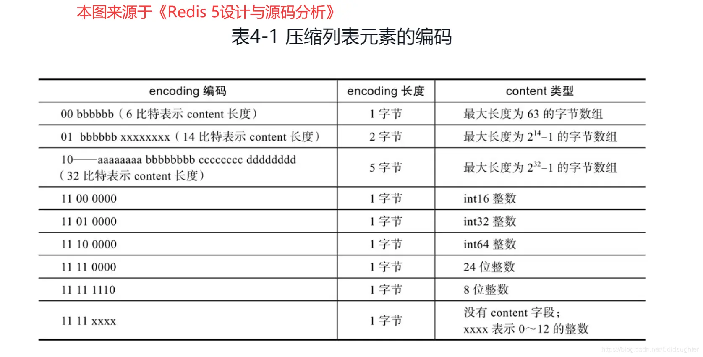

+ 如果**当前节点的数据是整数**，则 `encoding` 会使用 **1 字节的空间**进行编码，也就是 `encoding` 长度为 1 字节。通过 `encoding` 确认了整数类型，就可以确认整数数据的实际大小了，比如如果 `encoding` 编码确认了数据是 `int16` 整数，那么 `data` 的长度就是 `int16` 的大小。
+ 如果**当前节点的数据是字符串，根据字符串的长度大小**，`encoding` 会使用 1字节/2字节/5字节 的空间进行编码，`encoding` 编码的前两个 bit 表示数据的类型，后续的其他 bit 标识字符串数据的实际长度，即 `data` 的长度。

### 4.2 连锁更新

压缩列表除了查找复杂度高的问题，还有一个问题。

**压缩列表新增某个元素或修改某个元素时，如果空间不不够，压缩列表占用的内存空间就需要重新分配。而当新插入的元素较大时，可能会导致后续元素的 `prevlen` 占用空间都发生变化，从而引起「连锁更新」问题，导致每个元素的空间都要重新分配，造成访问压缩列表性能的下降。**

前面提到，压缩列表节点的 `prevlen` 属性会根据前一个节点的长度进行不同的空间大小分配：

+ 如果前一个**节点的长度小于 254 字节**，那么 prevlen 属性需要用 **1 字节的空间**来保存这个长度值；
+ 如果前一个**节点的长度大于等于 254 字节**，那么 prevlen 属性需要用 **5 字节的空间**来保存这个长度值；

现在假设一个压缩列表中有多个连续的、长度在 250～253 之间的节点，如下图：

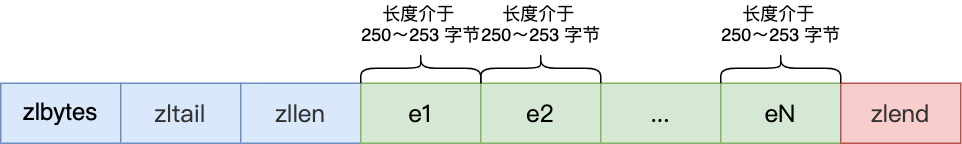

因为这些节点长度值小于 254 字节，所以 prevlen 属性需要用 1 字节的空间来保存这个长度值。

这时，如果将一个长度大于等于 254 字节的新节点加入到压缩列表的表头节点，即新节点将成为 e1 的前置节点，如下图：

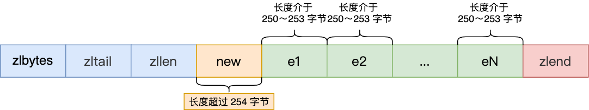

因为 e1 节点的 prevlen 属性只有 1 个字节大小，无法保存新节点的长度，此时就需要对压缩列表的空间重分配操作，并将 e1 节点的 prevlen 属性从原来的 1 字节大小扩展为 5 字节大小。

多米诺牌的效应就此开始。

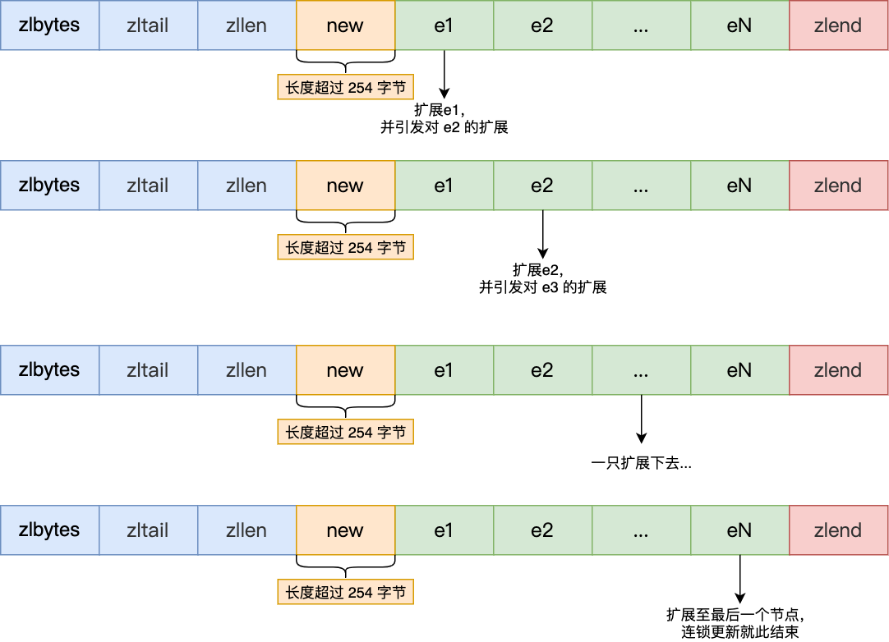

e1 原本的长度在 250～253 之间，因为刚才的扩展空间，此时 e1 的长度就大于等于 254 了，因此原本 e2 保存 e1 的 prevlen 属性也必须从 1 字节扩展至 5 字节大小。

正如扩展 e1 引发了对 e2 扩展一样，扩展 e2 也会引发对 e3 的扩展，而扩展 e3 又会引发对 e4 的扩展.... 一直持续到结尾。

**这种在特殊情况下产生的连续多次空间扩展操作就叫做「连锁更新」**，就像多米诺牌的效应一样，第一张牌倒下了，推动了第二张牌倒下；第二张牌倒下，又推动了第三张牌倒下....，

### 4.3 压缩列表的缺陷

空间扩展操作也就是重新分配内存，因此**连锁更新一旦发生，就会导致压缩列表占用的内存空间要多次重新分配，这就会直接影响到压缩列表的访问性能**。

所以说，**虽然压缩列表紧凑型的内存布局能节省内存开销，但是如果保存的元素数量增加了，或是元素变大了，会导致内存重新分配，最糟糕的是会有「连锁更新」的问题。**

因此，**压缩列表只会用于保存的节点数量不多的场景**，只要节点数量足够小，即使发生连锁更新，也是能接受的。

虽说如此，Redis 针对压缩列表在设计上的不足，在后来的版本中，新增设计了两种数据结构：quicklist（Redis 3.2 引入） 和 listpack（Redis 5.0 引入）。这两种数据结构的设计目标，就是尽可能地保持压缩列表节省内存的优势，同时解决压缩列表的「连锁更新」的问题。

## 5.哈希表

哈希表是一种保存键值对（key-value）的数据结构。

哈希表中的每一个 key 都是独一无二的，程序可以根据 key 查找到与之关联的 value，或者通过 key 来更新 value，又或者根据 key 来删除整个 key-value等等。

在讲压缩列表的时候，提到过 Redis 的 Hash 对象的底层实现之一是压缩列表（最新 Redis 代码已将压缩列表替换成 listpack）。Hash 对象的另外一个底层实现就是哈希表。

哈希表优点在于，它**能以 O(1) 的复杂度快速查询数据**。怎么做到的呢？将 key 通过 Hash 函数的计算，就能定位数据在表中的位置，因为哈希表实际上是数组，所以可以通过索引值快速查询到数据。

但是存在的风险也是有，在哈希表大小固定的情况下，随着数据不断增多，那么**哈希冲突**的可能性也会越高。

解决哈希冲突的方式，有很多种。

**Redis 采用了「链式哈希」来解决哈希冲突**，在不扩容哈希表的前提下，将具有相同哈希值的数据串起来，形成链接器，以便这些数据在表中仍然可以被查询到。

接下来，详细说说哈希表。

### 5.1 哈希表结构设计

Redis 的哈希表结构如下：

```c
typedef struct dictht {
    //哈希表数组
    dictEntry **table;
    //哈希表大小
    unsigned long size;  
    //哈希表大小掩码，用于计算索引值
    unsigned long sizemask;
    //该哈希表已有的节点数量
    unsigned long used;
} dictht;
```

可以看到，哈希表是一个数组（dictEntry **table），数组的每个元素是一个指向「哈希表节点（dictEntry）」的指针。


哈希表节点的结构如下：

```c
typedef struct dictEntry {
    //键值对中的键
    void *key;
  
    //键值对中的值
    union {
        void *val;
        uint64_t u64;
        int64_t s64;
        double d;
    } v;
    //指向下一个哈希表节点，形成链表
    struct dictEntry *next;
} dictEntry;
```

dictEntry 结构里不仅包含指向键和值的指针，还包含了指向下一个哈希表节点的指针，这个指针可以将多个哈希值相同的键值对链接起来，以此来解决哈希冲突的问题，这就是链式哈希。

另外，这里还跟你提一下，dictEntry 结构里键值对中的值是一个「联合体 v」定义的，因此，键值对中的值可以是一个指向实际值的指针，或者是一个无符号的 64 位整数或有符号的 64 位整数或double 类的值。这么做的好处是可以节省内存空间，因为当「值」是整数或浮点数时，就可以将值的数据内嵌在 dictEntry 结构里，无需再用一个指针指向实际的值，从而节省了内存空间。

### 5.2 哈希冲突

哈希表实际上是一个数组，数组里多每一个元素就是一个哈希桶。

当一个键值对的键经过 Hash 函数计算后得到哈希值，再将(哈希值 % 哈希表大小)取模计算，得到的结果值就是该 key-value 对应的数组元素位置，也就是第几个哈希桶。

#### 5.2.1 什么是哈希冲突？

举个例子，有一个可以存放 8 个哈希桶的哈希表。key1 经过哈希函数计算后，再将「哈希值 % 8 」进行取模计算，结果值为 1，那么就对应哈希桶 1，类似的，key9 和 key10 分别对应哈希桶 1 和桶 6。

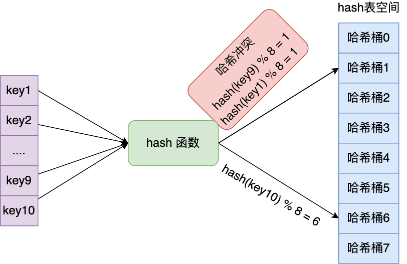

此时，key1 和 key9 对应到了相同的哈希桶中，这就发生了哈希冲突。

因此，**当有两个以上数量的 key 被分配到了哈希表中同一个哈希桶上时，此时称这些 key 发生了冲突**。

### 5.3 链式哈希

Redis 采用了「**链式哈希**」的方法来解决哈希冲突。

#### 5.3.1 链式哈希是怎么实现的？

实现的方式就是每个哈希表节点都有一个 next 指针，用于指向下一个哈希表节点，因此多个哈希表节点可以用 next 指针构成一个单项链表，**被分配到同一个哈希桶上的多个节点可以用这个单项链表连接起来**，这样就解决了哈希冲突。

还是用前面的哈希冲突例子，key1 和 key9 经过哈希计算后，都落在同一个哈希桶，链式哈希的话，key1 就会通过 next 指针指向 key9，形成一个单向链表。

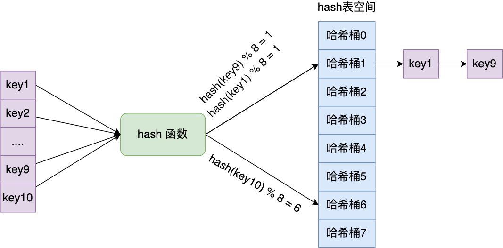

不过，链式哈希局限性也很明显，随着链表长度的增加，在查询这一位置上的数据的耗时就会增加，毕竟链表的查询的时间复杂度是 O(n)。

要想解决这一问题，就需要进行 rehash，也就是对哈希表的大小进行扩展。

接下来，看看 Redis 是如何实现的 rehash 的。

### 5.4 rehash

哈希表结构设计的这一小节，我给大家介绍了 Redis 使用 dictht 结构体表示哈希表。不过，在实际使用哈希表时，Redis 定义一个 dict 结构体，这个结构体里定义了**两个哈希表（ht[2]）**。

```c
typedef struct dict {
    …
    //两个Hash表，交替使用，用于rehash操作
    dictht ht[2]; 
    …
} dict;
```

之所以定义了 2 个哈希表，是因为进行 rehash 的时候，需要用上 2 个哈希表了。


在正常服务请求阶段，插入的数据，都会写入到「哈希表 1」，此时的「哈希表 2 」 并没有被分配空间。

随着数据逐步增多，触发了 rehash 操作，这个过程分为三步：

+ 给「哈希表 2」 分配空间，一般会比「哈希表 1」 大 2 倍；
+ 将「哈希表 1 」的数据迁移到「哈希表 2」 中；
+ 迁移完成后，「哈希表 1 」的空间会被释放，并把「哈希表 2」 设置为「哈希表 1」，然后在「哈希表 2」 新创建一个空白的哈希表，为下次 rehash 做准备。

为了方便你理解，我把 rehash 这三个过程画在了下面这张图：

这个过程看起来简单，但是其实第二步很有问题，**如果「哈希表 1 」的数据量非常大，那么在迁移至「哈希表 2 」的时候，因为会涉及大量的数据拷贝，此时可能会对 Redis 造成阻塞，无法服务其他请求。**

### 5.5 渐进式 rehash

为了避免 rehash 在数据迁移过程中，因拷贝数据的耗时，影响 Redis 性能的情况，所以 Redis 采用了**渐进式 rehash**，也就是将数据的迁移的工作不再是一次性迁移完成，而是分多次迁移。

渐进式 rehash 步骤如下：

+ 给「哈希表 2」 分配空间；
+ **在 rehash 进行期间，每次哈希表元素进行新增、删除、查找或者更新操作时，Redis 除了会执行对应的操作之外，还会顺序将「哈希表 1 」中索引位置上的所有 key-value 迁移到「哈希表 2」 上；**
+ 随着处理客户端发起的哈希表操作请求数量越多，最终在某个时间点会把「哈希表 1 」的所有 key-value 迁移到「哈希表 2」，从而完成 rehash 操作。

这样就巧妙地把一次性大量数据迁移工作的开销，分摊到了多次处理请求的过程中，避免了一次性 rehash 的耗时操作。

在进行渐进式 rehash 的过程中，会有两个哈希表，所以在渐进式 rehash 进行期间，哈希表元素的删除、查找、更新等操作都会在这两个哈希表进行。

比如，查找一个 key 的值的话，先会在「哈希表 1」 里面进行查找，如果没找到，就会继续到哈希表 2 里面进行找到。

另外，在渐进式 rehash 进行期间，新增一个 key-value 时，会被保存到「哈希表 2 」里面，而「哈希表 1」 则不再进行任何添加操作，这样保证了「哈希表 1 」的 key-value 数量只会减少，随着 rehash 操作的完成，最终「哈希表 1 」就会变成空表。

### 5.6 rehash 触发条件

介绍了 rehash 那么多，还没说什么时情况下会触发 rehash 操作呢？

rehash 的触发条件跟**负载因子（load factor）**有关系。

负载因子可以通过下面这个公式计算：

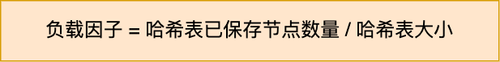

触发 rehash 操作的条件，主要有两个：

+ **当负载因子大于等于 1 ，并且 Redis 没有在执行 bgsave 命令或者 bgrewiteaof 命令，也就是没有执行 RDB 快照或没有进行 AOF 重写的时候，就会进行 rehash 操作。**
+ **当负载因子大于等于 5 时，此时说明哈希冲突非常严重了，不管有没有有在执行 RDB 快照或 AOF 重写，都会强制进行 rehash 操作。**

