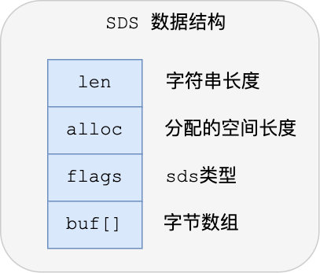

# Redis 数据结构

**Redis 为什么那么快？**

除了它是内存数据库，使得所有的操作都在内存上进行之外，还有一个重要因素，它实现的数据结构，使得我们对数据进行增删查改操作时，Redis 能高效的处理。

因此，这次我们就来好好聊一下 Redis 数据结构，这个在面试中太常问了。

注意，Redis 数据结构并不是指 String（字符串）对象、List（列表）对象、Hash（哈希）对象、Set（集合）对象和 Zset（有序集合）对象，因为这些是 Redis 键值对中值的数据类型，也就是数据的保存形式，这些对象的底层实现的方式就用到了数据结构。

我画了一张 Redis 数据类型（也叫 Redis 对象）和底层数据结构的对应关图，左边是 Redis 3.0版本的，也就是《Redis 设计与实现》这本书讲解的版本，现在看还是有点过时了，右边是现在 Github 最新的 Redis 代码的（还未发布正式版本）。


可以看到，Redis 数据类型的底层数据结构随着版本的更新也有所不同，比如：

+ 在 Redis 3.0 版本中 List 对象的底层数据结构由「双向链表」或「压缩表列表」实现，但是在 3.2 版本之后，List 数据类型底层数据结构是由 quicklist 实现的；
+ 在最新的 Redis 代码（还未发布正式版本）中，压缩列表数据结构已经废弃了，交由 listpack 数据结构来实现了。

**本文将介绍新旧版本的数据结构，共有 9 种：SDS、双向链表、压缩列表、哈希表、跳表、整数集合、quicklist、listpack。**

- [Redis 数据结构](#redis-数据结构)
  - [1.键值对数据库是怎么实现的？](#1键值对数据库是怎么实现的)
  - [2.SDS](#2sds)
    - [2.1 C 语言字符串的缺陷](#21-c-语言字符串的缺陷)
    - [2.2 SDS 结构设计](#22-sds-结构设计)
      - [2.2.1 O(1) 复杂度获取字符串长度](#221-o1-复杂度获取字符串长度)
      - [2.2.2 二进制安全](#222-二进制安全)
      - [2.2.3 不会发生缓冲区溢出](#223-不会发生缓冲区溢出)
      - [2.2.4 节省内存空间](#224-节省内存空间)

## 1.键值对数据库是怎么实现的？

在开始讲数据结构之前，先给介绍下 Redis 是怎样实现键值对（key-value）数据库的。

Redis 的键值对中的 key 就是字符串对象，而 **value 可以是字符串对象，也可以是集合数据类型的对象**，比如 List 对象、Hash 对象、Set 对象和 Zset 对象。

举个例子，我这里列出几种 Redis 新增键值对的命令：

```sh
> SET name "xiaolincoding"
OK

> HSET person name "xiaolincoding" age 18
0

> RPUSH stu "xiaolin" "xiaomei"
(integer) 4
```

这些命令代表着：

+ 第一条命令：name 是一个**字符串键**，因为键的**值是一个字符串对象**；
+ 第二条命令：person 是一个**哈希表键**，因为键的**值是一个包含两个键值对的哈希表对象**；
+ 第三条命令：stu 是一个**列表键**，因为键的**值是一个包含两个元素的列表对象**；

这些键值对是如何保存在 Redis 中的呢？

Redis 是使用了一个「哈希表」保存所有键值对，哈希表的最大好处就是让我们可以用 O(1) 的时间复杂度来快速查找到键值对。哈希表其实就是一个数组，数组中的元素叫做哈希桶。

Redis 的哈希桶是怎么保存键值对数据的呢？

哈希桶存放的是指向键值对数据的指针（`dictEntry*`），这样通过指针就能找到键值对数据，然后因为键值对的值可以保存字符串对象和集合数据类型的对象，所以键值对的数据结构中并不是直接保存值本身，而是保存了 void * key 和 void * value 指针，分别指向了实际的键对象和值对象，这样一来，即使值是集合数据，也可以通过 void * value 指针找到。

我这里画了一张 Redis 保存键值对所涉及到的数据结构。


这些数据结构的内部细节，我先不展开讲，后面在讲哈希表数据结构的时候，在详细的说说，因为用到的数据结构是一样的。这里先大概说下图中涉及到的数据结构的名字和用途：

+ redisDb 结构，表示 Redis 数据库的结构，结构体里存放了指向了 dict 结构的指针；
+ dict 结构，结构体里存放了 2 个哈希表，正常情况下都是用「哈希表1」，「哈希表2」只有在 rehash 的时候才用，具体什么是 rehash，我在本文的哈希表数据结构会讲；
+ ditctht 结构，表示哈希表的结构，结构里存放了哈希表数组，数组中的每个元素都是指向一个哈希表节点结构（dictEntry）的指针；
+ dictEntry 结构，表示哈希表节点的结构，结构里存放了 void * key 和 void * value 指针， key 指向的是 String 对象，而 value 则可以指向 String 对象，也可以指向集合类型的对象，比如 List 对象、Hash 对象、Set 对象和 Zset 对象。

特别说明下，void * key 和 void * value 指针指向的是 **Redis 对象**，Redis 中的每个对象都由 redisObject 结构表示，如下图：


对象结构里包含的成员变量：

+ type，标识该对象是什么类型的对象（String 对象、 List 对象、Hash 对象、Set 对象和 Zset 对象）；
+ encoding，标识该对象使用了哪种底层的数据结构；
+ **ptr，指向底层数据结构的指针**。

我画了一张 Redis 键值对数据库的全景图，你就能清晰知道 Redis 对象和数据结构的关系了：


接下来，就好好聊一下底层数据结构！

## 2.SDS

字符串在 Redis 中是很常用的，键值对中的键是字符串类型，值有时也是字符串类型。

Redis 是用 C 语言实现的，但是它没有直接使用 C 语言的 char* 字符数组来实现字符串，而是自己封装了一个名为简单动态字符串（simple dynamic string，SDS） 的数据结构来表示字符串，也就是 Redis 的 String 数据类型的底层数据结构是 SDS。

既然 Redis 设计了 SDS 结构来表示字符串，肯定是 C 语言的 char* 字符数组存在一些缺陷。

要了解这一点，得先来看看 char* 字符数组的结构。

### 2.1 C 语言字符串的缺陷

C 语言的字符串其实就是一个字符数组，即数组中每个元素是字符串中的一个字符。

比如，下图就是字符串 `xiaolin` 的 char* 字符数组的结构：


没学过 C 语言的同学，可能会好奇为什么最后一个字符是`\0`？

在 C 语言里，对字符串操作时，char * 指针只是指向字符数组的起始位置，而**字符数组的结尾位置就用 `\0` 表示，意思是指字符串的结束**。

因此，C 语言标准库中的字符串操作函数就通过判断字符是不是 `\0` 来决定要不要停止操作，如果当前字符不是 `\0` ，说明字符串还没结束，可以继续操作，如果当前字符是 `\0` 则说明字符串结束了，就要停止操作。

举个例子，C 语言获取字符串长度的函数 `strlen`，就是通过字符数组中的每一个字符，并进行计数，等遇到字符为 `\0` 后，就会停止遍历，然后返回已经统计到的字符个数，即为字符串长度。下图显示了 `strlen` 函数的执行流程：


很明显，**C 语言获取字符串长度的时间复杂度是 O(N)（这是一个可以改进的地方）**

C 语言字符串用 `\0` 字符作为结尾标记有个缺陷。假设有个字符串中有个 `\0` 字符，这时在操作这个字符串时就会提早结束，比如 `xiao\0lin` 字符串，计算字符串长度的时候则会是 4，如下图：


因此，除了字符串的末尾之外，**字符串里面不能含有 `\0` 字符**，否则最先被程序读入的 `\0` 字符将被误认为是字符串结尾，这个限制使得 C 语言的字符串只能保存文本数据，**不能保存像图片、音频、视频文化这样的二进制数据（这也是一个可以改进的地方）**

另外， C 语言标准库中字符串的操作函数是很不安全的，对程序员很不友好，稍微一不注意，就会导致缓冲区溢出。

举个例子，`strcat` 函数是可以将两个字符串拼接在一起。

```c
//将 src 字符串拼接到 dest 字符串后面
char *strcat(char *dest, const char* src);
```

**C 语言的字符串是不会记录自身的缓冲区大小的**，所以 `strcat` 函数假定程序员在执行这个函数时，已经为 `dest` 分配了足够多的内存，可以容纳 `src` 字符串中的所有内容，而**一旦这个假定不成立，就会发生缓冲区溢出将可能会造成程序运行终止，（这是一个可以改进的地方）。**

而且，`strcat` 函数和 `strlen` 函数类似，时间复杂度也很高，也都需要先通过遍历字符串才能得到目标字符串的末尾。然后对于 strcat 函数来说，还要再遍历源字符串才能完成追加，**对字符串的操作效率不高。**

好了， 通过以上的分析，我们可以得知 C 语言的字符串不足之处以及可以改进的地方：

+ 获取字符串长度的时间复杂度为 O（N）；
+ 字符串的结尾是以 `\0` 字符标识，字符串里面不能包含有 `\0` 字符，因此不能保存二进制数据；
+ 字符串操作函数不高效且不安全，比如有缓冲区溢出的风险，有可能会造成程序运行终止；

Redis 实现的 SDS 的结构就把上面这些问题解决了，接下来我们一起看看 Redis 是如何解决的。

### 2.2 SDS 结构设计

下图就是 Redis 5.0 的 SDS 的数据结构：



结构中的每个成员变量分别介绍下：

+ **len，记录了字符串长度**。这样获取字符串长度的时候，只需要返回这个成员变量值就行，时间复杂度只需要 O(1)。
+ **alloc，分配给字符数组的空间长度**。这样在修改字符串的时候，可以通过 `alloc - len` 计算出剩余的空间大小，可以用来判断空间是否满足修改需求，如果不满足的话，就会自动将 SDS 的空间扩展至执行修改所需的大小，然后才执行实际的修改操作，所以使用 SDS 既不需要手动修改 SDS 的空间大小，也不会出现前面所说的缓冲区溢出的问题。
+ **flags，用来表示不同类型的 SDS**。一共设计了 5 种类型，分别是 sdshdr5、sdshdr8、sdshdr16、sdshdr32 和 sdshdr64，后面在说明区别之处。
+ **buf[]，字符数组，用来保存实际数据**。不仅可以保存字符串，也可以保存二进制数据。

总的来说，Redis 的 SDS 结构在原本字符数组之上，增加了三个元数据：`len`、`alloc`、`flags`，用来解决 C 语言字符串的缺陷。

#### 2.2.1 O(1) 复杂度获取字符串长度

C 语言的字符串长度获取 `strlen` 函数，需要通过遍历的方式来统计字符串长度，时间复杂度是 O(N)。

而 Redis 的 SDS 结构因为加入了 `len` 成员变量，那么获取字符串长度的时候，直接返回这个成员变量的值就行，所以复杂度只有 O(1)。

#### 2.2.2 二进制安全

因为 SDS 不需要用 `\0` 字符来标识字符串结尾了，而是有个专门的 len 成员变量来记录长度，所以可存储包含 `\0` 的数据。但是 SDS 为了兼容部分 C 语言标准库的函数， SDS 字符串结尾还是会加上 `\0` 字符。

因此， SDS 的 API 都是以处理二进制的方式来处理 SDS 存放在 `buf[]` 里的数据，程序不会对其中的数据做任何限制，数据写入的时候时什么样的，它被读取时就是什么样的。

通过使用二进制安全的 SDS，而不是 C 字符串，使得 Redis 不仅可以保存文本数据，也可以保存任意格式的二进制数据。

#### 2.2.3 不会发生缓冲区溢出

C 语言的字符串标准库提供的字符串操作函数，大多数（比如 `strcat` 追加字符串函数）都是不安全的，因为这些函数把缓冲区大小是否满足操作需求的工作交由开发者来保证，程序内部并不会判断缓冲区大小是否足够用，当发生了缓冲区溢出就有可能造成程序异常结束。

所以，Redis 的 SDS 结构里引入了 `alloc` 和 `len` 成员变量，这样 SDS API 通过 `alloc - len` 计算，可以算出剩余可用的空间大小，这样在对字符串做修改操作的时候，就可以由程序内部判断缓冲区大小是否足够用。

而且，**当判断出缓冲区大小不够用时，Redis 会自动将扩大 SDS 的空间大小（小于 1MB 翻倍扩容，大于 1MB 按 1MB 扩容）**，以满足修改所需的大小。

在扩展 SDS 空间之前，SDS API 会优先检查未使用空间是否足够，如果不够的话，API 不仅会为 SDS 分配修改所必须要的空间，还会给 SDS 分配额外的「未使用空间」。

这样的好处是，下次在操作 SDS 时，如果 SDS 空间够的话，API 就会直接使用「未使用空间」，而无须执行内存分配，**有效的减少内存分配次数**。

所以，使用 SDS 即不需要手动修改 SDS 的空间大小，也不会出现缓冲区溢出的问题。

#### 2.2.4 节省内存空间

SDS 结构中有个 `flags` 成员变量，表示的是 SDS 类型。

Redis 一共设计了 5 种类型，分别是 sdshdr5、sdshdr8、sdshdr16、sdshdr32 和 sdshdr64。

这 5 种类型的主要**区别就在于，它们数据结构中的 len 和 alloc 成员变量的数据类型不同**。

比如 sdshdr16 和 sdshdr32 这两个类型，它们的定义分别如下：

```c
struct __attribute__ ((__packed__)) sdshdr16 {
    uint16_t len;
    uint16_t alloc; 
    unsigned char flags; 
    char buf[];
};


struct __attribute__ ((__packed__)) sdshdr32 {
    uint32_t len;
    uint32_t alloc; 
    unsigned char flags;
    char buf[];
};
```

可以看到：

+ sdshdr16 类型的 `len` 和 `alloc` 的数据类型都是 `uint16_t`，表示字符数组长度和分配空间大小不能超过 2 的 16 次方。
+ sdshdr32 则都是 `uint32_t`，表示表示字符数组长度和分配空间大小不能超过 2 的 32 次方。

**之所以 SDS 设计不同类型的结构体，是为了能灵活保存不同大小的字符串，从而有效节省内存空间**。比如，在保存小字符串时，结构头占用空间也比较少。

除了设计不同类型的结构体，Redis 在编程上还**使用了专门的编译优化来节省内存空间**，即在 struct 声明了 `__attribute__ ((packed))` ，它的作用是：**告诉编译器取消结构体在编译过程中的优化对齐，按照实际占用字节数进行对齐**。

比如，`sdshdr16` 类型的 SDS，默认情况下，编译器会按照 2 字节对齐的方式给变量分配内存，这意味着，即使一个变量的大小不到 2 个字节，编译器也会给它分配 2 个字节。

举个例子，假设下面这个结构体，它有两个成员变量，类型分别是 char 和 int，如下所示：

```c
#include <stdio.h>

struct test1 {
    char a;
    int b;
 } test1;
 
int main() {
     printf("%lu\n", sizeof(test1));
     return 0;
}
```

大家猜猜这个结构体大小是多少？我先直接说答案，这个结构体大小计算出来是 8。


这是因为默认情况下，编译器是使用「字节对齐」的方式分配内存，虽然 char 类型只占一个字节，但是由于成员变量里有 int 类型，它占用了 4 个字节，所以在成员变量为 char 类型分配内存时，会分配 4 个字节，其中这多余的 3 个字节是为了字节对齐而分配的，相当于有 3 个字节被浪费掉了。

如果不想编译器使用字节对齐的方式进行分配内存，可以采用了 `__attribute__ ((packed))` 属性定义结构体，这样一来，结构体实际占用多少内存空间，编译器就分配多少空间。

比如，我用 `__attribute__ ((packed))` 属性定义下面的结构体 ，同样包含 char 和 int 两个类型的成员变量，代码如下所示：

```c
#include <stdio.h>

struct __attribute__((packed)) test2  {
    char a;
    int b;
 } test2;
 
int main() {
     printf("%lu\n", sizeof(test2));
     return 0;
}
```

这时打印的结果是 5（1 个字节 char + 4 字节 int）。


可以看得出，这是按照实际占用字节数进行分配内存的，这样可以节省内存空间。

