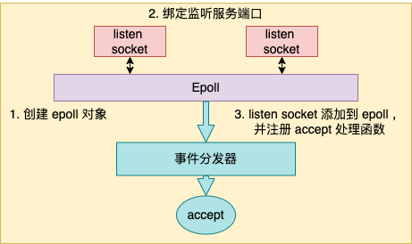

# 单线程的 Redis 如何做到每秒数万 QPS？

- [单线程的 Redis 如何做到每秒数万 QPS？](#单线程的-redis-如何做到每秒数万-qps)
  - [1.理解多路复用原理](#1理解多路复用原理)
  - [2.Redis 服务启动初始化](#2redis-服务启动初始化)
    - [2.1 创建 epoll 对象](#21-创建-epoll-对象)
    - [2.2 绑定监听服务端口](#22-绑定监听服务端口)
    - [2.3 注册事件回调函数](#23-注册事件回调函数)
  - [3.Redis 事件处理循环](#3redis-事件处理循环)
    - [3.1 epoll_wait 发现事件](#31-epoll_wait-发现事件)
    - [3.2 处理新连接请求](#32-处理新连接请求)

## 1.理解多路复用原理

在开始介绍 Redis 之前，我想有必要先来简单介绍下 epoll。

在传统的同步阻塞网络编程模型里（没有协程以前），性能上不来的根本原因在于进程线程都是笨重的家伙。让一个进(线)程只处理一个用户请求确确实实是有点浪费了。


先抛开高内存开销不说，在海量的网络请求到来的时候，光是频繁的进程线程上下文就让 CPU 疲于奔命了。


如果把进程比作牧羊人，一个进(线)程同时只能处理一个用户请求，相当于一个人只能看一只羊，放完这一只才能放下一只。如果同时来了 1000 只羊，那就得 1000 个人去放，这人力成本是非常高的。


性能提升思路很简单，就是让很多的用户连接来复用同一个进(线)程，这就是**多路复用**。**多路**指的是许许多多个用户的网络连接。**复用**指的是对进(线)程的复用。换到牧羊人的例子里，就是一群羊只要一个牧羊人来处理就行了。

不过复用实现起来是需要特殊的 socket 事件管理机制的，最典型和高效的方案就是 epoll。放到牧羊人的例子来，epoll 就相当于一只牧羊犬。

在 epoll 的系列函数里，`epoll_create` 用于创建一个 epoll 对象，`epoll_ctl` 用来给 epoll 对象添加或者删除一个 socket。`epoll_wait` 就是查看它当前管理的这些 socket 上有没有可读可写事件发生。


当网卡上收到数据包后，Linux 内核进行一系列的处理后把数据放到 socket 的接收队列。然后会检查是否有 epoll 在管理它，如果是则在 epoll 的就绪队列中插入一个元素。`epoll_wait` 的操作就非常的简单了，就是到 epoll 的就绪队列上来查询有没有事件发生就行了。

在基于 epoll 的编程中，和传统的函数调用思路不同的是，我们并不能主动调用某个 API 来处理。因为无法知道我们想要处理的事件啥时候发生。所以只好提前把想要处理的事件的处理函数注册到一个**事件分发器**上去。当事件发生的时候，由这个事件分发器调用回调函数进行处理。这类基于实现注册事件分发器的开发模式也叫 Reactor 模型。

## 2.Redis 服务启动初始化

理解了 epoll 原理后，我们再来实际看 Redis 具体是如何使用 epoll 的。直接在 Github 上就可以非常方便地获取 Redis 的源码。我们切到 5.0.0 版本来看单线程版本的实现。

```sh
$ git clone https://github.com/redis/redis
$ cd redis
$ git checkout -b 5.0.0 5.0.0
```

其中整个 Redis 服务的代码总入口在 `src/server.c` 文件中，我把入口函数的核心部分摘了出来，如下。

```c
//file: src/server.c
int main(int argc, char **argv) {
    ......
    // 启动初始化
    initServer();
    // 运行事件处理循环，一直到服务器关闭为止
    aeMain(server.el);
}
```

其实整个 Redis 的工作过程，就只需要理解清楚 main 函数中调用的 `initServer` 和 `aeMain` 这两个函数就足够了。

本节中我们重点介绍 initServer，在下一节介绍事件处理循环 aeMain。在 initServer 这个函数内，Redis 做了这么三件重要的事情。



+ 创建一个 epoll 对象
+ 对配置的监听端口进行 listen
+ 把 listen socket 让 epoll 给管理起来

```c
//file: src/server.c
void initServer() {
    // 2.1 创建 epoll
    server.el = aeCreateEventLoop(server.maxclients+CONFIG_FDSET_INCR);

    // 2.2 绑定监听服务端口
    listenToPort(server.port,server.ipfd,&server.ipfd_count);

    // 2.3 注册 accept 事件处理器
    for (j = 0; j < server.ipfd_count; j++) {
        aeCreateFileEvent(server.el, server.ipfd[j], AE_READABLE,
            acceptTcpHandler,NULL);
    }
    ...
}
```

接下来我们分别来看。

### 2.1 创建 epoll 对象

本小节的逻辑看起来貌似不短，但其实只是创建了一个 epoll 对象出来而已。

创建 epoll 对象的逻辑在 `aeCreateEventLoop` 中，在创建完后，Redis 将其保存在 `redisServer` 的 `aeEventLoop` 成员中，以备后续使用。

```c
struct redisServer {
    ...
    aeEventLoop *el;
}
```

我们来看 `aeCreateEventLoop` 详细逻辑。Redis 在操作系统提供的 epoll 对象基础上又封装了一个 `eventLoop` 出来，所以创建的时候是先申请和创建 `eventLoop`。

```c
//file:src/ae.c
aeEventLoop *aeCreateEventLoop(int setsize) {
    aeEventLoop *eventLoop;
    eventLoop = zmalloc(sizeof(*eventLoop);

    //将来的各种回调事件就都会存在这里
    eventLoop->events = zmalloc(sizeof(aeFileEvent)*setsize);
    ......

    aeApiCreate(eventLoop);
    return eventLoop;
}
```

在 `eventLoop` 里，我们稍微注意一下 `eventLoop->events`，将来在各种事件注册的时候都会保存到这个数组里。

```c
//file:src/ae.h
typedef struct aeEventLoop {
    ......
    aeFileEvent *events; /* Registered events */
}
```

具体创建 epoll 的过程在 `ae_epoll.c` 文件下的 `aeApiCreate` 中。在这里，真正调用了 `epoll_create`。

```c
//file:src/ae_epoll.c
static int aeApiCreate(aeEventLoop *eventLoop) {
    aeApiState *state = zmalloc(sizeof(aeApiState));
    state->epfd = epoll_create(1024); 
    eventLoop->apidata = state;
    return 0;
}
```

### 2.2 绑定监听服务端口

我们再来看 Redis 中的 listen 过程，它在 `listenToPort` 函数中。虽然调用链条很长，但其实主要就是执行了个简单 listen 而已。

```c
//file: src/redis.c
int listenToPort(int port, int *fds, int *count) {
    for (j = 0; j < server.bindaddr_count || j == 0; j++) {
        fds[*count] = anetTcpServer(server.neterr,port,NULL,
                server.tcp_backlog);
    }
}
```

Redis 是支持开启多个端口的，所以在 `listenToPort` 中我们看到是启用一个循环来调用 `anetTcpServer`。在 `anetTcpServer` 中，逐步会展开调用，直到执行到 `bind` 和 `listen` 系统调用。

```c
//file:src/anet.c
int anetTcpServer(char *err, int port, char *bindaddr, int backlog)
{
    return _anetTcpServer(err, port, bindaddr, AF_INET, backlog);
}
static int _anetTcpServer(......)
{
    // 设置端口重用
    anetSetReuseAddr(err,s)
    // 监听
    anetListen(err,s,p->ai_addr,p->ai_addrlen,backlog)
}
static int anetListen(......) {
    bind(s,sa,len);
    listen(s, backlog);
    ......
}
```

### 2.3 注册事件回调函数

我们回头再看一下 `initServer`，它调用 `aeCreateEventLoop` 创建了 epoll，调用 `listenToPort` 进行了服务端口的 `bind` 和 `listen`。接着就开始调用 `aeCreateFileEvent` 来注册一个 `accept` 事件处理器。

```c
//file: src/server.c
void initServer() {
    // 2.1 创建 epoll
    server.el = aeCreateEventLoop(server.maxclients+CONFIG_FDSET_INCR);

    // 2.2 监听服务端口
    listenToPort(server.port,server.ipfd,&server.ipfd_count);

    // 2.3 注册 accept 事件处理器
    for (j = 0; j < server.ipfd_count; j++) {
        aeCreateFileEvent(server.el, server.ipfd[j], AE_READABLE,
            acceptTcpHandler,NULL);
    }
    ...
}
```

我们来注意看调用 `aeCreateFileEvent` 时传的重要参数是 `acceptTcpHandler`，它表示将来在 listen socket 上有新用户连接到达的时候，该函数将被调用执行。我们来看 `aeCreateFileEvent` 具体代码。

```c
//file: src/ae.c
int aeCreateFileEvent(aeEventLoop *eventLoop, int fd, int mask,
        aeFileProc *proc, void *clientData)
{
    // 取出一个文件事件结构
    aeFileEvent *fe = &eventLoop->events[fd];

    // 监听指定 fd 的指定事件
    aeApiAddEvent(eventLoop, fd, mask);

    // 设置文件事件类型，以及事件的处理器
    fe->mask |= mask;
    if (mask & AE_READABLE) fe->rfileProc = proc;
    if (mask & AE_WRITABLE) fe->wfileProc = proc;

    // 私有数据
    fe->clientData = clientData;
}
```

函数 `aeCreateFileEvent` 一开始，从 `eventLoop->events` 获取了一个 `aeFileEvent` 对象。在 2.1 中我们介绍过 `eventLoop->events` 数组，注册的各种事件处理器会保存在这个地方。

接下来调用 `aeApiAddEvent`。这个函数其实就是对 `epoll_ctl` 的一个封装。主要就是实际执行 `epoll_ctl` `EPOLL_CTL_ADD`。

```c
//file:src/ae_epoll.c
static int aeApiAddEvent(aeEventLoop *eventLoop, int fd, int mask) {
    // add or mod
    int op = eventLoop->events[fd].mask == AE_NONE ?
            EPOLL_CTL_ADD : EPOLL_CTL_MOD;
    ......

    // epoll_ctl 添加事件
    epoll_ctl(state->epfd,op,fd,&ee);
    return 0;
}
```

每一个 `eventLoop->events` 元素都指向一个 `aeFileEvent` 对象。在这个对象上，设置了三个关键东西

+ rfileProc：读事件回调
+ wfileProc：写事件回调
+ clientData：一些额外的扩展数据

将来，当 `epoll_wait` 发现某个 fd 上有事件发生的时候，这样 redis 首先根据 fd 到 `eventLoop->events` 中查找 `aeFileEvent` 对象，然后再看 `rfileProc`、`wfileProc` 就可以找到读、写回调处理函数。

回头看 `initServer` 调用 `aeCreateFileEvent` 时传参来看。

```c
//file: src/server.c
void initServer() {
    ......
    // 2.3 注册 accept 事件处理器
    for (j = 0; j < server.ipfd_count; j++) {
        aeCreateFileEvent(server.el, server.ipfd[j], AE_READABLE,
            acceptTcpHandler,NULL);
    }
}
```

listen fd 对应的读回调函数 `rfileProc` 事实上就被设置成了 `acceptTcpHandler`，写回调没有设置，私有数据 `client_data` 也为 null。

## 3.Redis 事件处理循环

在上一节介绍完了 Redis 的启动初始化过程，创建了 epoll，也进行了绑定监听，也注册了 accept 事件处理函数为 `acceptTcpHandler`。

```c
//file: src/server.c
int main(int argc, char **argv) {
    ......
    // 启动初始化
    initServer();
    // 运行事件处理循环，一直到服务器关闭为止
    aeMain(server.el);
}
```

接下来，Redis 就会进入 `aeMain` 开始进行真正的用户请求处理了。在 `aeMain` 函数中，是一个无休止的循环。在每一次的循环中，要做如下几件事情。


+ 通过 `epoll_wait` 发现 listen socket 以及其它连接上的可读、可写事件
+ 若发现 listen socket 上有新连接到达，则接收新连接，并追加到 epoll 中进行管理
+ 若发现其它 socket 上有命令请求到达，则读取和处理命令，把命令结果写到缓存中，加入写任务队列
+ 每一次进入 epoll_wait 前都调用 beforesleep 来将写任务队列中的数据实际进行发送
+ 如若有首次未发送完毕的，当写事件发生时继续发送

```c
//file:src/ae.c
void aeMain(aeEventLoop *eventLoop) {

    eventLoop->stop = 0;
    while (!eventLoop->stop) {

        // 如果有需要在事件处理前执行的函数，那么运行它
        // 3.4 beforesleep 处理写任务队列并实际发送之
        if (eventLoop->beforesleep != NULL)
            eventLoop->beforesleep(eventLoop);

        // 开始等待事件并处理
        // 3.1 epoll_wait 发现事件
        // 3.2 处理新连接请求
        // 3.3 处理客户连接上的可读事件
        aeProcessEvents(eventLoop, AE_ALL_EVENTS);
    }
}
```

以上就是 aeMain 函数的核心逻辑所在，接下来我们分别对如上提到的四件事情进行详细的阐述。

### 3.1 epoll_wait 发现事件

Redis 不管有多少个用户连接，都是通过 `epoll_wait` 来统一发现和管理其上的可读（包括 listen socket 上的 accept 事件）、可写事件的。甚至连 timer，也都是交给 `epoll_wait` 来统一管理的。


每当 `epoll_wait` 发现特定的事件发生的时候，就会调用相应的事先注册好的事件处理函数进行处理。我们来详细看 `aeProcessEvents` 对 `epoll_wait` 的封装。

```c
//file:src/ae.c
int aeProcessEvents(aeEventLoop *eventLoop, int flags)
{
    // 获取最近的时间事件
    tvp = xxx

    // 处理文件事件，阻塞时间由 tvp 决定
    numevents = aeApiPoll(eventLoop, tvp);
    for (j = 0; j < numevents; j++) {
        // 从已就绪数组中获取事件
        aeFileEvent *fe = &eventLoop->events[eventLoop->fired[j].fd];

        //如果是读事件，并且有读回调函数
        fe->rfileProc()

        //如果是写事件，并且有写回调函数
        fe->wfileProc()
    }
}

//file: src/ae_epoll.c
static int aeApiPoll(aeEventLoop *eventLoop, struct timeval *tvp) {
    // 等待事件
    aeApiState *state = eventLoop->apidata;
    epoll_wait(state->epfd,state->events,eventLoop->setsize,
            tvp ? (tvp->tv_sec*1000 + tvp->tv_usec/1000) : -1);
    ...
}
```

`aeProcessEvents` 就是调用 `epoll_wait` 来发现事件。当发现有某个 fd 上事件发生以后，则调为其事先注册的事件处理器函数 `rfileProc` 和 `wfileProc`。

### 3.2 处理新连接请求