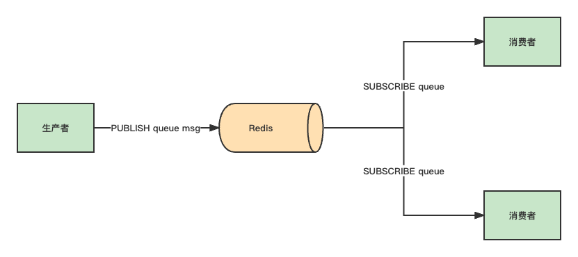

# Redis 实现消息队列

- [Redis 实现消息队列](#redis-实现消息队列)
  - [1.List 队列](#1list-队列)
    - [1.1 基本使用](#11-基本使用)
    - [1.2 阻塞式拉取](#12-阻塞式拉取)
    - [1.3 缺点](#13-缺点)
  - [2.发布/订阅模型：Pub/Sub](#2发布订阅模型pubsub)
    - [2.1 基本使用](#21-基本使用)
    - [2.2 匹配订阅模式](#22-匹配订阅模式)
    - [2.3 缺点](#23-缺点)
      - [2.3.1 消费者下线](#231-消费者下线)
      - [2.3.2 Redis 宕机](#232-redis-宕机)
      - [2.3.3 消息堆积](#233-消息堆积)
    - [2.4 小结](#24-小结)
  - [3.趋于成熟的队列 Stream](#3趋于成熟的队列-stream)
    - [3.1 基本使用](#31-基本使用)
    - [3.2 Stream 是否支持「阻塞式」拉取消息？](#32-stream-是否支持阻塞式拉取消息)

## 1.List 队列

### 1.1 基本使用

首先，我们先从最简单的场景开始讲起。

如果你的业务需求足够简单，想把 Redis 当作队列来使用，肯定最先想到的就是使用 List 这个数据类型。

如果把 List 当作队列，你可以这么来用。

生产者使用 LPUSH 发布消息：

```sh
> LPUSH queue msg1
(integer) 1
> LPUSH queue msg2
(integer) 2
```

消费者这一侧，使用 RPOP 拉取消息：

```sh
> RPOP queue
"msg1"
> RPOP queue
"msg2"
```

这个模型非常简单，也很容易理解。


但这里有个小问题，当队列中已经没有消息了，消费者在执行 RPOP 时，会返回 NULL。

```sh
> RPOP queue
(nil)
```

而我们在编写消费者逻辑时，一般是一个「死循环」，这个逻辑需要不断地从队列中拉取消息进行处理，伪代码一般会这么写：

```c
while true:
    msg = redis.pop("queue")
    // 没有消息，继续循环
    if msg == null:
        continue
    // 处理消息
    handle(msg)
```

而我们在编写消费者逻辑时，一般是一个「死循环」，这个逻辑需要不断地从队列中拉取消息进行处理，伪代码一般会这么写：

怎么解决这个问题呢？

也很简单，当队列为空时，我们可以「休眠」一会，再去尝试拉取消息。代码可以修改成这样：

```c
while true:
    msg = redis.pop("queue")
    // 没有消息，继续循环
    if msg == null:
        sleep(2)
        continue
    // 处理消息
    handle(msg)
```

这就**解决了 CPU 空转问题**。

这个问题虽然解决了，但又带来另外一个问题：**当消费者在休眠等待时，有新消息来了，那消费者处理新消息就会存在「延迟」**。

假设设置的休眠时间是 2s，那新消息最多存在 2s 的延迟。

要想缩短这个延迟，只能减小休眠的时间。但休眠时间越小，又有可能引发 CPU 空转问题。

鱼和熊掌不可兼得。

那如何做，既能及时处理新消息，还能避免 CPU 空转呢？

### 1.2 阻塞式拉取

幸运的是，**Redis 确实提供了「阻塞式」拉取消息的命令：`BRPOP` / `BLPOP`**，这里的 B 指的是阻塞（Block）。


现在，你可以这样来拉取消息了：

```c
while true:
    // 没消息阻塞等待，0 表示不设置超时时间
    msg = redis.brpop("queue", 0)
    if msg == null:
        continue
    // 处理消息
    handle(msg)
```

使用 BRPOP 这种阻塞式方式拉取消息时，还支持传入一个「超时时间」，如果设置为 0，则表示不设置超时，直到有新消息才返回，否则会在指定的超时时间后返回 NULL。

这个方案不错，既兼顾了效率，还避免了 CPU 空转问题，一举两得。

> 注意：如果设置的超时时间太长，这个连接太久没有活跃过，可能会被 Redis Server 判定为无效连接，之后 Redis Server 会强制把这个客户端踢下线。所以，采用这种方案，客户端要有重连机制。

### 1.3 缺点

解决了消息处理不及时的问题，你可以再思考一下，这种队列模型，有什么缺点？

我们一起来分析一下：

1. **不支持重复消费**：消费者拉取消息后，这条消息就从 List 中删除了，无法被其它消费者再次消费，即不支持多个消费者消费同一批数据；
2. **消息丢失**：消费者拉取到消息后，如果发生异常宕机，那这条消息就丢失了。

第一个问题是功能上的，使用 List 做消息队列，它仅仅支持最简单的，一组生产者对应一组消费者，不能满足多组生产者和消费者的业务场景。

第二个问题就比较棘手了，因为从 List 中 POP 一条消息出来后，这条消息就会立即从链表中删除了。也就是说，无论消费者是否处理成功，这条消息都没办法再次消费了。

这也意味着，如果消费者在处理消息时异常宕机，那这条消息就相当于丢失了。

针对这 2 个问题怎么解决呢？我们一个个来看。

## 2.发布/订阅模型：Pub/Sub

### 2.1 基本使用

从名字就能看出来，这个模块是 Redis 专门是针对「发布/订阅」这种队列模型设计的。

**它正好可以解决前面提到的第一个问题：重复消费。**

即多组生产者、消费者的场景，我们来看它是如何做的。

Redis 提供了 `PUBLISH` / `SUBSCRIBE` 命令，来完成发布、订阅的操作。



假设你想开启 2 个消费者，同时消费同一批数据，就可以按照以下方式来实现。

首先，使用 `SUBSCRIBE` 命令，启动 2 个消费者，并「订阅」同一个队列。

```sh
> SUBSCRIBE queue
Reading messages...(press Ctrl-C to quit)
1) "subscribe"
2) "queue"
3) (integer) 1
```

此时，2 个消费者都会被阻塞住，等待新消息的到来。

之后，再启动一个生产者，发布一条消息。

```sh
> PUBLISH queue msg1
(integer) 1
```

这时，2 个消费者就会解除阻塞，收到生产者发来的新消息。

```sh
> SUBSCRIBE queue
// 收到新消息
1) "message"
2) "queue"
3) "msg1"
```

看到了么，使用 Pub/Sub 这种方案，既支持阻塞式拉取消息，还很好地满足了多组消费者，消费同一批数据的业务需求。

### 2.2 匹配订阅模式

除此之外，Pub/Sub 还提供了「匹配订阅」模式，允许消费者根据一定规则，订阅「多个」自己感兴趣的队列。

```sh
> PUBSCRIBE queue.*
Reading message... (press Ctrl-C to quit)
1) "psubscribe"
2) "queue.*"
3) (integer) 1
```

这里的消费者，订阅了 `queue.*` 相关的队列消息。

之后，生产者分别向 `queue.p1` 和 `queue.p2` 发布消息。

```sh
> PUBLISH queue.p1 msg1
(integer) 1
> PUBLISH queue.p2 msg2
(integer) 1
```

这时再看消费者，它就可以接收到这 2 个生产者的消息了。

```sh
> PSUBSCRIBE queue.*
Reading messages... (press Ctrl-C to quit)
...
// 来自queue.p1的消息
1) "pmessage"
2) "queue.*"
3) "queue.p1"
4) "msg1"

// 来自queue.p2的消息
1) "pmessage"
2) "queue.*"
3) "queue.p2"
4) "msg2"
```


我们可以看到，**Pub/Sub 最大的优势就是，支持多组生产者、消费者处理消息**。

### 2.3 缺点

讲完了它的优点，那它有什么缺点呢？

其实，Pub/Sub 最大问题是：**丢数据**。

如果发生以下场景，就有可能导致数据丢失：

1. 消费者下线
2. Redis 宕机
3. 消息堆积

#### 2.3.1 消费者下线

这其实与 Pub/Sub 的实现方式有很大关系。

Pub/Sub 在实现时非常简单，它没有基于任何数据类型，也没有做任何的数据存储，它只是单纯地为生产者、消费者建立「数据转发通道」，把符合规则的数据，从一端转发到另一端。

一个完整的发布、订阅消息处理流程是这样的：

1. 消费者订阅指定队列，Redis 就会记录一个映射关系：队列->消费者
2. 生产者向这个队列发布消息，那 Redis 就从映射关系中找出对应的消费者，把消息转发给它


看到了么，整个过程中，没有任何的数据存储，一切都是**实时转发**的。

这种设计方案，就导致了上面提到的那些问题。

例如，如果一个消费者异常挂掉了，它再重新上线后，只能接收新的消息，在下线期间生产者发布的消息，因为找不到消费者，都会被丢弃掉。

如果所有消费者都下线了，那生产者发布的消息，因为找不到任何一个消费者，也会全部「丢弃」。

所以，当你在使用 Pub/Sub 时，一定要注意：**消费者必须先订阅队列，生产者才能发布消息，否则消息会丢失**。

这也是前面讲例子时，我们让消费者先订阅队列，之后才让生产者发布消息的原因。

#### 2.3.2 Redis 宕机

**因为 Pub/Sub 没有基于任何数据类型实现，所以它也不具备「数据持久化」的能力**。

也就是说，Pub/Sub 的相关操作，不会写入到 RDB 和 AOF 中，当 Redis 宕机重启，Pub/Sub 的数据也会全部丢失。

#### 2.3.3 消息堆积

当消费者的速度，跟不上生产者时，就会导致数据积压的情况发生。

如果采用 List 当作队列，消息积压时，会导致这个链表很长，最直接的影响就是，**Redis 内存会持续增长**，直到消费者把所有数据都从链表中取出。

但 Pub/Sub 的处理方式却不一样，当消息积压时，有可能会导致**消费失败**和**消息丢失**！

这是怎么回事？

还是回到 Pub/Sub 的实现细节上来说。

每个消费者订阅一个队列时，Redis 都会在 Server 上给这个消费者在分配一个「缓冲区」，这个缓冲区其实就是一块内存。

当生产者发布消息时，Redis 先把消息写到对应消费者的缓冲区中。

之后，消费者不断地从缓冲区读取消息，处理消息。


但是，问题就出在这个缓冲区上。

因为这个缓冲区其实是有「上限」的（可配置），如果消费者拉取消息很慢，就会造成生产者发布到缓冲区的消息开始积压，缓冲区内存持续增长。

如果超过了缓冲区配置的上限，此时，Redis 就会「强制」**把这个消费者踢下线**。

这时消费者就会消费失败，也会丢失数据。

如果你有看过 Redis 的配置文件，可以看到这个缓冲区的默认配置：`client-output-buffer-limit pubsub 32mb 8mb 60`。

它的参数含义如下：

+ 32mb：缓冲区一旦超过 32MB，Redis 直接强制把消费者踢下线；
+ 8mb + 60：缓冲区超过 8MB，并且持续 60 秒，Redis 也会把消费者踢下线

Pub/Sub 的这一点特点，是与 List 作队列差异比较大的。

从这里你应该可以看出，**List 其实是属于「拉」模型，而 Pub/Sub 其实属于「推」模型**。

List 中的数据可以一直积压在内存中，消费者什么时候来「拉」都可以。

但 Pub/Sub 是把消息先「推」到消费者在 Redis Server 上的缓冲区中，然后等消费者再来取。

当生产、消费速度不匹配时，就会导致缓冲区的内存开始膨胀，Redis 为了控制缓冲区的上限，所以就有了上面讲到的，强制把消费者踢下线的机制。

### 2.4 小结

好了，现在我们总结一下 Pub/Sub 的优缺点：

1. 支持发布 / 订阅，支持多组生产者、消费者处理消息
2. 消费者下线，数据会丢失
3. 不支持数据持久化，Redis 宕机，数据也会丢失
4. 消息堆积，缓冲区溢出，消费者会被强制踢下线，数据也会丢失

有没有发现，除了第一个是优点之外，剩下的都是缺点。

所以，很多人看到 Pub/Sub 的特点后，觉得这个功能很「鸡肋」。

也正是以上原因，Pub/Sub 在实际的应用场景中用得并不多。

> 目前只有哨兵集群和 Redis 实例通信时，采用了 Pub/Sub 的方案，因为哨兵正好符合即时通讯的业务场景。

我们再来看一下，Pub/Sub 有没有解决，消息处理时异常宕机，无法再次消费的问题呢？

其实也不行，Pub/Sub 从缓冲区取走数据之后，数据就从 Redis 缓冲区删除了，消费者发生异常，自然也无法再次重新消费。

好，现在我们重新梳理一下，我们在使用消息队列时的需求。

当我们在使用一个消息队列时，希望它的功能如下：

+ 支持阻塞等待拉取消息
+ 支持发布 / 订阅模式
+ 消费失败，可重新消费，消息不丢失
+ 实例宕机，消息不丢失，数据可持久化
+ 消息可堆积

Redis 除了 List 和 Pub/Sub 之外，还有符合这些要求的数据类型吗？

其实，Redis 的作者也看到了以上这些问题，也一直在朝着这些方向努力着。

Redis 作者在开发 Redis 期间，还另外开发了一个开源项目 disque。

这个项目的定位，就是一个基于内存的分布式消息队列中间件。

但由于种种原因，这个项目一直不温不火。

终于，在 Redis 5.0 版本，作者把 disque 功能移植到了 Redis 中，并给它定义了一个新的数据类型：

下面我们就来看看，它能符合上面提到的这些要求吗？

## 3.趋于成熟的队列 Stream

我们来看 Stream 是如何解决上面这些问题的。

我们依旧从简单到复杂，依次来看 Stream 在做消息队列时，是如何处理的？

### 3.1 基本使用

首先，Stream 通过 `XADD` 和 `XREAD` 完成最简单的生产、消费模型：

+ `XADD`：发布消息
+ `XREAD`：读取消息

生产者发布 2 条消息：

```sh
> XADD queue * name zhangsan
"1618469123380-0"
> XADD queue * name lisi
"1618469127777-0"
```

使用 `XADD` 命令发布消息，其中的「*」表示让 Redis 自动生成唯一的消息 ID。

这个消息 ID 的格式是「时间戳-自增序号」。

消费者拉取消息：

```sh
// 从开头读取5条消息，0-0表示从开头读取
> XREAD COUNT 5 STREAMS queue 0-0
1) 1) "queue"
   2) 1) 1) "1618469123380-0"
         2) 1) "name"
            2) "zhangsan"
      2) 1) "1618469127777-0"
         2) 1) "name"
            2) "
```

如果想继续拉取消息，需要传入上一条消息的 ID：

```sh
> XREAD COUNT 5 STREAMS queue 1618469127777-0
(nil)
```

没有消息，Redis 会返回 NULL。


以上就是 Stream 最简单的生产、消费。

下面我们来看，针对前面提到的消息队列要求，Stream 都是如何解决的？

### 3.2 Stream 是否支持「阻塞式」拉取消息？

