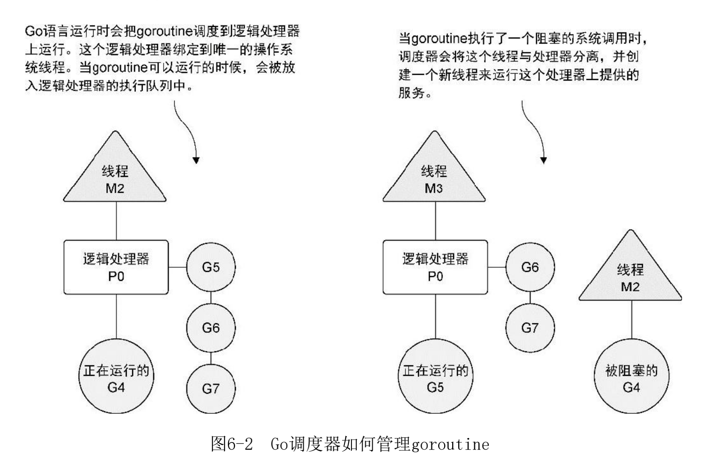
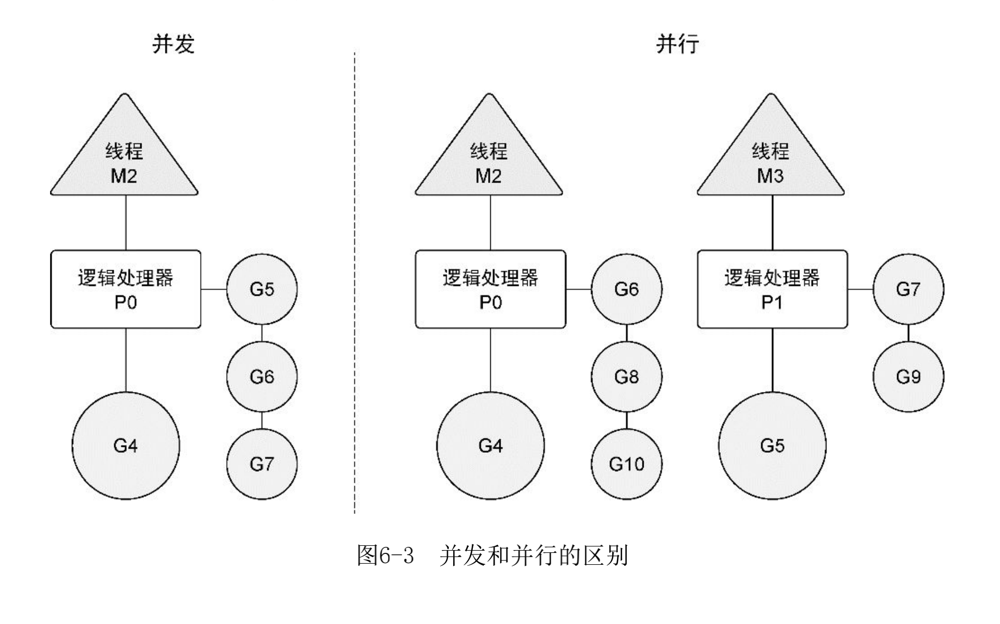

# 并发

Go 语言的并发模型来自一个叫作**通讯顺序进程**（Communicating Sequential Processes，CSP）的范型（paradigm）。CSP 是一种消息传递模型，通过在 goroutine 之间传递数据来传递信息，而不是对数据进行加锁来实现同步访问。

## 1.并发与并行

让我们先来学习一下抽象程度较高的概念：什么是操作系统的**线程**（thread）和**进程**（process）。这会有助于理解 Go 语言运行时调度器如何利用操作系统来并发运行 goroutine。当运行一个应用程序（如一个 IDE 或者编辑器）的时候，操作系统会为这个应用程序启动一个进程。可以将这个进程看作一个包含了应用程序在运行中需要用到和维护的各种资源的容器。

下图展示了一个包含所有可能分配的常用资源的进程。这些资源包括但不限于内存地址空间、文件和设备的句柄以及线程。一个线程是一个执行空间，这个空间会被操作系统调度来运行函数中所写的代码。每个进程至少包含一个线程，每个进程的初试线程被称为**主线程**。因为执行这个线程的空间是应用程序本身的空间，所以当主线程终止时，应用程序也会终止。操作系统将线程调度到某个处理器上运行，这个处理器并不一定是进程所在的处理器。不同的操作系统使用的线程调度算法一般都不一样，但是这种不同会被操作系统屏蔽，并不会展示给程序员。

操作系统会在物理处理器上调度线程来运行，而 Go 语言会在逻辑处理器上调度 goroutine 来运行。每个逻辑处理器都分别绑定到单个操作系统线程。在 1.5 版本上，Go 语言的运行默认会为每个可用的物理处理器分配一个逻辑处理器。（直到目前 1.8 版本都是统一逻辑，可以预见未来版本也会保持这个逻辑）在 1.5 之前的版本中，默认给整个应用程序只分配一个逻辑处理器。这些逻辑处理器会用于执行所有被创建的 goroutine。即便只有一个逻辑处理器，Go 也可以以神奇的效率和性能，并发调度无数个 goroutine。

在图6-2中，可以看到操作系统、逻辑处理器和本地运行队列之间的关系。如果创建一个 goroutine 并准备运行，这个 goroutine 就会被放到调度器的全局运行队列中。之后，调度器就将这些队列中的 goroutine 分配给一个逻辑处理器，并放到这个逻辑处理器的本地运行队列中。本地运行队列中的 goroutine 会一直等待直到自己被分配的逻辑处理器执行。

有时，正在运行的 goroutine 需要执行一个阻塞的系统调用，如打开一个文件。当这类调用发生时，线程和 goroutine 会从逻辑处理器上分离，该线程会继续阻塞，等待系统调用的返回。与此同时，这个逻辑处理器就失去了用来运行的线程。所以，调度器会创建一个新线程，并将其绑定到该逻辑处理器上。之后，调度器会从本地运行队列里选择另一个 goroutine 来运行。一旦被阻塞的系统调用执行完成并返回，对应的 goroutine 会放回本地运行队列，而之前的线程会保存好，以便之后可以继续使用。

如果一个 goroutine 要做一个网络 I/O 调用，流程上会有些不一样。在这种情况下，goroutine 会和逻辑处理器分离，并移到了集成了网络轮询器的运行时。一旦该轮询器指示某个网络读或者写已经就绪，对应的 goroutine 就会重新分配到逻辑处理器上来完成操作。调度器对可以创建的逻辑处理器的数量没有限制，但语言运行时默认限制每个程序最多创建 10000 个线程。这个限制可以通过调用 `runtime/debug` 包的 `SetMaxThreads` 方法来更改。如果程序试图使用更多的线程，就会崩溃。

并发（concurrency）并不是并行（parallelism）。并行是让不同的代码片段同时在不同的物理处理器上执行。并行的关键是同时做很多事情，而并发是指同时管理很多事情，这些事情可能只做了一半就被暂停去做别的事情了。在很多情况下，并发的效果比并行好，因为操作系统和硬件的总资源一般很少，但能支持系统同时做很多事情。这种“使用较少的资源做更多的事情”的哲学，也是指导 Go 语言设计的哲学。

如果希望 goroutine 并行，必须使用多于一个逻辑处理器。当有多个逻辑处理器时，调度器会将 goroutine 平等分配到每个逻辑处理器上。这会让 goroutine 在不同的线程上运行。不过要想真的实现并行效果，用户需要让自己的程序运行在有多个物理处理器的机器上。否则，哪怕 Go 语言运行时使用多个线程，goroutine 依然会在同一个物理处理器上并发运行，达不到并行的效果。

图6-3展示了在一个逻辑处理器并发运行 goroutine 和在两个逻辑处理器并行两个 goroutine 的区别。调度器包含一些聪明的算法，这些算法会随着 Go 语言的发布被更新和改进，所以不推荐盲目修改语言进行时对逻辑处理器的默认设置。如果真的认为修改逻辑处理器的数量可以提升性能，也可以对语言运行时的参数进行微调。

