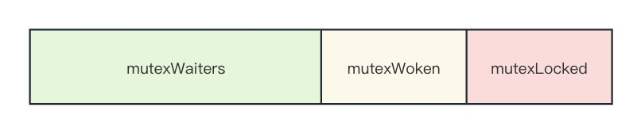
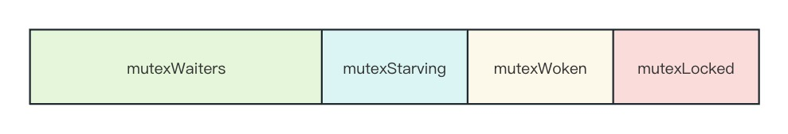

# Go 并发编程 | Mutex 的历史演进和底层实现

Mutex 就好比电视剧中保险库唯一的一把钥匙，只有拿到钥匙的 goroutine 才能进入保险库，其他 goroutine 必须等它走出保险库并交出钥匙，才有机会争抢钥匙进入保险库。

在这一过程中，Mutex 也经历了几个版本的迭代，大致可以分为 4 个版本，接下来我们逐一分析这 4 个版本。

## 1.变量标识

[源码地址](https://github.com/golang/go/blob/weekly.2009-11-06/src/pkg/sync/mutex.go)

```go
type Mutex struct {
	key  uint32; // 标识位，如果 >= 1，则说明当前 Mutex 已经被持有
	sema uint32; // 信号量变量，用来控制等待 goroutine 的阻塞休眠和唤醒
}
```

初版的 Mutex 使用一个标识字段 `key` 标记是否被某个 goroutine 持有，如果为 1，则代表持有；如果为 0，则可以通过 CAS 将这个 key 值设置为 1，成功设置则标识 Mutex 被该 goroutine 持有。

> CAS（Compare-And-Swap）：是一种并发编程中常用的原子操作，用于解决多线程并发访问共享内存时的数据一致性问题。CAS 操作包括两个步骤：比较和交换。比较内存中的某个值与预期值是否相等，如果相等，则将该值更新为新的值；如果不相等，则不做任何操作或返回失败。

我们接着来看加锁/解锁操作：

```go
func xadd(val *uint32, delta int32) (new uint32) {
	for {
		v := *val;
		nv := v+uint32(delta);
		if cas(val, v, nv) {
			return nv;
		}
	}
	panic("unreached");
}

func (m *Mutex) Lock() {
	if xadd(&m.key, 1) == 1 {
		// changed from 0 to 1; we hold lock
		return;
	}
	runtime.Semacquire(&m.sema);
}

func (m *Mutex) Unlock() {
	if xadd(&m.key, -1) == 0 {
		// changed from 1 to 0; no contention
		return;
	}
	runtime.Semrelease(&m.sema);
}
```

当调用 `Lock` 加锁时，会调用 `xadd` 方法，循环对 Mutex 的 `key` 字段进行 CAS 加一操作，直到成功；如果 `xadd` 返回的刚好是 1，说明 Mutex 已经被当前 goroutine 持有，`Lock` 函数直接返回；否则说明 Mutex 被其他 goroutine 持有，那么就会调用 `runtime.Semacquire` 使用信号量将自己休眠。

同理，当调用 `Unlock` 解锁时，会调用 `xadd` 方法对 `key` 减一。如果 `xadd` 返回 0，说明当前没有其他 goroutine 在等待该锁，直接 return；否则会调用 `runtime.Semrelease` 利用信号量唤醒等待锁的下一 goroutine。

## 2.引入 state 复合字段

[源码地址](https://github.com/golang/go/blob/weekly.2011-07-07/src/pkg/sync/mutex.go)

### 2.1 数据结构

```go
type Mutex struct {
	state int32
	sema  uint32
}

const (
	mutexLocked = 1 << iota // mutex is locked
	mutexWoken
	mutexWaiterShift = iota
)
```

在这版 Mutex 中，`state` 字段取代了 `key` 字段，为了节约内存，`state` 是一个复合型字段，包含多个含义：

+ 第一位（即最后一位）表示锁是否被持有；
+ 第二位表示是否有唤醒的 goroutine；
+ 剩余位数表示等待该锁的 goroutine 数量。



### 2.2 加锁

```go
func (m *Mutex) Lock() {
	// 快速通道: 获取到未加锁的互斥锁
	if atomic.CompareAndSwapInt32(&m.state, 0, mutexLocked) {
		return
	}

	awoke := false
	for {
		old := m.state
		new := old | mutexLocked  // 新的 state 值（加锁状态）
		if old&mutexLocked != 0 { // 如果为 true，说明锁被其他 goroutine 持有
			new = old + 1<<mutexWaiterShift // 等待者计数 +1
		}
		if awoke {
			// 如果当前 goroutine 是被唤醒的，新 state 值清除唤醒标志位
			new &^= mutexWoken
		}
		if atomic.CompareAndSwapInt32(&m.state, old, new) { // 设置新 state 值（原子操作）
			if old&mutexLocked == 0 { // 如果为 true，说明锁原状态未加锁，该 goroutine 成功获取锁
				break
			}
			runtime.Semacquire(&m.sema) // 未获取到锁，请求信号量进入休眠状态
			awoke = true                // 被唤醒则将唤醒标志设置为 true
		}
	}
}
```

其中，在等待逻辑中的 `atomic.CompareAndSwapInt32(&m.state, old, new)` 容易让人以为只要成功设置了 `state` 值就是获取到了锁，其实不是的，如果旧的 `state` 值是有锁状态，那么这次设置只是清除 `mutexWoken` 标志或者增加一个 waiter 而已。所以才需要 `old&mutexLocked == 0` 判断。

我们总结一下加锁的逻辑：

1.新来的 goroutine：
    + 如果锁被持有：waiter++，休眠；
    + 如果锁未被持有：通过快速路径获取到锁；
2.被唤醒的 goroutine
    + 如果锁被持有：waiter++（`old&mutexLocked != 0`）；清除 mutexWoken 标志；休眠；
    + 如果锁未被持有：清除 mutexWoken 标志；获取到锁。

### 2.3 解锁

```go
func (m *Mutex) Unlock() {
	// Fast path: drop lock bit.
	new := atomic.AddInt32(&m.state, -mutexLocked) // 得到解锁的 state 值
	if (new+mutexLocked)&mutexLocked == 0 {        // 如果解锁一个未加锁的 Mutex，会直接 panic
		panic("sync: unlock of unlocked mutex")
	}

	old := new
	for {
		// 如果没有等待者，或者某个 goroutine 已经被唤醒或者抢占了锁，那么不需要唤醒其他等待者，直接返回
		if old>>mutexWaiterShift == 0 || old&(mutexLocked|mutexWoken) != 0 {
			return
		}
		// 有等待者，并且没有唤醒的等待者，将等待者数量减 1，并且设置唤醒标志 mutexWoken
		new = (old - 1<<mutexWaiterShift) | mutexWoken
		if atomic.CompareAndSwapInt32(&m.state, old, new) {
			runtime.Semrelease(&m.sema) // 释放信号量，唤醒 waiter
			return
		}
		old = m.state
	}
}
```

我们总结一下解锁的逻辑：

1. 解锁（state 值减 1），如果是未加锁的 Mutex，则 panic；
2. 如果满足以下任一条件，直接 return：
    + 没有 waiter；
    + 已存在被唤醒的 waiter 或 Mutex 已被持有；
3. 尝试唤醒 waiter，如果失败，则重复 2-3 步骤。

### 2.4 小结

相比上一版本，这一版本主要更新了：

1. 新来的 goroutine 也有机会获得锁，打破了先来先到的逻辑；
2. 对未加锁的 Mutex 解锁会 panic。

## 3.加入自旋逻辑

[源码地址](https://github.com/golang/go/blob/release-branch.go1.5/src/sync/mutex.go)

### 3.1 加锁

在这个版本中，解锁逻辑基本不变，我们只分析加锁逻辑，并且在后续的分析中，我们会在源代码基础上删除数据竞争检测等非主要逻辑代码进行分析。

那么我们来看加锁逻辑：

```go
func (m *Mutex) Lock() {
	// 快速通道: 获取到未加锁的互斥锁
	if atomic.CompareAndSwapInt32(&m.state, 0, mutexLocked) {
		return
	}

	awoke := false
	iter := 0
	for {
		old := m.state            // 保存 Mutex 当前 state 值
		new := old | mutexLocked  // 新的 state 值（加锁状态）
		if old&mutexLocked != 0 { // Mutex 当前仍处于加锁状态
			if runtime_canSpin(iter) { // 如果可以自旋
				// !awoke: 当前 goroutine 是新来的；
				// old&mutexWoken == 0: 当前 Mutex 没有唤醒的 goroutine；
				// old>>mutexWaiterShift != 0: waiter 的数量大于 0；
				// atomic.CompareAndSwapInt32(&m.state, old, old|mutexWoken): 设置 Mutex 唤醒标志位，表示当前 goroutine 已被唤醒；
				if !awoke && old&mutexWoken == 0 && old>>mutexWaiterShift != 0 &&
					atomic.CompareAndSwapInt32(&m.state, old, old|mutexWoken) {
					awoke = true
				}
				runtime_doSpin()
				iter++
				continue // 自旋，再次尝试请求锁
			}
			new = old + 1<<mutexWaiterShift // 如果不能自旋，则 waiter++
		}
		// 如果当前 goroutine 是被唤醒的，新 state 值清除唤醒标志位
		if awoke {
			if new&mutexWoken == 0 { // 如果新 state 值唤醒标志位为 0，则 panic
				panic("sync: inconsistent mutex state")
			}
			new &^= mutexWoken
		}
		if atomic.CompareAndSwapInt32(&m.state, old, new) {
			if old&mutexLocked == 0 { // 旧 state 值成功释放了锁，则设置的新 state 值是加锁状态的，说明成功获取到了锁，直接返回
				break
			}
			runtime_Semacquire(&m.sema) // 未获取到锁，请求信号量进入休眠状态
			awoke = true                // 被唤醒则将唤醒标志设置为 true
			iter = 0
		}
	}

	if raceenabled {
		raceAcquire(unsafe.Pointer(m))
	}
}
```

### 3.2 自旋满足条件

[源码地址](https://github.com/golang/go/blob/master/src/runtime/proc.go#L7036)

```go
// Active spinning for sync.Mutex.
//
//go:linkname sync_runtime_canSpin sync.runtime_canSpin
//go:nosplit
func sync_runtime_canSpin(i int) bool {
	// sync.Mutex is cooperative, so we are conservative with spinning.
	// Spin only few times and only if running on a multicore machine and
	// GOMAXPROCS>1 and there is at least one other running P and local runq is empty.
	// As opposed to runtime mutex we don't do passive spinning here,
	// because there can be work on global runq or on other Ps.
	if i >= active_spin || ncpu <= 1 || gomaxprocs <= sched.npidle.Load()+sched.nmspinning.Load()+1 {
		return false
	}
	if p := getg().m.p.ptr(); !runqempty(p) {
		return false
	}
	return true
}
```

1. 累计自旋次数小于最大自旋次数（active_spin = 4）；
2. CPU 核数大于 1；
3. 有空闲的 P；
4. 当前 goroutine 所挂载的 P 的本地运行队列为空。

### 3.3 小结

相比上一版本，这一版本主要增加了 `if runtime_canSpin(iter)` 自旋逻辑。对于短期的资源竞争，自旋可能比阻塞等待更有效。

但是，你有没有想过，由于新来的 goroutine 也参与 Mutex 的竞争，在极端情况下，有可能每次 Mutex 都会被新来的 goroutine 抢到，导致等待的 goroutine 一直获取不到 Mutex，这就造成了 goroutine 饥饿。在下个版本，我们看看 Mutex 是如何处理饥饿问题的。

## 4.解决饥饿

[源码地址](https://github.com/golang/go/blob/dev.boringcrypto.go1.13/src/sync/mutex.go)

### 4.1 数据结构

```go
type Mutex struct {
	state int32
	sema  uint32
}

const (
	mutexLocked = 1 << iota // mutex is locked
	mutexWoken
	mutexStarving    // state 字段新增一个饥饿标志位
	mutexWaiterShift = iota

	starvationThresholdNs = 1e6 // 表示在正常模式下等待的时间阈值。如果一个 waiter 在正常模式下等待的时间超过了这个阈值，那么 Mutex 将切换到饥饿模式。
)
```



### 4.2 加锁

```go
func (m *Mutex) Lock() {
	// Fast path: 幸运之路，一下就获取到了锁
	if atomic.CompareAndSwapInt32(&m.state, 0, mutexLocked) {
		return
	}
	// Slow path：缓慢之路，尝试自旋竞争或饥饿状态下饥饿goroutine竞争
	m.lockSlow()
}

func (m *Mutex) lockSlow() {
	var waitStartTime int64
	starving := false // 当前 goroutine 的饥饿标记
	awoke := false    // 唤醒标记
	iter := 0         // 自旋次数
	old := m.state    // 当前 Mutex 的状态
	for {
		// Mutex 是加锁和非饥饿状态，并且可以自旋时，尝试自旋
		// old&(mutexLocked|mutexStarving) == mutexLocked: 当前 Mutex 处于加锁和非饥饿状态
		if old&(mutexLocked|mutexStarving) == mutexLocked && runtime_canSpin(iter) {
			if !awoke && old&mutexWoken == 0 && old>>mutexWaiterShift != 0 &&
				atomic.CompareAndSwapInt32(&m.state, old, old|mutexWoken) {
				awoke = true
			}
			runtime_doSpin()
			iter++
			old = m.state // 刷新 Mutex 状态，方便后续逻辑
			continue
		}
		new := old
		if old&mutexStarving == 0 { // 如果是非饥饿状态
			new |= mutexLocked // 加锁
		}
		if old&(mutexLocked|mutexStarving) != 0 { // 如果是加锁或饥饿状态
			new += 1 << mutexWaiterShift // waiter数量加1
		}
		if starving && old&mutexLocked != 0 { // 如果饥饿标记为 true 并且 Mutex 被持有
			new |= mutexStarving // 设置饥饿状态
		}
		if awoke { // 如果当前 goroutine 是唤醒的
			if new&mutexWoken == 0 { // 唤醒状态出错则 panic
				throw("sync: inconsistent mutex state")
			}
			new &^= mutexWoken // 新状态清除唤醒标记
		}
		// 成功设置新状态
		if atomic.CompareAndSwapInt32(&m.state, old, new) {
			// Mutex 旧的状态已释放，并且不是饥饿状态，说明正常请求到了 Mutex，退出循环
			if old&(mutexLocked|mutexStarving) == 0 {
				break // locked the mutex with CAS
			}

			// 判断是否第一次加入队列
			queueLifo := waitStartTime != 0
            // 如果之前就在队列里面（排过队），这次加入到队列头
			if waitStartTime == 0 {
				waitStartTime = runtime_nanotime()
			}
			// 阻塞等待
			runtime_SemacquireMutex(&m.sema, queueLifo, 1)
			// 唤醒之后检查锁是否应该处于饥饿状态
			starving = starving || runtime_nanotime()-waitStartTime > starvationThresholdNs
			old = m.state
			// 如果锁已经处于饥饿状态
			if old&mutexStarving != 0 {
				// 饥饿模式状态一致性检查
				// old&(mutexLocked|mutexWoken) != 0: Mutex 状态被加锁或唤醒
				// old>>mutexWaiterShift == 0: Mutex 没有等待者
				if old&(mutexLocked|mutexWoken) != 0 || old>>mutexWaiterShift == 0 {
					throw("sync: inconsistent mutex state")
				}
				// 加锁并且将 waiter 数减 1
				delta := int32(mutexLocked - 1<<mutexWaiterShift)
				// 不饥饿或者当前 goroutine 是最后一个 waiter
				if !starving || old>>mutexWaiterShift == 1 {
					delta -= mutexStarving // 清除饥饿标记
				}
				atomic.AddInt32(&m.state, delta)
				break
			}
			awoke = true
			iter = 0
		} else {
			old = m.state
		}
	}
}
```

### 4.3 解锁

```go
func (m *Mutex) Unlock() {
	// Fast path: drop lock bit.
	new := atomic.AddInt32(&m.state, -mutexLocked)
	// new != 0 意味着还有 waiter
	if new != 0 {
		m.unlockSlow(new)
	}
}

func (m *Mutex) unlockSlow(new int32) {
	// Mutex 状态检查
	if (new+mutexLocked)&mutexLocked == 0 {
		throw("sync: unlock of unlocked mutex")
	}
	// Mutex 非饥饿状态
	if new&mutexStarving == 0 {
		old := new
		for {
			// old>>mutexWaiterShift == 0: 没有 waiter
			// old&(mutexLocked|mutexWoken|mutexStarving) != 0: Mutex 的加锁、唤醒、饥饿任一标志位被设置了
			if old>>mutexWaiterShift == 0 || old&(mutexLocked|mutexWoken|mutexStarving) != 0 {
				return
			}
			// 设置唤醒标志并且 waiter 数减 1
			new = (old - 1<<mutexWaiterShift) | mutexWoken
			if atomic.CompareAndSwapInt32(&m.state, old, new) {
				runtime_Semrelease(&m.sema, false, 1)
				return
			}
			old = m.state
		}
	} else {
		runtime_Semrelease(&m.sema, true, 1)
	}
}
```

### 4.4 小结

相比上一版本，这一版本最大的改动就是引入了饥饿模式，饥饿模式可以避免极端情况下 Mutex 被所有新来的 goroutine 获取到，增强了 Mutex 竞争的公平性。

+ 正常模式 -> 饥饿模式

正常模式下，waiter 会进入一个先入先出队列尾部，被唤醒的 waiter 还需要跟新来的 goroutine 竞争，而新来的 goroutine 原本就在 CPU 中运行，更有可能竞争到 Mutex，特别是在高并发的情况下。而被唤醒 waiter 会被插入队列头部。在下一次唤醒时如果该 waiter 等待的时间超过 1 毫秒，那么 Mutex 就进入到了饥饿模式。

+ 饥饿模式 -> 正常模式

在饥饿模式下，Mutex 会被拥有者直接交给队列最前面的 waiter，新来的 goroutine 会直接加入队列尾部等待。如果该 waiter 是队列中的最后一个 waiter 或者等待的时间小于 1 毫秒，那么就会从饥饿模式回到正常模式。

## 5.总结

本篇文章我们列举了 Mutex 4 个版本的源码，探讨了其设计从简单到复杂的演变。希望能对你有帮助。