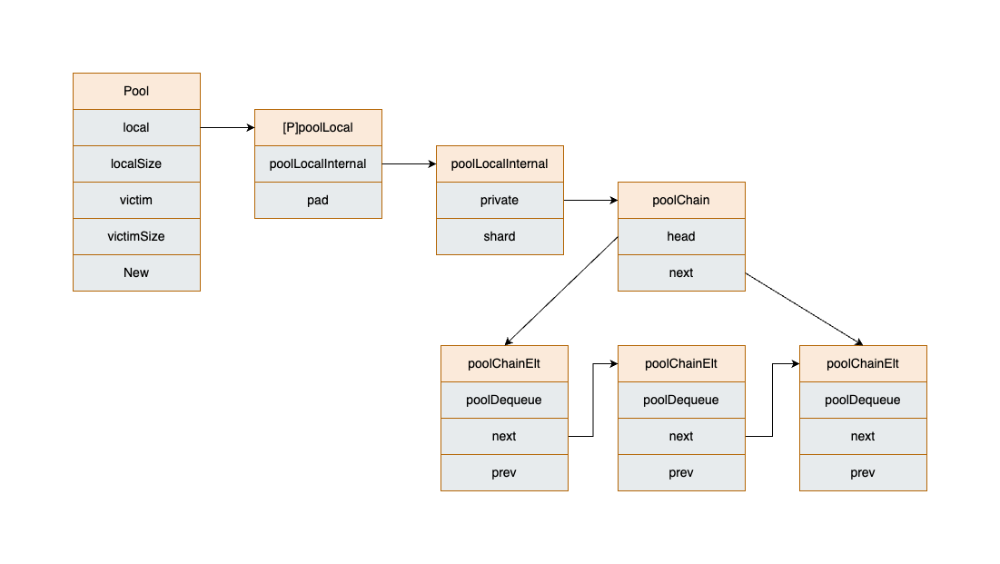

# 池化技术 Pool

## 1.背景

在并发编程中，资源的分配和回收是一个很重要的问题，频繁的分配和回收，会造成大量的开销。如果你想使用 Go 开发一个高性能的应用程序的话，就必须考虑垃圾回收给性能带来的影响。

所以，我们一般做性能优化时，会考虑池化技术，回收使用率高的对象，避免被垃圾回收，减少重复创建的开销。

Go 语言的 `sync.Pool` 正是一个可以帮助我们实现池化技术的工具。

## 2.使用

Pool 是一组临时对象的集合，可以单独保存和检索。

Pool 中存储的任何对象都可能在任何时候被自动移除。这是 Pool 管理内存的一种方式，它可以根据当前的内存使用情况和池的大小来决定何时回收对象。并且移除操作不会有任何通知，也就是不能依赖 Pool 来告知你对象何时被回收。

如果在对象被移除的时候，Pool 是持有该对象的唯一引用，该对象可能会被 GC 回收。

Pool 是**线程安全且不可复制**的。

`sync.Pool` 只提供了两个方法：Get、Put，和 Pool 结构体的一个字段 New，我们都来看看。

1. New

`New` 的数据类型是 `func() any`，在调用 `Get` 方法时如果没有空闲元素可返回时就会调用 `New` 方法来创建新的元素，如果没有设置 `New` 字段，则会返回 nil。

2. Get

从 Pool 中取走一个元素，并返回。

3. Put

将元素放回 Pool 中，如果传入的是 nil，那么会被 Pool 忽略。

我们来看 Go 官方包 fmt 使用 `sync.Pool` 的一个源码案例：

```go
type pp struct {
	buf buffer

    ......
}

var ppFree = sync.Pool{
	New: func() any { return new(pp) },     // 初始化时设置 New 字段
}

func newPrinter() *pp {
	p := ppFree.Get().(*pp) // 从 Pool 中获取 pp 元素
    ......
	return p
}

func (p *pp) free() {
	......
	ppFree.Put(p)
}

func Fprintln(w io.Writer, a ...any) (n int, err error) {
	p := newPrinter()	// 从 Pool 中取得一个 *pp 元素
	p.doPrintln(a)
	n, err = w.Write(p.buf)
	p.free()    // 使用结束，放回 Pool 中
	return
}

func Println(a ...any) (n int, err error) {
	return Fprintln(os.Stdout, a...)
}
```

## 3.源码解析

我们将基于 [GO 1.20.12: https://github.com/golang/go/blob/go1.20.12/src/sync/pool.go](https://github.com/golang/go/blob/go1.20.12/src/sync/pool.go) 来解析。

### 3.1 数据结构

```go
type Pool struct {
	noCopy noCopy

	local     unsafe.Pointer // local fixed-size per-P pool, actual type is [P]poolLocal
	localSize uintptr        // local 数组的长度

	victim     unsafe.Pointer // local from previous cycle
	victimSize uintptr        // victim 数组的长度

	New func() any
}

// Local per-P Pool appendix.
type poolLocalInternal struct {
	private any       // Can be used only by the respective P.
	shared  poolChain // Local P can pushHead/popHead; any P can popTail.
}

type poolLocal struct {
	poolLocalInternal

	// Prevents false sharing on widespread platforms with
	// 128 mod (cache line size) = 0 .
	pad [128 - unsafe.Sizeof(poolLocalInternal{})%128]byte
}
```

Pool 结构体最主要的字段是 `local` 和 `victim`，我们先来看 `local`。它的实际类型是 `[P]poolLocal`，这里的 `P` 是指 GMP 模型中 P 的数量。每个 P 都有一个自己的 local 池，这样可以减少不同逻辑处理器之间的内存争用，提高并发性能。

`victim` 的数据类型和 `local` 一模一样，它存储的是上一轮使用周期结束时 `local` 中的数据。从 `poolCleanup` 函数我们可以分析出：

每次垃圾回收时，Pool 会把 `victim` 中的对象移除，然后把 `local` 的数据给 `victim`，`victim` 就像一个废纸篓，有需要的时候就会把里面的东西捡回来重新使用。

```go
// poolCleanup 函数是在 GC开始时被调用的，此时处于 STW。
func poolCleanup() {
	// Drop victim caches from all pools.
	for _, p := range oldPools {
		p.victim = nil
		p.victimSize = 0
	}

	// Move primary cache to victim cache.
	for _, p := range allPools {
		p.victim = p.local
		p.victimSize = p.localSize
		p.local = nil
		p.localSize = 0
	}

	// The pools with non-empty primary caches now have non-empty
	// victim caches and no pools have primary caches.
	oldPools, allPools = allPools, nil
}
```

`local` 字段包含一个 `poolLocalInternal`，`poolLocalInternal` 字段包含两个字段：

+ `private`: 一个缓存对象，只能由对应的 P 获取，而一个 P 同一时刻只能运行一个 goroutine，所以不会有并发问题；
+ `shard`: 所有 P 均可访问，只有本地的 P 才能 pushHead/popHead，其他 P 可以 popTail，也就是只有本地 P 才能作为生产者 producer，其他 P 只能作为消费者 consumer，本质上是一个双向链表的实现。

我们可以通过画图加深对 Pool 数据结构的理解：



### 3.2 Get 方法

我们同样会删除数据竞争检测等非主要逻辑代码来进行分析。

```go
func (p *Pool) Get() any {
	// p.pin() 会将当前的 goroutine 固定在当前的 P 上并禁止抢占，它会返回 P 的 poolLocal 池和 id；
	// 这样做可以在查找期间直接拿到 P 的 poolLocal 池，也确保了查找期间不会被其他 goroutine 中断。
	l, pid := p.pin()
	// 从 private 获取
	x := l.private
	l.private = nil
	if x == nil {
		// 从 shared 头部获取
		x, _ = l.shared.popHead()
		if x == nil {
			// 从其他 shared 获取
			x = p.getSlow(pid)
		}
	}
	runtime_procUnpin()
	// New 一个
	if x == nil && p.New != nil {
		x = p.New()
	}
	return x
}
```

代码比较简单，我们可以小结一下获取顺序：

1. 从本地的 `private` 获取可用元素；
2. 从本地的 `shared` 头部获取可用元素；
3. 通过 `getSlow` 方法去其他 `shared` "偷"一个；
4. 最后使用 `New` 函数创建一个。

我们再来分析一下 `getSlow` 方法：

```go
func (p *Pool) getSlow(pid int) any {
	size := runtime_LoadAcquintptr(&p.localSize) 
	locals := p.local                            
	// 尝试从其他 proc 偷取一个元素
	for i := 0; i < int(size); i++ {
		l := indexLocal(locals, (pid+i+1)%int(size))
		if x, _ := l.shared.popTail(); x != nil {
			return x
		}
	}

	// 如果其他 proc 没有可用元素，那么尝试从当前的 victim 获取
	size = atomic.LoadUintptr(&p.victimSize)
	// 在并发环境中，goroutineID 通常是连续分配的。如果 pid 大于等于 victimSize，说明当前 goroutineID 没有对应的 victim
	if uintptr(pid) >= size {
		return nil
	}
	locals = p.victim
	l := indexLocal(locals, pid)
	// 逻辑一样，先从 private 开始获取
	if x := l.private; x != nil {
		l.private = nil
		return x
	}
	// 再从 shared 以及其他 proc 的 shared 获取
	for i := 0; i < int(size); i++ {
		l := indexLocal(locals, (pid+i)%int(size))
		if x, _ := l.shared.popTail(); x != nil {
			return x
		}
	}

	// 如果以上都没找到，那么标记改 victim 为空，之后的查找就可以快速跳过了
	atomic.StoreUintptr(&p.victimSize, 0)

	return nil
}
```

我们也小结一下 `getSlow` 的执行顺序：

1. 从其他 proc 的 `shared` 获取；
2. 从当前 `victim` 的 `private` 获取；
3. 循环从当前和其他 proc 的 `victim` 的 `shared` 获取；
4. 如果最终没有获取到，则标记为空，下次直接跳过。

### 3.3 Put 方法

`Put` 方法就更简单了，如果 `private` 为空就放入 `private`，否则插入 `shared` 头部。

```go
func (p *Pool) Put(x any) {
	// nil 值直接丢弃
	if x == nil {
		return
	}
	l, _ := p.pin()
	if l.private == nil {
		l.private = x
	} else {
		l.shared.pushHead(x)
	}
	runtime_procUnpin()
}
```

## 4.警惕踩坑

### 4.1 连接池

前面我们说过，Pool 中存储的任何对象可能会随时被GC清除。如果使用 sync.Pool 作连接池，会无通知地在某个时候就把连接垃圾回收掉了，而我们的场景是需要长久保持这个连接，**所以一般不建议使用 sync.Pool 作连接池。**（同理其他需要长期保持的对象也一样）

### 4.2 内存泄露

还是以 `fmt` 为例，在实际使用时可能会往 `p.buf` 填充大量数据，这会导致底层的 `[]byte` 扩容，如果这时候再 Put 回去，`[]byte` 的容量不变，并且可能不会被回收，就会一直占用很大的空间。这就是 sync.Pool 的内存泄漏问题。

在 [issue 23199](https://github.com/golang/go/issues/23199) 有具体的重现和讨论。

`fmt` 包的解决方法也很简单，在每次 Put 时，增加容量大小检查，如果超过指定大小，就直接丢弃掉：

```go
func (p *pp) free() {
	if cap(p.buf) > 64<<10 {
		return
	}
	......
}
```

### 4.3 内存浪费

如果在实际使用时需要的 buffer 比较小，而 Pool 中存放的 buffer 全都比较大，就会造成一种内存浪费的现象。

要做到尽可能不浪费，一种思路是可以将 buffer 分组，不同容量的为一组，例如：

1. 小于 1K byte 大小的元素为一组，占一个池子；
2. 大于 1K byte 小于 2K byte 大小的元素为一组，占一个池子；
3. 大于 2K byte 大小的元素为一组，占一个池子。

这样在使用时就可以按需到对应大小的池子中获取元素即可。官方库 [net/http/server.go](https://github.com/golang/go/blob/go1.20.12/src/net/http/server.go#L796) 就有类似实现：

```go
var (
	bufioReaderPool   sync.Pool
	bufioWriter2kPool sync.Pool
	bufioWriter4kPool sync.Pool
)

var copyBufPool = sync.Pool{
	New: func() any {
		b := make([]byte, 32*1024)
		return &b
	},
}

func bufioWriterPool(size int) *sync.Pool {
	switch size {
	case 2 << 10:
		return &bufioWriter2kPool
	case 4 << 10:
		return &bufioWriter4kPool
	}
	return nil
}
```

## 5.小结

本文我们介绍了 sync.Pool，是项目常用的优化手段之一，希望对你有帮助。