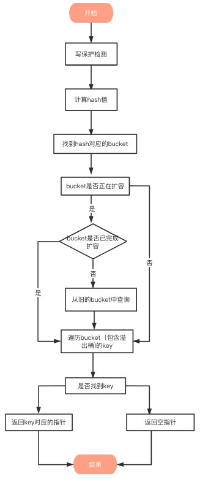

# Go 语言之 map 进阶

- [Go 语言之 map 进阶](#go-语言之-map-进阶)
  - [1.底层实现](#1底层实现)
    - [1.1 hmap](#11-hmap)
    - [1.2 bmap](#12-bmap)
    - [1.3 mapextra](#13-mapextra)
  - [2.map 遍历为什么是无序的？](#2map-遍历为什么是无序的)
  - [3.map 为什么是非线程安全的？](#3map-为什么是非线程安全的)
  - [4.map 的查找过程](#4map-的查找过程)
    - [4.1 写保护监测](#41-写保护监测)
    - [4.2 计算哈希值](#42-计算哈希值)
    - [4.3 找到 hash 对应的 bucket](#43-找到-hash-对应的-bucket)
    - [4.4 遍历 bucket 查找](#44-遍历-bucket-查找)
    - [4.5 返回 key 对应的指针](#45-返回-key-对应的指针)
  - [5.map 哈希冲突的解决方案](#5map-哈希冲突的解决方案)
  - [6.map 负载因子](#6map-负载因子)
    - [6.1 Go 1.17 及更早版本](#61-go-117-及更早版本)
    - [6.2 Go 1.18 ~ 1.20](#62-go-118--120)
  - [7.map 扩容](#7map-扩容)
    - [7.1 扩容机制](#71-扩容机制)
    - [7.2 扩容函数](#72-扩容函数)

## 1.底层实现

map 是一个指针，指向 `hmap` 结构体。

### 1.1 hmap

```go
// $GOROOT/src/runtime/map.go
type hmap struct {
    count     int     // 代表哈希表中的元素个数，调用 len(map) 时，返回的就是该字段值。
    flags     uint8   // 状态标志（是否处于正在写入的状态等）
    B         uint8   // buckets 的对数。如果 B = 5，则 buckets 数组的长度 = 2^B = 32，意味着有 32 个桶。
    noverflow uint16  // 溢出桶的数量
    hash0     uint32  // 生成 hash 的随机数种子

    // 指向 buckets 数组的指针，数组大小为 2^B，如果元素个数为 0，它为 nil。
    // buckets 数组中每个元素都是 bmap 结构
    buckets    unsafe.Pointer
    // 如果发生扩容，oldbuckets 是指向老的 buckets 数组的指针，
    // 老的 buckets 数组大小是新的 buckets 的 1/2，
    // 非扩容状态下，它为 nil。
    oldbuckets unsafe.Pointer
    nevacuate  uintptr        // 表示扩容进度，小于此地址的 buckets 代表已搬迁完成。

    extra *mapextra // 存储一些额外信息。
}
```

`hmap` 的 `bucket` 字段也是一个指针，指向的是底层的 `bmap` 数组。

### 1.2 bmap

```go
// $GOROOT/src/runtime/map.go
// A bucket for a Go map.
type bmap struct {
    // 长度为 8 的数组
    // 用来快速定位 key 是否在这个 bmap 中
    // 一个桶最多有 8 个槽位，如果 key 计算出来的 tophash 值在 tophash 数组中，则代表该 key 在这个桶中
    tophash [bucketCnt]uint8
}
```

每个 `bmap` 底层都采用链表结构。`bmap` 就是我们常说的“桶”，一个桶里面会最多装 8 个 key，这些 key 之所以会落入同一个桶，是因为它们经过哈希计算后，哈希结果的低 `B` 位是相同的。在桶内，又会根据 key 计算出来的 hash 值的高 8 位来决定 key 到底落入桶内的哪个位置（一个桶内最多有 8 个位置）。也就是说，`tophash` 字段存储了 key 哈希值的高 8 位。

此外，`tophash` 字段还会存储一些状态值，用来表明当前桶单元状态，这些状态值都是小于 `minTopHash`。

为了避免 key 哈希值的高 8 位值和这些状态值相等，产生混淆情况，所以当 key 哈希值高 8 位小于 `minTopHash` 时候，自动将其值加上 `minTopHash` 作为该 key 的 tophash。桶单元的状态值如下：

```go
// $GOROOT/src/runtime/map.go
emptyRest      = 0 // 表明此桶单元为空，且更高索引的单元也是空
emptyOne       = 1 // 表明此桶单元为空
evacuatedX     = 2 // 用于表示扩容迁移到新桶前半段区间
evacuatedY     = 3 // 用于表示扩容迁移到新桶后半段区间
evacuatedEmpty = 4 // 用于表示此单元已迁移
minTopHash     = 5 // key 的 tophash 值与桶状态值分割线值，小于此值的一定代表着桶单元的状态，大于此值的一定是 key 对应的 tophash 值

// tophash calculates the tophash value for hash.
func tophash(hash uintptr) uint8 {
    top := uint8(hash >> (goarch.PtrSize*8 - 8))
    if top < minTopHash {
        top += minTopHash
    }
    return top
}
```

在实际运行过程中，`bmap` 由 `tophash` 和连续的键、值数组组成，每个键值对占用一个槽位。`overflow` 存储的是指向溢出桶的指针，使用 `uintptr` 类型而非 `*bmap` 是为了避免被 GC 扫描到。类似于这样：

```go
type bmap struct {
    tophash  [8]uint8
    keys     [8]keytype  // 对应的键类型
    values   [8]elemtype // 对应的值类型
    overflow uintptr
}
```


注意到 key 和 value 是各自放在一起的，并不是 key/value/key/value/... 这样的形式，当 key 和 value 类型不一样的时候，key 和 value 占用字节大小不一样，使用 key/value 这种形式可能会因为内存对齐导致内存空间浪费，所以 Go 采用 key 和 value 分开存储的设计，更节省内存空间。

### 1.3 mapextra

当 map 的 key 和 value 都不是指针类型时候，`bmap` 将完全不包含指针，那么 gc 时候就不用扫描 `bmap`。`bmap` 指向溢出桶的字段 `overflow` 是 `uintptr` 类型，为了防止这些 `overflow` 桶被 gc 掉，所以需要 `mapextra.overflow` 将它保存起来。如果 `bmap` 的 `overflow` 是 `*bmap` 类型，那么 gc 扫描的是一个个链表，效率明显不如直接扫描一段内存（hmap.mapextra.overflow）。

```go
// $GOROOT/src/runtime/map.go
type mapextra struct {
    overflow     *[]*bmap // 指向 hmap.buckets 的溢出桶链表的指针
    oldoverflow  *[]*bmap // 指向 hmap.oldbuckets 的溢出桶链表的指针
    nextOverflow *bmap    // 指向空闲的溢出桶指针
}
```

## 2.map 遍历为什么是无序的？

主要原因有 2 点：

+ map 在遍历时，并不是从固定的 0 号 bucket 开始遍历的，每次遍历，都会从一个随机值序号的 bucket，再从其中随机的 cell 开始遍历；
+ map 遍历时，是按需遍历 bucket，同时按需遍历 bucket 中和其 overflow bucket 中的 cell。但是 map 在扩容后，会发生 key 的搬迁，这造成原来落在一个 bucket 中的 key，搬迁后，有可能会落到其他 bucket 中了，从这个角度看，遍历 map 的结果就不可能是按照原来的顺序了。

要实现一个有序的 map，可以先用 slice 将 map 的 key 存起来并进行排序，之后遍历 slice 即可：

```go
m := map[int]string{1: "a", 2: "b", 3: "c"}

var s []int
for k := range m {
    s = append(sl, k)
}
sort.Ints(sl)

for _, k := range sl {
		fmt.Println(k, m[k])
}
```

## 3.map 为什么是非线程安全的？

map 默认是并发不安全的，同时对 map 进行并发读写时，程序会 panic，原因如下：

Go 官方在经过了长时间的讨论后，认为 map 更应适配典型使用场景（不需要从多个 goroutine 中进行安全访问），而不是为了小部分情况（并发访问），导致大部分程序付出加锁代价（性能），决定了不支持。

要实现 map 线程安全，有 2 种方式：

+ 使用 map + 锁
+ 使用 `sync.Map`

## 4.map 的查找过程



### 4.1 写保护监测

首先会检查 map 的标志位 `flags`。如果 `flags` 的写标志位此时被置 1 了，说明有其他协程在执行“写”操作，进而导致程序 fatal，这也说明了 map 不是线程安全的。

```go
// $GOROOT/src/runtime/map.go
if h.flags&hashWriting != 0 {
		fatal("concurrent map read and map write")
}
```

### 4.2 计算哈希值

```go
// $GOROOT/src/runtime/map.go
hash := t.hasher(key, uintptr(h.hash0))
```

key 经过哈希函数计算后，得到的哈希值如下（主流 64 位机下共 64 个 bit 位），不同类型的 key 会有不同的 hash 函数。

```
10010111 | 000011110110110010001111001010100010010110010101010 │ 01010
```

### 4.3 找到 hash 对应的 bucket

还记得我们前面讲的吗，bucket 存储了**哈希值的低 B 个 bit 位**，用来定位 key 所存放的 bucket。

如果当前正在扩容中，并且定位到的旧 bucket 数据还未完成迁移，则使用旧的 bucket（扩容前的 bucket）。

```go
// $GOROOT/src/runtime/map.gp

// 计算哈希值，其中 t.hasher 是哈希函数，key 是键的指针，uintptr(h.hash0) 是一个哈希种子。
hash := t.hasher(key, uintptr(h.hash0))

// 计算桶掩码，bucketMask 函数返回值为 h.B 的二进制表示中最后 h.B 位的掩码。
m := bucketMask(h.B)

// 计算桶的地址，并将其转换为 bmap 类型指针。
// 其中 add 函数用于将两个指针相加，(hash&m) 是进行哈希取模的操作，t.bucketsize 是每个桶的大小。
b := (*bmap)(add(h.buckets, (hash&m)*uintptr(t.bucketsize)))

// 如果当前 map 正在进行扩容，并且新旧两个 map 桶的大小不相同，则需要额外处理。
if c := h.oldbuckets; c != nil {
    if !h.sameSizeGrow() {
        // 新旧两个 map 桶的大小比例为 2:1，因此原来的桶掩码 m 需要再右移一位，变成原来的一半。
        m >>= 1
    }
    // 根据计算出的桶地址和掩码，计算出旧 map 的对应桶地址 oldb。
    oldb := (*bmap)(add(c, (hash&m)*uintptr(t.bucketsize)))
    // 如果这个旧桶已经被迁移到新的桶中，则不使用它，否则将其作为当前桶。
    if !evacuated(oldb) {
        b = oldb
    }
}
```

### 4.4 遍历 bucket 查找

`tophash` 值定位：**哈希值的高 8 个 bit 位**，用来快速判断 key 是否已在当前 bucket 中（如果不在的话，需要去 bucket 的 overflow 中查找）。

用步骤 2 中的 hash 值，得到高 8 个 bit 位，也就是 `10010111`，转化为十进制，也就是 151

```go
// $GOROOT/src/runtime/map.gp
top := tophash(hash)

// $GOROOT/src/runtime/map.gp
func tophash(hash uintptr) uint8 {
    top := uint8(hash >> (goarch.PtrSize*8 - 8))
    if top < minTopHash {
        top += minTopHash
    }
    return top
}
```

上面函数中 `hash` 是 64 位的，`goarch.PtrSize` 值是 8，所以 `top := uint8(hash >> (sys.PtrSize*8 - 8))` 等效 `top = uint8(hash >> 56)`，最后 top 取出来的值就是 hash 的高 8 位值。

在 bucket 及 bucket 的 overflow 中寻找 **tophash 值为 151 的槽位**，即为 key 所在位置，找到了空槽位或者 N 号槽位，这样整个查找过程就结束了，其中找到空槽位代表没找到。

```go
// $GOROOT/src/runtime/map.gp
bucketloop:
    // 遍历 bucket 链表
    for ; b != nil; b = b.overflow(t) {
        // 遍历每个 bucket
        for i := uintptr(0); i < bucketCnt; i++ {
            if b.tophash[i] != top {
                // 如果 tophash 值为 emptyRest，表示后续所有槽位都为空
                if b.tophash[i] == emptyRest {
                    break bucketloop
                }
                continue
            }
            // 计算出 key 的地址
            k := add(unsafe.Pointer(b), dataOffset+i*uintptr(t.keysize))
            // 如果 key 是指针类型，需要进行解引用
            if t.indirectkey() {
                k = *((*unsafe.Pointer)(k))
            }
            if t.key.equal(key, k) {
                // 计算出对应 value 的地址
                e := add(unsafe.Pointer(b), dataOffset+bucketCnt*uintptr(t.keysize)+i*uintptr(t.elemsize))
                // 如果元素是指针类型，需要进行解引用
                if t.indirectelem() {
                    e = *((*unsafe.Pointer)(e))
                }
                return e
            }
        }
    }
```


### 4.5 返回 key 对应的指针

如果通过上面的步骤找到了 key 对应的槽位下标 i，我们再分析下 key/value 值是如何获取的：

```go
// $GOROOT/src/runtime/map.gp

// keys 的偏移量
dataOffset = unsafe.Offsetof(struct{
    b bmap
    v int64
}{}.v)

// 一个bucket的元素个数
bucketCntBits = 3
bucketCnt     = 1 << bucketCntBits // 8

// key 定位公式
// bucket 里 keys 的起始地址就是 unsafe.Pointer(b) + dataOffset
// 第 i 个下标 key 的地址就要在此基础上跨过 i 个 key 的大小；
k := add(unsafe.Pointer(b), dataOffset+i*uintptr(t.keysize))

// value 定位公式
// 我们知道，value 的地址是在所有 key 之后，因此第 i 个下标 value 的地址还需要加上所有 key 的偏移。
e := add(unsafe.Pointer(b), dataOffset+bucketCnt*uintptr(t.keysize)+i*uintptr(t.elemsize))
```

## 5.map 哈希冲突的解决方案

通过前面的介绍我们可以知道，map 哈希冲突的解决方案是使用**链地址法**。不过这里的链表单元并不是一个元素，而是**桶**。

## 6.map 负载因子

> 负载因子（load factor），用于衡量当前哈希表中空间占用率的核心指标。主要目的是为了**平衡 buckets 的存储空间大小**和**查找元素时的性能高低**。

### 6.1 Go 1.17 及更早版本

默认的负载因子是 6.5。这是 Go 官方的经过认真的测试得出的数字，一起来看看官方的这份测试报告。

报告中共包含 4 个关键指标，如下：

| loadFactor | %overflow | bytes/entry | hitprobe | missprobe |
| :--: | :--: | :--: | :--: | :--: |
| 4.00 | 2.13 | 20.77 | 3.00 | 4.00 |
| 4.50 | 4.05	| 17.30	| 3.25 | 4.50 |
| 5.00 | 6.85	| 14.77	| 3.50 | 5.00 |
| 5.50 | 10.55	| 12.94	| 3.75 | 5.50 |
| 6.00 | 15.27	| 11.67	| 4.00 | 6.00 |
| 6.50 | 20.90	| 10.79	| 4.25 | 6.50 |
| 7.00 | 27.14	| 10.15	| 4.50 | 7.00 |
| 7.50 | 34.03	| 9.73	| 4.75 | 7.50 |
| 8.00 | 41.10	| 9.40	| 5.00 | 8.00 |

+ loadFactor：负载因子，也有叫装载因子。
+ %overflow：溢出率，有溢出 bukcet 的百分比。
+ bytes/entry：平均每对 key/value 的开销字节数.
+ hitprobe：查找一个存在的 key 时，要查找的平均个数。
+ missprobe：查找一个不存在的 key 时，要查找的平均个数。

Go 官方发现：**装载因子越大，填入的元素越多，空间利用率就越高，但发生哈希冲突的几率就变大。反之，装载因子越小，填入的元素越少，冲突发生的几率减小，但空间浪费也会变得更多，而且还会提高扩容操作的次数。**

根据这份测试结果和讨论，Go 官方取了一个相对适中的值，把 Go 中的 map 的负载因子硬编码为 6.5，这就是 6.5 的选择缘由。

这意味着在 Go 1.17 及更早版本中，**当 map存储的元素个数大于或等于 (6.5 * 桶个数)时，就会触发扩容行为。**

### 6.2 Go 1.18 ~ 1.20

Go 1.18 后，map 的负载因子是根据实际的哈希表性能来动态调整的。map 的负载因子调整分为两个方面：添加元素时的扩容和删除元素时的缩容。

在添加元素时的扩容阶段，当 map 中的元素个数达到当前桶数量和负载因子的乘积时，Go 的 map 实现会进行负载因子调整。具体调整步骤如下：

1. 计算当前哈希表的性能指标，主要是通过测量平均查找时间来评估；
2. 如果当前哈希表的平均查找时间小于桶的填充因子（即平均查找时间小于等于 6.5），则会增加负载因子，具体增加的比例为当前负载因子的 5%；
3. 根据新的负载因子重新计算桶的数量，保证桶的数量为 2 的幂次方。

在删除元素时的缩容阶段，当 map 中的元素个数小于当前桶数量和负载因子的乘积的一半时，会进行负载因子调整。具体调整步骤如下：

1. 计算当前哈希表的性能指标，同样是通过测量平均查找时间来评估；
2. 如果当前哈希表的平均查找时间小于桶的填充因子（即平均查找时间小于等于 6.5），则会减少负载因子。具体减少的比例为当前负载因子的 5%；
3. 根据新的负载因子重新计算桶的数量，保证桶的数量为 2 的幂次方。

## 7.map 扩容

在向 map 插入新 key 的时候，会进行条件检测，符合下面这 2 个条件，就会触发扩容：

```go
// GOROOT/src/runtime/map.go
if !h.growing() && (overLoadFactor(h.count+1, h.B) || tooManyOverflowBuckets(h.noverflow, h.B)) {
		hashGrow(t, h)
		goto again // Growing the table invalidates everything, so try again
}

// 扩容条件 1：是否正在扩容
func (h *hmap) growing() bool {
	  return h.oldbuckets != nil
}

// 扩容条件 2：超过负载，map 元素个数 > 6.5 * 桶个数
// bucketCnt = 8，一个桶可以装的最大元素个数
// loadFactor = 6.5，负载因子，平均每个桶的元素个数
// bucketShift(B): 桶的个数
func overLoadFactor(count int, B uint8) bool {
	  return count > bucketCnt && uintptr(count) > loadFactorNum*(bucketShift(B)/loadFactorDen)
}

// 扩容条件 3：溢出桶太多
// 当桶总数 < 2^15 时，如果溢出桶总数 >= 桶总数，则认为溢出桶过多。
// 当桶总数 >= 2^15 时，直接与 2^15 比较，当溢出桶总数 >= 2^15 时，即认为溢出桶太多了。
// 可以看作对条件 2 的补充，因为在负载因子比较小的情况下，有可能 map 的查找和插入效率也很低，而第 2 点识别不出来这种情况。
func tooManyOverflowBuckets(noverflow uint16, B uint8) bool {
    // If the threshold is too low, we do extraneous work.
    // If the threshold is too high, maps that grow and shrink can hold on to lots of unused memory.
    // "too many" means (approximately) as many overflow buckets as regular buckets.
    // See incrnoverflow for more details.
    if B > 15 {
      B = 15
    }
    // The compiler doesn't see here that B < 16; mask B to generate shorter shift code.
    return noverflow >= uint16(1)<<(B&15)
}
```

### 7.1 扩容机制

双倍扩容：针对条件 2，新建一个 buckets 数组，新的 buckets 大小是原来的 2 倍，然后旧 buckets 数据搬迁到新的 buckets。

等量扩容：针对条件 3，并不扩大容量，buckets 数量维持不变，重新做一遍类似双倍扩容的搬迁动作，把松散的键值对重新排列一次，使得同一个 bucket 中的 key 排列地更紧密，节省空间，提高 bucket 利用率，进而保证更快的存取。

### 7.2 扩容函数

```go
// $GOROOT/src/runtime/map.go
// 
func hashGrow(t *maptype, h *hmap) {
    // 如果达到条件 2，那么将 B 值加 1，相当于是原来的 2 倍
    // 否则对应条件 3，进行等量扩容，所以 B 不变
    bigger := uint8(1)
    if !overLoadFactor(h.count+1, h.B) {
        bigger = 0
        h.flags |= sameSizeGrow
    }
    // 记录老的buckets
    oldbuckets := h.buckets
    // 申请新的buckets空间
    newbuckets, nextOverflow := makeBucketArray(t, h.B+bigger, nil)

    // 注意 &^ 运算符，这块代码的逻辑是转移标志位
    flags := h.flags &^ (iterator | oldIterator)
    if h.flags&iterator != 0 {
        flags |= oldIterator
    }
    // commit the grow (atomic wrt gc)
    // 提交 grow
    h.B += bigger
    h.flags = flags
    h.oldbuckets = oldbuckets
    h.buckets = newbuckets
    // 搬迁进度为 0
    h.nevacuate = 0
    // 溢出桶数量为 0
    h.noverflow = 0

    // 如果发现 hmap 是通过 extra 字段来存储溢出桶时
    if h.extra != nil && h.extra.overflow != nil {
        // Promote current overflow buckets to the old generation.
        if h.extra.oldoverflow != nil {
            throw("oldoverflow is not nil")
        }
        h.extra.oldoverflow = h.extra.overflow
        h.extra.overflow = nil
    }
    if nextOverflow != nil {
        if h.extra == nil {
            h.extra = new(mapextra)
        }
        h.extra.nextOverflow = nextOverflow
    }

    // the actual copying of the hash table data is done incrementally
    // by growWork() and evacuate().
}
```

上面的 `hashGrow()` 函数实际上并没有真正地“搬迁”，它只是分配好了新的 buckets，并将老的 buckets 挂到了 oldbuckets 字段上。真正搬迁 buckets 的动作在 `growWork()` 函数中，而调用 `growWork()` 函数的动作是在 mapassign 和 mapdelete 函数中。也就是插入或修改、删除 key 的时候，都会尝试进行搬迁 buckets 的工作。先检查 oldbuckets 是否搬迁完毕，具体来说就是检查 oldbuckets 是否为 nil。

由于 map 扩容需要将原有的 key/value 重新搬迁到新的内存地址，如果 map 存储了数以亿计的 key/value，一次性搬迁将会造成比较大的延时，因此 Go map 的扩容采取了一种称为**渐进式**的方式，原有的 key 并不会一次性搬迁完毕，每次最多只会搬迁 2 个 bucket。

```go
func growWork(t *maptype, h *hmap, bucket uintptr) {
    // 为了确认搬迁的 bucket 是我们正在使用的 bucket
    // 即如果当前 key 映射到旧的 bucket，那么就搬迁该 bucket。
    evacuate(t, h, bucket&h.oldbucketmask())

    // 如果还未完成扩容工作，则再搬迁一个bucket。
    if h.growing() {
        evacuate(t, h, h.nevacuate)
    }
}
```