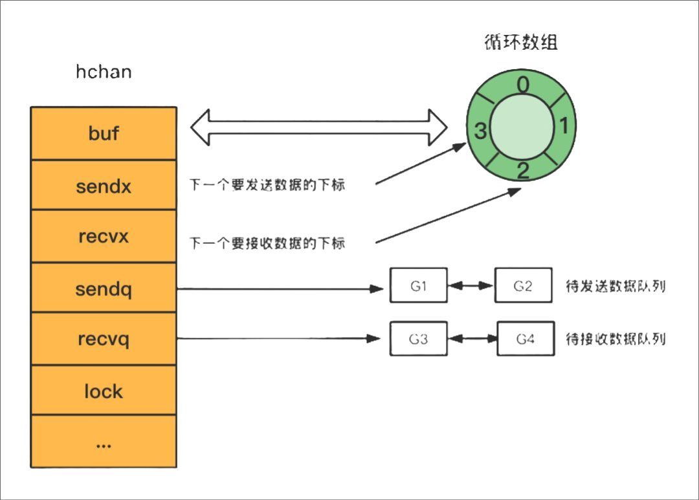

# Go 语言之 channel 进阶（上）

- [Go 语言之 channel 进阶（上）](#go-语言之-channel-进阶上)
  - [1.底层实现](#1底层实现)
    - [1.1 hchan](#11-hchan)
    - [1.2 sudog](#12-sudog)
  - [2.执行基本操作时的底层操作](#2执行基本操作时的底层操作)
    - [2.1 创建](#21-创建)
    - [2.2 发送](#22-发送)
    - [2.3 接收](#23-接收)
    - [2.4 关闭](#24-关闭)

channel（通道）用于 goroutine（协程）之间的通信。它提供了一种在不同协程之间传递数据的机制。channel 是一种类型安全的、阻塞的、先进先出（FIFO）的数据结构，确保发送的数据按照发送的顺序接收。

Go 语言提倡通过通信来共享内存，而不是通过共享内存来通信，CSP(Communicating Sequential Process)并发模型，就是通过 goroutine 和 channel 来实现的。

## 1.底层实现

### 1.1 hchan

通过 `var` 声明或者 `make` 函数创建的 `channel` 变量是一个存储在函数栈帧上的指针，指向堆上的 `hchan` 结构体。

```go
// src/runtime/chan.go

type hchan struct {
    qcount   uint     // 循环数组中的元素数量
    dataqsiz uint     // 循环数组的长度
    // channel 分为无缓冲和有缓冲两种。
    // 对于有缓冲的 channel 存储数据，使用了 ring buffer（环形缓冲区）来缓存写入的数据，本质是循环数组。
    // 为什么是循环数组？普通数组不行吗？普通数组容量固定，更适合指定的空间，弹出元素时，普通数组需要全部都前移。
    buf      unsafe.Pointer // 指向底层循环数组的指针（环形缓冲区）
    elemsize uint16   // 元素的大小
    closed   uint32   // channel是否关闭的标志
    elemtype *_type   // channel中的元素类型
    // 当下标超过数组容量后会回到第一个位置，所以需要有两个字段记录当前读和写的下标位置
    sendx    uint           // 下一次写下标的位置
    recvx    uint           // 下一次读下标的位置    
    // 尝试读/写 channel 被阻塞的 goroutine
    recvq    waitq  // 读等待队列
    sendq    waitq  // 写等待队列

    lock mutex //互斥锁，保证读写 channel 时不存在并发竞争问题
}
```



### 1.2 sudog

等待队列是**双向链表**结构，每个节点是一个 `sudog` 结构体变量，记录哪个协程在等待，等待的是哪个 channel，等待发送/接收的数据在哪里。

```go
// $GOROOT/src/runtime/chan.go

type waitq struct {
    first *sudog
    last  *sudog
}

type sudog struct {
    g *g

    next *sudog
    prev *sudog
    elem unsafe.Pointer 
    
    ...

    c *hchan 
}
```

## 2.执行基本操作时的底层操作

### 2.1 创建

当我们使用 `make(chan T, cap)` 来创建 channel 时，`make` 语法会在编译时转换为 `makechan64` 和 `makechan`：

```go
// $GOROOT/src/runtime/chan.go

func makechan64(t *chantype, size int64) *hchan {
    // 确保将 size 转换为 int 类型后与原始值相等，否则引发 panic
    if int64(int(size)) != size {
        panic(plainError("makechan: size out of range"))
    }

    return makechan(t, int(size))
}

func makechan(t *chantype, size int) *hchan {
    // 获取元素类型
    elem := t.elem

    // 编译器已经检查了这一点，但是为了安全起见再次进行检查
    // 如果元素大小大于等于 1<<16（65536），则抛出错误
    if elem.size >= 1<<16 {
        throw("makechan: invalid channel element type")
    }
    // 检查 hchanSize 是否能被 maxAlign 整除，或者 elem.align 是否大于 maxAlign
    if hchanSize%maxAlign != 0 || elem.align > maxAlign {
        throw("makechan: bad alignment")
    }

    // 计算所需的内存大小
	mem, overflow := math.MulUintptr(elem.size, uintptr(size))
    // 检查是否溢出、所需内存是否超过 maxAlloc - hchanSize 或者 size 是否小于 0
	if overflow || mem > maxAlloc-hchanSize || size < 0 {
		panic(plainError("makechan: size out of range"))
	}

	// 创建 hchan 指针
	var c *hchan
	switch {
	case mem == 0:
		// 队列或元素大小为 0：分配 hchan 的内存
		c = (*hchan)(mallocgc(hchanSize, nil, true))
		// 设置 buf 用于与竞争检测器同步
		c.buf = c.raceaddr()
	case elem.ptrdata == 0:
		// 元素不包含指针
        // 一次性分配 hchan 和 buf 的内存
		c = (*hchan)(mallocgc(hchanSize+mem, nil, true))
		c.buf = add(unsafe.Pointer(c), hchanSize)
	default:
		// 元素包含指针：创建 hchan，然后分配 buf 的内存
		c = new(hchan)
		c.buf = mallocgc(mem, elem, true)
	}

    // 设置 hchan 的属性
	c.elemsize = uint16(elem.size)
	c.elemtype = elem
	c.dataqsiz = uint(size)
	lockInit(&c.lock, lockRankHchan)

    // 调试信息，如果启用了 debugChan
	if debugChan {
		print("makechan: chan=", c, "; elemsize=", elem.size, "; dataqsiz=", size, "\n")
	}
	return c
}
```

总结一下，创建时会做如下检查：

+ 元素大小不能超过 65536 字节，也即 64K；
+ 元素的对齐大小不能超过 `maxAlign` 也即 8 字节；
+ 计算出来的所需内存不能超过限制；

创建时的策略：

+ 如果是无缓冲 channel，则直接给 `hchan` 分配内存；
+ 如果是有缓冲 channel，并且元素不包含指针，那么会为 `hchan` 和底层数组分配一段连续的内存；
+ 如果是有缓冲 channel，并且元素包含指针，那么会为 `hchan` 和底层数组分别分配内存。

### 2.2 发送

发送操作在编译时转换为 `chansend` 函数：

`chansend` 接收 4 个参数：

+ `c` 是一个指向 `hchan` 类型的指针，表示要接收数据的通道；
+ `ep` 是一个 `unsafe.Pointer` 类型的指针，用于接收接收到的数据；
+ `block` 表示接收操作的模式。如果 `block` 为 `true`，为阻塞模式，即发送操作将会阻塞，直到有接收者接收元素；如果 `block` 为 `false`，为非阻塞模式，即发送操作不会阻塞，如果通道已满，发送操作会立即返回；
+ `callerpc`：发送操作的调用者的程序计数器值。

```go
// $GOROOT/src/runtime/chan.go

func chansend(c *hchan, ep unsafe.Pointer, block bool, callerpc uintptr) bool {
    // 如果 c 为 nil，则说明发送到 nil 通道，根据是否阻塞选择是否触发 panic 或进入等待状态
    if c == nil {
		if !block {
			return false
		}
		gopark(nil, nil, waitReasonChanSendNilChan, traceEvGoStop, 2)
		throw("unreachable")
	}

    // debug
    if debugChan {
		print("chansend: chan=", c, "\n")
	}

    // 如果启用了竞争检测，则进行读取操作的 race 检测
    if raceenabled {
		racereadpc(c.raceaddr(), callerpc, abi.FuncPCABIInternal(chansend))
	}

    // 一条捷径：可以用来在不获取锁的前提下，快速判断非阻塞发送操作是否可行；
    // !block 为 true 则说明是非阻塞操作；
    // c.closed == 0：通道未关闭
    // full(c)：channel 已满
    if !block && c.closed == 0 && full(c) {
		return false
	}

    var t0 int64
    if blockprofilerate > 0 {
        t0 = cputicks()
    }

    lock(&c.lock)

    // 如果通道已关闭，则释放锁并引发 panic
    if c.closed != 0 {
        unlock(&c.lock)
        panic(plainError("send on closed channel"))
    }

    // 尝试从接收等待队列中取出一个等待的接收者
    if sg := c.recvq.dequeue(); sg != nil {
        // 找到了等待的接收者，直接将待发送的值传递给接收者，绕过通道缓冲区（如果有）
        send(c, sg, ep, func() { unlock(&c.lock) }, 3)
        return true
    }

    // 如果通道缓冲区中有空间，则将元素加入通道缓冲区
    if c.qcount < c.dataqsiz {
        // 在通道缓冲区中有空间，将元素加入通道缓冲区
        qp := chanbuf(c, c.sendx)
        if raceenabled {
            racenotify(c, c.sendx, nil)
        }
        typedmemmove(c.elemtype, qp, ep)
        c.sendx++
        if c.sendx == c.dataqsiz {
            c.sendx = 0
        }
        c.qcount++
        unlock(&c.lock)
        return true
    }

    // 如果不阻塞，则释放锁并返回 false
    if !block {
        unlock(&c.lock)
        return false
    }

    // 在通道上进行阻塞，等待某个接收者完成我们的操作
    gp := getg()
    mysg := acquireSudog()
    mysg.releasetime = 0
    if t0 != 0 {
        mysg.releasetime = -1
    }
    // 在将 mysg 排队到 gp.waiting 之前，确保在 gp.waiting 上分配 elem 并将其排队，以便 copystack 可以找到它
    mysg.elem = ep
    mysg.waitlink = nil
    mysg.g = gp
    mysg.isSelect = false
    mysg.c = c
    gp.waiting = mysg
    gp.param = nil
    c.sendq.enqueue(mysg)
    // 向任何尝试收缩我们堆栈的人发出信号，我们即将在通道上停放。
    // 当此 G 的状态发生变化并且我们设置 gp.activeStackChans 之间的窗口对于堆栈收缩是不安全的。
    atomic.Store8(&gp.parkingOnChan, 1)
    gopark(chanparkcommit, unsafe.Pointer(&c.lock), waitReasonChanSend, traceEvGoBlockSend, 2)
    // 确保被发送的值保持活动状态，直到接收者将其复制出来。
    // sudog 具有指向堆栈对象的指针，但 sudog 不被视为堆栈跟踪器的根。
    KeepAlive(ep)

    // 有人唤醒了我们
    if mysg != gp.waiting {
        throw("G waiting list is corrupted")
    }
    gp.waiting = nil
    gp.activeStackChans = false
    closed := !mysg.success
    gp.param = nil
    if mysg.releasetime > 0 {
        blockevent(mysg.releasetime-t0, 2)
    }
    mysg.c = nil
    releaseSudog(mysg)
    if closed {
        if c.closed == 0 {
            throw("chansend: spurious wakeup")
        }
        panic(plainError("send on closed channel"))
    }
    return true
}
```

向 channel 中发送数据时大概分为两大块：检查和数据发送，数据发送流程如下：

+ 如果 channel 的读等待队列存在接收者 goroutine：
  + 将数据直接发送给第一个等待的 goroutine，唤醒接收的 goroutine；
+ 如果 channel 的读等待队列不存在接收者 goroutine：
  + 如果循环数组 buf 未满，那么将会把数据发送到循环数组 buf 的队尾；
  + 如果循环数组 buf 已满，这个时候就会走阻塞发送的流程，将当前 goroutine 加入写等待队列，并挂起等待唤醒。

### 2.3 接收

接收操作在编译时转换为 `chanrecv` 函数。

`chanrecv` 的参数跟 `chansend` 几乎一致，返回值有 2 个，分别是 `selected`，`received`。`selected` 表示是否执行了接收操作，`received` 表示是否成功收到了数据。

+ 如果 `selected = false`：表示没有进行接收操作；
+ 如果 `selected = true`：表示进行了接收操作：
  + 如果 `received = false`：表示虽然接收操作成功，但没有接收到实际的数据；
  + 如果 `received = true`：表示接收操作成功，并且接收到实际的数据；

```go
// $GOROOT/src/runtime/chan.go

// chanrecv 从通道 c 接收数据并将接收到的数据写入 ep。
// ep 可能为 nil，这种情况表示忽略接收到的数据。
// 如果 block == false （非阻塞模式）并且通道中没有元素可用，返回 (false, false)。
// 否则，如果 c 已关闭，则将 *ep 清零并返回 (true, false)。
// 否则，将 *ep 填充为一个元素并返回 (true, true)。
// 非空的 ep 必须指向堆或调用者的栈。
func chanrecv(c *hchan, ep unsafe.Pointer, block bool) (selected, received bool) {
    // raceenabled: 不需要检查 ep，因为它始终在栈上或由 reflect 分配的新内存。

    if debugChan {
		print("chanrecv: chan=", c, "\n")
	}

    if c == nil {
        // c 是 nil，非阻塞模式返回 (false, false)。
		if !block {
			return
		}
		gopark(nil, nil, waitReasonChanReceiveNilChan, traceEvGoStop, 2)
		throw("unreachable")
	}

    // 快速路径：在不获取锁的情况下检查失败的非阻塞操作。
    if !block && empty(c) {
        // 在观察到 channel 没有准备好接收操作之后，我们观察 channel 是否已经关闭。
        //
        // 重新排序这些检查可能导致与关闭冲突时出现错误的行为。
        // 例如，如果 channel 是打开的且不为空，被关闭，然后被耗尽，重新排序后的读取可能错误地指示“打开且为空”。
        // 为了防止重新排序，我们对这两种检查都使用原子加载，并依赖清空和关闭发生在同一锁下的不同临界区。
        // 当关闭带有阻塞发送的无缓冲 channel 时，此假设失败，但无论如何这是一个错误条件。
		if atomic.Load(&c.closed) == 0 {
            // 由于 channel 不可重新打开，所以最近一次观察到 channel 没有关闭也就意味着第一次观察时也没有关闭。
            // 我们的行为就好像我们在那个时刻观察到了 channel，并报告接收无法继续。
            // 
            // channel 没有关闭，直接返回 (false, false)。
			return
		}
		// Sequential consistency is also required here, when racing with such a send.

        // channel 的关闭是不可逆的。这里重新检查 channel 是否有任何待接收的数据，是因为这些数据可能在上述判空和关闭检查之间到达。
        // 这里需要顺序一致性，当出现发送竞争时。
		if empty(c) {
			// channel 不可逆地关闭且为空。
			if raceenabled {
				raceacquire(c.raceaddr())
			}
			if ep != nil {
				typedmemclr(c.elemtype, ep)
			}
			return true, false
		}
	}

    var t0 int64
	if blockprofilerate > 0 {
		t0 = cputicks()
	}

    lock(&c.lock)

    // 如果 channel 关闭，并且 channel 中没有元素，那么返回 (true, false)。
    if c.closed != 0 && c.qcount == 0 {
		if raceenabled {
			raceacquire(c.raceaddr())
		}
		unlock(&c.lock)
		if ep != nil {
			typedmemclr(c.elemtype, ep)
		}
		return true, false
	}

    // 如果发送队列存在发送者，返回 (true, true)。
	if sg := c.sendq.dequeue(); sg != nil {
        // 找到一个等待的发送者。如果缓冲区大小为 0，则直接接收该发送者的值。
        // 否则，从队列头部接收，并将发送者的值添加到队列的尾部（两者都映射到相同的缓存槽，因为队列已满）。
		recv(c, sg, ep, func() { unlock(&c.lock) }, 3)
		return true, true
	}

    // 如果 channel 有缓冲数据，则直接从队列中接收数据，然后返回 (true, true)。
    if c.qcount > 0 {
		// 直接从队列接收
		qp := chanbuf(c, c.recvx)
		if raceenabled {
			racenotify(c, c.recvx, nil)
		}
		if ep != nil {
			typedmemmove(c.elemtype, ep, qp)
		}
		typedmemclr(c.elemtype, qp)
		c.recvx++
		if c.recvx == c.dataqsiz {
			c.recvx = 0
		}
		c.qcount--
		unlock(&c.lock)
		return true, true
	}

    // 如果为非阻塞，此时没有数据可用，返回 (false, false)。
    if !block {
		unlock(&c.lock)
		return false, false
	}

    // 没有可用的发送者：在该 channel 上阻塞。
    gp := getg()           // 获取当前的 goroutine
	mysg := acquireSudog() 
	mysg.releasetime = 0
	if t0 != 0 {
		mysg.releasetime = -1
	}
    // 在 gp.waiting 上分配 elem 和将 mysg 入队之间没有栈分割，
    // 这样 copystack 可以找到它。
	mysg.elem = ep
	mysg.waitlink = nil
	gp.waiting = mysg
    // sudog 节点记录 goroutine。
	mysg.g = gp
	mysg.isSelect = false
    // 记录等待的 channel。
	mysg.c = c
	gp.param = nil
    // 将自己的 sudog（等待节点）放入通道的接收队列中。
	c.recvq.enqueue(mysg)
    // 向任何试图缩小我们的栈的人发出信号，表明我们将要在一个通道上停靠。
    // 当这个 G 的状态发生变化和我们设置 gp.activeStackChans 之间的窗口对于堆栈收缩是不安全的。
	atomic.Store8(&gp.parkingOnChan, 1)
	gopark(chanparkcommit, unsafe.Pointer(&c.lock), waitReasonChanReceive, traceEvGoBlockRecv, 2)

    // 有人唤醒了我们
	if mysg != gp.waiting {
		throw("G waiting list is corrupted")
	}
    gp.waiting = nil
	gp.activeStackChans = false
	if mysg.releasetime > 0 {
		blockevent(mysg.releasetime-t0, 2)
	}
	success := mysg.success
	gp.param = nil
	mysg.c = nil
	releaseSudog(mysg)
	return true, success
}
```

我们简单总结下阻塞式数据接收流程：

+ 如果 channel 的写等待队列存在发送者 goroutine：
  + 如果是无缓冲 channel，**直接**从第一个发送者 goroutine 那里把数据拷贝给接收变量，**唤醒发送的 goroutine**；
  + 如果是有缓冲 channel（已满），将循环数组 buf 的队首元素拷贝给接收变量，将第一个发送者 goroutine 的数据拷贝到 buf 循环数组队尾，**唤醒发送的 goroutine**；
+ 如果 channel 的写等待队列不存在发送者 goroutine：
  + 如果循环数组 buf 非空，将循环数组 buf 的队首元素拷贝给接收变量；
  + 如果循环数组 buf 为空，这个时候就会走阻塞接收的流程，将当前 goroutine 加入读等待队列，并**挂起等待唤醒**。

### 2.4 关闭

关闭操作在编译时转换为 `closechan` 函数。

```go
// $GOROOT/src/runtime/chan.go

func closechan(c *hchan) {
	if c == nil {
		panic(plainError("close of nil channel"))
	}

    // 获取 channel 的锁。
	lock(&c.lock)
    // 如果通道已关闭，则 panic。
	if c.closed != 0 {
		unlock(&c.lock)
		panic(plainError("close of closed channel"))
	}

    // 如果开启了竞争检测，则记录竞争检测信息。
	if raceenabled {
		callerpc := getcallerpc()
		racewritepc(c.raceaddr(), callerpc, abi.FuncPCABIInternal(closechan))
		racerelease(c.raceaddr())
	}

    // 关闭通道
	c.closed = 1

	var glist gList

	// 释放所有的接收者
	for {
        // 从接收者队列中出队一个等待的接收者
		sg := c.recvq.dequeue()
		if sg == nil {
			break
		}
		if sg.elem != nil {
            // 清空接收者携带的元素值
			typedmemclr(c.elemtype, sg.elem)
			sg.elem = nil
		}
		if sg.releasetime != 0 {
            // 设置释放时间为当前 CPU 时间
			sg.releasetime = cputicks()
		}
		gp := sg.g
		gp.param = unsafe.Pointer(sg)
		sg.success = false
		if raceenabled {
			raceacquireg(gp, c.raceaddr())
		}
        // 将接收者的 goroutine 添加到待唤醒列表中
		glist.push(gp)
	}

	// 释放所有的发送者（它们将会 panic）
	for {
		sg := c.sendq.dequeue()
		if sg == nil {
			break
		}
		sg.elem = nil
		if sg.releasetime != 0 {
			sg.releasetime = cputicks()
		}
		gp := sg.g
		gp.param = unsafe.Pointer(sg)
		sg.success = false
		if raceenabled {
			raceacquireg(gp, c.raceaddr())
		}
		glist.push(gp)
	}
	unlock(&c.lock)

	// 在释放通道锁之后，唤醒所有的 goroutine。
	for !glist.empty() {
		gp := glist.pop()
		gp.schedlink = 0
		goready(gp, 3)
	}
}
```