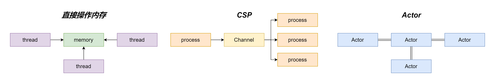

# Go 语言之 channel 进阶（下）

- [Go 语言之 channel 进阶（下）](#go-语言之-channel-进阶下)
  - [1.对不同状态的 channel 操作一览表](#1对不同状态的-channel-操作一览表)
  - [2.channel 是通过什么保证线程安全的？](#2channel-是通过什么保证线程安全的)
  - [3.使用 channel 来共享内存有什么优缺点？](#3使用-channel-来共享内存有什么优缺点)
  - [4.channel 死锁场景](#4channel-死锁场景)
    - [4.1 无缓冲 channel 在一个 goroutine 同时读写](#41-无缓冲-channel-在一个-goroutine-同时读写)
    - [4.2 无缓冲 channel 先写后读/只写不读](#42-无缓冲-channel-先写后读只写不读)
    - [4.3 有缓冲 channel 缓存继续写入数据](#43-有缓冲-channel-缓存继续写入数据)
    - [4.4 多个 goroutine 互相等待](#44-多个-goroutine-互相等待)
    - [4.5 直接读取空 channel（不存在对 channel 的写入操作）](#45-直接读取空-channel不存在对-channel-的写入操作)

在[上篇文章](./003_channel-1.md)我们分析了 channel 的源码，这篇文章我们来看看 channel 的常见问题。

## 1.对不同状态的 channel 操作一览表

|  | 未初始化 | 关闭 | 正常 |
| :-: | :-: | :-: | :-: |
| 关闭 | `panic: close of nil channel` | `panic: close of closed channel` | 正常关闭 |
| 发送 | 永远阻塞导致死锁 | panic | 阻塞或者成功发送 |
| 接收 | 永远阻塞导致死锁 | 缓冲区为空则为零值，否则可以继续读 | 阻塞或者成功接收 |

## 2.channel 是通过什么保证线程安全的？

从 `hchan` 的结构上可以知道，再对循环数组 `buf` 中的数据进行操作时，必须先获取互斥锁。

```go
// src/runtime/chan.go

type hchan struct {
    ...

    lock mutex //互斥锁，保证读写 channel 时不存在并发竞争问题
}
```

## 3.使用 channel 来共享内存有什么优缺点？

**“不要通过共享内存来通信，应该使用通信来共享内存”** 这句话想必大家已经非常熟悉了。

无论是通过共享内存来通信还是通过通信来共享内存，最终我们应用程序都是读取的内存当中的数据，只是前者是直接读取内存的数据，而后者是通过发送消息的方式来进行同步。而通过发送消息来同步的这种方式常见的就是 Go 采用的 CSP（Communication Sequential Process）模型以及 Erlang 采用的 Actor 模型，这两种方式都是通过通信来共享内存。



大部分的语言采用的都是第一种方式直接去操作内存，然后通过互斥锁，CAS 等操作来保证并发安全。Go 引入了 channel 和 goroutine 实现 CSP 模型将生产者和消费者进行了解耦，channel 其实和消息队列很相似。而 Actor 模型和 CSP 模型都是通过发送消息来共享内存，但是它们之间最大的区别就是 Actor 模型当中并没有一个独立的 Channel 组件，而是 Actor 与 Actor 之间直接进行消息的发送与接收，每个 Actor 都有一个本地的“信箱”消息都会先发送到这个“信箱”当中。

优点：

+ 简单易用，可读性强；
+ 使用 channel 可以帮助我们解耦生产者和消费者，可以降低并发当中的耦合；
+ channel 底层实现包含了互斥锁和条件变量等同步机制，能够避免数据竞争和其他并发问题。

缺点：

+ 性能影响：channel 在进行通信时会涉及到内存分配、复制和同步等操作，这些操作会带来一定的性能开销，尤其是在大量数据传输的情况下；
+ 可能存在死锁的情况。

## 4.channel 死锁场景

这里指的是抛出了 `fatal error: all goroutines are asleep - deadlock!`。

### 4.1 无缓冲 channel 在一个 goroutine 同时读写

```go
package main

func main() {
	ch := make(chan int)
	ch <- 1
	_ = <-ch
}
```

### 4.2 无缓冲 channel 先写后读/只写不读

```go
package main

func main() {
	ch := make(chan int)
	ch <- 1

	go func() {
		_ = <-ch
	}()
}
```

### 4.3 有缓冲 channel 缓存继续写入数据

```go
package main

func main() {
	ch := make(chan int, 2)
	ch <- 1
	ch <- 2
	ch <- 3
}
```

### 4.4 多个 goroutine 互相等待

```go
package main

import (
	"sync"
)

func main() {
	var wg sync.WaitGroup
	ch1 := make(chan int)
	ch2 := make(chan int)

	wg.Add(2)

	go func() {
		defer wg.Done()
		value := <-ch1
		ch2 <- value * 2
	}()

	go func() {
		defer wg.Done()
		value := <-ch2
		ch1 <- value * 2
	}()

	ch1 <- 1
	wg.Wait()
}
```

### 4.5 直接读取空 channel（不存在对 channel 的写入操作）

```go
package main

import "fmt"

func main() {
	ch1 := make(chan int)
	fmt.Println(<-ch1)

	ch2 := make(chan int, 2)
	fmt.Println(<-ch2)
}
```