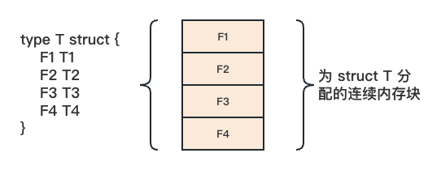
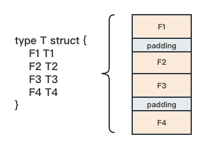
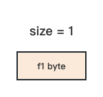
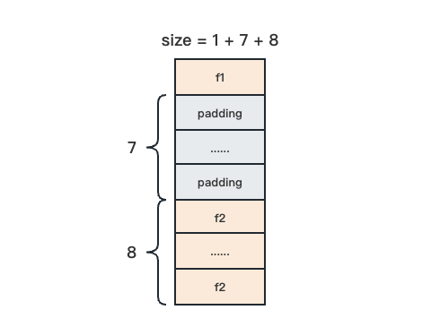
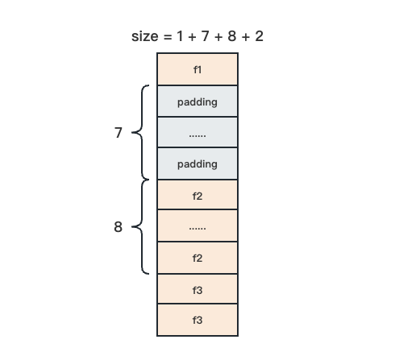
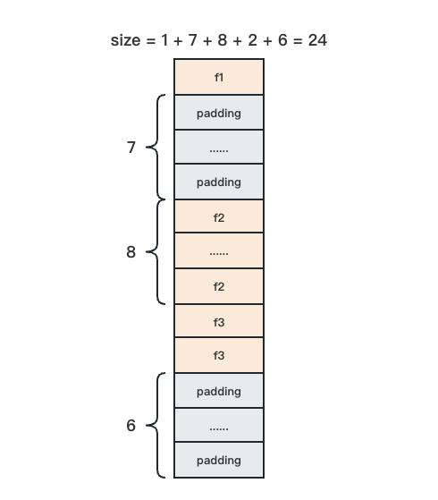

# Go 语言之 struct 进阶

- [Go 语言之 struct 进阶](#go-语言之-struct-进阶)
  - [1.内存布局](#1内存布局)
  - [2.空结构体](#2空结构体)
    - [2.1 定义](#21-定义)
    - [2.2 特点](#22-特点)
    - [2.3 使用场景](#23-使用场景)
  - [3.Tag](#3tag)
  - [4.参考](#4参考)

## 1.内存布局

struct 通过在一个连续的内存块中将其元素（即结构体字段）一个接着一个地以"平铺"的方式存放，实现了高效的内存布局。下面展示了 struct T 的内存布局：



在处理 struct T 的内存布局时，Go 采用了高效紧凑的方式，完全将分配给结构体的内存用于存储字段，并没有额外的被编译器插入的字段。如果我们想要获取结构体类型变量的内存大小以及每个字段相对于结构体变量起始地址的偏移量，我们可以借助标准库中的 `unsafe` 包提供的函数：

```go
var t T
unsafe.Sizeof(t)
unsafe.Offsetof(t.F3)
```

然而，在实际使用过程中，struct 在内存中的占用往往不像上图那么“完美”，我们来看下图：



在实际情况下，尽管 Go 编译器没有在结构体变量的内存空间中插入额外字段，但实际的结构体字段可能并不是紧密相连的，它们之间可能存在一些"缝隙"。这些"缝隙"也是结构体变量占用的内存空间的一部分，我们暂且将它们成为"填充物（Padding）"。

为什么 Go 编译器要在结构体字段之间插入填充物呢？这是因为需要「内存对齐」。

> 什么是内存对齐？
> 
> 元素按照定义顺序一个一个地放到内存中去，但并不是紧密排列的。从结构体存储的首地址开始，每个元素放置到内存中时，它都会认为内存是按照自己的大小来划分的，因此元素放置的内存地址一定会在自身大小的整数倍上开始，这就是内存对齐。

以基本数据类型为例，变量的内存地址值必须是其类型大小的整数倍。例如，一个 int64 类型的变量的内存地址应该是 int64 类型自身大小（即 8 字节）的整数倍；一个 uint16 类型的变量的内存地址应该是 uint16 类型自身大小（即 2 字节）的整数倍。

而对于像结构体这样的复合数据类型，内存对齐的要求有所不同。首先是结构体变量的内存地址，只需要是其最长字段长度与系统对齐系数两者中较小值的整数倍即可。对于结构体类型来说，我们需要确保每个字段的内存地址严格满足内存对齐的要求。

> 为什么需要内存对齐？
>
> 1.平台原因，比如 Sun 公司的 Sparc 处理器仅支持内存对齐的地址；
> 2.性能原因：如果数据的地址不是按照特定的规则对齐的，那么 CPU 将花费额外的时间来读取和处理这些未对齐的数据。
>
> 假如没有内存对齐，在 64 位 操作系统上，将一个 int 变量（8 字节）放在内存地址位 1 的位置。当处理器去取数据时，要先从 0 地址开始读取第一个 8 字节块，剔除不想要的字节（0 地址）。然后从地址 8 开始读取下一个 8 字节块，同样剔除不要的数据（9-15 地址），最后将两块数据合并放入寄存器。这就需要做两次内存访问。

我们来看一个例子：

```go
type t struct {
    f1 byte

    f2 int64
    f3 uint16
}
```

整个内存计算过程可以分为 2 步。

1. 对齐结构体的各个字段
2. 对齐整个结构体

我们先来看第一步，**对齐结构体的各个字段**。

**首先是第一个字段 `f1`。**由于它是 1 个字节长度的 byte 类型变量，所以把它放在任意地址都可以被 1 整除，我们用一个 `size` 表示当前已经对其的内存空间大小，这个时候 `size = 1`。



**再来看第二个字段 `f2`。**它是 8 个字节长度的 int64 类型，按照内存对齐要求，它应该被放在可以被 8 整除的地址上。如果把 `f1` 和 `f2` 紧密排列，显然 `f2` 的地址无法被 8 整除，这时候我们需要在 `f1` 和 `f2` 之间做一些填充，使得 `f1` 的地址和 `f2` 的地址都能同时被 8 整除。于是我们填充 7 个字节，此时 `size = 1 + 7 + 8`。



**最后分析第三个字段 `f3`。**它是 2 个字节长度的 uint16 类型，按照内存对齐要求，它应该被放在可以被 2 整除的地址上，而 `f2` 之后的那个地址肯定可以被 8 整除，也就可以被 2 整除，所以 `f3` 可以直接放在 `f2` 后面，不需要额外的填充。此时 `size = 1 + 7 + 8 + 2`。



现在结构体 `t` 的所有字段都已经对齐了，**我们开始第二步，也就是对齐整个结构体。**

根据内存对齐要求，`t` 的地址是其最长字段长度与系统对齐系数两者中较小值的整数倍，这里 `t` 的最长字段为 `f2`，长度是 8 字节，而 64 位操作系统的系统对齐系数一般为 8，两者相同，我们取 8。那么整个结构体的对齐系数就是 8。

那么我们只要保证每个结构体 `t` 的变量的内存地址能被 8 整除就可以了吗？其实不行。如果只分配一个 `t` 类型变量，不再继续填充，也可能保证其内存地址为 8 的倍数。但是如果同时分配了多个连续的 `t` 类型的变量，比如是一个 `var T [5]t` 类型的数组，我们虽然可以保证 `T[0]` 这个元素地址可以被 8 整除，但能保证 `T[1]` 的地址也可以被 8 整除吗？

数组是元素连续存储的一种类型，元素 `T[1]` 的地址等于 `T[0]` 的地址 + T 的大小（18），显然无法被 8 整除，这将导致 `T[1]` 及后续元素的地址都无法对齐，无法满足内存对齐的要求。

问题的根源在哪里呢？问题就在于 `t` 的当前大小为 18，这是一个不能被 8 整除的数值，如果 `t` 的大小可以被 8 整除，那问题就解决了。于是我们还需要从 18 开始向后找到第一个可以被 8 整除的数字，即 24，最终我们确定结构体类型 `t` 的大小 `size` 为 24。



最后我们运行代码确认一下：

```go
type t struct {
	f1 byte

	f2 int64
	f3 uint16
}

func main() {
	var a t
	fmt.Println(unsafe.Sizeof(a))   // 24
}
```

在上述推演过程中，你应该已经知道了，Go 语言中结构体类型的大小受内存对齐约束的影响。这样一来，不同的字段排列顺序也会影响到“填充字节”的多少，从而影响到整个结构体大小。比如下面两个结构体类型表示的抽象是相同的，但正是因为字段排列顺序不同，导致它们的大小也不同：

```go
type T struct {
    b byte
    i int64
    u uint16
}

type S struct {
    b byte
    u uint16
    i int64
}

func main() {
    var t T
    println(unsafe.Sizeof(t)) // 24
    var s S
    println(unsafe.Sizeof(s)) // 16
}
```

所以，你在日常定义结构体时，可以注意下结构体中字段的顺序，节约内存。

## 2.空结构体

### 2.1 定义

空结构体有两种定义方式：

```go
// 1 匿名空结构体
var s struct{}

// 2 命名空结构体
type S struct{}
var s S
```

### 2.2 特点

1. 零内存占用

```go
package main

import (
	"unsafe"
)

type S struct {
}

func main() {
	var s S
	println(unsafe.Sizeof(s)) // 0
}
```

2. 变量地址相同

无论创建多少个结构体变量，它们的内存都相同：

```go
package main

import (
	"fmt"
)

type S struct {
}

func main() {
	var s1 struct{}
	var s2 S
	fmt.Printf("%p\n", &s1)
	fmt.Printf("%p\n", &s2)
	fmt.Printf("%p\n", &struct{}{})
}
```

为什么地址都会相同呢？我们来看底层 `mallocgc` 函数：

```go
// $GOROOT/src/runtime/malloc.go

// Allocate an object of size bytes.
// Small objects are allocated from the per-P cache's free lists.
// Large objects (> 32 kB) are allocated straight from the heap.
func mallocgc(size uintptr, typ *_type, needzero bool) unsafe.Pointer {
	...

	if size == 0 {
		return unsafe.Pointer(&zerobase)
	}

	...
}
```

根据 `malloc.go` 源码的部分内容，当要分配的对象大小 `size` 为 0 时，会返回指向 `zerobase` 的指针。zerobase 是一个用于分配零字节对象的基准地址，它不占用任何实际的内存空间。

### 2.3 使用场景

1. 占位符

当我们将 `map` 的值置为空结构体 `var m map[K comparable]struct{}`，这样无论是作为一个 `set` 来使用或者判断特定的 key 是否初始化等场景，都能起到节省内存的作用。

2. 用于 channel 通信

go 标准库 `context` 的 `Context` 接口的 `Done` 方法就返回了一个只读 channel，channel 的元素就是空结构体。

```go
// $GOROOT/src/context/context.go

type Context interface {
    Deadline() (deadline time.Time, ok bool)

    Done() <-chan struct{}

    Err() error

    Value(key any) any
}
```

3. 作为方法接收器

当方法的实现不需要任何数据存储/处理时，可以使用空结构体。

## 3.Tag

struct 声明允许字段附带 Tag 来对字段做一些标记，我们可以借助 Tag 实现 json 解析、ORM 映射等。

Tag 不仅仅是一个字符串那么简单。因为其主要用于反射场景，`reflect` 包中提供了操作 Tag 的方法，所以 Tag 写法也要遵循一定的规则：以空格分隔的 `key:value` 键值对。

```go
type S struct {
	Name string `json:"name"`
	Age  int    `json:"age"`
}
```

我们来看看 `reflect` 包对 Tag 的定义：

```go
// $GOROOT/src/reflect/type.go

// StructTag 是结构体字段的 tag 字符串。
// 
// 按照惯例，tag 字符串是由一系列可选的、以空格分隔的 key:"value" 键值对串联而成。
// 每个 key 是一个非空字符串，由除了空格、引号和冒号之外的非控制字符组成。
// 每个 value 使用双引号 " 进行引用，并采用 Go 字符串字面量语法。
type StructTag string
```

> 非控制字符：通常指 ASCII 码表中数值大于等于于 32（0x20）的字符。

那么如何获取 Tag 呢？`reflect` 包为 `StructTag` 提供了 `Get` 方法，

```go
// $GOROOT/src/reflect/type.go

func (tag StructTag) Get(key string) string {
	v, _ := tag.Lookup(key)
	return v
}

func (tag StructTag) Lookup(key string) (value string, ok bool) {
    ...
}
```

我们可以看下面例子：

```go
package main

import (
	"fmt"
	"reflect"
)

type S struct {
	Name string `json:"name" bson:"name"`
	Age  int    `json:"age"`
}

func main() {
	s := S{}
	sType := reflect.TypeOf(s)

	field1 := sType.Field(0)
	fmt.Println("json tag: ", field1.Tag.Get("json"))
	fmt.Println("json tag: ", field1.Tag.Get("bson"))

	field2, _ := sType.FieldByName("Age")
	fmt.Println("json tag: ", field2.Tag.Get("json"))
}
```

## 4.参考

+ 《Go 语言第一课》 - TonyBai