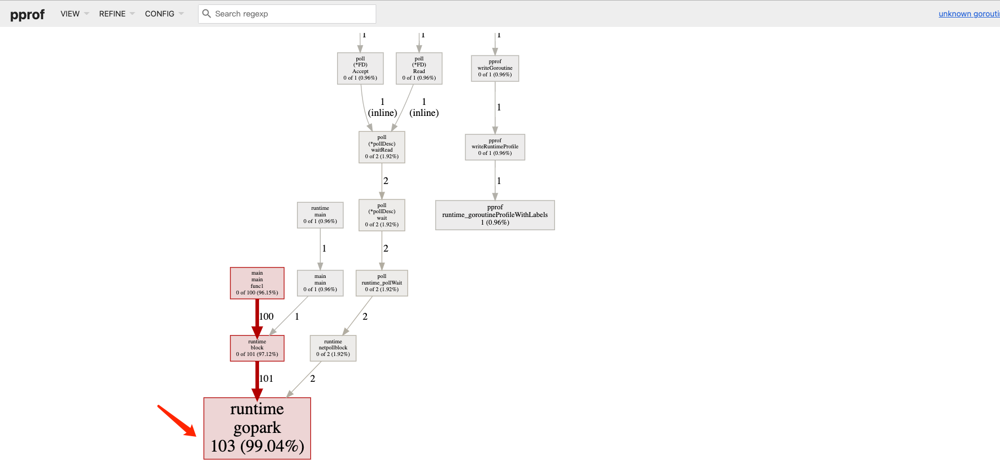

# Go 如何查看正在执行的goroutine数量?

## 1.程序中引入pprof pakage

在程序中引入 pprof package：

```go
import _ "net/http/pprof"
```

程序中开启 HTTP 监听服务：

```go
package main

import (
    "net/http"
    _ "net/http/pprof"
)

func main() {
    for i := 0; i < 100; i++ {
        go func() {
            select {}
        }()
    }

    go func() {
        http.ListenAndServe("localhost:6060", nil)
    }()

    select {}
}
```

## 2.分析 goroutine 文件

在命令行下执行：

```sh
go tool pprof -http=:1248 http://127.0.0.1:6060/debug/pprof/goroutine
```

会自动打开浏览器页面如下图所示



在图中可以清晰的看到 goroutine 的数量以及调用关系，可以看到有 103 个 goroutine。