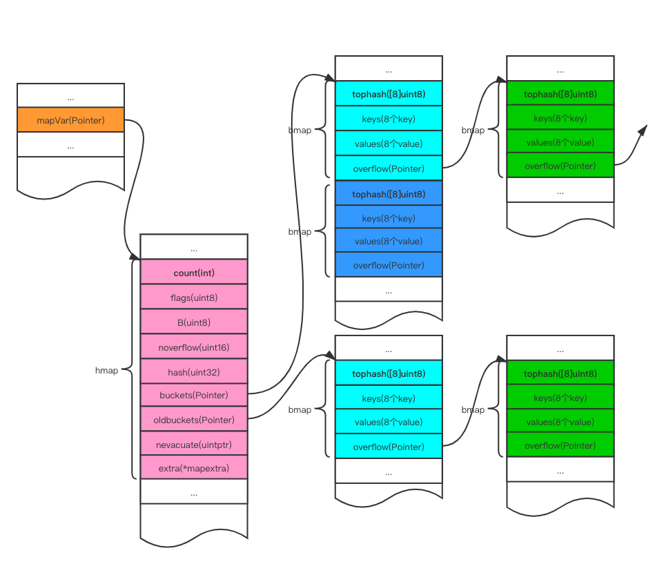

# Go map 的底层实现原理

Go 中的 map 是一个指针，占用 8 个字节，指向 hmap 结构体。

源码包中 src/runtime/map.go 定义了 hmap 的数据结构：

hmap 包含若干个结构为 bmap 的数组，每个 bmap 底层都采用链表结构，bmap 通常叫其 bucket。



## 1.hmap 结构体

```go
// A header for a Go map.
type hmap struct {
    // 代表哈希表中的元素个数，调用len(map)时，返回的就是该字段值。
    count     int 
    // 状态标志（是否处于正在写入的状态等）
    flags     uint8 
    // buckets（桶）的对数
    // 如果B=5，则buckets数组的长度 = 2^B=32，意味着有32个桶
    B         uint8  
    // 溢出桶的数量
    noverflow uint16 
    // 生成hash的随机数种子
    hash0     uint32 
    // 指向 buckets 数组的指针，数组大小为 2^B，如果元素个数为 0，它为 nil。
    // buckets 数组中每个元素都是 bmap 结构
    buckets    unsafe.Pointer 
    // 如果发生扩容，oldbuckets是指向老的buckets数组的指针，老的buckets数组大小是新的buckets的1/2;非扩容状态下，它为nil。
    oldbuckets unsafe.Pointer 
    // 表示扩容进度，小于此地址的buckets代表已搬迁完成。
    nevacuate  uintptr 
    // 存储溢出桶，这个字段是为了优化GC扫描而设计的，下面详细介绍
    extra *mapextra 
}
```

## 2.bmap 结构体

bmap 就是我们常说的“桶”，一个桶里面会最多装 8 个 key，这些 key 之所以会落入同一个桶，是因为它们经过哈希计算后，哈希结果的低 B 位是相同的。在桶内，又会根据 key 计算出来的 hash 值的高 8 位来决定 key 到底落入桶内的哪个位置（一个桶内最多有8个位置)。

```go
// A bucket for a Go map.
type bmap struct {
    // len为8的数组
    // 用来快速定位key是否在这个bmap中
    // 一个桶最多8个槽位，如果key所在的tophash值在tophash中，则代表该key在这个桶中
    tophash [bucketCnt]uint8
}
```

上面的 bmap 结构式静态结构，在编译过程中 `runtime.bmap` 会拓展成以下结构体：

```go
type bmap struct{
    tophash [8]uint8
    // keytype 由编译器编译时候确定
    keys [8]keytype 
    // elemtype 由编译器编译时候确定
    values [8]elemtype 
    // overflow 指向下一个 bmap，overflow 是 uintptr 而不是 *bmap 类型，保证 bmap 完全不含指针，是为了减少 gc，溢出桶存储到 extra 字段中
    overflow uintptr 
}
```

tophash 就是用于实现快速定位 key 的位置，在实现过程中会使用 key 的 hash 值的高 8 位作为 tophash 值，存放在 bmap 的 tophash 字段中。

tophash 字段不仅存储 key 哈希值的高 8 位，还会存储一些状态值，用来表明当前桶单元状态，这些状态值都是小于 minTopHash 的。

为了避免 key 哈希值的高 8 位值和这些状态值相等，产生混淆情况，所以当 key 哈希值高 8 位若小于 minTopHash 时候，自动将其值加上 minTopHash 作为该 key 的 tophash。桶单元的状态值如下：

```go
emptyRest      = 0 // 表明此桶单元为空，且更高索引的单元也是空
emptyOne       = 1 // 表明此桶单元为空
evacuatedX     = 2 // 用于表示扩容迁移到新桶前半段区间
evacuatedY     = 3 // 用于表示扩容迁移到新桶后半段区间
evacuatedEmpty = 4 // 用于表示此单元已迁移
minTopHash     = 5 // key的tophash值与桶状态值分割线值，小于此值的一定代表着桶单元的状态，大于此值的一定是key对应的tophash值

func tophash(hash uintptr) uint8 {
    top := uint8(hash >> (goarch.PtrSize*8 - 8))
    if top < minTopHash {
        top += minTopHash
    }
    return top
}
```

## 3.mapextra 结构

当 map 的 key 和 value 都不是指针类型时候，bmap 将完全不包含指针，那么 gc 时候就不用扫描 bmap。bmap 指向溢出桶的字段 overflow 是 uintptr 类型，为了防止这些 overflow 桶被 gc 掉，所以需要 mapextra.overflow 将它保存起来。如果 bmap 的 overflow 是 *bmap 类型，那么 gc 扫描的是一个个拉链表，效率明显不如直接扫描一段内存(hmap.mapextra.overflow)。


```go
type mapextra struct {
    // overflow 包含的是 hmap.buckets 的 overflow 的 buckets
    overflow    *[]*bmap
    // oldoverflow 包含扩容时 hmap.oldbuckets 的 overflow 的 bucket
    oldoverflow *[]*bma
    // 指向空闲的 overflow bucket 的指针
    nextOverflow *bmap 
}
```

## 4.总结

bmap（bucket）内存数据结构可视化如下:

注意到 key 和 value 是各自放在一起的，并不是 key/value/key/value/... 这样的形式，当 key 和 value 类型不一样的时候，key 和 value 占用字节大小不一样，使用 key/value 这种形式可能会因为内存对齐导致内存空间浪费，所以 Go 采用 key 和 value 分开存储的设计，更节省内存空间。

## 5.资料

[Go面试题(三)：map的实现原理 - 掘金](https://juejin.cn/post/7029679896183963678#heading-1)