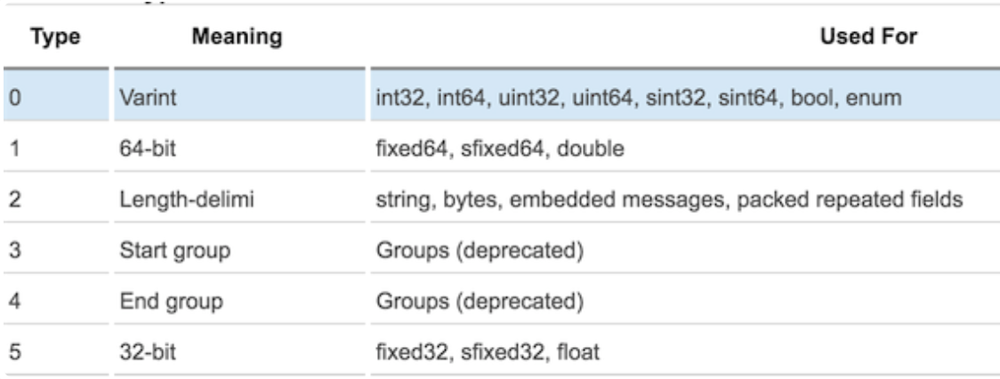

# Protobuf 认识与使用

- [Protobuf 认识与使用](#protobuf-认识与使用)
  - [1.Protobuf 简介](#1protobuf-简介)
  - [2.优劣势](#2优劣势)
  - [3.安装](#3安装)
    - [3.1 MacOS](#31-macos)
      - [3.1.1 brew 安装](#311-brew-安装)
      - [3.1.2 下载安装](#312-下载安装)
  - [4.语法](#4语法)
    - [4.1 message](#41-message)
    - [4.2 标识号](#42-标识号)
    - [4.3 字段规则](#43-字段规则)
    - [4.4 数据类型](#44-数据类型)
  - [5.使用案例](#5使用案例)
  - [6.Protobuf 序列化原理](#6protobuf-序列化原理)
    - [6.1 Varint](#61-varint)

## 1.Protobuf 简介

Protobuf 是 Protobuf Buffers 的简称，它是 Google 公司开发的一种数据描述语言，是一种轻便高效的结构化数据存储格式，可以用于结构化数据，或者说序列化。它很适合做数据存储或 RPC 数据交换。可用于通讯、数据存储等领域的语言无关、平台无关、可扩展的序列化结构数据格式。他是一种灵活、高效、自动化的机制，用于序列化结构化数据，对比 XML 和 JSON，他更小、更快、更简单。总之他是微服务中需要使用的东西。

Protobuf 刚开源时的定位类似于 XML、JSON 等数据描述语言，通过附带工具生成代码并实现结构化数据序列化的功能。这里我们更关注的是作为 Protobuf 作为接口规范的描述语言，可以作为设计安全的跨语言 RPC 接口的基础。

需要了解两点：

1. protobuf 是类似与 json 一样的数据描述语言。
2. protobuf 非常适合于 RPC 数据交换格式。

## 2.优劣势

**优势：**

1. 序列化后体积相比 json 和 xml 小，适合网络传输；
2. 支持跨平台多语言；
3. 消息格式升级和兼容性很好；
4. 序列化反序列化速度很快，快于 json 的处理速度。

**劣势：**

1. 相比 xml 和 json，应用不够广；
2. 二进制格式导致可读性差；
3. 缺乏自描述；

## 3.安装

### 3.1 MacOS

#### 3.1.1 brew 安装

```sh
brew install protobuf
```

#### 3.1.2 下载安装

1. 下载地址：[https://github.com/protocolbuffers/protobuf/releases](https://github.com/protocolbuffers/protobuf/releases)；
2. 选择 `protobuf-all-xxx.tar.gz` 包，`xxx` 代表最新的版本号，点击下载；
3. 把下载下来的文件夹移动到你的管理目录；
4. 双击解压；
5. 打开终端并 `vim ~/.bash_profile` 后面追加环境变量：

```sh
export PROTOBUF=你的管理目录/protobuf
export PATH=$PROTOBUF/bin:$PATH
```

6. 终端 `source ~/.bash_profile` 生效；（到这一步其实就可以了）
7. 终端 `cd 管理目录/protobuf`；
8. 终端 `sudo ./configure`，若执行报错自动安装某文件，点击安装，安装完成后重新执行此命令。；
9. 终端 `sudo make check`；
10. 终端 `sudo make install`；
11. 终端 `protoc --version` 检查是否安装完成;或者 `protoc --version`。

## 4.语法

使用 Protobuf 协议进行数据序列化和和反序列化操作时，首先定义传输数据的格式，并命名为以 `.proto` 为扩展名的消息定义文件。

### 4.1 message

Protobuf 中定义一个数据结构需要用到关键字 `message`，这一点和 Java 的 `class`，Go 语言中的 `struct` 类似。

### 4.2 标识号

在消息的定义中，每个字段等号后面都有唯一的标识号，用于在反序列化过程中识别各个字段的，一旦开始使用就不能改变。标识号从整数 1 开始，依次递增，每次增加 1，标识号的范围为 1~2^29–1，其中 [19000-19999] 为 Protobuf 协议预留字段，开发者不建议使用该范围的标识号；一旦使用，在编译时 Protoc 编译器会报出警告。

### 4.3 字段规则

字段规则有三种：

+ required：该规则规定，消息体中该字段的值是必须要设置的。
+ optional：消息体中该规则的字段的值可以存在，也可以为空，optional 的字段可以根据 defalut 设置默认值。
+ repeated：消息体中该规则字段可以存在多个（包括 0 个），该规则对应 Java 的数组或者 Go 语言的 slice。

> 注意：使用 required 弊多于利；在实际开发中更应该使用 optional 和 repeated 而不是 required。

### 4.4 数据类型

常见的数据类型与 protoc 协议中的数据类型映射如下：

**枚举类型**：proto 协议支持使用枚举类型，和正常的编程语言一样，枚举类型可以使用 enum 关键字定义在 `.proto` 文件中：

```protobuf
enum Age {
  male = 1
  female = 2
}
```

**字段默认值**：`.proto` 文件支持在进行 `message` 定义时设置字段的默认值，可以通过 `default` 进行设置，如下所示：

```go
message Address {
    required sint32 id = 1 [default = 1];
    required string name = 2 [default = '北京'];
    optional string pinyin = 3 [default = 'beijing'];
    required string address = 4;
    required bool flag = 5 [default = true];
}
```

**导入**：如果需要引用的 `message` 是写在别的 `.proto` 文件中，可以通过 `import "xxx.proto"` 来进行引入。

**嵌套**：`message` 与 `message` 之间可以嵌套定义，比如如下形式：

```go
syntax = "proto2";
package example;
message Person {
    required string Name = 1;
    required int32 Age = 2;
    required string From = 3;
    optional Address Addr = 4;
    message Address {
        required sint32 id = 1;
        required string name = 2;
        optional string pinyin = 3;
        required string address = 4;
    }
}
```

**message更新规则**：`message` 定义以后如果需要进行修改，为了保证之前的序列化和反序列化能够兼容新的 `message`，`message` 的修改需要满足以下规则：

+ 不可以修改已存在域中的标识号。
+ 所有新增添的域必须是 `optional` 或者 `repeated`。
+ 非 `required` 域可以被删除。但是这些被删除域的标识号不可以再次被使用。
+ 非 `required` 域可以被转化，转化时可能发生扩展或者截断，此时标识号和名称都是不变的。
+ `sint32` 和 `sint64` 是相互兼容的。
+ `fixed32` 兼容 `sfixed32`。 `fixed64` 兼容 `sfixed64`。
+ `optional` 兼容 `repeated`。发送端发送 `repeated` 域，用户使用 `optional` 域读取，将会读取 `repeated` 域的最后一个元素。

## 5.使用案例

1. 创建扩展名为 `.proto` 的文件，并编写代码。比如创建 `person.proto` 文件，内容如下：

```go
syntax = "proto2";
package example;

message Person {
    required string Name = 1;
    required int32 Age = 2;
    required string From = 3;
}
```

2. 编译 `.proto` 文件，生成 Go 语言文件。执行如下命令：

```sh
protoc --go_out=. test.proto
```

生成对应的 person.pb.go 文件。并构建对应的 example 目录，存放生成的 person.pb.go 文件。


1. 在程序中使用 Protobuf：

```go
package main

import (
	"ProtocDemo/example"
	"fmt"
	"os"

	"github.com/golang/protobuf/proto"
)

func main() {
	fmt.Println("Hello World. \n")

	msg_test := &example.Person{
		Name: proto.String("Davie"),
		Age:  proto.Int(18),
		From: proto.String("China"),
	}

	//序列化
	msgDataEncoding, err := proto.Marshal(msg_test)
	if err != nil {
		panic(err.Error())
		return
	}

	msgEntity := example.Person{}
	err = proto.Unmarshal(msgDataEncoding, &msgEntity)
	if err != nil {
		fmt.Println(err.Error())
		os.Exit(1)
		return
	}

	fmt.Printf("姓名：%s\n\n", msgEntity.GetName())
	fmt.Printf("年龄：%d\n\n", msgEntity.GetAge())
	fmt.Printf("国籍：%s\n\n", msgEntity.GetFrom())
}
```

## 6.Protobuf 序列化原理

### 6.1 Varint

Varint 是一种紧凑的表示数字的方法。它用一个或多个字节来表示一个数字，值越小的数字使用越少的字节数。这能减少用来表示数字的字节数。

Varint 中的每个 byte 的最高位 bit 有特殊的含义，如果该位为 1，表示后续的 byte 也是该数字的一部分，如果该位为 0，则结束。其他的 7 个 bit 都用来表示数字。因此小于 128 的数字都可以用一个 byte 表示。大于 128 的数字，比如 300，会用两个字节来表示：1010 1100 0000 0010。下图演示了 Google Protocol Buffer 如何解析两个 bytes。注意到最终计算前将两个 byte 的位置相互交换过一次，这是因为 Google Protocol Buffer 字节序采用 little-endian 的方式。


在序列化时，Protobuf 按照 TLV 的格式序列化每一个字段，T 即 Tag，也叫 Key；V 是该字段对应的值 value；L 是 V 的长度，如果一个字段是整形，这个 L 部分会省略。

序列化后的 Value 是按原样保存到字符串或者文件中，Key 按照一定的转换条件保存起来，序列化后的结果就是 KeyValueKeyValue... 依次类推的样式，示意图如下所示：


采用这种 Key-Pair 结构无需使用分隔符来分割不同的 Field。对于可选的 Field，如果消息中不存在该 Field，那么在最终的 Message Buffer 中就没有该 field，这些特性都有助于节约消息本身的大小。比如，我们有消息 order1：

```go
Order.id = 10;
Order.desc = "bill";
```

则最终的 Message Buffer 中有两个 Key-Value 对，一个对应消息中的 id；另一个对应 desc。Key 用来标识具体的 field，在解包的时候，Protocol Buffer 根据 Key 就可以知道相应的 Value 应该对应于消息中的哪一个 field。

Key 的定义如下：

```go
(field_number << 3) | wire_type
```

可以看到 Key 由两部分组成。第一部分是 field_number，比如消息 lm.helloworld 中 field id 的 field_number 为 1。第二部分为 wire_type。表示 Value 的传输类型。而 wire_type 有以下几种类型：

