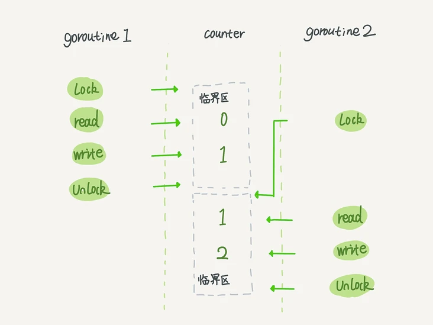
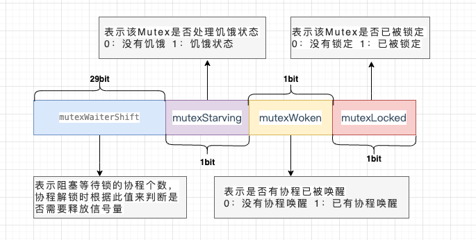
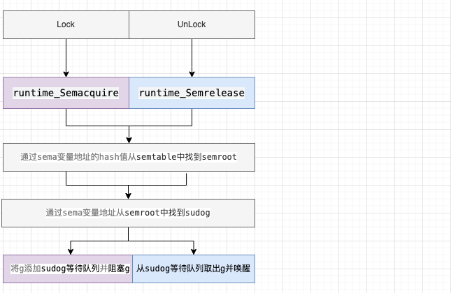
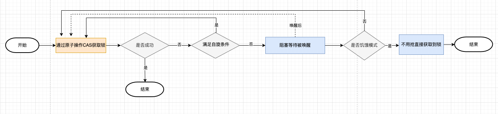
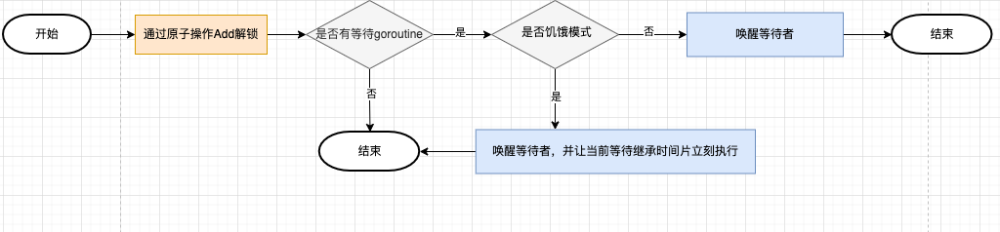

# Go 互斥锁的实现原理

Go `sync` 包提供了两种锁类型：互斥锁 `sync.Mutex` 和 读写互斥锁 `sync.RWMutex`，都属于悲观锁。

## 1.概念

`Mutex` 是互斥锁，当一个 goroutine 获得了锁后，其他 goroutine 不能获取锁（只能存在一个写者或读者，不能同时读和写）

## 2.使用场景

多个线程同时访问临界区，为保证数据的安全，锁住一些共享资源，以防止并发访问这些共享数据时可能导致的数据不一致问题。

获取锁的线程可以正常访问临界区，未获取到锁的线程等待锁释放后可以尝试获取锁。



## 3.底层实现结构

互斥锁对应的是底层结构是 `sync.Mutex` 结构体，位于 `src/sync/mutex.go` 中。

```go
type Mutex struct {  
    state int32  
    sema  uint32
}
```

`state` 表示锁的状态，有锁定、被唤醒、饥饿模式等，并且是用 `state` 的二进制位来标识的，不同模式下会有不同的处理方式。



`sema` 表示信号量，`mutex` 阻塞队列的定位是通过这个变量来实现的，从而实现 goroutine 的阻塞和唤醒。




```go
addr = &sema
func semroot(addr *uint32) *semaRoot {  
    return &semtable[(uintptr(unsafe.Pointer(addr))>>3)%semTabSize].root  
}
root := semroot(addr)
root.queue(addr, s, lifo)
root.dequeue(addr)

var semtable [251]struct {  
    root semaRoot  
    ...
}

type semaRoot struct {  
    lock  mutex  
    treap *sudog // root of balanced tree of unique waiters.  
    nwait uint32 // Number of waiters. Read w/o the lock.  
}

type sudog struct {
    g *g  
    next *sudog  
    prev *sudog
    elem unsafe.Pointer // 指向sema变量
    waitlink *sudog // g.waiting list or semaRoot  
    waittail *sudog // semaRoot
    ...
}
```

## 4.操作

锁的实现一般会依赖于原子操作、信号量，通过 `atomic` 包中的一些原子操作来实现锁的锁定，通过信号量来实现线程的阻塞与唤醒。

### 4.1 加锁

通过原子操作 cas 加锁，如果加锁不成功，根据不同的场景选择自旋重试加锁或者阻塞等待被唤醒后加锁。



```go
func (m *Mutex) Lock() {
    // Fast path: 幸运之路，一下就获取到了锁
    if atomic.CompareAndSwapInt32(&m.state, 0, mutexLocked) {
        return
    }
    // Slow path：缓慢之路，尝试自旋或阻塞获取锁
    m.lockSlow()
}
```

### 4.2 解锁

通过原子操作 add 解锁，如果仍有 goroutine 在等待，唤醒等待的 goroutin。



```go
func (m *Mutex) Unlock() {  
   // Fast path: 幸运之路，解锁
   new := atomic.AddInt32(&m.state, -mutexLocked)  
   if new != 0 {  
            // Slow path：如果有等待的goroutine，唤醒等待的goroutine
            m.unlockSlow()
   }  
}
```

## 5.注意点

+ 在 `Lock()` 之前使用 `Unlock()` 会导致 panic 异常
+ 使用 `Lock()` 加锁后，再次 `Lock()` 会导致死锁（不支持重入），需 `Unlock()` 解锁后才能再加锁
+ 锁定状态与 goroutine 没有关联，一个 goroutine 可以 Lock，另一个 goroutine 可以 Unlock