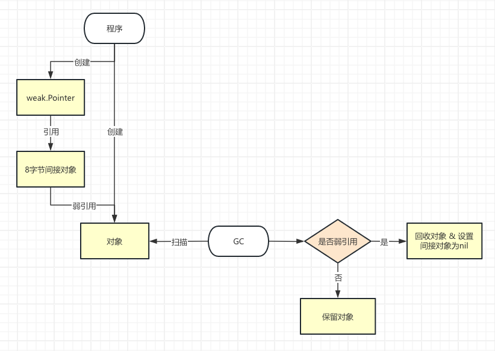

# Go 1.24 更新总结

## 类型别名支持泛型参数

传统的类型别名形式如下：

```go
type P = Q  // 这是类型别名，P 跟 Q 完全相同

// 注意这是定义新类型，P 跟 Q 是不同的类型
type P Q
```

但是对于泛型来说，类型别名 `P` 中不能包含类型参数。下面这样的定义是不合法的：

```go
// Go 1.23 之前这样写是错误的
type P[T any] = []T
```

Go 1.23 版本以实验特性的形式（需显式使用 `GOEXPERIMENT=aliastypeparams`）支持了带有类型参数的类型别名。到了 **Go 1.24，这个实验特性正式转正，成为默认特性**。

现在我们可以这样定义带泛型参数的类型别名：

```go
type MySlice[T any] = []T

func main() {
    // 使用 int 类型实例化 MySlice
    intSlice := MySlice[int]{1, 2, 3, 4, 5}
    fmt.Println("Int Slice:", intSlice)

    // 使用 string 类型实例化 MySlice
    stringSlice := MySlice[string]{"hello", "world"}
    fmt.Println("String Slice:", stringSlice)

    // 使用自定义类型实例化 MySlice
    type Person struct {
        Name string
        Age  int
    }

    personSlice := MySlice[Person]{
        {Name: "Alice", Age: 30},
        {Name: "Bob", Age: 25},
    }
    fmt.Println("Person Slice:", personSlice)
}
```

**如何理解带类型参数的类型别名?**简单理解，就是在任何出现 `MySlice[T]` 的地方，将其换成 `[]T`。

**一些修正**

Go 1.23 版本中存在一些类型约束检查的问题，比如下面这段代码不应该编译通过的示例（`[]int` 类型是不满足 `comparable` 约束）：

```go
package main

import "fmt"

type MySlice[T any] = []T
type YourSlice[T comparable] = MySlice[T]

func main() {
    // 使用 int 类型实例化 MySlice
    intSlice := MySlice[int]{1, 2, 3, 4, 5}
    fmt.Println("Int Slice:", intSlice)

    intsliceSlice := YourSlice[[]int]{
        []int{1, 2, 3},
        []int{4, 5, 6},
    }
    fmt.Println("IntSlice Slice:", intsliceSlice)
}
```

在 Go 1.24 中，这个问题被修正。如果你运行上面的代码，会得到编译错误：

Go 1.23 中，带有类型参数的别名类型不能跨包使用，会报错：`internal compiler error: panic: importing generic type aliases is not supported in Go 1.23 (see issue #68526)`。

在 Go 1.24 中这条限制被取消。

相关 issue: [#46477](https://github.com/golang/go/issues/46477)

## Tools

### 工具依赖管理

我们日常编写Go项目代码时常常会依赖一些使用Go编写的工具，比如 `golang.org/x/tools/cmd/stringer`。我们希望所有项目合作者都使用相同版本的工具，以避免在不同时间、不同环境中的输出不同的结果。因此，Go 社区希望通过 go.mod 将工具的版本以及依赖管理起来。

#### Go 1.24 之前

Go Wiki 推荐 `Go modules by example` 中的 [`Tools as dependencies`](https://github.com/go-modules-by-example/index/blob/master/010_tools/README.md) 文档，大致思路是将项目依赖的 Go 工具以“项目依赖”的方式存放到 `tools.go` 文件(放到 go module 根目录下)中。举个例子：

1. 创建 `tools.go`：

```go
//go:build tools

package tools

import (
    _ "golang.org/x/tools/cmd/stringer"
)
```

2. 执行 `go mod tidy` 或 `go get golang.org/x/tools/cmd/stringer` 安装依赖；
3. 然后在同一目录下安装:

```sh
$ go install golang.org/x/tools/cmd/stringer
```

4. 使用

```sh
$ go run golang.org/x/tools/cmd/stringer -type=HTTPStatus
```

**缺点：**

+ 配置繁琐：需要手动创建 tools.go 文件，并添加特定的构建标签来排除它；
+ 使用不便：运行工具时可能需要额外的脚本或配置(每次手敲 `go run golang.org/x/tools/cmd/stringer` 的确有些不便)。

#### Go 1.24

直接在 `go.mod` 文件里添加 `tool` 指令：

```
module demo

go 1.24

tool golang.org/x/tools/cmd/stringer
```

然后分别安装依赖和 `stringer`：

```sh
$ go mod tidy
$ go install tool
```

更快捷的安装 tool 的办法是直接运行 `go get -tool golang.org/x/tools/cmd/stringer`。

使用 tool 的命令也更简短 `go tool stringer -type=HTTPStatus`。

tool directive 和 go 工具链做了很好的融合，除了上面的命令外，还支持：

+ `go build tool` 构建 module 依赖的 tool，并将构建出可执行文件放在当前目录下；
+ `go build -o bin/ tool` 将构建 module 依赖的 tool，并将构建出可执行文件放在项目自己的 bin 目录下。

**不同项目不同版本是否会产生冲突？不会**

当我在两个项目里各自安装 `github.com/golangci/golangci-lint/cmd/golangci-lint` tool 时，可以看到输出不同版本：

```sh
# project A
$ go tool golangci-lint version                         
golangci-lint has version v1.64.1 built with go1.24.4 from ...

# project B
$ go tool golangci-lint version
golangci-lint has version v1.64.8 built with go1.24.4 from ...
```

并且这些 tool 不像以前那样直接安装到 `$GOPATH/bin` 或 `$GOBIN`，而是存放在构建缓存目录里：

```sh
# project A
$ go tool -n golangci-lint
/Users/xxx/Library/Caches/go-build/c1/c1d8c7ffe191cddd283227e50526df7ec9f862f920e85017fc1ac376a5a35dff-d/golangci-lint

# project B
$ go tool -n golangci-lint
/Users/xxx/Library/Caches/go-build/55/554067097e927c181a63db83d21daeb348a2c388c55c5cf3f93f448a4638d210-d/golangci-lint
```


### 构建缓存

Go 1.24 之前仅缓存编译后的包文件（build actions），而不缓存链接后的二进制文件（link actions）。不缓存二进制文件很大原因在于二进制文件比单个包对象文件大得多，并且它们不像包文件那样被经常重用。

Go 1.24 由 `go run` 和新版 `go tool` 创建的可执行文件现在会被缓存到 Go 构建缓存中。这虽然会增大缓存，但能加快重复执行的速度。这也能说明上面不同项目依赖同一工具不同版本时不会相互覆盖，并且第一次使用 `go tool` 执行工具时比较慢的原因。详见 [issue#69290](https://github.com/golang/go/issues/69290)。

由于构建缓存的增大，也有人提议说定期清理构建缓存，二进制缓存建议 2 天清理，普通包文件缓存 5 天。而从 [issue#68872](https://github.com/golang/go/issues/68872) 来看目前暂无解决计划。


### go build/install/test 支持 json (#62067)[https://github.com/golang/go/issues/62067]

Go 1.24 之前已经支持了 `go test -json` 命令，1.24 增加了对 `build` 和 `install` 的 json 支持。可以通过 `go help buildjson` 查看。

Go 1.24 之前的 `go test -json` 出现构建失败时，构建错误信息会与测试的 JSON 输出交织在一起，导致工具难以准确地将构建错误与受影响的测试包关联起来。Go 1.24 进行了优化，现在会以 JSON 格式报告构建输出和失败信息，并与测试结果的 JSON 输出交错显示。这些信息通过新的 Action 类型进行区分。


### 新增 GOAUTH 配置支持 HTTP 认证 (#26232)[https://github.com/golang/go/issues/26232]

`go get` 命令用于从远程代码仓库获取依赖包。通常，这些依赖包的导入路径是通过 HTTP 请求获取的，服务器会返回一个包含元标签（meta tag）的 HTML 页面，指示如何获取该包的源代码。然而，对于需要身份验证的私有仓库，`go get` 无法直接工作，因为 `go get` 使用的是 `net/http.DefaultClient`，它不知道如何处理需要身份验证的 URL。具体来说，当 `go get` 尝试获取一个私有仓库的URL时，由于没有提供身份验证信息，服务器会返回 401 或 403 错误，导致 `go get` 无法继续执行。

Go 通过新增的环境变量 GOAUTH 来指定一个或多个认证命令。`go get` 在执行时会调用这些命令，获取身份验证信息，并在后续的 HTTP 请求中使用这些信息。

### go build 支持设置版本号 (#50603)[https://github.com/golang/go/issues/50603]

Go 1.24 的 `go build` 命令会在编译后的二进制文件中包含版本信息。如果本地 VCS 标签可用，主模块的版本将从该标签中设置。如果没有本地 VCS 标签可用，则会生成一个伪版本（pseudo-version），通常包含时间戳和提交哈希。 此外，为了避免与已发布的版本混淆，`go build` 还会在伪版本中添加一些特殊的标识符，例如 `devel`，以表明这是一个本地构建的版本。如果有未提交的 VCS 更改，则会附加一个 `+dirty` 后缀。

使用 `-buildvcs=false` 标志可以省略二进制文件中的版本控制信息。

```sh
# Go 1.24
$ go version -m mcp
mcp: go1.24.4
    path    gitlab-mcp
    mod     gitlab-mcp      v0.0.0-20250812063442-9f4c15be546e+dirty


# Go 1.23
go version -m mcp23 
mcp23: go1.23.4
    path    gitlab-mcp
    mod     gitlab-mcp      (devel)
```

### 新增 GODEBUG=toolchaintrace=1 可用于追踪 go 命令的工具链选择过程

```sh
$ GODEBUG='toolchaintrace=1' go build -o mcp ./
go: using local toolchain go1.24.4
```

### Cgo 优化

传统 cgo 机制下调用 c 函数时，Go 会保证传递给 C 函数的 go 指针指向的对象位于堆上。但如果 C 函数不保留 Go 指针的副本，并且不将该指针传递回 Go 代码，那么这个保证就是没有必要的。Go 1.24 增加了 `#cgo noescape cFunctionName` 注解用于显式告诉 go 编译器：不会有指针通过特定的 C 函数逃逸。

此外，当 Go 函数调用 C 函数时，它默认会为 C 函数中再调用 Go 函数做好准备，这当然会有一些额外开销。这对于那些不会调回 Go 函数的 C 函数也是没有必要的。在 Go 1.24 中新增的 `#cgo nocallback cFunctionName` 注解就是用于告诉编译器这些准备工作不是必需的。

### objdump

objdump 是 Go 提供的一个调试工具，主要用于对 Go 构建的二进制文件进行**反汇编**，帮助开发者分析指令级别的执行情况。新增 64 位架构支持：

+ LoongArch（GOARCH=loong64）
+ RISC-V（GOARCH=riscv64）
+ S390X（GOARCH=s390x）

### Vet 增强

`go vet` 是 Go 自带的一个 静态分析工具。它的作用是：在代码编译之前，扫描 Go 源码，发现常见的、容易被忽略但可能导致 bug 的问题。Go 1.24 增加或增强了以下分析器：

+ 新增 tests 分析器

用于检查测试包（test package）中测试函数、模糊测试（fuzzer）、基准测试（benchmark）和示例（example）的声明是否存在常见错误，例如：命名错误、签名错误、引用不存在的标识符。

+ 增强 printf 分析器 [#60529](https://github.com/golang/go/issues/60529)

新增对 `fmt.Printf(s)` 的检查，如果这类调用中格式字符串 `s` 是非常量且没有额外参数，则提醒用户使用 `fmt.Print`。

+ 增强 buildtag 分析器 [#64127](https://github.com/golang/go/issues/64127)

现在会对 `//go:build` 指令中无效的 Go 主版本构建约束的检测。例如，如果你使用 `//go:build go1.23.1`，该分析器会提醒你应该使用 `//go:build go1.23`。

+ 增强 copylock 分析器 [#66387](https://github.com/golang/go/issues/66387)

现在会在 fori 循环中包含 `sync.Locker` 的变量复制的不安全操作的诊断，防止锁的复制带来的潜在问题。

```sh
$ go vet .
......
./main.go:10:6: for loop iteration copies lock value to m: sync.Mutex
......
```

## runtime

Go 1.24 在运行时层面做了多项优化，在一系列具有代表性的基准测试中，平均可降低约 2–3% 的 CPU 开销（具体收益依应用而异）。核心改动包括：

- 新的内置 map 实现（基于 Swiss Tables）
- 小对象分配路径进一步优化
- 新的运行时内部互斥锁实现（spin-bit mutex）

基于 Swiss Tables 的 map 实现以及互斥锁优化是实验特性，但都是默认生效的，在 Go 1.24 中，你可以在构建阶段，通过显式设置 `GOEXPERIMENT=noswissmap` 和 `GOEXPERIMENT=nospinbitmutex` 关闭这两个实验特性。

## 编译器 [#60725](https://github.com/golang/go/issues/60725)

Go 1.24 之前，Go 编译器允许在 C 类型的别名上声明方法，虽然某些时候它可以正常工作，如下面示例：

```go
package main

/*
typedef int foo;
*/
import "C"

type foo = C.foo

func (foo) method() int { return 123 }

func main() {
	var x foo
	println(x.method()) // "123"
}
```

但这可能引入了潜在的类型安全性以及运行时错误问题，尽管目前为 C 类型别名添加方法的情形非常少。

Go 1.24 通过引入了一个新的编译器检查修复了该问题，该检查利用了 [`isCgoGeneratedFile`](https://github.com/golang/go/issues/60725#issuecomment-1595731822) 函数和类型名称的特征（如_Ctype_前缀）来识别 C 类型别名，并禁止在 C 类型别名上声明方法。

## 标准库（部分）

### encoding/json

```go
package main

import (
	"encoding/json"
	"fmt"
	"time"
)

type ZeroStruct struct {
	A int
	B string
	C float64
}

type Foo struct {
	EmptyStruct struct{}   `json:"empty_struct,omitempty"`
	ZeroStruct  ZeroStruct `json:"zero_struct,omitempty"`
	Time        time.Time  `json:"time,omitempty"`
}

func main() {
	foo := Foo{}
	data, _ := json.Marshal(foo)
	fmt.Println(string(data)) // 输出：{"empty_struct":{},"zero_struct":{"A":0,"B":"","C":0},"time":"0001-01-01T00:00:00Z"}
}
```

`omitempty` 标签希望当某个字段值为“空”时，在 JSON 序列化过程中应该被忽略。但以上的情况仍然会在 JSON 中输出。

于是新增了 `omitzero` 标签，如果字段值为零，则 JSON 序列化时忽略该字段。如果该字段类型定义了 `IsZero bool` 方法，那么就用它来判断零值；否则是根据字段是否是零值（通过 `reflect.Value.IsZero` 判断）来判断。

如果同时指定了 `omitempty` 和 `omitzero`，则字段是否被忽略基于两者的逻辑或关系。

### 新增 weak package (#67552)[https://github.com/golang/go/issues/67552]

weak 包提供了**弱指针**功能，弱指针（Weak Pointer）是与强指针相对而言的，强指针（Strong Pointer）就是下面代码片段中的这种常规指针：

```go
var p *T = new(T) // 假设 T 类型对象被分配到堆上
```

只要 p 指向堆上的 T 对象，GC 就会认为 *p 是可达对象，那么 T 对象不会被 GC 回收。

弱指针的核心思想是允许引用内存而不阻止 GC 回收它。GC 在回收对象时，会自动将所有指向该对象的弱指针设置为 nil。这确保了弱指针不会产生悬空引用（dangling pointer）。在缓存、规范化映射、避免循环引用等场景发挥作用。



```go
package main

import (
	"fmt"
	"runtime"
	"weak"
)

func main() {
	type Blob []byte
	b := make(Blob, 1024*1024) // 1MB
	wp := weak.Make(&b)         // 创建弱指针

	fmt.Println("before GC, weak ok?", wp.Value() != nil) // 应为 true

	// 丢弃强引用
	b = nil
	runtime.GC()

	if wp.Value() == nil {
		fmt.Println("object was collected (weak -> nil)")
	} else {
		fmt.Println("object still alive")
	}
}
```

### os 包支持限制目录文件访问 (#67002)[https://github.com/golang/go/issues/67002]

> 目录遍历漏洞（Directory Traversal Vulnerabilities）和符号链接遍历漏洞（Symlink Traversal Vulnerabilities）是常见的安全漏洞，攻击者通过提供相对路径（如"../../../etc/passwd"）或创建符号链接，诱使程序访问其本不应访问的文件，从而导致安全问题。例如，[CVE-2024-3400](https://nvd.nist.gov/vuln/detail/CVE-2024-3400) 是一个最近的真实案例，展示了目录遍历漏洞如何导致远程代码执行。

为解决文件系统操作的安全边界控制问题，新增 `os.Root` 类型，可以通过 `os.OpenRoot` 函数获得。`os.Root` 的方法仅限于在该目录内操作，并且不允许路径引用目录外的位置，包括跟随符号链接指向目录外的路径。

```go
package main

import (
    "fmt"
	"log"
	"os"
)

func main() {
    root, err := os.OpenRoot(".")
	if err != nil {
		log.Fatalln(err)
	}
	defer root.Close()

	file, err := root.Open("file.txt")
	if err != nil {
		fmt.Println("failed to open file.txt: ", err)
	}
	defer file.Close()

	// 访问父目录会失败
	_, err = root.Open("../outside.txt")
	if err != nil {
		fmt.Println(err) // 报错: openat ../outside.txt: path escapes from parent
	}

	// 传统的 os.OpenFile
	_, err = os.OpenFile("../outside.txt", os.O_RDONLY, 0644)
	if err != nil {
		fmt.Println(err) // 不会报错
	}
}
```

从安全角度来看，Go 1.24 之后，建议多使用这种安全操作文件系统的方式，如果你的文件操作都局限在一个目录下。

## 参考

[Go 1.24 Release Notes](https://tip.golang.org/doc/go1.24)
[Go 1.24中值得关注的几个变化 - TonyBai](https://tonybai.com/2025/02/16/some-changes-in-go-1-24/)
[Go 1.24新特性前瞻：语法、编译器与运行时 - TonyBai](https://tonybai.com/2024/12/16/go-1-24-foresight-part1/)
[Go 1.24新特性前瞻：工具链和标准库 - TonyBai](https://tonybai.com/2024/12/17/go-1-24-foresight-part2/)