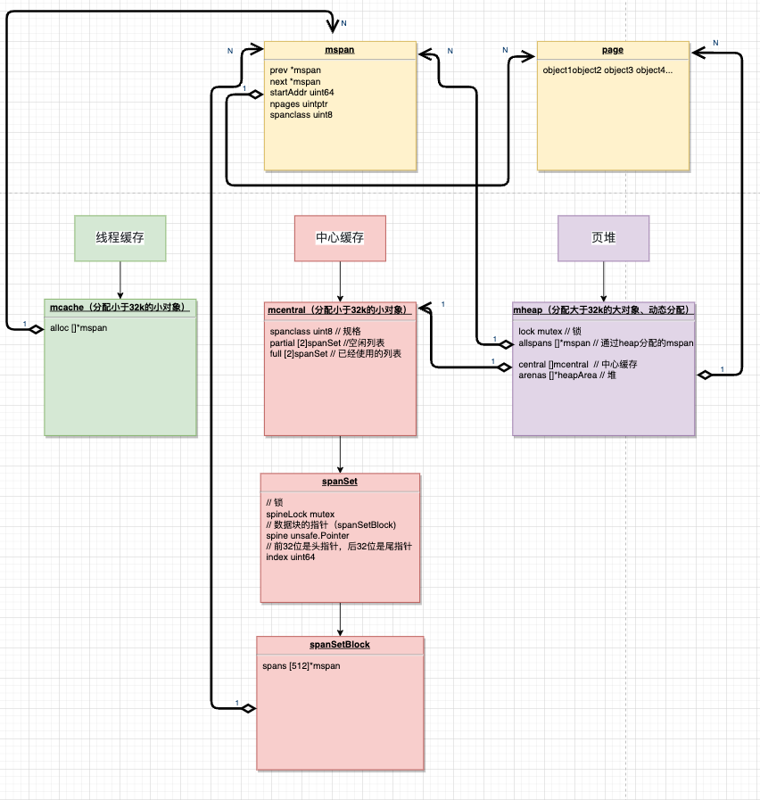
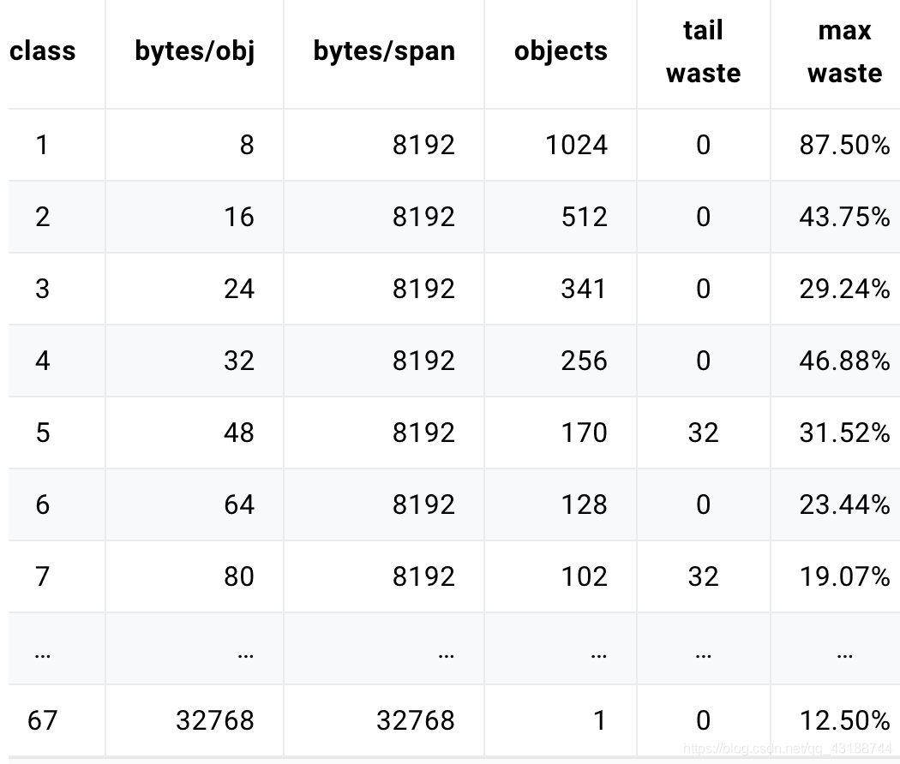

# Go 内存分配机制？

Go 语言内置运行时（就是 runtime），抛弃了传统的内存分配方式，改为自主管理。这样可以自主地实现更好的内存使用模式，比如内存池、预分配等等。这样，不会每次内存分配都需要进行系统调用。

## 1.设计思想

+ 内存分配算法采用 Google 的 TCMalloc 算法，每个线程都会自行维护一个独立的内存池，进行内存分配时优先从该内存池中分配，当内存池不足时才会向加锁向全局内存池申请，减少系统调用并且避免不同线程对全局内存池的锁竞争。
+ 把内存切分的非常的细小，分为多级管理，以降低锁的粒度。
+ 回收对象内存时，并没有将其真正释放掉，只是放回预先分配的大块内存中，以便复用。只有内存闲置过多的时候，才会尝试归还部分内存给操作系统，降低整体开销。

## 2.分配组件

Go 的内存管理组件主要有：`mspan`、`mcache`、`mcentral`和 `mheap`。



### 1.1 内存管理单元 mspan

`mspan` 是内存管理的基本单元，该结构体中包含 `next` 和 `prev` 两个字段，它们分别指向了前一个和后一个 `mspan`，每个 `mspan` 都管理 `npages` 个大小为 8KB 的页，一个 `span` 是由多个 `page` 组成的，这里的页不是操作系统中的内存页，它们是操作系统内存页的整数倍。

`page` 是内存存储的基本单元，“对象”放到 `page` 中。

```go
type mspan struct {
    next *mspan // 后指针
    prev *mspan // 前指针
    startAddr uintptr // 管理页的起始地址，指向 page
    npages    uintptr // 页数
    spanclass   spanClass // 规格
    ...
}

type spanClass uint8
```

Go 有 68 种不同大小的 `spanClass`，用于小对象的分配。

```go
const _NumSizeClasses = 68
var class_to_size = [_NumSizeClasses]uint16{0, 8, 16, 32, 48, 64, 80, 96, 112, 128, 144, 160, 176, 192, 208, 224, 240, 256, 288, 320, 352, 384, 416, 448, 480, 512, 576, 640, 704, 768, 896, 1024, 1152, 1280, 1408, 1536,1792, 2048, 2304, 2688, 3072, 3200, 3456, 4096, 4864, 5376, 6144, 6528, 6784, 6912, 8192, 9472, 9728, 10240, 10880, 12288, 13568, 14336, 16384, 18432, 19072, 20480, 21760, 24576, 27264, 28672, 32768}
```

如果按照序号为 1 的 `spanClass`（对象规格为 8B）分配，每个 `span` 占用堆的字节数：8k，`mspan` 可以保存 1024 个对象

如果按照序号为 2 的 `spanClass`（对象规格为 16B）分配，每个 `span` 占用堆的字节数：8k，`mspan` 可以保存 512 个对象

···

如果按照序号为 67 的 `spanClass`（对象规格为 32K）分配，每个 `span` 占用堆的字节数：32k，`mspan` 可以保存 1 个对象



字段含义：

+ class：class ID，每个 `span` 结构中都有一个 class ID, 表示该 `span` 可处理的对象类型
+ bytes/obj：该 class 代表对象的字节数
+ bytes/span：每个 `span` 占用堆的字节数，也即页数*页大小
+ objects: 每个 `span` 可分配的对象个数，也即（bytes/spans）/（bytes/obj）
+ waste bytes: 每个 `span` 产生的内存碎片，也即（bytes/spans）%（bytes/obj）

大于 32k 的对象出现时，会直接从 heap 分配一个特殊的 `span`，这个特殊的 `span` 的类型(class)是 0, 只包含了一个大对象

### 1.2 线程缓存 mcache

`mcache` 管理线程在本地缓存的 `mspan`，每个 goroutine 绑定的 P 都有一个 `mcache` 字段。

```go
type mcache struct {
    alloc [numSpanClasses]*mspan
}

_NumSizeClasses = 68
numSpanClasses = _NumSizeClasses << 1
```

`mcache` 用 `Span Classes` 作为索引管理多个用于分配的 `mspan`，它包含所有规格的 `mspan`。它是 `_NumSizeClasses` 的 2 倍，也就是 68\*2=136，其中 \*2 是将 `spanClass` 分成了有指针和没有指针两种，方便与垃圾回收。对于每种规格，有 2 个 `mspan`，一个 `mspan` 不包含指针，另一个 `mspan` 则包含指针。对于无指针对象的 `mspan` 在进行垃圾回收的时候无需进一步扫描它是否引用了其他活跃的对象。

`mcache` 在初始化的时候是没有任何 `mspan` 资源的，在使用过程中会动态地从 `mcentral` 申请，之后会缓存下来。当对象小于等于 32KB 大小时，使用 `mcache` 的相应规格的 `mspan` 进行分配。

### 1.3 中心缓存 mcentral

`mcentral` 管理全局的 `mspan` 供所有线程使用，全局 `mheap` 变量包含 `central` 字段，每个 `mcentral` 结构都维护在 `mheap` 结构内。

```go
type mcentral struct {
    spanclass spanClass // 指当前规格大小

    partial [2]spanSet // 有空闲object的mspan列表
    full    [2]spanSet // 没有空闲object的mspan列表
}
```

每个 `mcentral` 管理一种 `spanClass` 的 `mspan`，并将有空闲空间和没有空闲空间的 `mspan` 分开管理。`partial` 和 `full` 的数据类型为 `spanSet`，表示 `mspans` 集，可以通过 pop、push 来获得 `mspans`。

```go
type spanSet struct {
    spineLock mutex
    spine     unsafe.Pointer // 指向[]span的指针
    spineLen  uintptr        // Spine array length, accessed atomically
    spineCap  uintptr        // Spine array cap, accessed under lock

    index headTailIndex  // 前32位是头指针，后32位是尾指针
}
```

简单说下 `mcache` 从 `mcentral` 获取和归还 `mspan` 的流程：

+ 获取：加锁，从 `partial` 链表找到一个可用的 `mspan`；并将其从 `partial` 链表删除；将取出的 `mspan` 加入到 `full` 链表；将 `mspan` 返回给工作线程，解锁。
+ 归还：加锁，将 `mspan` 从 `full` 链表删除；将 `mspan` 加入到 `partial` 链表，解锁。

### 1.4 页堆 mheap

`mheap` 管理 Go 的所有动态分配内存，可以认为是 Go 程序持有的整个堆空间，全局唯一。

```go
var mheap_ mheap
type mheap struct {
    lock      mutex    // 全局锁
    pages     pageAlloc // 页面分配的数据结构
    allspans []*mspan // 所有通过 mheap_ 申请的mspans
        // 堆
    arenas [1 << arenaL1Bits]*[1 << arenaL2Bits]*heapArena
    
        // 所有中心缓存mcentral
    central [numSpanClasses]struct {
        mcentral mcentral
        pad      [cpu.CacheLinePadSize - unsafe.Sizeof(mcentral{})%cpu.CacheLinePadSize]byte
    }
    ...
}
```

所有 `mcentral` 的集合则是存放于 `mheap` 中的。`mheap` 里的 `arena` 区域是堆内存的抽象，运行时会将 8KB 看做一页，这些内存页中存储了所有在堆上初始化的对象。运行时使用二维的 `runtime.heapArena` 数组管理所有的内存，每个 `runtime.heapArena` 都会管理 64MB 的内存。

当申请内存时，依次经过 `mcache` 和 `mcentral` 都没有可用合适规格的大小内存，这时候会向 `mheap` 申请一块内存。然后按指定规格划分为一些列表，并将其添加到相同规格大小的 `mcentral` 的 非空闲列表 后面。

## 3.分配对象

+ 微对象 (0, 16B)：先使用线程缓存上的微型分配器，再依次尝试线程缓存、中心缓存、堆分配内存；
+ 小对象 [16B, 32KB]：依次尝试线程缓存、中心缓存、堆分配内存；
+ 大对象 (32KB, +∞)：直接尝试堆分配内存；

## 4.分配流程

+ 首先通过计算使用的大小规格
+ 然后使用 `mcache` 中对应大小规格的块分配。
+ 如果 `mcentral` 中没有可用的块，则向 `mheap` 申请，并根据算法找到最合适的 `mspan`。
+ 如果申请到的 `mspan` 超出申请大小，将会根据需求进行切分，以返回用户所需的页数。剩余的页构成一个新的 `mspan` 放回 `mheap` 的空闲列表。
+ 如果 `mheap` 中没有可用 `span`，则向操作系统申请一系列新的页（最小 1MB）

