# Go GC 的发展史

- [Go GC 的发展史](#go-gc-的发展史)
  - [1.Go V1.3 之前的标记-清除（mark and sweep）方法](#1go-v13-之前的标记-清除mark-and-sweep方法)
    - [1.1 流程](#11-流程)
    - [1.2 缺点](#12-缺点)
  - [2.Go V1.5 的三色标记法](#2go-v15-的三色标记法)
    - [2.1 流程](#21-流程)
    - [2.2 如果三色标记法不被 STW 保护](#22-如果三色标记法不被-stw-保护)
    - [2.3 强弱三色不变式](#23-强弱三色不变式)
    - [2.4 屏障机制](#24-屏障机制)
      - [2.4.1 插入屏障](#241-插入屏障)
      - [2.4.2 删除屏障](#242-删除屏障)
  - [3.GO V1.8 混合写屏障机制](#3go-v18-混合写屏障机制)
    - [3.1 具体操作](#31-具体操作)
    - [3.2 伪代码](#32-伪代码)
    - [3.3 场景](#33-场景)
      - [3.3.1 对象被一个堆对象删除引用，称为栈对象的下游](#331-对象被一个堆对象删除引用称为栈对象的下游)
      - [3.3.2 对象被一个栈对象删除引用，成为另一个栈对象的下游](#332-对象被一个栈对象删除引用成为另一个栈对象的下游)
      - [3.3.3 对象被一个堆对象删除引用，成为另一个堆对象的下游](#333-对象被一个堆对象删除引用成为另一个堆对象的下游)
      - [3.3.4 对象从一个栈对象删除已用，成为另一个堆对象的下游](#334-对象从一个栈对象删除已用成为另一个堆对象的下游)
  - [4.参考](#4参考)

## 1.Go V1.3 之前的标记-清除（mark and sweep）方法

### 1.1 流程

1. 暂停程序业务逻辑，找出不可达对象和可达对象。

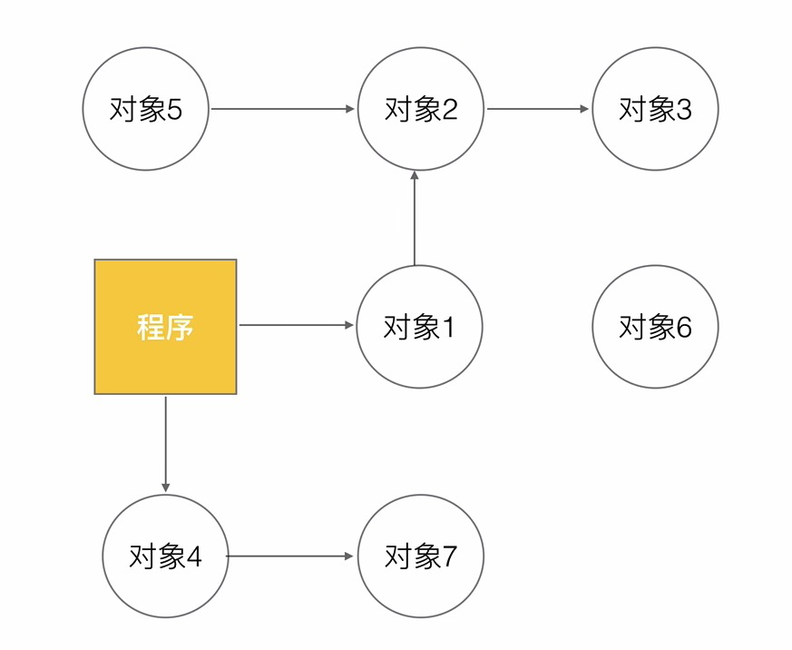

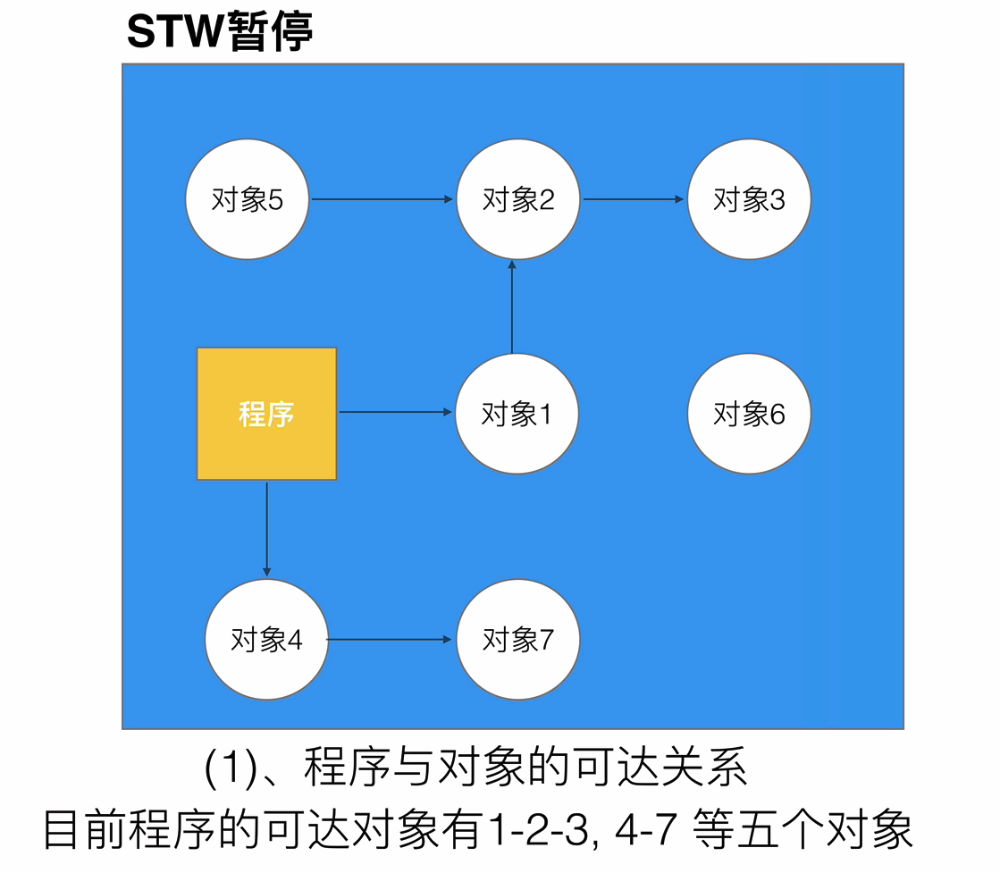

2. 标记可达对象。

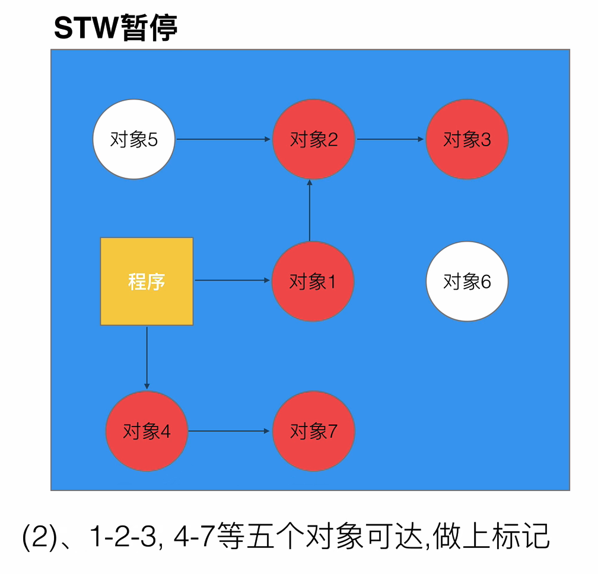

3. 标记完了之后，清除未标记对象。

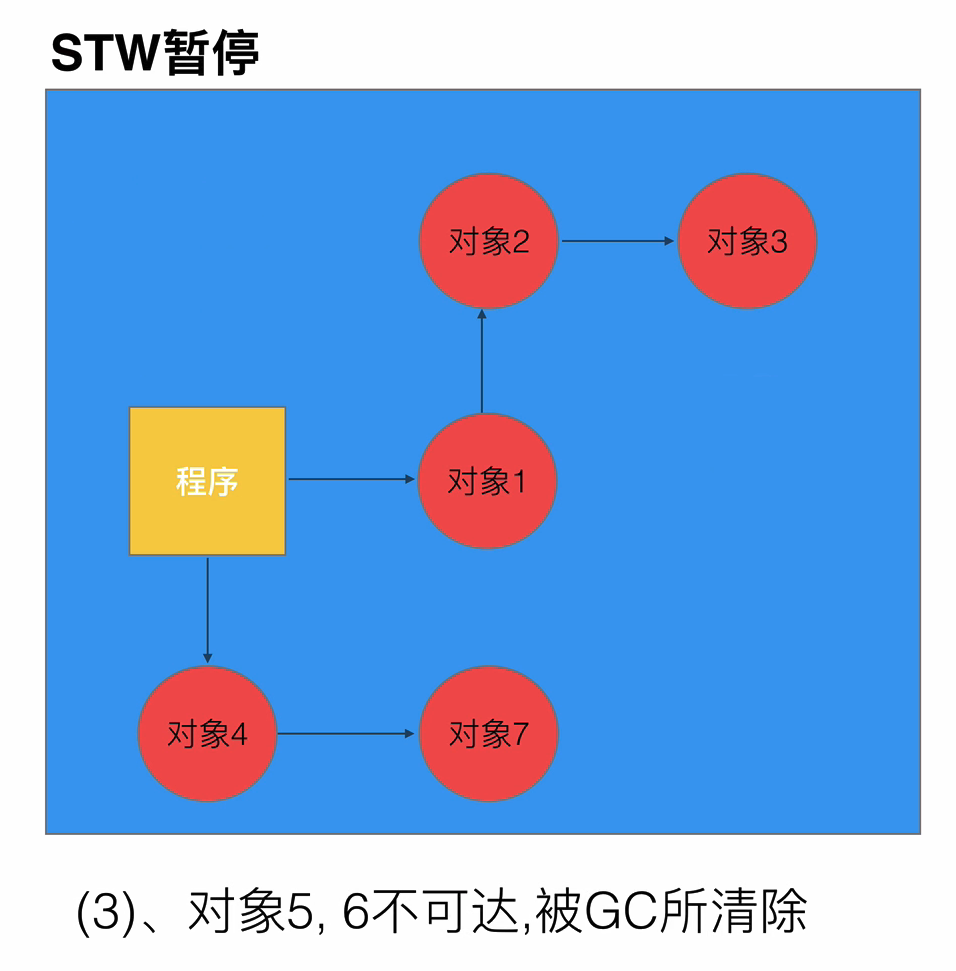

4. 停止暂停，让程序继续跑。然后循环重复这个过程，直到 process 程序生命周期结束。

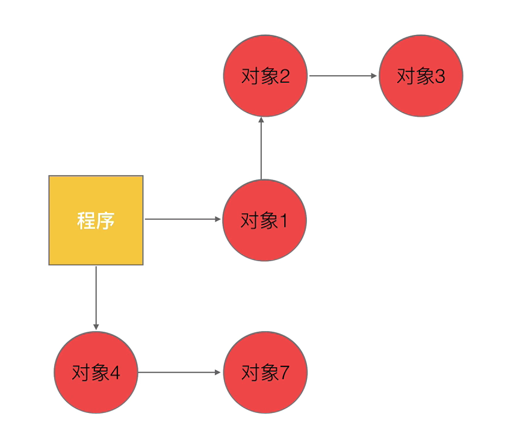

### 1.2 缺点

1. **STW（stop the world）：让程序暂停，程序出现卡顿**
2. 标记需要扫描整个 heap
3. 清除数据会产生 heap 碎片

## 2.Go V1.5 的三色标记法

### 2.1 流程

1. 只要是新创建的对象，默认的颜色都标记为白色。

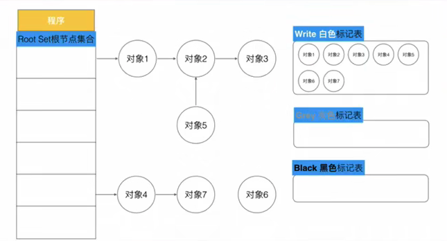

2. 每次 GC 回收开始，然后从根节点开始遍历所有对象，把遍历到的对象从白色集合放入灰色集合。

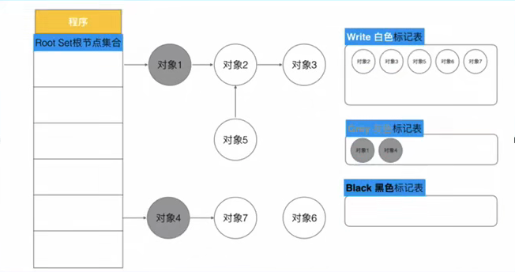

3. 遍历灰色集合，将灰色对象引用的对象从白色集合放入灰色集合，之后将灰色对象放入黑色集合。

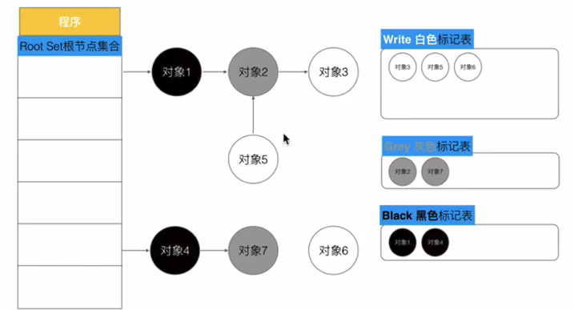

4. 重复地散步，直到灰色集合中无任何对象。

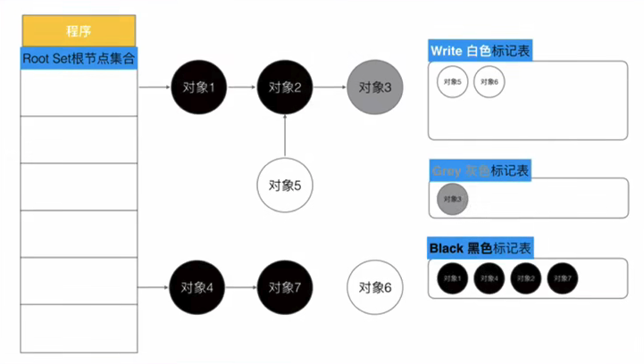

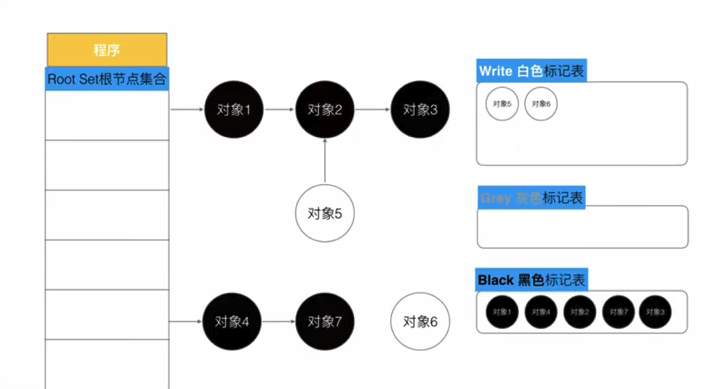

5. 回收所有白色标记表的对象，也就是垃圾回收。

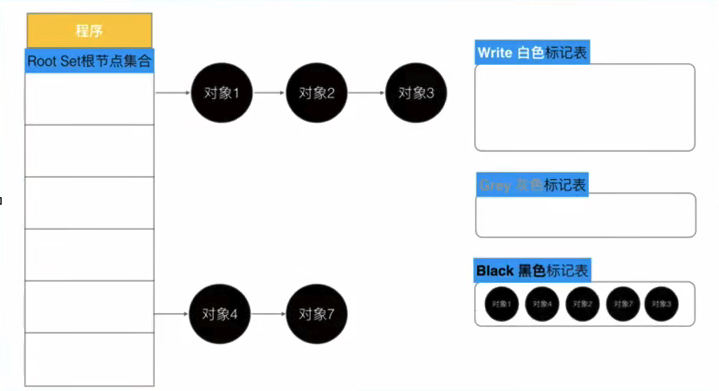

### 2.2 如果三色标记法不被 STW 保护

+ 一个白色对象被黑色对象引用
+ 同时，灰色对象与它之间的可达关系的该白色对象遭到破坏

当上述 2 个条件同时满足时就会出现对象丢失的对象。

### 2.3 强弱三色不变式

**如果三色标记满足强弱不变式之一，即可保证不丢失对象。**

+ 强三色不变式：破坏条件1

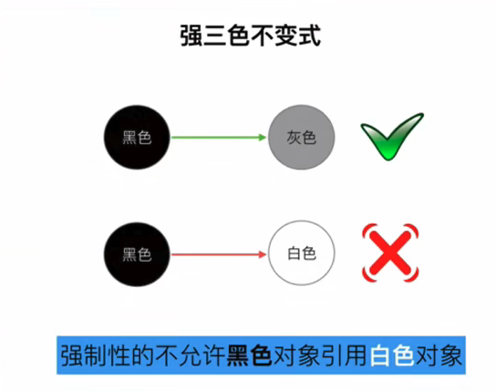

+ 弱三色不变式：破坏条件2

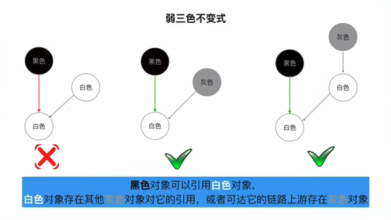

### 2.4 屏障机制

#### 2.4.1 插入屏障

对象被引用时，触发的机制。

具体操作：在 A 对象引用 B 对象时，B 对象被标记为灰色。（将 B 挂在 A 下游，B 必须被标记为灰色）

满足强三色不变式。不存在黑色对象引用白色对象的情况，因为白色会强制变为灰色。

**伪代码：**

```
添加下游对象(当前下游对象slot, 新下游对象ptr) {
    // 1
    标记灰色(新下游对象ptr)

    // 2
    当前下游对象slot = 新下游对象ptr
}
```

**场景：**

+ 添加下游对象(nil, B)  // A 之前没有下游，新添加一个下游对象 B，B 被标记为灰色
+ 添加下游对象(C, B)    // A 将下游对象 C 更换为 B，B 被标记为 灰色

**不足：**

结束时需要 STW 来重新扫描栈，大约需要 10~100ms。

#### 2.4.2 删除屏障

对象被删除时，触发的机制。

具体操作：被删除的对象，如果自身为灰色或者白色，那么被标记为灰色。

满足弱三色不变式。保护灰色对象到白色对象的路径不会断。

**伪代码：**

```
添加下游对象(当前下游对象slot, 新下游对象ptr) {
    // 1
    if (当前下游对象 slot 是灰色 || 当前下游对象 slot 是白色) {
        标记灰色(当前下游对象slot)  // slot 为被删除对象，标记为灰色。
    }

    // 2 
    当前下游对象slot = 新下游对象ptr
}
```

**场景：**

+ 添加下游对象(B, nil)  // A 对象，删除 B 对象的引用。B 被 A 删除，被标记为灰（如果 B 之前为白）
+ 添加下游对象(B, C)    // A 对象，更换下游 B 变成 C。B 被 A 删除，被标记为灰（如果 B 之前为白）

**不足：**

回收精度低，一个对象及时被删除了最后一个指向它的指针也依旧可以活过这一轮，在下一轮 GC 中被清理掉。

## 3.GO V1.8 混合写屏障机制

### 3.1 具体操作

1. GC 开始将栈上的对象全部扫描并标记为黑色（之后不再进行第二次重复扫描，无需 STW）。
2. GC 期间，任何栈上创建的新对象，均为黑色。
3. 被删除的对象标记为灰色。
4. 被添加的对象标记为灰色。

### 3.2 伪代码

```
添加下游对象(当前下游对象slot, 新下游对象ptr) {
    // 1
    标记灰色(当前下游对象slot)      // 只要下游对象被移走，就标记为灰色

    // 2
    标记灰色(新下游对象ptr)

    // 3
    当前下游对象slot = 新下游对象 ptr
}
```

### 3.3 场景

#### 3.3.1 对象被一个堆对象删除引用，称为栈对象的下游

伪代码：

```
obj4->next = obj7   // 堆对象 7 被堆对象 4 引用
obj1->next = obj7   // 堆对象 7 被栈对象 1 引用
obj4->next = null   // 堆对象 4 删除引用堆对象 7
```

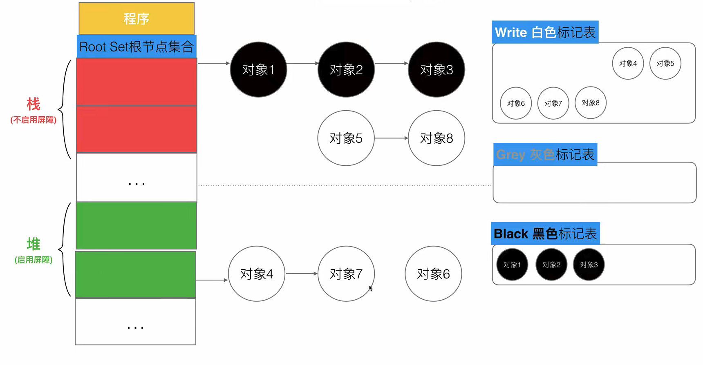

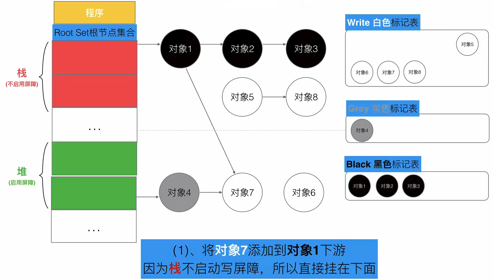

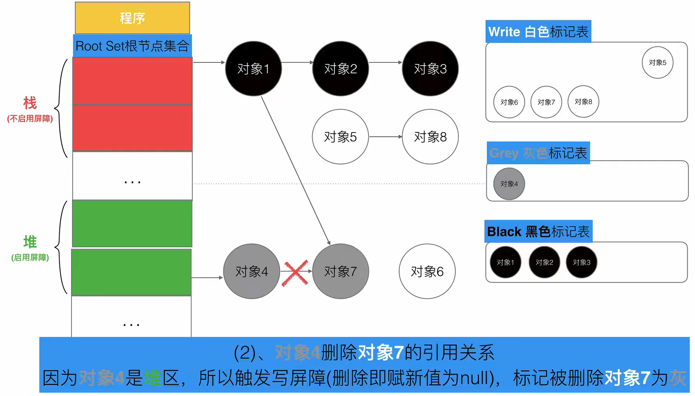

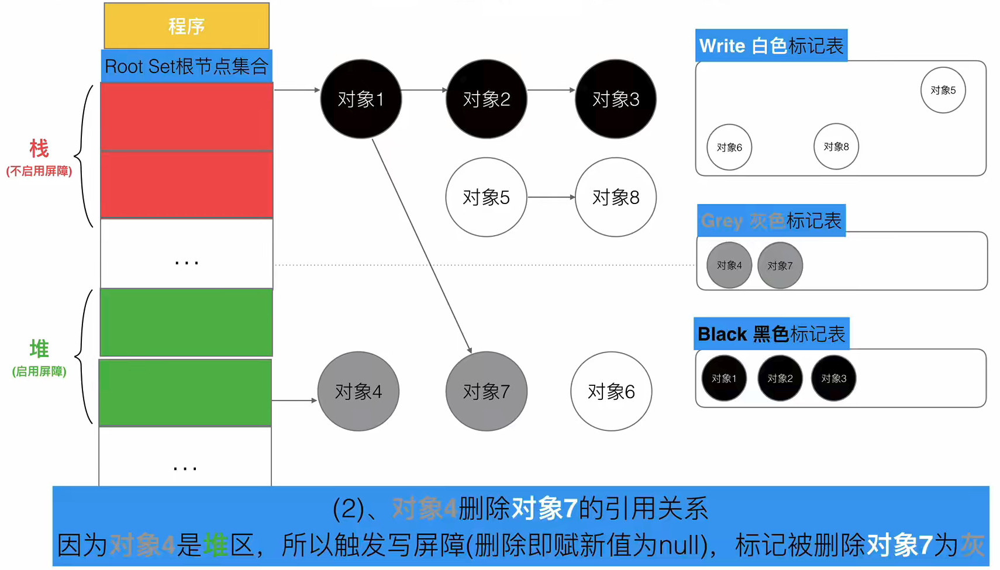

#### 3.3.2 对象被一个栈对象删除引用，成为另一个栈对象的下游

伪代码：

```
new obj9    // 初始化栈对象 9
obj9->next = obj3   // 将栈对象 3 挂在栈对象 9 的下游
obj2->next = null   // 栈对象 2 删除引用对象 3
```

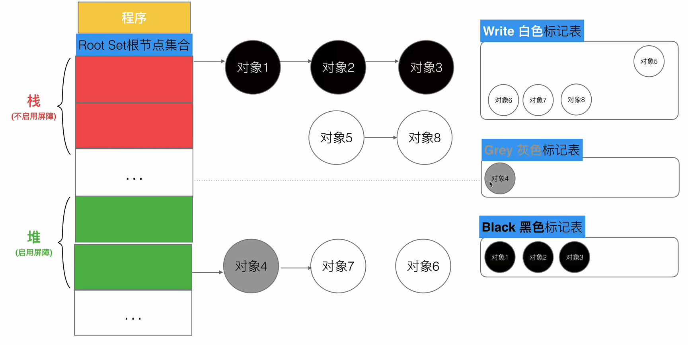

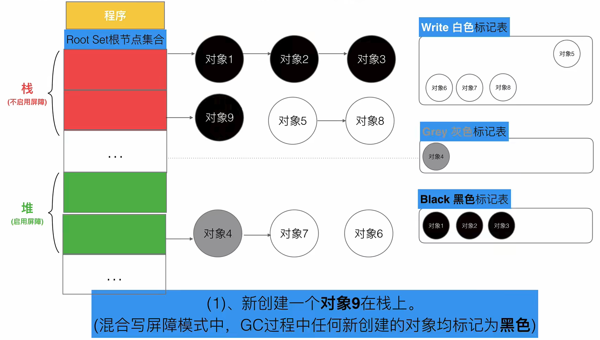

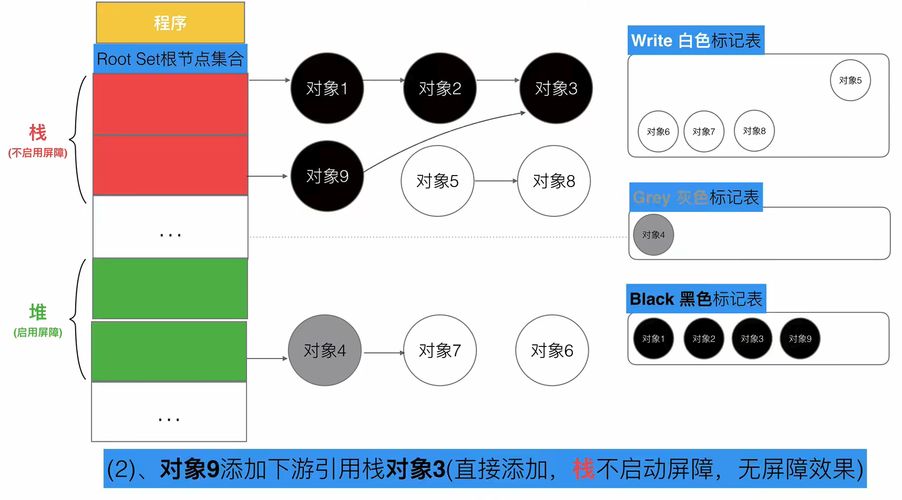

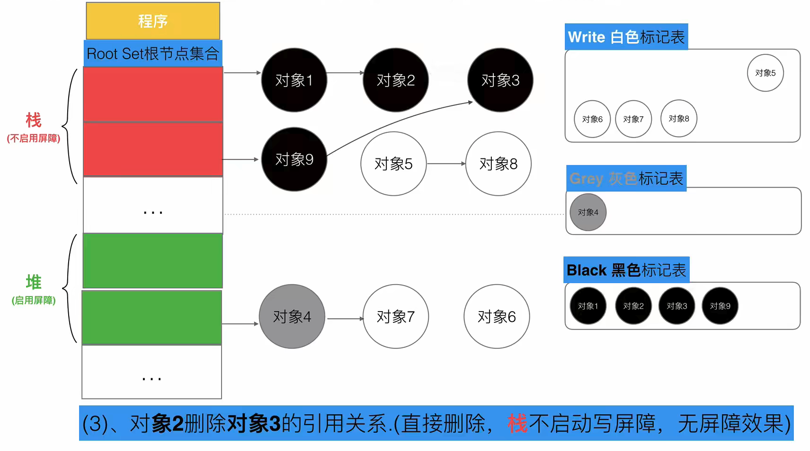

#### 3.3.3 对象被一个堆对象删除引用，成为另一个堆对象的下游

伪代码：

```
obj10->next = obj7  // 将堆对象 7 挂在堆对象 10 下游
obj4->next = null   // 堆对象 4 删除引用堆对象 7
```

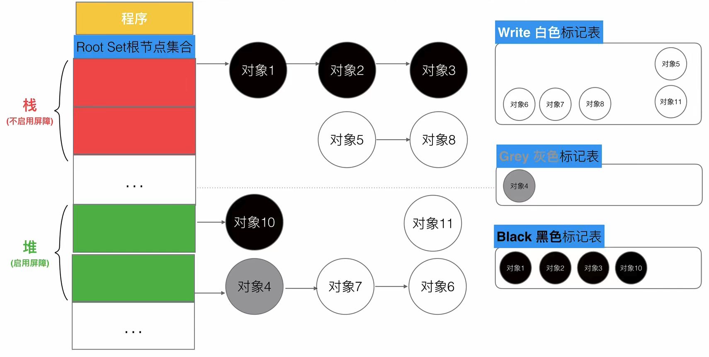

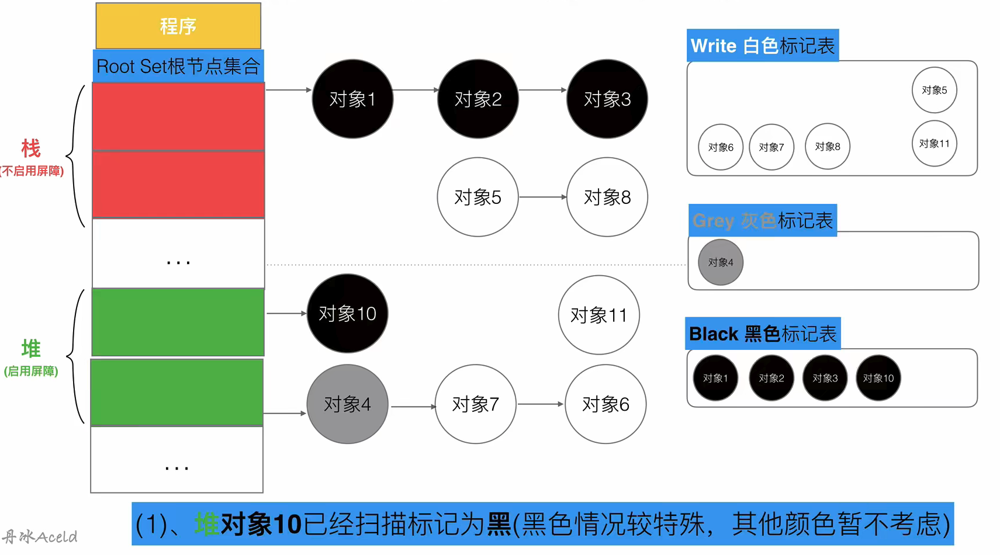

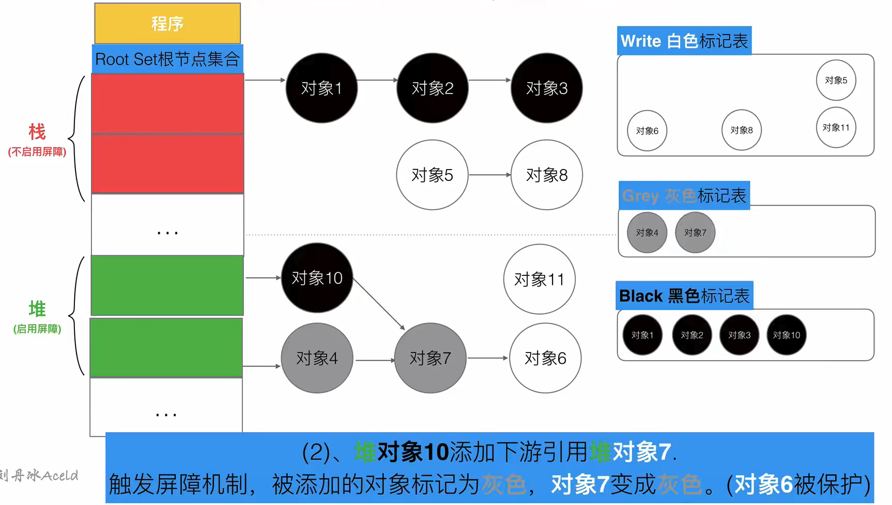

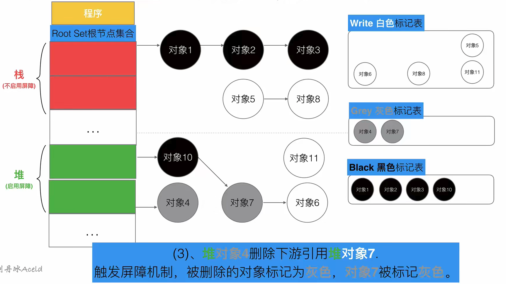

#### 3.3.4 对象从一个栈对象删除已用，成为另一个堆对象的下游

伪代码：

```
obj1->next = null   // 栈对象 1 删除引用栈对象 2
obj4->next = obj2   // 堆对象 4 添加下游栈对象 2，删除原有下游栈对象 7
```


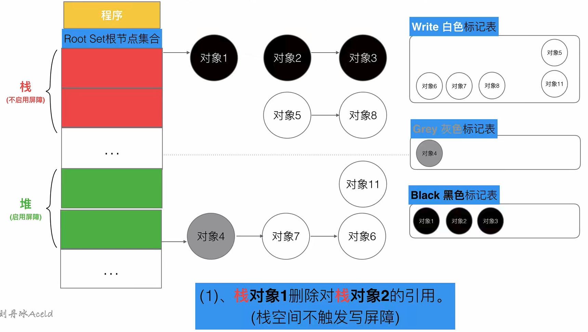

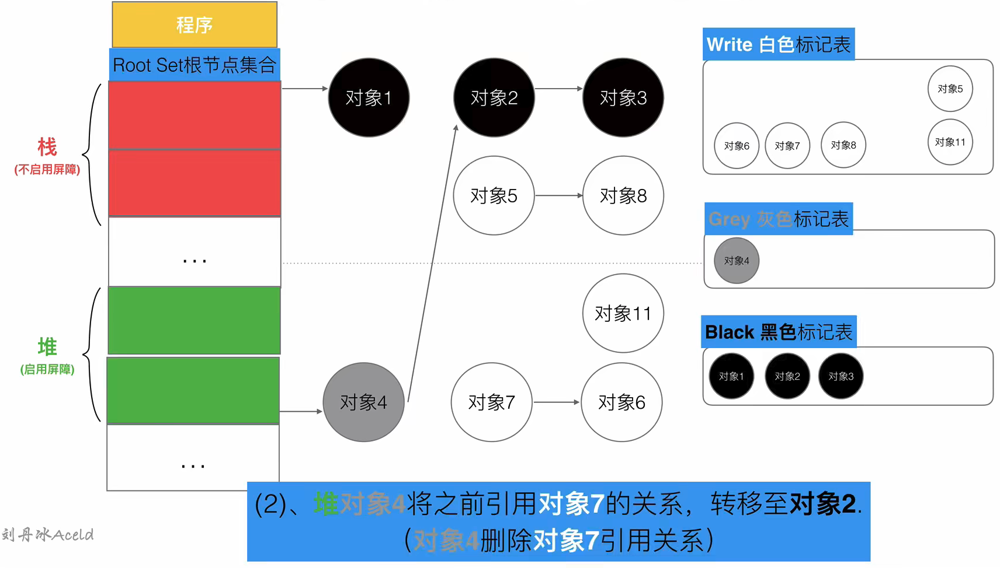

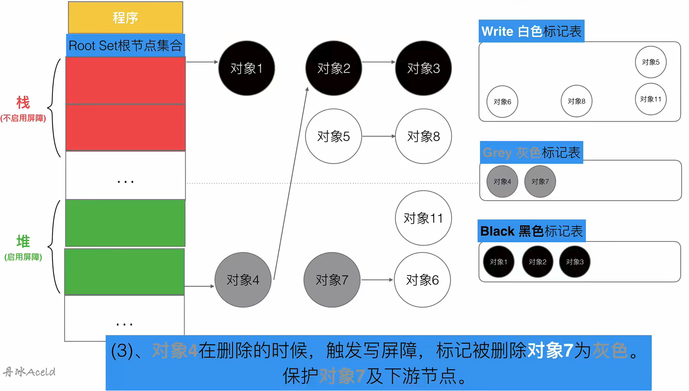

## 4.参考

[Golang中GC回收机制三色标记与混合写屏障 - bilibili](https://www.bilibili.com/video/BV1wz4y1y7Kd)