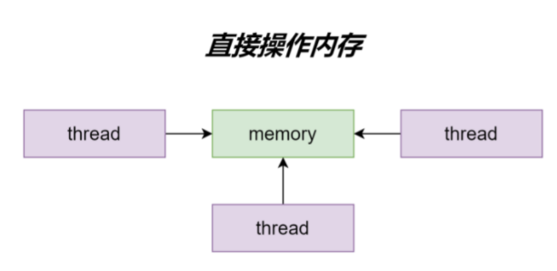
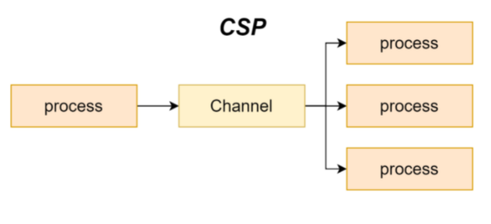

# Go 常用的并发模型

并发模型说的是系统中的线程如何协作完成并发任务，不同的并发模型，线程以不同的方式进行**通信**和协作。

## 1.线程间通信方式

线程间通信方式有两种：共享内存和消息传递，无论是哪种通信模型，线程或者协程最终都会从内存中获取数据，所以更为准确的说法是直接共享内存、发送消息的方式来同步信息。

### 1.1 共享内存

**抽象层级**：抽象层级低，当我们遇到对资源进行更细粒度的控制或者对性能有极高要求的场景才应该考虑抽象层级更低的方法。

**耦合**：高，线程需要在读取或者写入数据时先获取保护该资源的互斥锁。

**线程竞争**：需要加锁，才能避免线程竞争和数据冲突。

### 1.2 发送消息

**抽象层级**：抽象层级高，提供了更良好的封装和与领域更相关和契合的设计，比如 Go 语言中的 channel 就提供了 goroutine 之间用于传递信息的方式，它在内部实现时就广泛用到了共享内存和锁，通过对两者进行的组合提供了更高级的同步机制。

**耦合**：低，生产消费者模型

**线程竞争**：保证同一时间只有一个活跃的线程能够访问数据，channel 维护所有被该 channel 阻塞的协程，保证有资源的时候只唤醒一个协程，从而避免竞争。

Go语言中实现了两种并发模型，一种是共享内存并发模型，另一种则是 CSP 模型。

## 2.共享内存并发模型

通过直接共享内存 + 锁的方式同步信息，传统多线程并发。

## 3.CSP 并发模型

通过发送消息的方式来同步信息，Go 语言推荐使用的通信顺序进程（communicating sequential processes）并发模型，通过 goroutine 和 channel 来实现。

+ goroutine 是 Go 语言中并发的执行单位，可以理解为”线程“
+ channel 是 Go 语言中各个并发结构体（goroutine）之间的通信机制。通俗的讲，就是各个 goroutine 之间通信的”管道“，类似于 Linux 中的管道。

