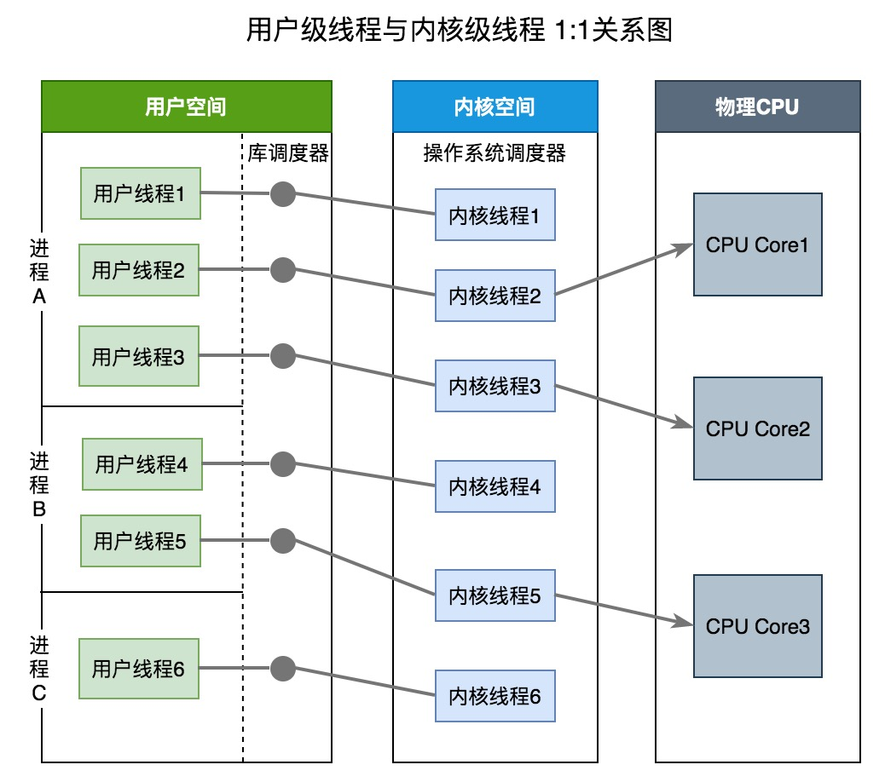
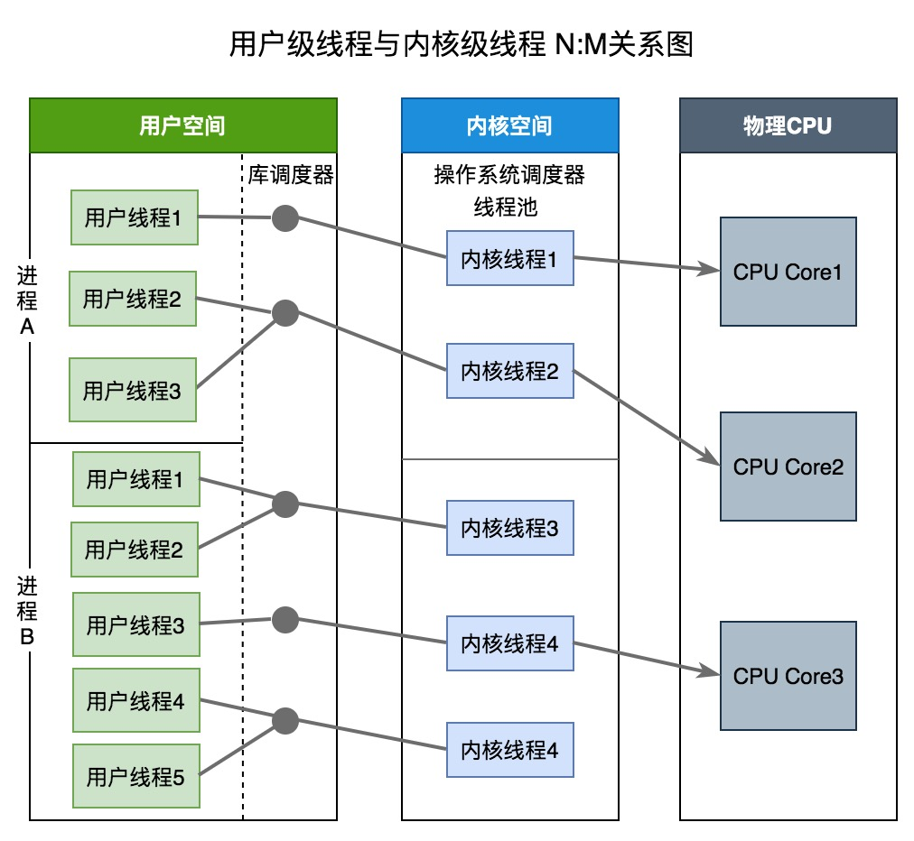

# Go 线程实现模型

Go 实现的是两级线程模型（M：N)，准确的说是 GMP 模型，是对两级线程模型的改进实现，使它能够更加灵活地进行线程之间的调度。

## 1.背景

### 1.1 单进程时代

每个程序就是一个进程，直到一个程序运行完，才能进行下一个进程。

缺点：

1. 无法并发，只能串行
2. 进程阻塞所带来的 CPU 时间浪费

### 1.2 多进程/线程时代	

一个线程阻塞， CPU 可以立刻切换到其他线程中去执行。

缺点：

1. 进程/线程占用内存高
2. 进程/线程上下文切换成本高

### 1.3 线程 -> CPU 

由操作系统调度，协程 -> 线程。

由 Go 调度器来调度，协程与线程的映射关系有三种线程模型。

## 2.三种线程模型

线程实现模型主要分为：`内核级线程模型`、`用户级线程模型`、`两级线程模型`，他们的区别在于用户线程与内核线程之间的对应关系。

### 2.1 内核级线程模型（1：1）

1 个用户线程对应 1 个内核线程，这种最容易实现，协程的调度都由 CPU 完成了

优点：

+ 实现起来最简单
+ 能够利用多核
+ 如果进程中的一个线程被阻塞，不会阻塞其他线程，是能够切换同一进程内的其他线程继续执行

缺点：

+ 上下文切换成本高，创建、删除和切换都由 CPU 完成

### 2.2 用户级线程模型（N：1）

1 个进程中的所有线程对应 1 个内核线程

优点：

+ 上下文切换成本低，在用户态即可完成线程切换

缺点：

+ 无法利用多核
+ 一旦协程阻塞，造成线程阻塞，本线程的其它线程无法执行

### 2.3 两级线程模型（M：N)

M 个线程对应 N 个内核线程。

优点：

+ 能够利用多核
+ 上下文切换成本低
+ 如果进程中的一个线程被阻塞，不会阻塞其他线程，是能够切换同一进程内的其他线程继续执行

缺点：

+ 实现起来最复杂