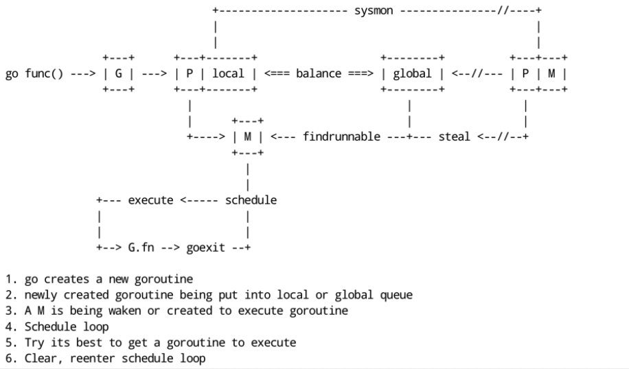
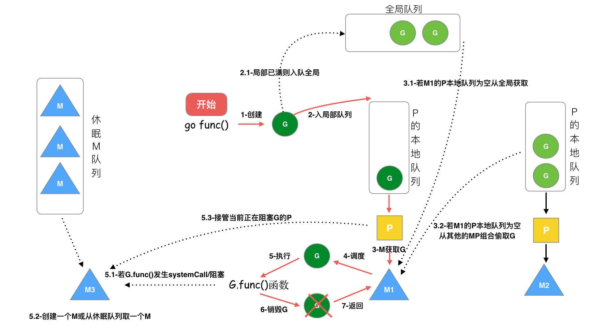
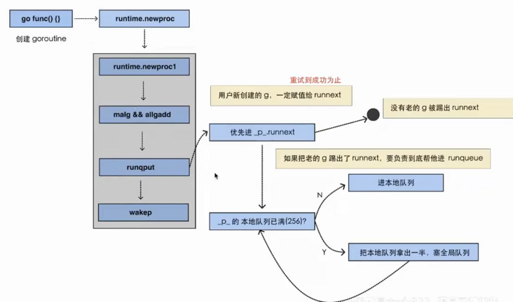

# Go 调度原理

goroutine 调度的本质就是将 **Goroutine (G）** 按照一定算法放到 CPU 上去执行。

CPU 感知不到 Goroutine，只知道内核线程，所以需要 Go 调度器将协程调度到内核线程上面去，然后操作系统调度器将内核线程放到 CPU 上去执行。

M 是对内核级线程的封装，所以 Go 调度器的工作就是将 G 分配到 M。

Go 调度器的实现不是一蹴而就的，它的调度模型与算法也是几经演化，从最初的 GM 模型，到 GMP 模型，从不支持抢占，到支持协作式抢占，再到支持基于信号的异步抢占，经历了不断地优化与打磨。

## 1.设计思想

+ 线程复用（work stealing 机制和 hand off 机制）
+ 利用并行（利用多核 CPU）
+ 抢占调度（解决公平性问题）

## 2.调度对象

Go 调度器

Go 调度器是属于 Go runtime 中的一部分，Go runtime 负责实现 Go 的并发调度、垃圾回收、内存堆栈管理等关键功能。

## 3.被调度对象

G 的来源

+ P 的 runnext（只有 1 个 G，局部性原理，永远会被最先调度执行）
+ P的本地队列（数组，最多 256 个 G）
+ 全局 G 队列（链表，无限制）
+ 网络轮询器 network poller（存放网络调用被阻塞的 G）

P 的来源

+ 全局 P 队列（数组，GOMAXPROCS 个 P）

M 的来源

+ 休眠线程队列（未绑定 P，长时间休眠会等待 GC 回收销毁）
+ 运行线程（绑定 P，指向 P 中的 G）
+ 自旋线程（绑定 P，指向 M 的 G0）

其中运行线程数 + 自旋线程数 <= P的数量（GOMAXPROCS），M个数 >= P个数

## 4.调度流程

协程的调度采用了生产者-消费者模型，实现了用户任务与调度器的解耦。





生产端我们开启的每个协程都是一个计算任务，这些任务会被提交给 go 的 runtime。如果计算任务非常多，有成千上万个，那么这些任务是不可能同时被立刻执行的，所以这个计算任务一定会被先暂存起来，一般的做法是放到内存的队列中等待被执行。

G 的生命周期：G 从创建、保存、被获取、调度和执行、阻塞、销毁，步骤如下：

1. **创建 G**，关键字 `go func()` 创建 G 
2. **保存 G**，创建的 G 优先保存到本地队列 P，如果 P 满了，则会平衡部分 P 到全局队列中
3. 唤醒或者新建 M 执行任务，进入调度循环（步骤 4，5，6)
4. M 首先从 P 的本地队列获取 G，如果 P 为空，则从全局队列获取 G，如果全局队列也为空，则从另一个本地队列偷取一半数量的 G（负载均衡），这种从其它 P 偷取 G 的方式称之为 **work stealing** 
5. M 调度和执行 G，M 调用 `G.func()` 函数执行 G
    + 如果 M 在执行 G 的过程发生**系统调用阻塞**（同步），会阻塞 G 和 M（操作系统限制），此时 P 会和当前 M 解绑，并寻找新的 M，如果没有空闲的 M 就会新建一个 M，来接管这个 P，接着继续执行 P 中其余的 G，这种阻塞后释放 P 的方式称之为 **hand off**。当系统调用结束后，这个 G 会尝试获取一个空闲的 P 执行，优先获取之前绑定的 P，并放入到这个 P 的本地队列，如果获取不到 P，那么这个线程 M 变成休眠状态，加入到空闲线程中，然后这个 G 会被放入到全局队列中。
    + 如果 M 在执行 G 的过程发生网络 IO 等操作阻塞时（异步），阻塞 G，不会阻塞 M。M 会寻找 P 中其它可执行的 G 继续执行，G 会被网络轮询器 network poller 接手，当阻塞的 G 恢复后，会从 network poller 被移回到 P 的 LRQ 中，重新进入可执行状态。异步情况下，通过调度，Go scheduler 成功地将 I/O 的任务转变成了 CPU 任务，或者说将内核级别的线程切换转变成了用户级别的 goroutine 切换，大大提高了效率。
6. **M 执行完 G 后清理现场**，重新进入调度循环（将 M 上运⾏的 goroutine 切换为 G0，G0 负责调度时协程的切换）

其中步骤 2 中保存 G 的详细流程如下：

+ 执行 go func 的时候，主线程 M0 会调用 `newproc()` 生成一个 G 结构体，这里会先选定当前 M0 上的 P 结构
+ 每个协程 G 都会被尝试先放到 P 中的 runnext，若 runnext 为空则放到 runnext 中，生产结束
+ 若 runnext 满，则将原来 runnext 中的 G 踢到本地队列中，将当前 G 放到 runnext 中，生产结束
+ 若本地队列也满了，则将本地队列中的 G 拿出一半，放到全局队列中，生产结束。



## 5.调度时机

**什么时候进行调度（执行/切换）？**

在以下情形下，会切换正在执行的 goroutine

+ 抢占式调度
  + sysmon 检测到协程运行过久（比如sleep，死循环）
    + 切换到g0，进入调度循环
+ 主动调度
  + 新起一个协程和协程执行完毕
    + 触发调度循环
  + 主动调用 runtime.Gosched()
    + 切换到g0，进入调度循环
  + 垃圾回收之后
    + stw 之后，会重新选择 g 开始执行
+ 被动调度
  + 系统调用（比如文件IO）阻塞（同步）
    + 阻塞 G 和 M，P 与 M 分离，将 P 交给其它 M 绑定，其它 M 执行 P 的剩余 G
  + 网络IO调用阻塞（异步）
    + 阻塞 G，G 移动到 NetPoller，M执行P的剩余G
  + atomic/mutex/channel 等阻塞（异步）
    + 阻塞 G，G 移动到 channel 的等待队列中，M 执行 P 的剩余 G

## 6.调度策略

**使用什么策略来挑选下一个goroutine执行？**

由于 P 中的 G 分布在 runnext、本地队列、全局队列、网络轮询器中，则需要挨个判断是否有可执行的 G，大体逻辑如下：

+ 每执行 61 次调度循环，从全局队列获取 G，若有则直接返回
+ 从 P 上的 runnext 看一下是否有 G，若有则直接返回
+ 从 P 上的 本地队列 看一下是否有 G，若有则直接返回
+ 上面都没查找到时，则去全局队列、网络轮询器查找或者从其他 P 中窃取，**一直阻塞**直到获取到一个可用的 G 为止

源码实现如下：

```go
func schedule() {
    _g_ := getg()
    var gp *g
    var inheritTime bool
    ...
    if gp == nil {
        // 每执行 61 次调度循环会看一下全局队列。为了保证公平，避免全局队列一直无法得到执行的情况，当全局运行队列中有待执行的 G 时，通过 schedtick 保证有一定几率会从全局的运行队列中查找对应的 goroutine；
        if _g_.m.p.ptr().schedtick%61 == 0 && sched.runqsize > 0 {
            lock(&sched.lock)
            gp = globrunqget(_g_.m.p.ptr(), 1)
            unlock(&sched.lock)
        }
    }
    if gp == nil {
        // 先尝试从 P 的 runnext 和本地队列查找 G
        gp, inheritTime = runqget(_g_.m.p.ptr())
    }
    if gp == nil {
        // 仍找不到，去全局队列中查找。还找不到，要去网络轮询器中查找是否有 G 等待运行；仍找不到，则尝试从其他 P 中窃取 G 来执行。
        gp, inheritTime = findrunnable() // blocks until work is available
        // 这个函数是阻塞的，执行到这里一定会获取到一个可执行的 G
    }
    ...
    // 调用 execute，继续调度循环
    execute(gp, inheritTime)
}
```

从全局队列查找时，如果要所有 P 平分全局队列中的 G，每个 P 要分得多少个，这里假设会分得 n 个。然后把这 n 个 G，转移到当前 G 所在 P 的本地队列中去。但是最多不能超过 P 本地队列长度的一半（即 128）。这样做的目的是，如果下次调度循环到来的时候，就不必去加锁到全局队列中在获取一次 G 了，性能得到了很好的保障。

```go
func globrunqget(_p_ *p, max int32) *g {
   ...
   // gomaxprocs = p的数量
   // sched.runqsize是全局队列长度
   // 这里 n = 全局队列的G平分到每个P本地队列上的数量 + 1
   n := sched.runqsize/gomaxprocs + 1
   if n > sched.runqsize {
      n = sched.runqsize
   }
   if max > 0 && n > max {
      n = max
   }
   // 平分后的数量 n 不能超过本地队列长度的一半，也就是 128
   if n > int32(len(_p_.runq))/2 {
      n = int32(len(_p_.runq)) / 2
   }

   // 执行将 G 从全局队列中取n个分到当前P本地队列的操作
   sched.runqsize -= n

   gp := sched.runq.pop()
   n--
   for ; n > 0; n-- {
      gp1 := sched.runq.pop()
      runqput(_p_, gp1, false)
   }
   return gp
}
```

从其它 P 查找时，会偷一半的 G 过来放到当前 P 的本地队列。