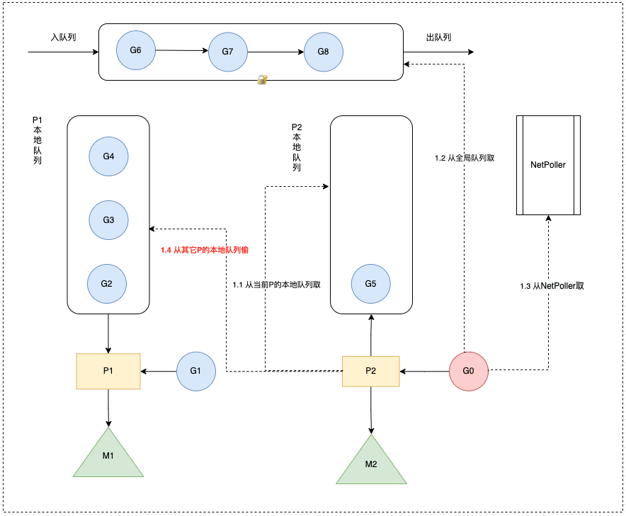

# Go work stealing 机制？

## 1.概念

当线程 M ⽆可运⾏的 G 时，尝试从其他 M 绑定的 P 偷取 G，减少空转，提高了线程利用率（避免闲着不干活）。

当从本线程绑定 P 本地 队列、全局G队列、netpoller 都找不到可执行的 g，会从别的 P 里窃取 G 并放到当前 P 上面。

从 netpoller 中拿到的 G 是 _Gwaiting 状态（存放的是因为网络 IO 被阻塞的 G），从其它地方拿到的 G 是 _Grunnable 状态。

从全局队列取的 G 数量：N = min(len(GRQ)/GOMAXPROCS + 1, len(GRQ/2)) （根据GOMAXPROCS负载均衡）

从其它 P 本地队列窃取的 G 数量：N = len(LRQ)/2（平分）



## 2.窃取流程

源码见 `runtime/proc.go` `stealWork` 函数，窃取流程如下，如果经过多次努力一直找不到需要运行的 goroutine 则调用 stopm 进入睡眠状态，等待被其它工作线程唤醒。

1. 选择要窃取的 P
2. 从 P 中偷走一半 G

### 2.1 选择要窃取的 P

窃取的实质就是遍历 `allp` 中的所有 P，查看其运行队列是否有 goroutine，如果有，则取其一半到当前工作线程的运行队列。

为了保证公平性，遍历 `allp` 时并不是固定的从 `allp[0]` 即第一个 P 开始，而是从随机位置上的 P 开始，而且遍历的顺序也随机化了，并不是现在访问了第 i 个 P 下一次就访问第 i+1 个 P，而是使用了一种伪随机的方式遍历 `allp` 中的每个 P，防止每次遍历时使用同样的顺序访问 `allp` 中的元素。

```go
offset := uint32(random()) % nprocs
coprime := 随机选取一个小于nprocs且与nprocs互质的数
const stealTries = 4 // 最多重试4次
for i := 0; i < stealTries; i++ {
    for i := 0; i < nprocs; i++ {
        p := allp[offset]
        从 P 的运行队列偷取 goroutine
        if 偷取成功 {
            break
        }
        offset += coprime
        offset = offset % nprocs
    }
}
```

可以看到只要随机数不一样，偷取 P 的顺序也不一样，但可以保证经过 nprocs 次循环，每个 P 都会被访问到。

### 2.2 从 P 中偷走一半 G

源码见 `runtime/proc.go` `runqsteal` 函数：

挑选出盗取的对象 P 之后，则调用 `runqsteal` 盗取 P 的运行队列中的 goroutine，`runqsteal` 函数再调用 `runqgrap` 从 P 的本地队列尾部批量偷走一半的 G。

为啥是偷一半的 G，可以理解为负载均衡。

```go
func runqgrab(_p_ *p, batch *[256]guintptr, batchHead uint32, stealRunNextG bool) uint32 {
    for {
        h := atomic.LoadAcq(&_p_.runqhead) // load-acquire, synchronize with other consumers
        t := atomic.LoadAcq(&_p_.runqtail) // load-acquire, synchronize with the producer
        n := t - h        // 计算队列中有多少个goroutine
        n = n - n/2     // 取队列中goroutine个数的一半
        if n == 0 {
            ......
            return ......
        }
        return n
    }
}
```