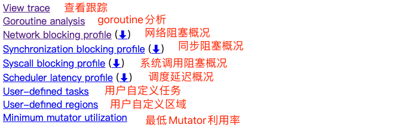

# Go 如何查看运行时调度信息？

有 2 种方式可以查看一个程序的调度 GMP 信息，分别是 go tool trace 和 GODEBUG

trace.go

```go
package main

import (
    "fmt"
    "os"
    "runtime/trace"
    "time"
)

func main() {
    //创建trace文件
    f, err := os.Create("trace.out")
    if err != nil {
        panic(err)
    }

    defer f.Close()

    //启动 trace goroutine
    err = trace.Start(f)
    if err != nil {
        panic(err)
    }
    defer trace.Stop()

    //main
    for i := 0; i < 5; i++ {
        time.Sleep(time.Second)
        fmt.Println("Hello World")
    }
}
```

## 1.go tool trace

启动可视化界面：

```go
go run trace.go
go tool trace trace.out
2022/04/22 10:44:11 Parsing trace...
2022/04/22 10:44:11 Splitting trace...
2022/04/22 10:44:11 Opening browser. Trace viewer is listening on http://127.0.0.1:35488
```

### 1.1 打开 http://127.0.0.1:35488 查看可视化界面



点击 `view trace` 能够看见可视化的调度流程：


一共有 2 个 G 在程序中，一个是特殊的 G0，是每个 M 必须有的一个初始化的 G，另外一个是 G1 main goroutine (执行 main 函数的协程)，在一段时间内处于可运行和运行的状态。

### 1.2 点击 Threads 那一行可视化的数据条，我们会看到 M 详细的信息


一共有 2 个 M 在程序中，一个是特殊的 M0，用于初始化使用，另外一个是用于执行 G1 的 M1。

### 1.3 点击 Proc 那一行可视化的数据条，我们会看到 P 上正在运行 goroutine 详细的信息

一共有 3 个 P 在程序中，分别是P0、P1、P2。


点击具体的 goroutine 行为后可以看到其相关联的详细信息:

```sh
Start：开始时间
Wall Duration：持续时间
Self Time：执行时间
Start Stack Trace：开始时的堆栈信息
End Stack Trace：结束时的堆栈信息
Incoming flow：输入流
Outgoing flow：输出流
Preceding events：之前的事件
Following events：之后的事件
All connected：所有连接的事件
```

## 2.GODEBUG

GODEBUG 变量可以控制运行时内的调试变量。查看调度器信息，将会使用如下两个参数：

+ schedtrace：设置 `schedtrace=X` 参数可以使运行时在每 X 毫秒发出一行调度器的摘要信息到标准 err 输出中。
+ scheddetail：设置 `schedtrace=X` 和 `scheddetail=1` 可以使运行时在每 X 毫秒发出一次详细的多行信息，信息内容主要包括调度程序、处理器、OS 线程 和 goroutine 的状态。

### 2.1 查看基本信息

```sh
go build trace.go
GODEBUG=schedtrace=1000 ./trace
```

```sh
SCHED 0ms: gomaxprocs=8 idleprocs=6 threads=4 spinningthreads=1 idlethreads=0 runqueue=0 [1 0 0 0 0 0 0 0]
Hello World
SCHED 1010ms: gomaxprocs=8 idleprocs=8 threads=4 spinningthreads=0 idlethreads=2 runqueue=0 [0 0 0 0 0 0 0 0]
Hello World
SCHED 2014ms: gomaxprocs=8 idleprocs=8 threads=4 spinningthreads=0 idlethreads=2 runqueue=0 [0 0 0 0 0 0 0 0]
Hello World
SCHED 3024ms: gomaxprocs=8 idleprocs=8 threads=4 spinningthreads=0 idlethreads=2 runqueue=0 [0 0 0 0 0 0 0 0]
Hello World
SCHED 4027ms: gomaxprocs=8 idleprocs=8 threads=4 spinningthreads=0 idlethreads=2 runqueue=0 [0 0 0 0 0 0 0 0]
Hello World
SCHED 5029ms: gomaxprocs=8 idleprocs=7 threads=4 spinningthreads=0 idlethreads=2 runqueue=0 [0 0 0 0 0 0 0 0]
```

sched：每一行都代表调度器的调试信息，后面提示的毫秒数表示启动到现在的运行时间，输出的时间间隔受 `schedtrace` 的值影响。

gomaxprocs：当前的 CPU 核心数（GOMAXPROCS 的当前值）。

idleprocs：空闲的处理器数量，后面的数字表示当前的空闲数量。

threads：OS 线程数量，后面的数字表示当前正在运行的线程数量。

spinningthreads：自旋状态的 OS 线程数量。

idlethreads：空闲的线程数量。

runqueue：全局队列中中的 goroutine 数量，而后面的 [0 0 0 0 0 0 0 0] 则分别代表这 8 个 P 的本地队列正在运行的 goroutine 数量。

### 2.2 查看详细信息

```sh
go build trace.go
GODEBUG=scheddetail=1,schedtrace=1000 ./trace
```

```sh
SCHED 0ms: gomaxprocs=8 idleprocs=6 threads=4 spinningthreads=1 idlethreads=0 runqueue=0 gcwaiting=0 nmidlelocked=0 stopwait=0 sysmonwait=0
  P0: status=0 schedtick=0 syscalltick=0 m=-1 runqsize=1 gfreecnt=0 timerslen=0
  P1: status=1 schedtick=0 syscalltick=0 m=2 runqsize=0 gfreecnt=0 timerslen=0
  P2: status=0 schedtick=0 syscalltick=0 m=-1 runqsize=0 gfreecnt=0 timerslen=0
  P3: status=0 schedtick=0 syscalltick=0 m=-1 runqsize=0 gfreecnt=0 timerslen=0
  P4: status=0 schedtick=0 syscalltick=0 m=-1 runqsize=0 gfreecnt=0 timerslen=0
  P5: status=0 schedtick=0 syscalltick=0 m=-1 runqsize=0 gfreecnt=0 timerslen=0
  P6: status=0 schedtick=0 syscalltick=0 m=-1 runqsize=0 gfreecnt=0 timerslen=0
  P7: status=0 schedtick=0 syscalltick=0 m=-1 runqsize=0 gfreecnt=0 timerslen=0
  M3: p=0 curg=-1 mallocing=0 throwing=0 preemptoff= locks=1 dying=0 spinning=false blocked=false lockedg=-1
  M2: p=1 curg=-1 mallocing=0 throwing=0 preemptoff= locks=2 dying=0 spinning=false blocked=false lockedg=-1
  M1: p=-1 curg=-1 mallocing=0 throwing=0 preemptoff= locks=2 dying=0 spinning=false blocked=false lockedg=-1
  M0: p=-1 curg=-1 mallocing=0 throwing=0 preemptoff= locks=1 dying=0 spinning=false blocked=false lockedg=1
  G1: status=1(chan receive) m=-1 lockedm=0
  G2: status=1() m=-1 lockedm=-1
  G3: status=1() m=-1 lockedm=-1
  G4: status=4(GC scavenge wait) m=-1 lockedm=-1
```

G

```
status: G 的运行状态
m: 隶属于哪一个 M
lockedm: 是否有锁定 M
```

G 的运行状态共涉及如下 9 种状态：

| 状态 | 值 | 含义 |
| :-: | :-: | :-: |
| _Gidle | 0 | 刚刚被分配，还没有进行初始化。 |
| _Grunnable | 1 | 已经在运行队列中，还没有执行用户代码。 |
| _Grunning	| 2 | 不在运行队列里中，已经可以执行用户代码，此时已经分配了 M 和 P。 |
| _Gsyscall | 3 | 正在执行系统调用，此时分配了 M。 |
| _Gwaiting | 4 | 在运行时被阻止，没有执行用户代码，也不在运行队列中，此时它正在某处阻塞等待中。 |
| _Gmoribund_unused | 5 | 尚未使用，但是在 gdb 中进行了硬编码。 |
| _Gdead | 6 | 尚未使用，这个状态可能是刚退出或是刚被初始化，此时它并没有执行用户代码，有可能有也有可能没有分配堆栈。 |
| _Genqueue_unused | 7 | 尚未使用。 |
| _Gcopystack | 8 | 正在复制堆栈，并没有执行用户代码，也不在运行队列中。 |

M

```
p：隶属哪一个 P。
curg：当前正在使用哪个 G。
runqsize：运行队列中的 G 数量。
gfreecnt：可用的 G（状态为 Gdead）。
mallocing：是否正在分配内存。
throwing：是否抛出异常。
preemptoff：不等于空字符串的话，保持 curg 在这个 m 上运行。
```

P

```
status：P 的运行状态。
schedtick：P 的调度次数。
syscalltick：P 的系统调用次数。
m：隶属哪一个 M。
runqsize：运行队列中的 G 数量。
gfreecnt：可用的G（状态为 Gdead）
```

| 状态 | 值 | 含义 |
| :-: | :-: | :-: |
| _Pidle | 0 | 刚刚被分配，还没有进行进行初始化。 |
| _Prunning | 1 | 当 M 与 P 绑定调用 acquirep 时，P 的状态会改变为 _Prunning。 |
| _Psyscall	| 2 | 正在执行系统调用。 |
| _Pgcstop | 3 | 暂停运行，此时系统正在进行 GC，直至 GC 结束后才会转变到下一个状态阶段。 |
| _Pdead | 4 | 废弃，不再使用。 |