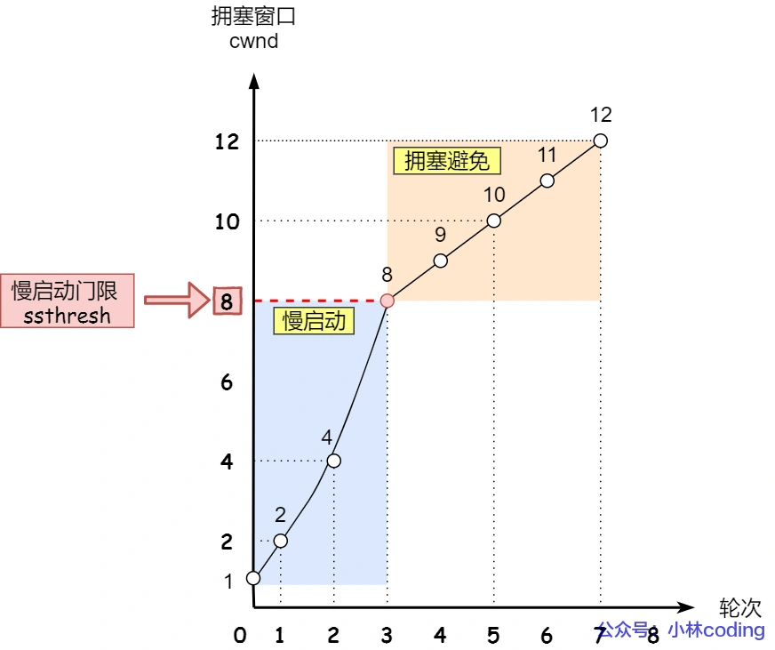
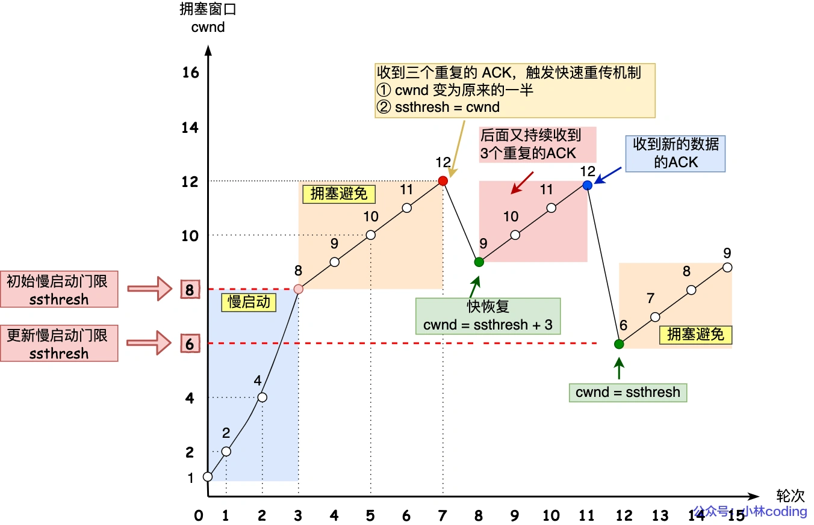

# TCP 拥塞控制

- [TCP 拥塞控制](#tcp-拥塞控制)
  - [1.为什么要有拥塞控制，不是已经有流量控制了吗？](#1为什么要有拥塞控制不是已经有流量控制了吗)
  - [2.什么是拥塞窗口？和发送窗口有什么关系呢？](#2什么是拥塞窗口和发送窗口有什么关系呢)
  - [3.怎么知道当前网络是否出现了拥塞呢？](#3怎么知道当前网络是否出现了拥塞呢)
  - [4.拥塞控制有哪些控制算法？](#4拥塞控制有哪些控制算法)
    - [4.1 慢启动](#41-慢启动)
    - [4.2 拥塞避免算法](#42-拥塞避免算法)
    - [4.3 拥塞发生](#43-拥塞发生)
      - [4.3.1 超时重传](#431-超时重传)
    - [4.4 快速恢复](#44-快速恢复)

## 1.为什么要有拥塞控制，不是已经有流量控制了吗？

前面的流量控制是避免「发送方」的数据填满「接收方」的缓存，但是并不知道网络的中发生了什么。

一般来说，计算机网络都处在一个共享的环境。因此也有可能会因为其他主机之间的通信使得网络拥堵。

**在网络出现拥堵时，如果继续发送大量数据包，可能会导致数据包时延、丢失等，这时 TCP 就会重传数据，但是一重传就会导致网络的负担更重，于是会导致更大的延迟以及更多的丢包，这个情况就会进入恶性循环被不断地放大...**

所以，TCP 不能忽略网络上发生的事，它被设计成一个无私的协议，当网络发送拥塞时，TCP 会自我牺牲，降低发送的数据量。

于是，就有了**拥塞控制**，控制的目的就是**避免「发送方」的数据填满整个网络**。

为了在「发送方」调节所要发送数据的量，定义了一个叫做「**拥塞窗口**」的概念。

## 2.什么是拥塞窗口？和发送窗口有什么关系呢？

**拥塞窗口 cwnd** 是发送方维护的一个的状态变量，它会根据**网络的拥塞程度动态变化的**。

我们在前面提到过发送窗口 `swnd` 和接收窗口 `rwnd` 是约等于的关系，那么由于加入了拥塞窗口的概念后，此时发送窗口的值是 swnd = min(cwnd, rwnd)，也就是拥塞窗口和接收窗口中的最小值。

拥塞窗口 `cwnd` 变化的规则：

+ 只要网络中没有出现拥塞，`cwnd` 就会增大；
+ 但网络中出现了拥塞，`cwnd` 就减少；

## 3.怎么知道当前网络是否出现了拥塞呢？

其实只要「发送方」没有在规定时间内接收到 ACK 应答报文，也就是**发生了超时重传，就会认为网络出现了拥塞。**

## 4.拥塞控制有哪些控制算法？

拥塞控制主要是四个算法：

+ 慢启动
+ 拥塞避免
+ 拥塞发生
+ 快速恢复

### 4.1 慢启动

TCP 在刚建立连接完成后，首先是有个慢启动的过程，这个慢启动的意思就是一点一点的提高发送数据包的数量，如果一上来就发大量的数据，这不是给网络添堵吗？

慢启动的算法记住一个规则就行：**当发送方每收到一个 ACK，拥塞窗口 `cwnd` 的大小就会加 1。**

这里假定拥塞窗口 `cwnd` 和发送窗口 `swnd` 相等，下面举个栗子：

+ 连接建立完成后，一开始初始化 `cwnd = 1`，表示可以传一个 `MSS` 大小的数据。
+ 当收到一个 ACK 确认应答后，`cwnd` 增加 1，于是一次能够发送 2 个
+ 当收到 2 个的 ACK 确认应答后，`cwnd` 增加 2，于是就可以比之前多发 2 个，所以这一次能够发送 4 个
+ 当这 4 个的 ACK 确认到来的时候，每个确认 `cwnd` 增加 1， 4 个确认 `cwnd` 增加 4，于是就可以比之前多发 4 个，所以这一次能够发送 8 个。

慢启动算法的变化过程如下图：

可以看出慢启动算法，发包的个数是指数性的增长。

**那慢启动涨到什么时候是个头呢？**

有一个叫慢启动门限 `ssthresh`（slow start threshold）状态变量。

+ 当 `cwnd` < `ssthresh` 时，使用慢启动算法。
+ 当 `cwnd` >= `ssthresh` 时，就会使用「拥塞避免算法」。

### 4.2 拥塞避免算法

前面说道，当拥塞窗口 `cwnd` 「超过」慢启动门限 `ssthresh` 就会进入拥塞避免算法。

一般来说 `ssthresh` 的大小是 `65535` 字节。

那么进入拥塞避免算法后，它的规则是：**每当收到一个 ACK 时，cwnd 增加 1/cwnd**。

接上前面的慢启动的栗子，现假定 `ssthresh` 为 8：

+ 当 8 个 ACK 应答确认到来时，每个确认增加 1/8，8 个 ACK 确认 `cwnd` 一共增加 1，于是这一次能够发送 9 个 MSS 大小的数据，变成了**线性增长**。

拥塞避免算法的变化过程如下图：

所以，我们可以发现，拥塞避免算法就是将原本慢启动算法的指数增长变成了线性增长，还是增长阶段，但是增长速度缓慢了一些。

就这么一直增长着后，网络就会慢慢进入了拥塞的状况了，于是就会出现丢包现象，这时就需要对丢失的数据包进行重传。

当触发了重传机制，也就进入了「拥塞发生算法」。

### 4.3 拥塞发生

当网络出现拥塞，也就是会发生数据包重传，重传机制主要有两种：

+ 超时重传
+ 快速重传

这两种使用的拥塞发送算法是不同的，接下来分别来说说。

#### 4.3.1 超时重传

当发生了「超时重传」，则就会使用拥塞发生算法。

这个时候，`ssthresh` 和 `cwnd` 的值会发生变化：

+ `ssthresh` 设为 `cwnd/2`，
+ `cwnd` 重置为 1 （是恢复为 `cwnd` 初始化值，我这里假定 `cwnd` 初始化值 1）

**怎么查看系统 cwnd 初始化值？**

Linux 针对每一个 TCP 连接的 `cwnd` 初始化值是 10，也就是 10 个 MSS，我们可以用 `ss -nli` 命令查看每一个 TCP 连接的 `cwnd` 初始化值，如下图：

拥塞发生算法的变化如下图：

接着，就重新开始慢启动，慢启动是会突然减少数据流的。这真是一旦「超时重传」，马上回到解放前。但是这种方式太激进了，反应也很强烈，会造成网络卡顿。

### 4.4 快速恢复

还有更好的方式，前面我们讲过「快速重传算法」。当接收方发现丢了一个中间包的时候，发送三次前一个包的 ACK，于是发送端就会快速地重传，不必等待超时再重传。

TCP 认为这种情况不严重，因为大部分没丢，只丢了一小部分，则 `ssthresh` 和 `cwnd` 变化如下：

+ `cwnd = cwnd/2`，也就是设置为原来的一半;
+ `ssthresh = cwnd`;
+ 进入快速恢复算法

快速重传和快速恢复算法一般同时使用，快速恢复算法是认为，你还能收到 3 个重复 ACK 说明网络也不那么糟糕，所以没有必要像 RTO 超时那么强烈。

快速恢复算法如下：

+ 拥塞窗口 `cwnd = ssthresh + 3`（ 3 的意思是确认有 3 个数据包被收到了）；
+ 重传丢失的数据包；
+ 如果再收到重复的 ACK，那么 `cwnd` 增加 1；
+ 如果收到新数据的 ACK 后，把 `cwnd` 设置为第一步中的 `ssthresh` 的值，原因是该 ACK 确认了新的数据，说明从 duplicated ACK 时的数据都已收到，该恢复过程已经结束，可以回到恢复之前的状态了，也即再次进入拥塞避免状态；

也就是没有像「超时重传」一夜回到解放前，而是还在比较高的值，后续呈线性增长。