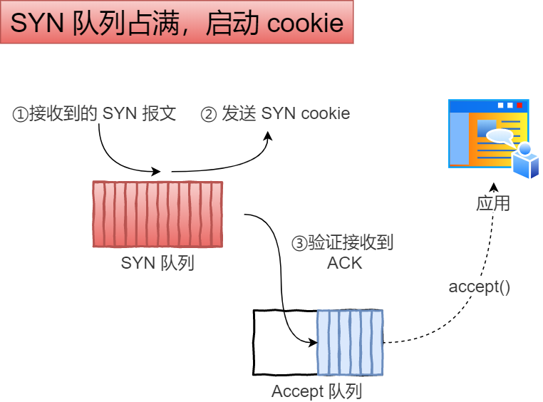

# 什么是 SYN 攻击，如何避免 SYN 攻击？

我们都知道 TCP 连接建立是需要三次握手，假设攻击者短时间伪造不同 IP 地址的 SYN 报文，服务端每接收到一个 SYN 报文，就进入 `SYN_RCVD` 状态，但服务端发送出去的 ACK + SYN 报文，无法得到未知 IP 主机的 ACK 应答，**久而久之就会占满服务端的半连接队列**，使得服务器不能为正常用户服务。


先跟大家说一下，什么是 TCP 半连接和全连接队列。

在 TCP 三次握手的时候，Linux 内核会维护两个队列，分别是：

+ 半连接队列，也称 SYN 队列；
+ 全连接队列，也称 accept 队列；

我们先来看下 Linux 内核的 SYN 队列（半连接队列）与 Accpet 队列（全连接队列）是如何工作的？


正常流程：

+ 当服务端接收到客户端的 SYN 报文时，会创建一个半连接的对象，然后将其加入到内核的「SYN 队列」；
+ 接着发送 SYN + ACK 给客户端，等待客户端回应 ACK 报文；
+ 服务端接收到 ACK 报文后，从「 SYN 队列」取出一个半连接对象，然后创建一个新的连接对象放入到「Accept 队列」；
+ 应用通过调用 `accpet()` socket 接口，从「Accept 队列」取出连接对象。

不管是半连接队列还是全连接队列，都有最大长度限制，超过限制时，默认情况都会丢弃报文。

SYN 攻击方式最直接的表现就会把 TCP 半连接队列打满，这样**当 TCP 半连接队列满了，后续再在收到 SYN 报文就会丢弃**，导致客户端无法和服务端建立连接。

避免 SYN 攻击方式，可以有以下四种方法：

+ 调大 netdev_max_backlog；
+ 增大 TCP 半连接队列；
+ 开启 tcp_syncookies；
+ 减少 SYN+ACK 重传次数；

## 1.调大 netdev_max_backlog

当网卡接收数据包的速度大于内核处理的速度时，会有一个队列保存这些数据包。控制该队列的最大值如下参数，默认值是 1000，我们要适当调大该参数的值，比如设置为 10000：

```sh
net.core.netdev_max_backlog = 10000
```

## 2.增大 TCP 半连接队列

增大 TCP 半连接队列，要同时增大下面这三个参数：

+ net.ipv4.tcp_max_syn_backlog
+ 增大 listen() 函数中的 backlog
+ 增大 net.core.somaxconn

## 3.开启 net.ipv4.tcp_syncookies

开启 syncookies 功能就可以在不使用 SYN 半连接队列的情况下成功建立连接，相当于绕过了 SYN 半连接来建立连接。



具体过程：

+ 当「SYN 队列」满之后，后续服务器收到 SYN 包，不会丢弃，而是根据算法，计算出一个 `cookie` 值；
+ 将 cookie 值放到第二次握手报文的「序列号」里，然后服务端回第二次握手给客户端；
+ 服务端接收到客户端的应答报文时，服务器会检查这个 ACK 包的合法性。如果合法，将该连接对象放入到「Accept 队列」。
+ 最后应用程序通过调用 `accpet()` 接口，从「 Accept 队列」取出的连接。

可以看到，当开启了 `tcp_syncookies` 了，即使受到 SYN 攻击而导致 SYN 队列满时，也能保证正常的连接成功建立。

`net.ipv4.tcp_syncookies` 参数主要有以下三个值：

+ `0`：表示关闭该功能；
+ `1`：表示仅当 SYN 半连接队列放不下时，再启用它；
+ `2`：表示无条件开启功能；

那么在应对 SYN 攻击时，只需要设置为 1 即可。

```sh
echo 1 > /proc/sys/net/ipv4/tcp_syncookies
```

## 4.减少 SYN+ACK 重传次数

当服务端受到 SYN 攻击时，就会有大量处于 SYN_REVC 状态的 TCP 连接，处于这个状态的 TCP 会重传 SYN+ACK ，当重传超过次数达到上限后，就会断开连接。

那么针对 SYN 攻击的场景，我们可以减少 SYN-ACK 的重传次数，以加快处于 SYN_REVC 状态的 TCP 连接断开。

SYN-ACK 报文的最大重传次数由 `tcp_synack_retries` 内核参数决定（默认值是 5 次），比如将 `tcp_synack_retries` 减少到 2 次：

```sh
echo 2 > /proc/sys/net/ipv4/tcp_synack_retries
```