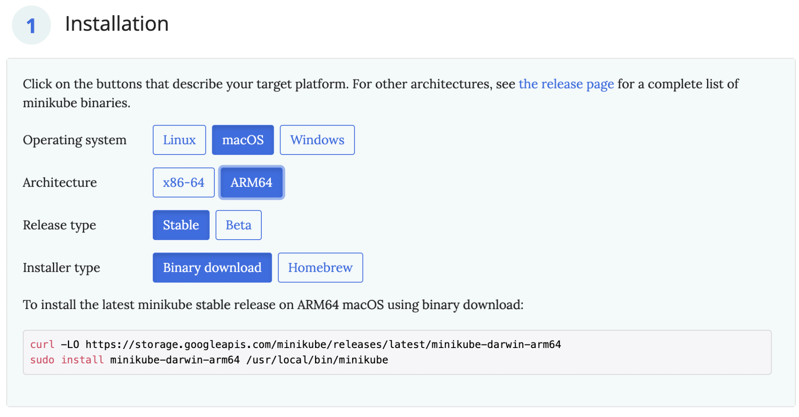
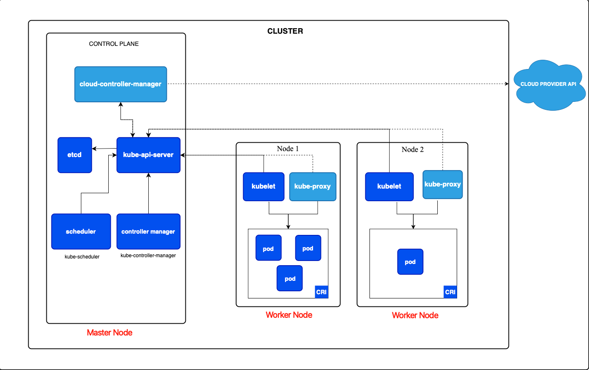
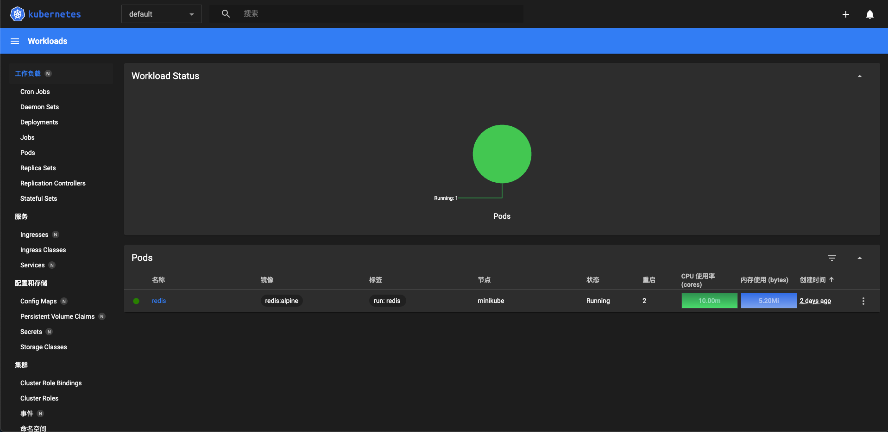
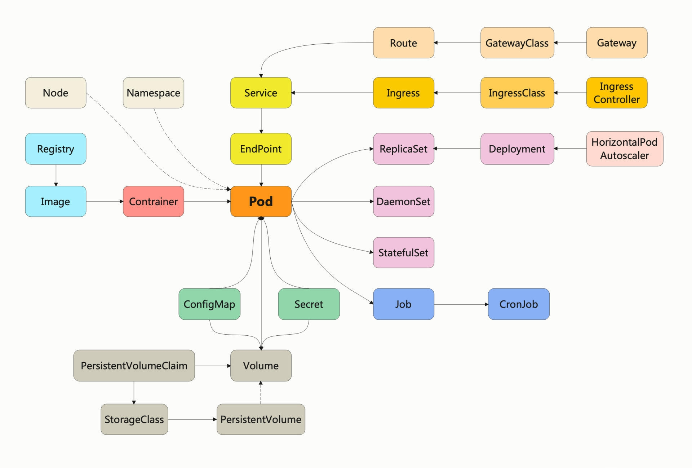
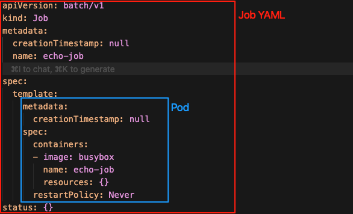
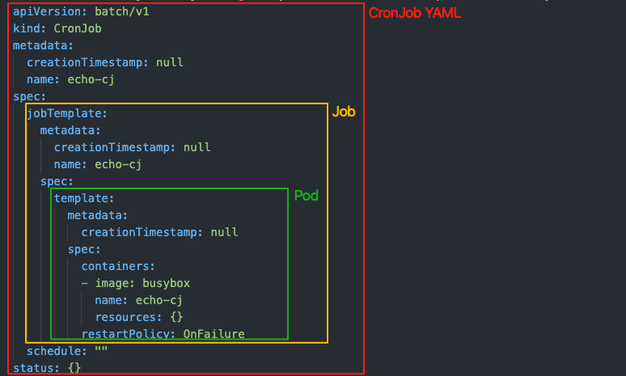

# 介绍

Kubernetes（简称 k8s） 源自 Google 内部的集群管理系统 Borg。2014年，Google 将 Borg 系统用 Go 语言重写并开源，命名为 Kubernetes（希腊语"舵手"之意）。

k8s 提供了详细的中文官方文档 [https://kubernetes.io/zh-cn/docs/home/](https://kubernetes.io/zh-cn/docs/home/)，适合我们更全面地学习 k8s。

## 核心能力

Kubernetes 不仅能够创建和调度容器，还提供了完整的集群管理能力：

- **容器编排**: 自动化部署、扩缩容、负载均衡
- **服务发现**: 内置 DNS 和服务注册机制
- **存储编排**: 自动挂载存储系统（本地存储、云存储等）
- **自我修复**: 自动重启失败容器、替换和重新调度容器
- **配置管理**: 管理应用配置和敏感信息
- **批量执行**: 支持批处理任务和定时任务

# 快速搭建 k8s 环境

在[官网](https://kubernetes.io/zh-cn/docs/tasks/tools/)介绍了两个快速搭建 k8s 环境的工具：kind 和 minukube。我们会以 minikube 为例，它是一个比较迷你的 k8s，集成了 k8s 绝大多数功能，适合用于前期学习。

## 安装 minikube

[官网](https://minikube.sigs.k8s.io/docs/start/?arch=%2Fmacos%2Farm64%2Fstable%2Fbinary+download)提供了详细的安装说明：



安装完成后可以执行 `minikube version` 验证是否安装成功：

```sh
$ minikube version
minikube version: v1.37.0
```

minikube 只能够搭建 k8s 环境，要操作 k8s，还需要另一个专门的客户端工具 kubectl。

kubectl 也是一个命令行工具，作用与 k8s 后台服务通信，把我们的命令转发给 k8s，实现容器和集群的管理功能。

kubectl 是一个与 k8s、minikube 彼此独立的项目，所以不包含在 minikube 里，但 minikube 提供了安装它的简化方式，你只需执行下面的这条命令：

```sh
minikube kubectl
```

它就会把与当前 k8s 版本匹配的kubectl下载下来，存放在内部目录（例如 `~/.minikube/cache/darwin/arm64/v1.33.4/kubectl`），然后我们就可以使用它来对 k8s 发送命令了。

总结：minikube 管理 k8s 集群环境，kubectl 操作实际的 k8s 功能。

## 验证 minikube 环境

使用命令 `minikube start` 会从 Docker Hub 上拉取镜像，以当前最新版本的 k8s 启动集群。也可以在后面添加参数 `--kubernetes-version`，明确指定要使用 k8s 版本。例如：

```sh
$ minikube start --kubernetes-version=v1.33
😄  Darwin 15.5 (arm64) 上的 minikube v1.37.0
👉  使用 Kubernetes 1.33.4，因为未指定修补程序版本
✨  自动选择 docker 驱动
📌  使用具有 root 权限的 Docker Desktop 驱动程序
👍  在集群中 "minikube" 启动节点 "minikube" primary control-plane
🚜  正在拉取基础镜像 v0.0.48 ...
💾  正在下载 Kubernetes v1.33.4 的预加载文件...
......
```

现在 k8s 集群就已经在我们本地运行了，你可以使用 `minikube status`、`minikube node list` 来查看集群的状态：

```sh
$ minikube status
minikube
type: Control Plane
host: Running
kubelet: Running
apiserver: Running
kubeconfig: Configured

$ minikube node list
minikube	192.168.49.2
```

可以看到，k8s 集群里现在只有一个节点，名字就叫 minikube，类型是 Control Plane，里面有 host、kubelet、apiserver 三个服务，IP 地址是 192.168.49.2。

还可以使用 `minikube ssh` 登录到这个节点，跟使用 linux 没什么区别：

```sh
$ minikube ssh
docker@minikube:~$ pwd
/home/docker
docker@minikube:~$ ll
total 32
drwxr-x--- 1 docker docker 4096 Oct 27 05:32 ./
drwxr-xr-x 1 root   root   4096 Sep  9 07:07 ../
-rw-r--r-- 1 docker docker  220 Sep  9 07:07 .bash_logout
-rw-r--r-- 1 docker docker 3771 Sep  9 07:07 .bashrc
-rw-r--r-- 1 docker docker  807 Sep  9 07:07 .profile
drwxr-xr-x 1 docker docker 4096 Oct 27 05:32 .ssh/
-rw-r--r-- 1 docker docker    0 Oct 27 05:32 .sudo_as_admin_successful
docker@minikube:~$ uname
Linux
docker@minikube:~$ uname -m
aarch64
```

## 简单使用 kubectl 操作集群

一般来说是直接使用 kubectl 操作 k8s 集群，但 minikube 自带的 kubectl 需要加上 `minikube` 前缀，后面再有个 `--`，像这样：

```sh
$ minikube kubectl -- version
Client Version: v1.33.4
Kustomize Version: v5.6.0
Server Version: v1.33.4
```

可以使用别名简化命令，提高效率，以 zshrc 为例：

```sh
$ echo 'alias kubectl="minikube kubectl --"' >> ~/.zshrc
$ echo 'source <(kubectl completion zsh)' >> ~/.zshrc
$ source ~/.zshrc
$ kubectl version
Client Version: v1.33.4
Kustomize Version: v5.6.0
Server Version: v1.33.4
```

使用 `kubectl run redis --image=redis:alpine` 运行一个 redis 服务，注意和 `docker run` 的区别是使用 `--image` 指定镜像：

```sh
$ kubectl run redis --image=redis:alpine
pod/redis created
$ kubectl get pod
NAME    READY   STATUS    RESTARTS      AGE
redis   1/1     Running   1 (13h ago)   23h
$ kubectl describe pod redis
Name:             redis
Namespace:        default
......
```

# 架构总览

k8s 官网上有一张[架构图](https://kubernetes.io/zh-cn/docs/concepts/architecture/)，我对它做了标注，我们可以根据它来探究 k8s 的架构。



k8s 采用了**控制面/数据面**（Control Plane / Data Plane）架构，集群里的计算机被称为**节点**（Node），可以是物理机或虚拟机。少量节点用作控制面来负责集群的管理维护工作，其他大部分节点都被划归数据面，用来跑业务应用。

控制面的节点在 k8s 里叫 **Master Node**，一般简称 **Master**，它是整个集群里最重要的部分，可以说是 k8s 的大脑和心脏。

数据面的节点叫做 **Worker Node**，一般就简称为 Worker 或者 Node，相当于 k8s 的手和脚，在 Master 的指挥下干活。

k8s 集群通常由大量的 Node 组成，这些 Node 被统一抽象为一个资源池。调度器会在这个资源池中分配资源、调度应用，从而实现资源的“池化”管理。所以管理也变得简单，可以方便地在集群中添加或删除节点。

你可以使用 `kubectl get node` 查看 k8s 的节点状态：

```sh
$ kubectl get node
NAME       STATUS   ROLES           AGE   VERSION
minikube   Ready    control-plane   34h   v1.33.4
```

注意，当集群的规模较小，工作负载较少的时候，Master 也可以承担 Node 的工作，在我们搭建的 minikube 环境里，它就只有一个节点，这个节点既是 Master 又是 Node。

## 节点的内部结构

k8s 的节点内部由很多的模块组成，这些模块分成组件（Component）和插件（Addon）。组件实现了 k8s 的核心功能特性，没有这些组件 k8s 就无法启动，而插件则是一些附加功能，不安装也不会影响 k8s 的正常运行。

### Master 组件介绍

Master 里有 5 个组件，分别是：

- apiserver
- etcd
- scheduler
- controller-manager
- cloud-controller-manager

apiserver 是 Master 节点，同时也是整个 k8s 系统的唯一入口，它对外公开了一系列的 RESTful API，并且加上了验证、授权等功能，所有其他组件都只能和它直接通信。

etcd 是 k8s 使用的高可用、分布式 KV 数据库，用来持久化存储系统里的各种资源对象和状态。从图中你可以看到它只与 apiserver 有直接联系，也就是说任何其他组件想要读写 etcd 里的数据都必须经过 apiserver。

scheduler 负责容器的编排工作，检查节点的资源状态，把 Pod 调度到最合适的节点上运行。因为节点状态和 Pod 信息都存储在 etcd 里，所以 scheduler 必须通过 apiserver 才能获得。

controller-manager 负责维护容器和节点等资源的状态，实现故障检测、服务迁移、应用伸缩等功能。同样，它也必须通过 apiserver 获得存储在 etcd 里的信息，才能够实现对资源的各种操作。

cloud-controller-manager 是 k8s 中专门负责与底层云平台 API 交互的组件，它通过调用云厂商接口来创建、更新或删除与 k8s 对象（如 Node、Service、Volume）对应的云资源。

使用 `kubectl get pod -n kube-system` 可以看到前 4 个被容器化的组件（cloud-controller-manager 应该是需要部署到云平台才会出现）：

```sh
kubectl get pod -n kube-system
NAME                               READY   STATUS    RESTARTS       AGE
coredns-674b8bbfcf-6j4ht           1/1     Running   1 (36h ago)    2d9h
coredns-674b8bbfcf-8sv97           1/1     Running   1 (36h ago)    2d9h
etcd-minikube                      1/1     Running   1 (36h ago)    2d9h    # etcd
kube-apiserver-minikube            1/1     Running   1 (22h ago)    2d9h    # apiserver
kube-controller-manager-minikube   1/1     Running   1 (36h ago)    2d9h    # controller-manager
kube-proxy-smjv9                   1/1     Running   1 (36h ago)    2d9h
kube-scheduler-minikube            1/1     Running   1 (36h ago)    2d9h    # scheduler
storage-provisioner                1/1     Running   8 (3h1m ago)   2d9h
```

### Node 组件介绍

Node 里有 3 个组件，分别是：

- kubelet
- kube-proxy
- container-runtime

kubelet 是 Node 的核心代理组件，负责与 apiserver 通信，实现状态报告、命令下发、启停容器等功能。

kube-proxy 是 Node 的网络代理组件，只负责管理容器的网络通信，它可以根据 Service 和 Endpoint 信息配置网络规则，实现为 Pod 转发 TCP/UDP 数据包。

container-runtime 又叫容器运行时，负责在 kubelet 的“指挥”下创建容器等操作，管理容器的生命周期。图中 CRI（Container Runtime Interface）指的是标准接口，而 container-runtime 是这个接口的具体实现，这样可以不用必须依赖某个特定的容器引擎如 Docker、containerd、CRI-O 等。

这 3 个组件只有 kube-proxy 通常以容器形式运行。kubelet 因为要管理整个 Node，需要直接访问宿主机（root 权限、文件系统、容器运行时 socket、网络命名空间等），容器化会限制其权限和能力。

验证环节：

```sh
$ minikube ssh

docker@minikube:~$ docker ps|grep kube-proxy
31956b3d02d9   e19c0cda155d                 "/usr/local/bin/kube…"   23 hours ago   Up 23 hours             k8s_kube-proxy_kube-proxy-smjv9_kube-system_b1138561-1f4e-467a-8a27-d6076d1c1a36_1
......

docker@minikube:~$ ps -ef | grep kubelet
root        1327       1  7 Oct28 ?        01:16:58 /var/lib/minikube/binaries/v1.33.4/kubelet --bootstrap-kubeconfig=/etc/kubernetes/bootstrap-kubelet.conf --config=/var/lib/kubelet/config.yaml --hostname-override=minikube --kubeconfig=/etc/kubernetes/kubelet.conf --node-ip=192.168.49.2
```

### 小结

我们把上面介绍的组件串起来看，就能明白 k8s 的大致工作流程：

- 每个 Node 上的 kubelet 会定期向 apiserver 上报节点状态，apiserver 再存到 etcd 里。
- 每个 Node 上的 kube-proxy 实现了 TCP/UDP 反向代理，让容器对外提供稳定的服务。
- scheduler 通过 apiserver 得到当前的节点状态，调度 Pod，然后 apiserver 下发命令给某个 Node 的 kubelet，kubelet 调用 container-runtime 启动容器。
- controller-manager 通过 apiserver 得到实时的节点状态，监控可能的异常情况，再使用相应的手段去调节恢复。

### 插件介绍

插件能为 k8s 提供附加功能，让 k8s 更强大。minikube 支持很多的插件，我们可以使用 `minikube addons list` 查看插件列表：

```sh
$ minikube addons list
┌────────────── ┬─────┬──────┬────────────────────┐
│         ADDON NAME          │ PROFILE  │   STATUS   │               MAINTAINER               │
├────────────── ┼─────┼──────┼────────────────────┤
│ ambassador                  │ minikube │ disabled   │ 3rd party (Ambassador)                 │
│ amd-gpu-device-plugin       │ minikube │ disabled   │ 3rd party (AMD)                        │
│ auto-pause                  │ minikube │ disabled   │ minikube                               │
│ cloud-spanner               │ minikube │ disabled   │ Google                                 │
│ csi-hostpath-driver         │ minikube │ disabled   │ Kubernetes                             │
│ dashboard                   │ minikube │ disabled   │ Kubernetes                             │
│ default-storageclass        │ minikube │ enabled ✅ │ Kubernetes                             │
│ efk                         │ minikube │ disabled   │ 3rd party (Elastic)                    │
│ freshpod                    │ minikube │ disabled   │ Google                                 │
│ gcp-auth                    │ minikube │ disabled   │ Google                                 │
......
│ storage-provisioner-rancher │ minikube │ disabled   │ 3rd party (Rancher)                    │
│ volcano                     │ minikube │ disabled   │ third-party (volcano)                  │
│ volumesnapshots             │ minikube │ disabled   │ Kubernetes                             │
│ yakd                        │ minikube │ disabled   │ 3rd party (marcnuri.com)               │
└────────────── ┴─────┴──────┴────────────────────┘
```

例如只要执行 `minikube dashboard` 就可以自动用浏览器打开 Dashboard 页面：



# k8s 的 API 对象

作为一个集群操作系统，k8s 总结了 Google 多年在集群管理方面的经验，在理论层面抽象出许多概念来描述和管理系统中的各种资源，这些概念被称为**API 对象**。可以说，k8s 一切皆对象。

你可能会联想到上文的 apiserver，因为它是 k8s 系统的唯一入口，采用了 HTTP 协议的 URL 资源理念，API 风格也用 RESTful 的 GET/POST/DELETE 等，所以这些概念很自然地就被称为是“API 对象”了。

我们可以使用 `kubectl api-resources` 查看当前 k8s 版本支持的所有对象：

```sh
$ kubectl api-resources
NAME                                SHORTNAMES   APIVERSION                        NAMESPACED   KIND
bindings                                         v1                                true         Binding
componentstatuses                   cs           v1                                false        ComponentStatus
configmaps                          cm           v1                                true         ConfigMap
endpoints                           ep           v1                                true         Endpoints
events                              ev           v1                                true         Event
limitranges                         limits       v1                                true         LimitRange
namespaces                          ns           v1                                false        Namespace
nodes                               no           v1                                false        Node
persistentvolumeclaims              pvc          v1                                true         PersistentVolumeClaim
persistentvolumes                   pv           v1                                false        PersistentVolume
pods                                po           v1                                true         Pod
podtemplates                                     v1                                true         PodTemplate
```

NAME 指对象名称，比如 `pods`、`configmaps` 等，SHORTNAMES 指这种资源的简写，例如 `kubectl get pods` 可以简写为 `kubectl get po`。

在使用 kubectl 命令时，可以加上参数 `--v=9`，它会显示出详细的命令执行过程，清楚地看到发出的 HTTP 请求，比如：

```sh
$ kubectl get pod --v=9
I1030 23:39:13.947395   32050 loader.go:402] Config loaded from file:  /Users/tz7/.kube/config
I1030 23:39:13.947909   32050 envvar.go:172] "Feature gate default state" feature="InOrderInformers" enabled=true
I1030 23:39:13.947917   32050 envvar.go:172] "Feature gate default state" feature="WatchListClient" enabled=false
I1030 23:39:13.947919   32050 envvar.go:172] "Feature gate default state" feature="ClientsAllowCBOR" enabled=false
I1030 23:39:13.947922   32050 envvar.go:172] "Feature gate default state" feature="ClientsPreferCBOR" enabled=false
I1030 23:39:13.947924   32050 envvar.go:172] "Feature gate default state" feature="InformerResourceVersion" enabled=false
I1030 23:39:13.948257   32050 cert_rotation.go:141] "Starting client certificate rotation controller" logger="tls-transport-cache"
I1030 23:39:13.950499   32050 helper.go:113] "Request Body" body=""
I1030 23:39:13.950536   32050 round_trippers.go:527] "Request" curlCommand=<
	curl -v -XGET  -H "Accept: application/json;as=Table;v=v1;g=meta.k8s.io,application/json;as=Table;v=v1beta1;g=meta.k8s.io,application/json" -H "User-Agent: kubectl/v1.33.4 (darwin/arm64) kubernetes/74cdb42" 'https://127.0.0.1:58415/api/v1/namespaces/default/pods?limit=500'
 >
I1030 23:39:13.950817   32050 round_trippers.go:562] "HTTP Trace: Dial succeed" network="tcp" address="127.0.0.1:58415"
I1030 23:39:13.963653   32050 round_trippers.go:632] "Response" verb="GET" url="https://127.0.0.1:58415/api/v1/namespaces/default/pods?limit=500" status="200 OK" headers=<
......
```

我们可以看到，该命令等价于 kubectl 客户端调用了 curl，向 58415 端口发送了 HTTP GET 请求，URL 是 `/api/v1/namespaces/default/pods`。

## 使用 YAML 创建 API 对象

之前我们用 `kubectl run redis --image=redis:alpine` 运行 Redis 是“命令式”的，现在我们来看看如何使用 YAML “声明式”地创建 Nginx Pod：

```yaml
apiVersion: v1
kind: Pod
metadata:
  name: ngx-pod
  labels:
    env: demo
    owner: dinsafer

spec:
  containers:
    - image: nginx:alpine
      name: ngx
      ports:
        - containerPort: 80
```

API 对象采用标准的 HTTP 协议，我们可以借鉴 HTTP 报文格式，把 YAML 文件格式分为“header”和“body”两部分，方便理解。

首先是“header”部分：

- `apiVersion` 表示这种资源的 API 版本号，由于 k8s 的迭代速度很快，不同的版本创建的对象会有差异，为了区分这些版本就需要使用 `apiVersion` 这个字段，比如 `v1`、`v1alpha1`、`v1beta1` 等。
- `kind` 表示资源对象的类型，比如 Pod、Node、Job、Service 等。
- `metadata` 表示资源的一些“元信息”，用来标记对象，方便 k8s 管理的一些信息。这个 YAML 实例有两个“元信息”：`name` 给 Pod 命名为 `ngx-pod`，`labels` 给 Pod “贴”上了一些便于查找的标签，分别是 `env` 和 `owner`。

“body”部分与对象特定相关，每种对象会有不同的格式定义，在 YAML 里表现为 `spec`(specification) 字段。

这个 Pod 的 `spec` 是一个 `containers` 对象数组，数组里的元素对象指定了名字、镜像、端口等信息。

使用 `kubectl apply`、`kubectl delete`，再加上参数 `-f`，你就可以使用这份 YAML 文件创建或者删除对象了：

```sh
$ kubectl apply -f ngx-pod.yaml
pod/ngx-pod created

$ kubectl get pod
NAME      READY   STATUS    RESTARTS      AGE
ngx-pod   1/1     Running   0             2m44s
redis     1/1     Running   2 (13h ago)   2d23h

$ kubectl delete -f ngx-pod.yaml
pod "ngx-pod" deleted
```

当我们使用 `kubectl apply -f ngx-pod.yaml --v=9` 可以看到 YAML 里的配置都被 kubectl 用于生成 HTTP 请求发给 apiserver：

```sh
$ kubectl apply -f ngx-pod.yaml --v=9
......
	curl -v -XGET  -H "User-Agent: kubectl/v1.33.4 (darwin/arm64) kubernetes/74cdb42" -H "Accept: application/json" 'https://127.0.0.1:58415/api/v1/namespaces/default/pods/ngx-pod'
    ......
	{"kind":"Status","apiVersion":"v1","metadata":{},"status":"Failure","message":"pods \"ngx-pod\" not found","reason":"NotFound","details":{"name":"ngx-pod","kind":"pods"},"code":404}
 >
I1031 00:36:12.654059   37021 helper.go:246] "Request Body" body=<
	{"apiVersion":"v1","kind":"Pod","metadata":{"annotations":{"kubectl.kubernetes.io/last-applied-configuration":"{\"apiVersion\":\"v1\",\"kind\":\"Pod\",\"metadata\":{\"annotations\":{},\"labels\":{\"env\":\"demo\",\"owner\":\"dinsafer\"},\"name\":\"ngx-pod\",\"namespace\":\"default\"},\"spec\":{\"containers\":[{\"image\":\"nginx:alpine\",\"name\":\"ngx\",\"ports\":[{\"containerPort\":80}]}]}}\n"},"labels":{"env":"demo","owner":"dinsafer"},"name":"ngx-pod","namespace":"default"},"spec":{"containers":[{"image":"nginx:alpine","name":"ngx","ports":[{"containerPort":80}]}]}}
 >
I1031 00:36:12.654086   37021 round_trippers.go:527] "Request" curlCommand=<
	curl -v -XPOST  -H "Content-Type: application/json" -H "User-Agent: kubectl/v1.33.4 (darwin/arm64) kubernetes/74cdb42" -H "Accept: application/json" 'https://127.0.0.1:58415/api/v1/namespaces/default/pods?fieldManager=kubectl-client-side-apply&fieldValidation=Strict'
```

可以看到有一个先查询再创建的过程，另外和 HTTP 协议一样，“header”里的 `apiVersion`、`kind`、`metadata` 这三个字段是任何对象都必须有的。

## 如何编写 YAML

1. 查阅官方文档

API 对象的所有字段都可以在[官方文档](https://kubernetes.io/zh-cn/docs/reference/kubernetes-api/)找到，但查阅起来可能会比较繁琐。

2. 使用 kubectl 生成模板

我们可以在运行 `kubectl run` 时使用参数 `--dry-run=client` 和 `-o yaml` 只生成 YAML 文件，例如：

```sh
# --dry-run=client: 空运行
# -o yaml: 生成 YAML 格式
$ kubectl run ngx-pod --image=nginx:alpine --dry-run=client -o yaml
apiVersion: v1
kind: Pod
metadata:
  creationTimestamp: null
  labels:
    run: ngx-pod
  name: ngx-pod
spec:
  containers:
  - image: nginx:alpine
    name: ngx-pod
    resources: {}
  dnsPolicy: ClusterFirst
  restartPolicy: Always
status: {}
```

接下来就是根据对象的说明文档，定制这个 YAML 了。

3. 使用 kubectl explain 命令

`kubectl explain` 相当于是 k8s 自带的 API 文档，会给出对象字段的详细说明。

```sh
$ kubectl explain pod
KIND:       Pod
VERSION:    v1

DESCRIPTION:
    Pod is a collection of containers that can run on a host. This resource is
    created by clients and scheduled onto hosts.

FIELDS:
  apiVersion	<string>
    APIVersion defines the versioned schema of this representation of an object.
    Servers should convert recognized schemas to the latest internal value, and
    may reject unrecognized values. More info:
    https://git.k8s.io/community/contributors/devel/sig-architecture/api-conventions.md#resources

  kind	<string>
    Kind is a string value representing the REST resource this object
    represents. Servers may infer this from the endpoint the client submits
    requests to. Cannot be updated. In CamelCase. More info:
    https://git.k8s.io/community/contributors/devel/sig-architecture/api-conventions.md#types-kinds

  metadata	<ObjectMeta>
    Standard object's metadata. More info:
    https://git.k8s.io/community/contributors/devel/sig-architecture/api-conventions.md#metadata

  spec	<PodSpec>
    Specification of the desired behavior of the pod. More info:
    https://git.k8s.io/community/contributors/devel/sig-architecture/api-conventions.md#spec-and-status

  status	<PodStatus>
    Most recently observed status of the pod. This data may not be up to date.
    Populated by the system. Read-only. More info:
    https://git.k8s.io/community/contributors/devel/sig-architecture/api-conventions.md#spec-and-status

$ kubectl explain pod.kind
$ kubectl explain pod.spec
$ kubectl explain pod.spec.containers
```

4. 使用 kubectl api-resources 命令快速查看

```sh
$ kubectl api-resources
NAME                                SHORTNAMES   APIVERSION                        NAMESPACED   KIND
pods                                po           v1                                true         Pod
ingresses                           ing          networking.k8s.io/v1              true         Ingress
```

输出的 `APIVERSION` 和 `KIND` 分别是 YAML 里的 `apiVersion` 和 `kind`。

# Pod: k8s 的核心对象

传送门：[官方文档](https://kubernetes.io/zh-cn/docs/concepts/workloads/pods/)

## 概念

Pod 的中文是“豌豆荚”，后来又延伸出“舱室”“太空舱”等含义，你可以看一下这张图片，形象地来说 Pod 就是包含了很多组件、成员的一种结构。


首先我们知道容器的理念是对应用的独立封装，它里面就应该是一个进程、一个应用，如果里面有多个应用，不仅违背了容器的初衷，也会让容器更难以管理。

但是存在一些特殊情况，多个应用结合得非常紧密以至于无法把它们拆开。例如，有的应用运行前依赖其他应用，或者日志代理，它必须读取另一个应用存储在本地磁盘的文件再转发出去。这些应用如果被强制分离成两个容器，切断联系，就无法正常工作了。

**为了解决这样多应用联合运行的问题，同时还要不破坏容器的隔离，就需要在容器外面再建立一个“收纳舱”**，让多个容器既保持相对独立，又能够小范围共享网络、存储等资源，而且永远是“绑定”的状态。

所以 Pod 的概念也就呼之欲出了，容器就像是“豆荚”里那些小小的“豌豆”，你可以在 Pod 的 YAML 里看到，`spec.containers` 字段是一个数组，里面允许定义多个容器。

> Pod 可以类比 Linux 进程组的概念，是一组进程组成的应用，对应地称其为“容器组”。

Pod 是 k8s 应用调度部署的最小单位，Pod 负责编排处理容器。并且基于 Pod，k8s 扩展出了许多重要的 API 对象，例如配置信息 ConfigMap、离线作业 Job、多实例部署 Deployment 等。所以 Pod 是 k8s 的核心对象。



## 原理

Pod 的实现需要使用一个名为 Infra 的中间容器，它主要负责：

- Network Namespace（网络命名空间）
- IPC Namespace（进程间通信命名空间）
- UTS Namespace（主机名）

在 Pod 中，Infra 容器永远是第一个被创建的容器，而其他用户定义的容器，则通过 Join Network Namespace 的方式与 Infra 容器关联在一起。

Infra 容器使用的是一个非常特殊的镜像：registry.k8s.io/pause。这个镜像用 C 语言编写，运行一个极简的进程，该进程几乎不做任何事情，只是保持命名空间存活并作为 PID 1 进程收割僵尸进程。在 Infra 容器"Hold住" Network Namespace 之后，用户容器就可以加入到 Infra 容器的 Network Namespace 中了。也就是说，在 Pod 中：

- 容器间可以直接使用 localhost 进行通信
- 一个 Pod 只有一个 IP 地址，也就是这个 Pod 的 Network Namespace 对应的 IP 地址
- 所有的网络资源，都是一个 Pod 一份，并且被该 Pod 内的所有容器共享
- Pod 的生命周期只和 Infra 容器一致，与用户容器无关

## YAML 文件编写

`apiVersion` 和 `kind` 使用固定值 `v1` 和 `Pod`。`metadata` 应该包含 `name` 和 `labels` 两个字段，`labels` 可以添加任意数量的 Key-Value，方便和 `name` 结合识别和管理，例如 env:dev|test|prod，region:north|south。

和 Docker 启动容器不同，k8s 必须给 Pod 命名，否则会报错：

```sh
$ cat ngx-pod.yaml
apiVersion: v1
kind: Pod
metadata:
  labels:
    env: demo
    owner: dinsafer

spec:
  containers:
    - image: nginx:alpine
      name: ngx
      ports:
        - containerPort: 80

$ kubectl apply -f ngx-pod.yaml
error: error when retrieving current configuration of:
Resource: "/v1, Resource=pods", GroupVersionKind: "/v1, Kind=Pod"
Name: "", Namespace: "default"
from server for: "ngx-pod.yaml": resource name may not be empty
```

`spec` 不仅有 `containers` 字段，还有 `restartPolicy`（重启策略），`volumes`（定义可被容器挂载的存储卷）等。我们先重点关注 `containers` 字段。

每一个 `container` 对象也必须要有一个 `name` 表示名字和一个 `image` 说明使用的镜像。其他字段用起来跟 Docker 类似，例如：

- `ports`：列出容器对外暴露的端口，和 Docker 的 `-p` 参数类似。
- `env`：定义 Pod 的环境变量，和 Dockerfile 里的 `ENV` 指令有点类似，但它是运行时指定的，更加灵活可配置。
- `command`：定义容器启动时要执行的命令，相当于 Dockerfile 里的 `ENTRYPOINT` 指令。
- `args`：定义 `command` 运行时的参数，相当于 Dockerfile 里的 `CMD` 指令，注意这两个命令和 Docker 的含义不同。
- `imagePullPolicy`：指定镜像的拉取策略，值有 Always|Never|IfNotPresent，一般默认是 IfNotPresent，表示只有本地不存在才会远程拉取镜像，减少网络消耗。

## kubectl 操作 Pod

```sh
# 指定 YAML 文件创建或者删除 Pod
kubectl apply -f ngx-pod.yml
kubectl delete -f ngx-pod.yml

# 指定名字删除 Pod
kubectl delete pod ngx-pod

# 查看 Pod 的标准输出流信息（Pod 默认是后台运行）
kubectl logs ngx-pod

# 查看 Pod 列表和运行状态
kubectl get pod

# 查看 Pod 详细状态
kubectl describe pod ngx-pod

# 拷贝文件到 Pod
kubectl cp a.txt ngx-pod:/tmp

# 进入 Pod 内部（注意相比 Docker 多了 --）
# 如果 Pod 包含多容器，需要用 -c 指定容器名
kubectl exec -it ngx-pod -- sh
```

# Job/CronJob: 临时任务/定时任务

## Job YAML 文件编写

Job 的 YAML “header” 部分还是那 3 个必备的字段：

- `apiVersion`：值为 `batch/v1`，属于批处理对象组（batch group），而不是核心对象组（core group）。
- `kind`：值为 `Job`。
- `metadata`：必须用 `name` 标记名字，可以用 `labels` 添加任意标签。

生成 YAML 模板：

```sh
# 注意是 kubectl create 而不是 kubectl run
$ kubectl create job echo-job --image=busybox --dry-run=client -o yaml
apiVersion: batch/v1
kind: Job
metadata:
  creationTimestamp: null
  name: echo-job
spec:
  template:
    metadata:
      creationTimestamp: null
    spec:
      containers:
      - image: busybox
        name: echo-job
        resources: {}
      restartPolicy: Never    # Pod 运行失败的策略，OnFailure 表示失败原地重启容器，Never 表示不重启容器，Job 会重新调度生成一个新的 Pod。
status: {}
```

Job 和 Pod 的 YAML 文件的主要区别在 `spec` 字段，Job 多了一个 `template` 字段，然后又是一个 `spec`。

这是 k8s 面向对象的设计思路的体现，一个是“单一职责”，一个是“组合优于继承”。因为 Pod 已经是一个相对完善的对象，专门负责管理容器，那么就不会再盲目为它扩充功能，而是要保持它的独立性，容器之外的功能就需要定义其他的对象，把 Pod 作为它的一个成员“组合”进去。

Job 对象正是应用了组合模式，`template` 字段定义了一个“应用模板”，里面嵌入了一个 Pod，这样 Job 就可以从这个模板来创建出 Pod。

而这个 Pod 因为受 Job 的管理控制，不直接和 apiserver 打交道，所以就没必要重复声明 apiVersion 等 “header” 字段，只需要定义好关键的 `spec`，描述清楚容器相关的信息就可以了，可以说是一个“无头”的 Pod 对象。下图辅助理解：



## kubectl 操作 Job

```yaml
apiVersion: batch/v1
kind: Job
metadata:
  name: echo-job

spec:
  template:
    spec:
      restartPolicy: OnFailure
      containers:
      - image: busybox
        name: echo-job
        imagePullPolicy: IfNotPresent
        command: ["/bin/echo"]
        args: ["hello", "world"]
```

我们修改原始 Job 对象，让它打印 "hello world" 然后退出。

```bash
# 创建 Job
> kubectl apply -f job.yml
job.batch/echo-job created

# 查看 Job 状态
> kubectl get job
NAME       STATUS     COMPLETIONS   DURATION   AGE
echo-job   Complete   1/1           34s        113s

# 查看 Pod 状态
> kubectl get pod
NAME             READY   STATUS      RESTARTS      AGE
echo-job-sqfsn   0/1     Completed   0             118s
```

Job 会列出运行成功的作业数量，这里只有一个作业，所以就是 `1/1`。Pod 显示为 `Completed` 表示任务完成。

Pod 被自动关联了一个名字，用的是 Job 的名字 `echo-job` 再加上一个随机字符串 `sqfsn`，这是 Job 管理的方便之处，免去了手工定义的麻烦。

我们可以使用命令 `kubectl logs` 来获取 Pod 的运行结果：

```bash
> kubectl logs echo-job-sqfsn
hello world
```

相比直接运行容器，k8s 提供了很多 [Job 级别的字段](https://kubernetes.io/zh-cn/docs/concepts/workloads/controllers/job/)，例如：

- activeDeadlineSeconds: 设置 Pod 运行的超时时间。
- backoffLimit: 设置 Pod 的失败重试次数。
- completions: Job 完成需要运行多少个 Pod，默认是 1 个。
- parallelism: 与 completions 相关，表示允许并发运行的 Pod 数量，避免过多占用资源。

现在我们使用这 4 个字段，创建一个新的 Job 对象。它随机睡眠一段时间再退出，模拟运行时间较长的作业：

```yaml
apiVersion: batch/v1
kind: Job
metadata:
  name: sleep-job

spec:
  activeDeadlineSeconds: 15   # 15s 超时
  backoffLimit: 2             # 最多重试 2 次
  completions: 4              # 一共需要运行完 4 个 Pod
  parallelism: 2              # 同一时刻最多并发运行 2 个 Pod

  template:
    spec:
      restartPolicy: OnFailure
      containers:
      - image: busybox
        name: echo-job
        imagePullPolicy: IfNotPresent
        command:
          - sh
          - -c
          - sleep $(($RANDOM % 10 + 1)) && echo done
```

创建 Job 并使用 `get pod -w` 实时观察 Pod 的状态，看到 Pod 不断被排队、创建、运行的过程：

```bash
> kubectl apply -f sleep-job.yaml && kubectl get pod -w
job.batch/sleep-job created
NAME              READY   STATUS      RESTARTS      AGE
sleep-job-8qdf6   0/1     Pending     0             0s
sleep-job-nr9nl   0/1     Pending     0             0s
sleep-job-nr9nl   0/1     ContainerCreating   0             0s
sleep-job-8qdf6   0/1     ContainerCreating   0             0s
sleep-job-8qdf6   1/1     Running             0             2s
sleep-job-nr9nl   1/1     Running             0             2s
sleep-job-nr9nl   0/1     Completed           0             3s
sleep-job-nr9nl   0/1     Completed           0             4s
sleep-job-bmrb4   0/1     Pending             0             0s
sleep-job-bmrb4   0/1     Pending             0             0s
sleep-job-nr9nl   0/1     Completed           0             5s
sleep-job-bmrb4   0/1     ContainerCreating   0             0s
sleep-job-bmrb4   1/1     Running             0             1s
sleep-job-8qdf6   0/1     Completed           0             10s
sleep-job-8qdf6   0/1     Completed           0             11s
sleep-job-dg2sr   0/1     Pending             0             0s
sleep-job-dg2sr   0/1     Pending             0             0s
sleep-job-8qdf6   0/1     Completed           0             12s
sleep-job-dg2sr   0/1     ContainerCreating   0             0s
sleep-job-dg2sr   1/1     Running             0             1s
sleep-job-bmrb4   0/1     Completed           0             9s
sleep-job-bmrb4   0/1     Terminating         0             10s
sleep-job-dg2sr   1/1     Terminating         0             3s
sleep-job-dg2sr   1/1     Terminating         0             3s
sleep-job-bmrb4   0/1     Terminating         0             10s
sleep-job-bmrb4   0/1     Completed           0             11s
sleep-job-bmrb4   0/1     Completed           0             12s
sleep-job-bmrb4   0/1     Completed           0             12s
sleep-job-dg2sr   0/1     Completed           0             7s
sleep-job-dg2sr   0/1     Completed           0             8s
sleep-job-dg2sr   0/1     Completed           0             8s
```

再查看 Job 的状态，可以看到因为时间不足处于 Failed 状态：

```bash
> kubectl get job
NAME        STATUS     COMPLETIONS   DURATION   AGE
sleep-job   Failed     2/4           88s        88s

# 只执行了两个 Pod
> kubectl get pod
NAME              READY   STATUS      RESTARTS      AGE
sleep-job-292fq   0/1     Completed   0             26s
sleep-job-hkcpt   0/1     Completed   0             26s
```

要让这个 job 成功执行，我们可以先执行 `kubectl delete job sleep-job` 删除 job，接着设置更大的 `activeDeadlineSeconds` 值，最后重复执行上述步骤，可以看到 Job Complete 的状态：

```bash
> kubectl get job
NAME        STATUS     COMPLETIONS   DURATION   AGE
sleep-job   Complete   4/4           26s        73s

> kubectl get pod
NAME              READY   STATUS      RESTARTS      AGE
sleep-job-j8zm8   0/1     Completed   0             5m51s
sleep-job-m9l7f   0/1     Completed   0             6m4s
sleep-job-rjc5k   0/1     Completed   0             6m4s
sleep-job-sbxnc   0/1     Completed   0             5m51s
```

所以，k8s “声明式”地管理 Job 对象，非常直观、方便、自动化。

Job 在运行结束后不会立即删除，主要是为了方便获取计算结果。可以使用字段 `ttlSecondsAfterFinished` 控制。

## CronJob YAML 文件编写

```bash
> kubectl create cj echo-cj --image=busybox --schedule="" --dry-run=client -o yaml
apiVersion: batch/v1
kind: CronJob
metadata:
  creationTimestamp: null
  name: echo-cj
spec:
  jobTemplate:
    metadata:
      creationTimestamp: null
      name: echo-cj
    spec:
      template:
        metadata:
          creationTimestamp: null
        spec:
          containers:
          - image: busybox
            name: echo-cj
            resources: {}
          restartPolicy: OnFailure
  schedule: ""
status: {}
```

可以看到 CronJob 的模板有三个 spec 嵌套：

- 第一个 `spec` 是 CronJob 自己的对象规格声明。
- 第二个 `spec` 从属于 `jobTemplate`，它定义了一个 Job 对象。
- 第三个 `spec` 从属于 `template`，它定义了 Job 里运行的 Pod。

也就是 CronJob 是组合了 Job 而生成的新对象：



schedule 使用的是标准的 Cron 语法，和 Linux 的 crontab 一样，指定分钟、小时、天、月、周。

## kubectl 操作 CronJob

```yaml
apiVersion: batch/v1
kind: CronJob
metadata:
  creationTimestamp: null
  name: echo-cj
spec:
  schedule: "*/1 * * * *"
  jobTemplate:
    spec:
      template:
        spec:
          restartPolicy: OnFailure
          containers:
          - image: busybox
            name: echo-cj
            imagePullPolicy: IfNotPresent
            command: ["/bin/echo"]
            args: ["hello", "world"]
status: {}
```

创建 CronJob：

```bash
> kubectl apply -f cj.yaml
cronjob.batch/echo-cj created

> kubectl get cj
NAME      SCHEDULE      TIMEZONE   SUSPEND   ACTIVE   LAST SCHEDULE   AGE
echo-cj   */1 * * * *   <none>     False     0        3s              24s

> kubectl get pod
NAME                     READY   STATUS      RESTARTS      AGE
echo-cj-29394233-8b6z8   0/1     Completed   0             2m57s
echo-cj-29394234-xjb5g   0/1     Completed   0             117s
echo-cj-29394235-xj45z   0/1     Completed   0             57s
```

在这个例子中，k8s 会：

1. 每分钟创建一个 Job。
2. Job 创建一个 Pod。
3. Pod 执行 `/bin/echo hello world`。
4. Pod 完成后 Job 状态变为 `Completed`。
5. CronJob 会持续产生日志和历史 Job（默认保留 3 个成功、1 个失败，可以使用字段 `successfulJobsHistoryLimit` 和 `failedJobsHistoryLimit` 控制）。

# ConfigMap/Secret: 明文/密文配置

## ConfigMap

ConfigMap 用来保存明文配置，如运行参数、业务配置等。

使用 `kubectl create cm` 创建 ConfigMap 的 YAML 模板：

```bash
# cm 是 ConfigMap 的缩写
# --from-literal=k=v 向 ConfigMap 中加入一个键值对： key = k，value = v
> kubectl create cm conf \
--from-literal=version=v1.0 \
--from-literal=env=dev \
--from-literal=port=80 \
--dry-run=client -o yaml
apiVersion: v1
kind: ConfigMap
metadata:
  creationTimestamp: null
  name: conf

data:
  env: dev
  port: "80"
  version: v1.0
```

ConfigMap 的 YAML 因为存储的是配置数据，是静态的字符串，并不是容器，所以不需要用 `spec` 字段来说明运行时的“规格”。

> 除了 --from-literal，你也可以使用 --from-file 从配置文件中创建 ConfigMap/Secret 对象。

接下来使用 kubectl 创建 ConfigMap 对象：

```bash
> kubectl apply -f conf.yaml
configmap/conf created

> kubectl get cm
NAME               DATA   AGE
conf               3      24s

> kubectl describe cm conf
Name:         conf
Namespace:    default
Labels:       <none>
Annotations:  <none>

Data
====
env:
----
dev

port:
----
80

version:
----
v1.0


BinaryData
====

Events:  <none>
```

## Secret

Secret 用来保存秘密配置，如数据库密码、密钥、证书等。

使用 `kubectl create secret generic` 创建 Secret 的 YAML 模板：

```bash
-> % kubectl create secret generic database \
--from-literal=host=127.0.0.1 \
--from-literal=port=3306 \
--from-literal=name=root \
--from-literal=pwd=123456 \
--dry-run=client -o yaml
apiVersion: v1
kind: Secret
metadata:
  creationTimestamp: null
  name: database

data:
  host: MTI3LjAuMC4x
  name: cm9vdA==
  port: MzMwNg==
  pwd: MTIzNDU2
```

Secret 的 YAML 模板和 ConfigMap 非常相似，不过对 `data` 里键值对的值做了 Base64 编码，算不上真正的加密。

接下来使用 kubectl 创建 Secret 对象：

```bash
> kubectl apply -f database.yaml
secret/database created

> kubectl get secret
NAME       TYPE     DATA   AGE
database   Opaque   4      7s

>  kubectl describe secret database
Name:         database
Namespace:    default
Labels:       <none>
Annotations:  <none>

Type:  Opaque

Data
====
port:  4 bytes
pwd:   6 bytes
host:  9 bytes
name:  4 bytes
```

因为它是保密的，使用 `kubectl describe` 不能直接看到内容，只能看到数据的大小。

> ConfigMap 和 Secret 的数据都是存储在 etcd。

## 如何使用

要想让 Pod 知道 ConfigMap/Secret 的配置信息，就必须要以某种方式“注入”到 Pod 里，让应用读取。有两种方式分别是<strong>环境变量</strong>和<strong>文件挂载</strong>。

### 环境变量

Pod YAML 的 `env` 字段提供了一个 `valueFrom` 字段，支持从 ConfigMap/Secret 对象里获取值，这样就实现了把配置信息以环境变量的形式注入进 Pod，也就是配置与应用的解耦。

```bash
> kubectl explain pod.spec.containers.env.valueFrom
KIND:       Pod
VERSION:    v1

FIELD: valueFrom <EnvVarSource>


DESCRIPTION:
    Source for the environment variable's value. Cannot be used if value is not
    empty.
    EnvVarSource represents a source for the value of an EnvVar.

FIELDS:
  configMapKeyRef	<ConfigMapKeySelector>
    Selects a key of a ConfigMap.
  ......

  secretKeyRef	<SecretKeySelector>
    Selects a key of a secret in the pod's namespace
```

接下来我们在 Pod YAML 引用上文创建的 ConfigMap/Secret 对象：

```yaml
apiVersion: v1
kind: Pod
metadata:
  name: load-configmap-secret-pod

spec:
  containers:
  - env:
    - name: ENV   # 该 Pod 的环境变量名称
      valueFrom:
        configMapKeyRef:
          name: conf  # 引用的 ConfigMap 对象名称，也就是 metadata.name 值
          key: env    # 引用的 ConfigMap 对象 data.key 的名称
    - name: PORT
      valueFrom:
        configMapKeyRef:
          name: conf
          key: port
    - name: VERSION
      valueFrom:
        configMapKeyRef:
          name: conf
          key: version
    - name: DB_HOST
      valueFrom:
        secretKeyRef:
          name: database
          key: host
    - name: DB_NAME
      valueFrom:
        secretKeyRef:
          name: database
          key: name
    - name: DB_PORT
      valueFrom:
        secretKeyRef:
          name: database
          key: port
    - name: DB_PWD
      valueFrom:
        secretKeyRef:
          name: database
          key: pwd

    image: busybox
    name: busy
    imagePullPolicy: IfNotPresent
    command: ["/bin/sleep", "300"]
```

这个 Pod 的名字是 `load-configmap-secret-pod`，镜像是 `busybox`，会执行命令 `sleep` 300 秒。

一共定义了 `ENV`、`PORT`、`DB_HOST`、`DB_NAME` 等 7 个环境变量，使用字段 `configMapKeyRef` 表示引用的是 ConfigMap 对象，使用字段 `secretKeyRef` 表示引用的是 Secret 对象。

接下来创建 Pod：

```bash
> kubectl apply -f pod.yaml
pod/load-configmap-secret-pod created

> kubectl exec -it load-configmap-secret-pod -- sh
/ # echo $ENV
dev
/ # echo $PORT
80
/ # echo $VERSION
v1.0
/ # echo $DB_HOST
127.0.0.1
/ # echo $DB_NAME
root
/ # echo $DB_PORT
3306
/ # echo $DB_PWD
123456
```

### 文件挂载

k8s 为 Pod 定义了一个 **Volume** 的概念，可以翻译成是“存储卷”。如果把 Pod 理解为虚拟机，那么 Volume 就相当于是虚拟机里的磁盘。

在 Pod 挂载 Volume，只需要在 `spec` 里增加一个 `volumes` 字段，然后再定义卷的名字和引用的 ConfigMap/Secret 就可以了。Volume 属于 Pod，不属于容器，所以 `volumes` 和 `containers` 是同级。

定义了 Volume 后，需要在 `containers` 下使用 `volumeMounts`，将定义好的 Volume 挂载到容器指定路径下，所以需要用到 `volumeMounts` 的 `mountPath` 和 `name` 字段表示挂载路径和 Volume 名字。

```yaml
apiVersion: v1
kind: Pod
metadata:
  name: load-configmap-secret-pod

spec:
  containers:
  - image: busybox
    name: busy
    imagePullPolicy: IfNotPresent
    command: ["/bin/sleep", "300"]
    
    volumeMounts:
    - name: conf-volume
      mountPath: /etc/config
      readOnly: true
    - name: database-volume
      mountPath: /etc/secret
      readOnly: true
  
  volumes:
  - name: conf-volume
    configMap:
      name: conf
  - name: database-volume
    secret:
      secretName: database
```

你可以看到，挂载 Volume 的方式和环境变量又不太相同。环境变量是直接引用了 ConfigMap/Secret，而 Volume 多加了一个环节，需要先用 Volume 引用 ConfigMap/Secret，然后在容器里挂载 Volume。

这样做的好处是，以 Volume 的概念统一抽象了所有的存储，不仅现在支持 ConfigMap/Secret，以后还能够支持临时卷、持久卷、动态卷、快照卷等许多形式的存储，扩展性非常好。

现在使用 `kubectl apply` 创建它：

```bash
> kubectl apply -f pod.yaml
pod/load-configmap-secret-pod created

> kubectl exec -it load-configmap-secret-pod -- sh
/ # ls /etc/config
env      port     version
/ # ls /etc/secret
host  name  port  pwd
/ # cat /etc/config/env
dev
/ # cat /etc/secret/pwd
123456
```

ConfigMap 和 Secret 都变成了目录的形式，它们里面的 Key-Value 变成了一个个文件，文件名就是 Key。

环境变量用法简单，更适合存放简短的字符串，而 Volume 更适合存放大数据量的配置文件，在 Pod 里加载成文件后让应用直接读取使用。

